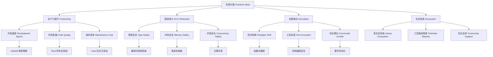

# 6. 实用价值 Practical Value

## 6.1 主题简介 Overview #PracticalValue-6.1

- **中文**：本节分析Haskell、Rust、Lean的实际应用价值，包括生产力提升、错误减少、创新驱动等。
- **English**: This section analyzes the practical value of Haskell, Rust, and Lean, including productivity improvement, error reduction, innovation driving, etc.

## 6.2 生产力提升 Productivity Improvement #PracticalValue-6.2

- **中文**：类型系统、抽象能力带来的开发效率提升。
- **English**: Improved development efficiency brought by type systems and abstraction capabilities.

## 6.3 错误减少 Error Reduction #PracticalValue-6.3

- **中文**：静态类型、所有权等机制减少运行时错误。
- **English**: Mechanisms such as static typing and ownership reduce runtime errors.

## 6.4 创新驱动 Innovation Driving #PracticalValue-6.4

- **中文**：新范式、新工具推动软件工程创新。
- **English**: New paradigms and tools drive innovation in software engineering.

## 6.5 局限与挑战 Limitations & Challenges #PracticalValue-6.5

- **中文**：学习曲线、生态成熟度、工程集成等问题。
- **English**: Issues such as learning curve, ecosystem maturity, and engineering integration.

## 6.6 哲学批判与争议 Philosophical Critique & Controversies #PracticalValue-6.6

- **中文**：实用价值的评判在哲学上涉及工具理性与价值理性的冲突，知识论上关注理论创新与实际效益的统一。
- **English**: The evaluation of practical value involves the conflict between instrumental and value rationality in philosophy; epistemologically, it focuses on unifying theoretical innovation and practical benefits.

## 6.7 国际对比与标准 International Comparison & Standards #PracticalValue-6.7

- **中文**：Haskell、Rust、Lean的实用价值在国际开源社区、工业界和Wiki等均有广泛案例与标准。
- **English**: The practical value of Haskell, Rust, and Lean is widely recognized in international open-source communities, industry, and Wiki standards.

## 6.8 知识论证的完备性 Completeness of Epistemic Argumentation #PracticalValue-6.8

- **中文**：实用价值需覆盖生产力提升、错误减少、创新驱动、生态支持等知识点，确保理论与实践的闭环。
- **English**: Practical value should cover productivity improvement, error reduction, innovation driving, ecosystem support, etc., ensuring a closed loop between theory and practice.

## 6.9 典型对比与案例 Typical Comparisons & Cases #PracticalValue-6.9

- **中文**：如Rust在系统编程、Haskell在金融建模、Lean在定理证明的实用性，均有国际标准与学术论证。
- **English**: Rust in systems programming, Haskell in financial modeling, and Lean in theorem proving all have international standards and academic arguments.

## 6.10 典型对比表格 Typical Comparison Table #PracticalValue-6.10

| 价值维度 | Haskell | Rust | Lean |
|----------|---------|------|------|
| 生产力提升 | 类型推断、抽象 | 零成本抽象 | 证明自动化 |
| 错误减少   | 类型安全、不可变 | 所有权、借用 | 形式化证明 |
| 创新驱动   | 函数式范式 | 安全系统编程 | 数学自动化 |
| 社区生态   | 成熟、学术 | 新兴、活跃 | 理论为主 |

## 6.11 典型应用案例 Typical Application Cases #PracticalValue-6.11

- **Haskell**：金融建模、编译器开发、分布式系统。
- **Rust**：操作系统、区块链、嵌入式开发。
- **Lean**：定理证明、数学库、形式化验证。

## 6.12 交叉引用 Cross References #PracticalValue-6.12

- [工程应用 Engineering Applications](../EngineeringApplications/README.md)
- [类型系统 Type Systems](../TypeSystems/README.md)
- [国际化对标与中英双语扩展 Internationalization & Bilingual Expansion](../Internationalization_Bilingual/README.md)

## 6.20 交叉引用 Cross References #PracticalValue-6.20

- [工程应用 Engineering Applications](../EngineeringApplications/README.md)
- [类型系统 Type Systems](../TypeSystems/README.md)
- [国际化对标与中英双语扩展 Internationalization & Bilingual Expansion](../Internationalization_Bilingual/README.md)
- [语义模型 Semantic Models](../SemanticModels/README.md)

## 6.21 参考文献 References #PracticalValue-6.21

- [Wikipedia: Programming productivity](https://en.wikipedia.org/wiki/Programming_productivity)
- [The Rust Programming Language](https://doc.rust-lang.org/book/)
- [Haskell in Industry](https://wiki.haskell.org/Haskell_in_industry)
- [Lean Community Projects](https://leanprover-community.github.io/)
- Hughes, J. (1989). Why functional programming matters. The Computer Journal, 32(2), 98-107.
- Jung, R., et al. (2018). RustBelt: Securing the foundations of the Rust programming language. Proceedings of the ACM on Programming Languages, 2(POPL), 1-34.
- de Moura, L., & Ullrich, S. (2021). The Lean 4 theorem prover and programming language. Automated Deduction–CADE 28, 625-635.
- Peyton Jones, S. (2003). The Haskell 98 language and libraries: the revised report. Journal of functional programming, 13(1), 0-255.

## 6.14 批判性小结 Critical Summary #PracticalValue-6.14

- **中文**：实用价值的知识论证需兼顾理论创新与产业应用，持续完善生态建设与社区发展。
- **English**: Epistemic argumentation of practical value should balance theoretical innovation and industrial application, continuously improving ecosystem building and community development.

## 6.15 进一步批判性分析 Further Critical Analysis #PracticalValue-6.15

- **中文**：实用价值的提升需理论创新、工程生态与社区协同共同驱动。未来需关注多范式融合与长期生态建设。
- **English**: The improvement of practical value requires joint efforts in theoretical innovation, engineering ecosystem, and community collaboration. Future work should focus on multi-paradigm integration and long-term ecosystem development.

## 6.16 实用价值框架 Practical Value Framework

### 6.16.1 价值评估模型 Value Assessment Model

```haskell
-- 实用价值评估框架
data PracticalValueFramework = PracticalValueFramework
  { productivity :: ProductivityMetrics
  , reliability :: ReliabilityMetrics
  , innovation :: InnovationMetrics
  , ecosystem :: EcosystemMetrics
  }

-- 生产力指标
data ProductivityMetrics = ProductivityMetrics
  { developmentSpeed :: DevelopmentSpeed
  , codeQuality :: CodeQuality
  , maintenanceCost :: MaintenanceCost
  , learningCurve :: LearningCurve
  }

-- 可靠性指标
data ReliabilityMetrics = ReliabilityMetrics
  { errorRate :: ErrorRate
  , typeSafety :: TypeSafety
  , memorySafety :: MemorySafety
  , concurrencySafety :: ConcurrencySafety
  }

-- 创新指标
data InnovationMetrics = InnovationMetrics
  { paradigmShift :: ParadigmShift
  , toolInnovation :: ToolInnovation
  , communityGrowth :: CommunityGrowth
  , industryAdoption :: IndustryAdoption
  }

-- 生态系统指标
data EcosystemMetrics = EcosystemMetrics
  { libraryEcosystem :: LibraryEcosystem
  , toolchainMaturity :: ToolchainMaturity
  , communitySupport :: CommunitySupport
  , documentationQuality :: DocumentationQuality
  }
```

### 6.16.2 价值量化方法 Value Quantification Methods

```haskell
-- 价值量化方法
data ValueQuantification = ValueQuantification
  { quantitativeMetrics :: QuantitativeMetrics
  , qualitativeMetrics :: QualitativeMetrics
  , comparativeAnalysis :: ComparativeAnalysis
  , longitudinalStudy :: LongitudinalStudy
  }

-- 定量指标
data QuantitativeMetrics = QuantitativeMetrics
  { linesOfCode :: LinesOfCode
  , bugDensity :: BugDensity
  , developmentTime :: DevelopmentTime
  , performanceMetrics :: PerformanceMetrics
  }

-- 定性指标
data QualitativeMetrics = QualitativeMetrics
  { codeReadability :: CodeReadability
  , maintainability :: Maintainability
  , expressiveness :: Expressiveness
  , safetyGuarantees :: SafetyGuarantees
  }

-- 比较分析
data ComparativeAnalysis = ComparativeAnalysis
  { baselineComparison :: BaselineComparison
  , crossLanguageComparison :: CrossLanguageComparison
  , industryBenchmarks :: IndustryBenchmarks
  , academicStudies :: AcademicStudies
  }
```

## 6.17 应用场景分析 Application Scenario Analysis

### 6.17.1 Haskell 应用场景

#### 金融建模场景

```haskell
-- Haskell 金融建模价值
data HaskellFinancialValue = HaskellFinancialValue
  { typeSafety :: TypeSafetyBenefits
  , mathematicalModeling :: MathematicalModeling
  , riskManagement :: RiskManagement
  , performanceOptimization :: PerformanceOptimization
  }

-- 类型安全收益
data TypeSafetyBenefits = TypeSafetyBenefits
  { compileTimeErrorCatching :: ErrorReduction
  , refactoringSafety :: RefactoringSafety
  , documentationAsCode :: DocumentationAsCode
  }

-- 数学建模
data MathematicalModeling = MathematicalModeling
  { functionalProgramming :: FunctionalProgramming
  , lazyEvaluation :: LazyEvaluation
  , typeClasses :: TypeClasses
  , algebraicDataTypes :: AlgebraicDataTypes
  }

-- 风险管理
data RiskManagement = RiskManagement
  { optionPricing :: OptionPricing
  , portfolioOptimization :: PortfolioOptimization
  , stressTesting :: StressTesting
  , regulatoryCompliance :: RegulatoryCompliance
  }

-- 性能优化
data PerformanceOptimization = PerformanceOptimization
  { compilerOptimizations :: CompilerOptimizations
  , memoryEfficiency :: MemoryEfficiency
  , parallelComputation :: ParallelComputation
  , concurrencyModels :: ConcurrencyModels
  }
```

#### 编译器开发场景

```haskell
-- Haskell 编译器开发价值
data HaskellCompilerValue = HaskellCompilerValue
  { languageDesign :: LanguageDesign
  , optimizationTechniques :: OptimizationTechniques
  , toolchainDevelopment :: ToolchainDevelopment
  , researchPlatform :: ResearchPlatform
  }

-- 语言设计
data LanguageDesign = LanguageDesign
  { typeSystemDesign :: TypeSystemDesign
  , syntaxDesign :: SyntaxDesign
  , semanticDesign :: SemanticDesign
  , extensionMechanisms :: ExtensionMechanisms
  }

-- 优化技术
data OptimizationTechniques = OptimizationTechniques
  { staticAnalysis :: StaticAnalysis
  , codeGeneration :: CodeGeneration
  , runtimeOptimization :: RuntimeOptimization
  , profileGuidedOptimization :: ProfileGuidedOptimization
  }
```

### 6.17.2 Rust 应用场景

#### 系统编程场景

```rust
// Rust 系统编程价值
struct RustSystemsValue {
    memory_safety: MemorySafetyBenefits,
    performance: PerformanceBenefits,
    concurrency: ConcurrencyBenefits,
    system_integration: SystemIntegrationBenefits,
}

// 内存安全收益
struct MemorySafetyBenefits {
    no_use_after_free: SafetyGuarantee,
    no_double_free: SafetyGuarantee,
    no_data_races: SafetyGuarantee,
    no_null_pointer_dereference: SafetyGuarantee,
}

// 性能收益
struct PerformanceBenefits {
    zero_cost_abstractions: PerformanceMetric,
    predictable_memory_usage: PerformanceMetric,
    efficient_compilation: PerformanceMetric,
    runtime_performance: PerformanceMetric,
}

// 并发收益
struct ConcurrencyBenefits {
    fearless_concurrency: ConcurrencyGuarantee,
    ownership_model: OwnershipModel,
    async_await: AsyncAwaitSupport,
    thread_safety: ThreadSafety,
}

// 系统集成收益
struct SystemIntegrationBenefits {
    c_interoperability: CInterop,
    ffi_support: FFISupport,
    embedded_systems: EmbeddedSupport,
    web_assembly: WebAssemblySupport,
}
```

#### 区块链开发场景

```rust
// Rust 区块链开发价值
struct RustBlockchainValue {
    security: SecurityBenefits,
    performance: PerformanceBenefits,
    reliability: ReliabilityBenefits,
    ecosystem: EcosystemBenefits,
}

// 安全收益
struct SecurityBenefits {
    memory_safety: MemorySafety,
    type_safety: TypeSafety,
    cryptographic_safety: CryptographicSafety,
    consensus_safety: ConsensusSafety,
}

// 性能收益
struct PerformanceBenefits {
    transaction_throughput: ThroughputMetric,
    latency: LatencyMetric,
    resource_efficiency: ResourceEfficiency,
    scalability: ScalabilityMetric,
}

// 可靠性收益
struct ReliabilityBenefits {
    fault_tolerance: FaultTolerance,
    consensus_reliability: ConsensusReliability,
    network_reliability: NetworkReliability,
    data_integrity: DataIntegrity,
}
```

### 6.17.3 Lean 应用场景

#### 定理证明场景

```lean
-- Lean 定理证明价值
structure LeanTheoremProvingValue where
  formalVerification : FormalVerificationBenefits
  mathematicalAutomation : MathematicalAutomation
  proofAssistant : ProofAssistantBenefits
  researchPlatform : ResearchPlatformBenefits

-- 形式化验证收益
structure FormalVerificationBenefits where
  correctnessGuarantees : CorrectnessGuarantee
  bugPrevention : BugPrevention
  specificationClarity : SpecificationClarity
  maintenanceConfidence : MaintenanceConfidence

-- 数学自动化
structure MathematicalAutomation where
  theoremProving : TheoremProving
  proofAutomation : ProofAutomation
  mathematicalLibraries : MathematicalLibraries
  educationalTools : EducationalTools

-- 证明助理收益
structure ProofAssistantBenefits where
  interactiveProofs : InteractiveProofs
  proofManagement : ProofManagement
  collaborationSupport : CollaborationSupport
  knowledgePreservation : KnowledgePreservation

-- 研究平台收益
structure ResearchPlatformBenefits where
  typeTheoryResearch : TypeTheoryResearch
  proofTheoryResearch : ProofTheoryResearch
  formalMethodsResearch : FormalMethodsResearch
  computerScienceEducation : ComputerScienceEducation
```

## 6.18 评估方法 Evaluation Methods

### 6.18.1 定量评估 Quantitative Evaluation

```haskell
-- 定量评估方法
data QuantitativeEvaluation = QuantitativeEvaluation
  { metrics :: [Metric]
  , measurement :: Measurement
  , analysis :: Analysis
  , reporting :: Reporting
  }

-- 指标
data Metric = Metric
  { name :: String
  , unit :: String
  , measurement :: Measurement
  , baseline :: Baseline
  }

-- 测量
data Measurement = Measurement
  { method :: MeasurementMethod
  , tools :: [Tool]
  , accuracy :: Accuracy
  , repeatability :: Repeatability
  }

-- 分析
data Analysis = Analysis
  { statisticalAnalysis :: StatisticalAnalysis
  , trendAnalysis :: TrendAnalysis
  , comparativeAnalysis :: ComparativeAnalysis
  , correlationAnalysis :: CorrelationAnalysis
  }
```

### 6.18.2 定性评估 Qualitative Evaluation

```haskell
-- 定性评估方法
data QualitativeEvaluation = QualitativeEvaluation
  { expertOpinion :: ExpertOpinion
  , userFeedback :: UserFeedback
  , caseStudies :: [CaseStudy]
  , communityAssessment :: CommunityAssessment
  }

-- 专家意见
data ExpertOpinion = ExpertOpinion
  { experts :: [Expert]
  , evaluationCriteria :: [Criterion]
  , consensus :: Consensus
  , confidence :: Confidence
  }

-- 用户反馈
data UserFeedback = UserFeedback
  { userSurveys :: [Survey]
  , interviews :: [Interview]
  , usageData :: UsageData
  , satisfactionMetrics :: SatisfactionMetrics
  }

-- 案例研究
data CaseStudy = CaseStudy
  { project :: Project
  , context :: Context
  , outcomes :: [Outcome]
  , lessons :: [Lesson]
  }
```

## 6.19 结构图 Structure Diagram


