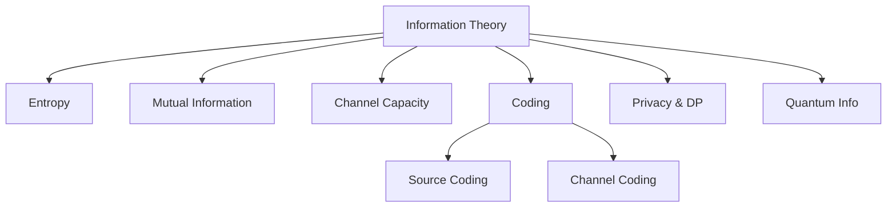
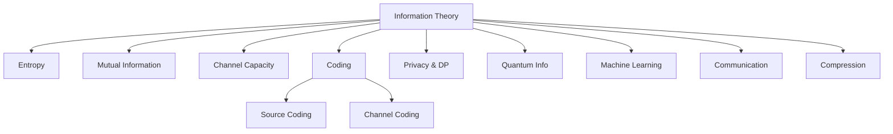

# 14.1 信息论的定义 Definition of Information Theory #InformationTheory-14.1

## 定义 Definition

### 基本定义 Basic Definition

- **中文**：信息论是研究信息的度量、传输、编码、压缩与噪声影响的理论体系。它关注于熵、信道容量、编码定理、冗余、误码率等核心概念，广泛应用于通信、计算机、统计、人工智能等领域，为信息处理和传输提供理论基础。
- **English**: Information theory is a theoretical framework for studying the measurement, transmission, encoding, compression, and noise effects of information. It focuses on entropy, channel capacity, coding theorems, redundancy, error rates, and is widely applied in communication, computer science, statistics, and artificial intelligence, providing theoretical foundations for information processing and transmission.

### 形式化定义 Formal Definition

#### 信息熵 Information Entropy

对于离散随机变量 $X$，其信息熵定义为：

$$H(X) = -\sum_{x \in \mathcal{X}} p(x) \log p(x)$$

其中 $p(x)$ 是 $X$ 的概率质量函数。

#### 联合熵 Joint Entropy

对于随机变量 $X$ 和 $Y$，联合熵定义为：

$$H(X, Y) = -\sum_{x \in \mathcal{X}} \sum_{y \in \mathcal{Y}} p(x, y) \log p(x, y)$$

#### 条件熵 Conditional Entropy

对于随机变量 $X$ 和 $Y$，条件熵定义为：

$$H(X|Y) = -\sum_{x \in \mathcal{X}} \sum_{y \in \mathcal{Y}} p(x, y) \log p(x|y)$$

#### 互信息 Mutual Information

对于随机变量 $X$ 和 $Y$，互信息定义为：

$$I(X; Y) = H(X) - H(X|Y) = H(Y) - H(Y|X)$$

#### 信道容量 Channel Capacity

对于信道 $W$，信道容量定义为：

$$C = \max_{p(x)} I(X; Y)$$

其中最大值在所有可能的输入分布 $p(x)$ 上取。

## 哲学背景 Philosophical Background

### 信息哲学 Information Philosophy

- **中文**：信息论体现了信息哲学思想，将信息视为客观存在的基本要素，探讨信息的本质、结构和规律。
- **English**: Information theory embodies information philosophy, viewing information as a fundamental element of objective existence, exploring the essence, structure, and laws of information.

### 概率哲学 Probability Philosophy

- **中文**：信息论体现了概率哲学思想，通过概率来描述信息的不确定性和随机性，强调信息的统计性质。
- **English**: Information theory embodies probability philosophy, describing information uncertainty and randomness through probability, emphasizing the statistical nature of information.

### 通信哲学 Communication Philosophy

- **中文**：信息论体现了通信哲学思想，将通信视为信息的传输和处理过程，探讨通信的本质和规律。
- **English**: Information theory embodies communication philosophy, viewing communication as a process of information transmission and processing, exploring the essence and laws of communication.

## 核心概念 Core Concepts

### 1信息熵 Information Entropy

#### 香农熵 Shannon Entropy

```haskell
-- 香农熵
data ShannonEntropy = ShannonEntropy
  { probabilityDistribution :: Map Event Double
  , entropy :: Double
  }

-- 计算香农熵
calculateShannonEntropy :: [Double] -> Double
calculateShannonEntropy probabilities = 
  -sum [p * logBase 2 p | p <- probabilities, p > 0]

-- 熵的性质
entropyProperties :: [Double] -> EntropyProperties
entropyProperties probabilities = EntropyProperties
  { nonNegativity = all (>= 0) probabilities
  , additivity = calculateAdditivity probabilities
  , maximum = calculateMaximumEntropy (length probabilities)
  }
```

#### 条件熵和互信息 Conditional Entropy and Mutual Information

```haskell
-- 条件熵
conditionalEntropy :: [[Double]] -> [Double] -> Double
conditionalEntropy pYGivenX pX = 
  sum [pX' * calculateShannonEntropy pYGivenX' | (pX', pYGivenX') <- zip pX pYGivenX]

-- 互信息
mutualInformation :: [Double] -> [[Double]] -> [Double] -> Double
mutualInformation pX pYGivenX pY = 
  let hX = calculateShannonEntropy pX
      hY = calculateShannonEntropy pY
      hXY = jointEntropy pX pYGivenX
  in hX + hY - hXY

-- 联合熵
jointEntropy :: [Double] -> [[Double]] -> Double
jointEntropy pX pYGivenX = 
  let pXY = [pX' * pY' | (pX', pYGivenX') <- zip pX pYGivenX, pY' <- pYGivenX']
  in calculateShannonEntropy pXY
```

### 信道理论 Channel Theory

#### 离散无记忆信道 Discrete Memoryless Channel

```haskell
-- 离散无记忆信道
data DiscreteMemorylessChannel = DiscreteMemorylessChannel
  { inputAlphabet :: Set Symbol
  , outputAlphabet :: Set Symbol
  , transitionMatrix :: Map (Symbol, Symbol) Double
  }

-- 信道转移概率
channelTransition :: DiscreteMemorylessChannel -> Symbol -> Symbol -> Double
channelTransition dmc input output = 
  fromMaybe 0 (lookup (input, output) (transitionMatrix dmc))

-- 信道容量
channelCapacity :: DiscreteMemorylessChannel -> Double
channelCapacity dmc = 
  maximum [mutualInformation pX (channelMatrix dmc) pY | pX <- allInputDistributions dmc]
  where
    pY = calculateOutputDistribution dmc pX
```

#### 二进制对称信道 Binary Symmetric Channel

```haskell
-- 二进制对称信道
data BinarySymmetricChannel = BinarySymmetricChannel
  { crossoverProbability :: Double
  }

-- BSC转移概率
bscTransition :: BinarySymmetricChannel -> Bool -> Bool -> Double
bscTransition bsc input output = 
  if input == output 
  then 1 - crossoverProbability bsc 
  else crossoverProbability bsc

-- BSC容量
bscCapacity :: BinarySymmetricChannel -> Double
bscCapacity bsc = 
  1 - binaryEntropy (crossoverProbability bsc)
  where
    binaryEntropy p = -p * logBase 2 p - (1-p) * logBase 2 (1-p)
```

### 编码理论 Coding Theory

#### 信源编码 Source Coding

```haskell
-- 信源编码
data SourceCoding = SourceCoding
  { source :: Source
  , encoder :: Encoder
  , decoder :: Decoder
  , compressionRatio :: Double
  }

data Source = Source
  { alphabet :: Set Symbol
  , probabilityDistribution :: Map Symbol Double
  }

data Encoder = Encoder
  { encodingFunction :: Symbol -> [Bit]
  , averageLength :: Double
  }

-- 霍夫曼编码
huffmanEncoding :: Source -> Encoder
huffmanEncoding source = 
  let huffmanTree = buildHuffmanTree (probabilityDistribution source)
      encodingMap = buildEncodingMap huffmanTree
  in Encoder
    { encodingFunction = \symbol -> fromJust (lookup symbol encodingMap)
    , averageLength = calculateAverageLength encodingMap (probabilityDistribution source)
    }
```

#### 信道编码 Channel Coding

```haskell
-- 信道编码
data ChannelCoding = ChannelCoding
  { code :: Code
  , encoder :: ChannelEncoder
  , decoder :: ChannelDecoder
  , errorCorrection :: ErrorCorrection
  }

data Code = Code
  { codeWords :: Set [Bit]
  , codeRate :: Double
  , minimumDistance :: Int
  }

-- 汉明码
hammingCode :: Int -> Code
hammingCode k = 
  let n = 2^k - 1
      m = n - k
      parityCheckMatrix = buildParityCheckMatrix k
      generatorMatrix = buildGeneratorMatrix parityCheckMatrix
      codeWords = generateCodeWords generatorMatrix
  in Code
    { codeWords = codeWords
    , codeRate = fromIntegral k / fromIntegral n
    , minimumDistance = 3
    }
```

### 信息压缩 Information Compression

#### 无损压缩 Lossless Compression

```haskell
-- 无损压缩
data LosslessCompression = LosslessCompression
  { compressor :: Compressor
  , decompressor :: Decompressor
  , compressionRatio :: Double
  }

data Compressor = Compressor
  { compress :: [Symbol] -> [Bit]
  , compressionEfficiency :: Double
  }

-- LZ77压缩
lz77Compression :: Compressor
lz77Compression = Compressor
  { compress = lz77Compress
  , compressionEfficiency = calculateEfficiency
  }

lz77Compress :: [Symbol] -> [Bit]
lz77Compress input = 
  let window = []
      lookahead = input
      compressed = []
  in compressLZ77 window lookahead compressed
```

#### 有损压缩 Lossy Compression

```haskell
-- 有损压缩
data LossyCompression = LossyCompression
  { compressor :: LossyCompressor
  , decompressor :: LossyDecompressor
  , distortion :: Double
  , rate :: Double
  }

data LossyCompressor = LossyCompressor
  { compress :: [Symbol] -> [Bit]
  , distortionFunction :: [Symbol] -> [Symbol] -> Double
  }

-- 率失真理论
rateDistortionTheory :: LossyCompression -> RateDistortionFunction
rateDistortionTheory lc = RateDistortionFunction
  { rate = rate lc
  , distortion = distortion lc
  , optimalTradeoff = calculateOptimalTradeoff lc
  }
```

### 信息传输 Information Transmission

#### 信道编码定理 Channel Coding Theorem

```haskell
-- 信道编码定理
data ChannelCodingTheorem = ChannelCodingTheorem
  { channel :: Channel
  , achievableRate :: Double
  , errorProbability :: Double
  , proof :: Proof
  }

-- 香农信道编码定理
shannonChannelCodingTheorem :: Channel -> ChannelCodingTheorem
shannonChannelCodingTheorem channel = ChannelCodingTheorem
  { channel = channel
  , achievableRate = channelCapacity channel
  , errorProbability = 0
  , proof = shannonProof
  }
```

#### 信源编码定理 Source Coding Theorem

```haskell
-- 信源编码定理
data SourceCodingTheorem = SourceCodingTheorem
  { source :: Source
  , achievableRate :: Double
  , errorProbability :: Double
  , proof :: Proof
  }

-- 香农信源编码定理
shannonSourceCodingTheorem :: Source -> SourceCodingTheorem
shannonSourceCodingTheorem source = SourceCodingTheorem
  { source = source
  , achievableRate = entropy source
  , errorProbability = 0
  , proof = shannonProof
  }
```

## 历史发展 Historical Development

### 理论基础 Theoretical Foundation

#### 信息论的起源 (1940s)

- **Claude Shannon** 创立信息论 (1948)
- **Ralph Hartley** 研究信息传输 (1928)
- **Harry Nyquist** 研究信号传输 (1924)

#### 信息论的发展 (1950s-1970s)

- **Richard Hamming** 发展纠错码 (1950)
- **David Huffman** 提出霍夫曼编码 (1952)
- **Robert Fano** 研究信源编码 (1961)

### 现代发展 Modern Development

#### 现代信息论 (1980s-2020s)

```haskell
-- 现代信息论
data ModernInformationTheory = ModernInformationTheory
  { quantumInformation :: QuantumInformation
  , networkInformation :: NetworkInformation
  , informationSecurity :: InformationSecurity
  }

-- 量子信息论
data QuantumInformation = QuantumInformation
  { quantumEntropy :: QuantumEntropy
  , quantumChannel :: QuantumChannel
  , quantumCoding :: QuantumCoding
  }

-- 网络信息论
data NetworkInformation = NetworkInformation
  { networkCapacity :: NetworkCapacity
  , networkCoding :: NetworkCoding
  , networkSecurity :: NetworkSecurity
  }
```

## 形式化语义 Formal Semantics

### 操作语义 Operational Semantics

#### 信息传输语义

对于信道 $W$ 和输入 $X$，传输语义定义为：

$$W(X) = Y$$

其中 $Y$ 是输出。

#### 编码语义

对于编码器 $E$ 和信源 $S$，编码语义定义为：

$$E(S) = C$$

其中 $C$ 是编码序列。

### 指称语义 Denotational Semantics

#### 信息语义

对于信息源 $X$，其指称语义定义为：

$$[\![X]\!] = H(X)$$

#### 信道语义

对于信道 $W$，其语义定义为：

$$[\![W]\!] = C$$

其中 $C$ 是信道容量。

## 与其他理论的关系 Relationship to Other Theories

### 与概率论的关系

- **中文**：信息论以概率论为基础，概率论为信息论提供数学工具。
- **English**: Information theory is based on probability theory, with probability theory providing mathematical tools for information theory.

### 与通信理论的关系

- **中文**：信息论为通信理论提供理论基础，通信理论为信息论提供应用场景。
- **English**: Information theory provides theoretical foundations for communication theory, while communication theory provides application scenarios for information theory.

### 与密码学的关系

- **中文**：信息论为密码学提供理论基础，密码学为信息论提供安全应用。
- **English**: Information theory provides theoretical foundations for cryptography, while cryptography provides security applications for information theory.

## 交叉引用 Cross References

- [概率论 Probability Theory](../ProbabilityTheory/README.md)
- [通信理论 Communication Theory](../CommunicationTheory/README.md)
- [密码学 Cryptography](../Cryptography/README.md)
- [形式化定义 Formal Definitions](../FormalDefinitions/README.md)
- [定理与证明 Theorems & Proofs](../Theorems_Proofs/README.md)

## 参考文献 References

1. Shannon, C. E. (1948). A mathematical theory of communication. Bell System Technical Journal, 27(3), 379-423.
2. Hartley, R. V. L. (1928). Transmission of information. Bell System Technical Journal, 7(3), 535-563.
3. Nyquist, H. (1924). Certain factors affecting telegraph speed. Bell System Technical Journal, 3(2), 324-346.
4. Hamming, R. W. (1950). Error detecting and error correcting codes. Bell System Technical Journal, 29(2), 147-160.
5. Huffman, D. A. (1952). A method for the construction of minimum-redundancy codes. Proceedings of the IRE, 40(9), 1098-1101.
6. Cover, T. M., & Thomas, J. A. (2006). Elements of information theory. Wiley.
7. MacKay, D. J. C. (2003). Information theory, inference, and learning algorithms. Cambridge University Press.
8. Gallager, R. G. (1968). Information theory and reliable communication. Wiley.

## 对比分析 Comparison

- **中文**：信息论 vs 概率论 vs 编码/通信 vs 统计学习
  - 概率给工具；信息论给度量与极限；编码/通信给实现；统计学习给推断。
- **English**: Probability provides tools; information theory gives metrics/limits; coding/communication implement; statistical learning infers.

## 争议与批判 Controversies & Critique

- **中文**：
  - 实际系统的非理想信道/相关性破坏独立假设；深度学习中的“信息瓶颈”解释争议。
- **English**: Non-ideal channels/correlations; debates around the information bottleneck view in deep learning.

## 前沿趋势 Frontier Trends

- **中文**：
  - 量子信息、网络信息论、隐私与差分隐私、联邦学习中的信息流；
  - 代码与模型压缩、率失真在多模态模型中的落地。
- **English**: Quantum/network information; privacy and DP; information flow in federated learning; code/model compression; rate–distortion in multimodal models.

## 常见陷阱 Common Pitfalls

- **中文**：
  - 熵/互信息估计偏差；忽视先验导致的伪容量；把相关性当因果。
- **English**: Entropy/MI estimation bias; ignoring priors inflating capacity; mistaking correlation for causation.

## 扩展交叉引用 Extended Cross References

- [概率论 Probability Theory](../ProbabilityTheory/README.md)
- [通信理论 Communication Theory](../CommunicationTheory/README.md)
- [编码理论 Coding Theory](../CodingTheory/README.md)
- [统计学习 Statistical Learning](../../model/AI/Statistical_Learning.md)

## 知识图谱 Knowledge Graph



## 对比分析 Comparison1

- **中文**：信息论 vs 通信理论 vs 编码理论 vs 统计学习理论
  - 信息论关注"信息的度量与传输"；通信理论聚焦"信号传输技术"；编码理论强调"错误检测与纠正"；统计学习理论注重"从数据中学习"。
- **English**: Information theory vs communication theory vs coding theory vs statistical learning theory
  - Information theory focuses on "measurement and transmission of information"; communication theory on "signal transmission technology"; coding theory on "error detection and correction"; statistical learning on "learning from data".

## 争议与批判 Controversies & Critique1

- **中文**：
  - 信息定义的哲学争议；熵与复杂性的关系；
  - 香农信息论 vs 语义信息论；信息论在AI中的适用性。
- **English**:
  - Philosophical controversies over information definition; relationship between entropy and complexity;
  - Shannon information theory vs semantic information theory; applicability of information theory in AI.

## 前沿趋势 Frontier Trends1

- **中文**：
  - 量子信息论与量子计算；信息论在机器学习中的应用；
  - 分布式信息处理；信息论与神经科学的交叉。
- **English**:
  - Quantum information theory and quantum computing; applications of information theory in machine learning;
  - Distributed information processing; intersection of information theory and neuroscience.

## 常见陷阱 Common Pitfalls1

- **中文**：
  - 混淆信息与数据；忽视信息的语义维度；
  - 过度依赖熵作为复杂性度量；信息论模型的简化假设。
- **English**:
  - Confusing information with data; ignoring semantic dimensions of information;
  - Over-reliance on entropy as complexity measure; simplifying assumptions in information theory models.

## 扩展交叉引用 Extended Cross References1

- [语义模型 Semantic Models](../SemanticModels/README.md)
- [工程应用 Engineering Applications](../EngineeringApplications/README.md)
- [实践价值 Practical Value](../PracticalValue/README.md)
- [系统理论 System Theory](../SystemTheory/README.md)
- [控制论 Cybernetics](../Cybernetics/README.md)
- [形式语言理论 Formal Language Theory](../FormalLanguageTheory/README.md)

## 知识图谱 Knowledge Graph1


