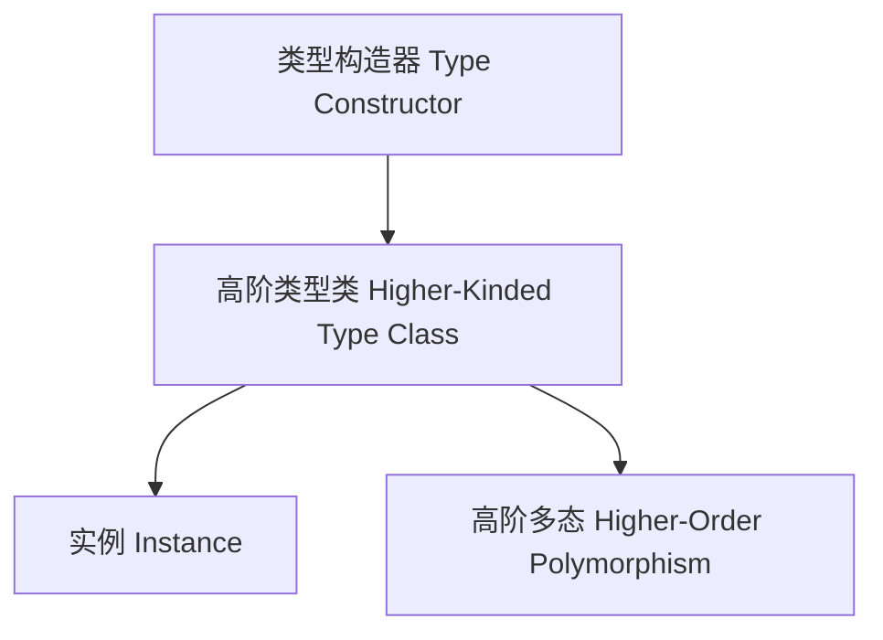

# 01. 高阶类型在Haskell中的理论与实践（Higher-Kinded Types in Haskell）

> **中英双语核心定义 | Bilingual Core Definitions**

## 1.1 高阶类型简介（Introduction to Higher-Kinded Types）

- **定义（Definition）**：
  - **中文**：高阶类型是指以类型构造器为参数或返回值的类型。Haskell支持高阶类型，允许类型类和数据类型抽象于类型构造器。
  - **English**: Higher-kinded types are types that take type constructors as parameters or return them. Haskell supports higher-kinded types, allowing type classes and data types to abstract over type constructors.

- **Wiki风格国际化解释（Wiki-style Explanation）**：
  - 高阶类型是Haskell类型系统强大抽象能力的体现，广泛用于泛型编程、抽象数据类型和高阶多态。
  - Higher-kinded types exemplify Haskell's powerful abstraction, widely used in generic programming, abstract data types, and higher-order polymorphism.

## 1.2 Haskell中的高阶类型语法与语义（Syntax and Semantics of Higher-Kinded Types in Haskell）

- **类型构造器（Type Constructor）**

```haskell
-- List 是 * -> * 类型构造器
-- Maybe 也是 * -> * 类型构造器
-- Either 是 * -> * -> * 类型构造器
```

- **高阶类型类（Higher-Kinded Type Class）**

```haskell
class Functor f where
  fmap :: (a -> b) -> f a -> f b

class Monad m where
  (>>=) :: m a -> (a -> m b) -> m b
```

- **高阶多态（Higher-Order Polymorphism）**
  - 类型类可约束类型构造器参数，实现高阶抽象。

```haskell
instance Functor [] where
  fmap = map

instance Functor Maybe where
  fmap _ Nothing  = Nothing
  fmap f (Just x) = Just (f x)
```

## 1.3 范畴论建模与结构映射（Category-Theoretic Modeling and Mapping）

- **高阶类型与函子/单子的关系**
  - 高阶类型对应于范畴论中的函子范畴（category of functors）。

| 概念 | Haskell实现 | 代码示例 | 中文解释 |
|------|-------------|----------|----------|
| 类型构造器 | *->* | `Maybe`, `[]` | 类型级容器 |
| 高阶类型类 | 类型类约束 | `class Functor f where ...` | 抽象于类型构造器 |
| 实例 | 类型构造器实现 | `instance Functor [] ...` | 具体类型实现 |

## 1.4 形式化证明与论证（Formal Proofs & Reasoning）

- **高阶类型安全性证明**
  - **中文**：证明高阶类型类约束下的实例满足接口规范。
  - **English**: Prove that instances under higher-kinded type class constraints satisfy the interface specification.

- **高阶多态性证明**
  - **中文**：证明高阶类型支持更强的抽象和多态能力。
  - **English**: Prove that higher-kinded types support stronger abstraction and polymorphism.

## 1.5 多表征与本地跳转（Multi-representation & Local Reference）

- **高阶类型结构图（Higher-Kinded Types Structure Diagram）**



- **相关主题跳转**：
  - [类型类 Type Class](../07-Type-Class/01-Type-Class-in-Haskell.md)
  - [函子 Functor](../05-Category-Theory/02-Functor/01-Functor-and-Haskell.md)
  - [单子 Monad](../05-Category-Theory/03-Monad/01-Monad-and-Haskell.md)

---

> 本文档为高阶类型在Haskell中的中英双语、Haskell语义模型与形式化证明规范化输出，适合学术研究与工程实践参考。
