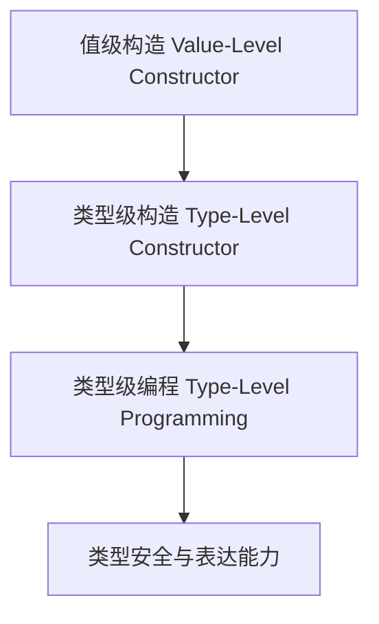

# 01. 类型推广与DataKinds在Haskell中的理论与实践（Type Promotion and DataKinds in Haskell）

> **中英双语核心定义 | Bilingual Core Definitions**

## 1.1 类型推广与DataKinds简介（Introduction to Type Promotion and DataKinds）

- **定义（Definition）**：
  - **中文**：类型推广是指将值级别的构造提升为类型级别。DataKinds是Haskell的扩展，允许数据构造器、字面量等在类型层面使用，支持类型级布尔、自然数、符号等。
  - **English**: Type promotion refers to lifting value-level constructors to the type level. DataKinds is a Haskell extension that allows data constructors, literals, etc., to be used at the type level, supporting type-level booleans, naturals, symbols, etc.

- **Wiki风格国际化解释（Wiki-style Explanation）**：
  - 类型推广和DataKinds极大丰富了Haskell类型系统的表达能力，是类型级编程、依赖类型和GADT等高级特性的基础。
  - Type promotion and DataKinds greatly enrich the expressiveness of Haskell's type system and are the foundation for type-level programming, dependent types, and advanced features like GADTs.

## 1.2 Haskell中的类型推广与DataKinds语法与语义（Syntax and Semantics of Type Promotion and DataKinds in Haskell）

- **DataKinds扩展与类型级字面量**

```haskell
{-# LANGUAGE DataKinds #-}

data Nat = Z | S Nat
-- DataKinds后，'Z 和 'S n 可用作类型级自然数

data Color = Red | Green | Blue
-- 类型级颜色：'Red, 'Green, 'Blue

-- 类型级布尔
:type True  -- True :: Bool
:type 'True -- 'True :: Bool (类型级)
```

- **类型级编程与类型推广**

```haskell
{-# LANGUAGE GADTs, DataKinds, KindSignatures #-}

data Vec :: * -> Nat -> * where
  VNil  :: Vec a 'Z
  VCons :: a -> Vec a n -> Vec a ('S n)

-- 类型级布尔与类型族
:type family And (a :: Bool) (b :: Bool) :: Bool where
  And 'True  'True  = 'True
  And _      _      = 'False
```

## 1.3 范畴论建模与结构映射（Category-Theoretic Modeling and Mapping）

- **类型推广与范畴论关系**
  - 类型推广可视为范畴中的对象提升与层级扩展。

| 概念 | Haskell实现 | 代码示例 | 中文解释 |
|------|-------------|----------|----------|
| 类型级字面量 | DataKinds | `'True`, `'Z` | 类型级常量 |
| 类型推广 | 类型级构造 | `data Vec a n` | 类型级参数 |
| 类型级布尔 | DataKinds/类型族 | `And 'True 'False` | 类型级逻辑 |

## 1.4 形式化证明与论证（Formal Proofs & Reasoning）

- **类型推广安全性证明**
  - **中文**：证明类型推广和DataKinds下的类型级运算在编译期得到保证。
  - **English**: Prove that type-level operations under type promotion and DataKinds are guaranteed at compile time.

- **表达能力证明**
  - **中文**：证明类型推广可表达更丰富的类型级结构和属性。
  - **English**: Prove that type promotion can express richer type-level structures and properties.

## 1.5 多表征与本地跳转（Multi-representation & Local Reference）

- **类型推广与DataKinds结构图（Type Promotion and DataKinds Structure Diagram）**



- **相关主题跳转**：
  - [类型级编程 Type-Level Programming](../12-Type-Level-Programming/01-Type-Level-Programming-in-Haskell.md)
  - [依赖类型 Dependent Type](../10-Dependent-Type/01-Dependent-Type-in-Haskell.md)
  - [GADT in Haskell](../09-GADT/01-GADT-in-Haskell.md)

---

> 本文档为类型推广与DataKinds在Haskell中的中英双语、Haskell语义模型与形式化证明规范化输出，适合学术研究与工程实践参考。
