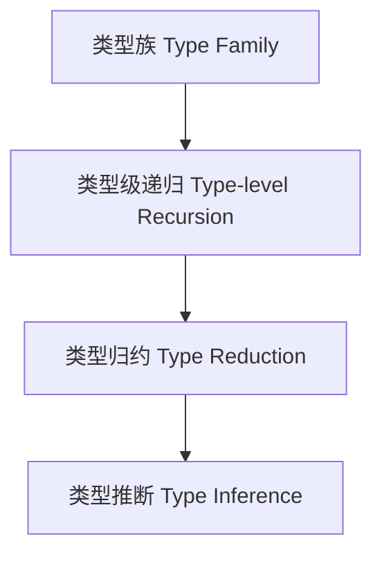

# 类型级自动推导（Type-Level Inference in Haskell）

## 定义 Definition

- **中文**：类型级自动推导是指在编译期通过类型系统自动推导类型关系、约束和结果的机制，广泛应用于类型族、类型类、GADT等高级类型特性。
- **English**: Type-level inference refers to the mechanism by which the type system automatically infers type relations, constraints, and results at compile time. It is widely used in type families, type classes, GADTs, and other advanced type features in Haskell.

## Haskell 语法与实现 Syntax & Implementation

```haskell
{-# LANGUAGE TypeFamilies, DataKinds, TypeOperators, UndecidableInstances #-}
-- 类型族实现类型级加法的自动推导
import GHC.TypeLits

type family Add (a :: Nat) (b :: Nat) :: Nat where
  Add 0 b = b
  Add a b = 1 + Add (a - 1) b
```

## 类型推断与类型级自动推导的关系

- Haskell 的类型推断（如 Hindley-Milner 系统）与类型级自动推导协同工作，前者推断表达式类型，后者在类型层级递归归约类型关系。
- Type inference (e.g., Hindley-Milner) works with type-level inference: the former infers expression types, the latter recursively reduces type-level relations.

## 形式化证明 Formal Reasoning

- **类型归约终止性证明**：可用归纳法证明类型族递归定义的终止性。
- **Type reduction termination**: Inductive proof can be used to show termination of type family recursion.

### 证明示例 Proof Example

- 设 `Add a b`，对 `a` 归纳：
  - 基础：`a=0`，`Add 0 b = b`，归约终止。
  - 归纳：假设 `Add (a-1) b` 终止，则 `Add a b = 1 + Add (a-1) b` 也终止。

## 工程应用 Engineering Application

- 类型级自动推导常用于类型安全的 DSL、类型级约束求解、泛型编程等。
- Type-level inference is used in type-safe DSLs, type-level constraint solving, generic programming, etc.

## 范畴论映射 Category Theory Mapping

- 类型级自动推导可视为范畴中的函子映射（Functorial mapping），类型归约对应于态射组合。

## 结构图 Structure Diagram



## 本地跳转 Local References

- [类型族 Type Family](../11-Type-Family/01-Type-Family-in-Haskell.md)
- [类型推断 Type Inference](../06-Type-Inference-and-Polymorphism/01-Type-Inference-and-Polymorphism-in-Haskell.md)
- [类型级编程 Type-level Programming](../12-Type-Level-Programming/01-Type-Level-Programming-in-Haskell.md)
