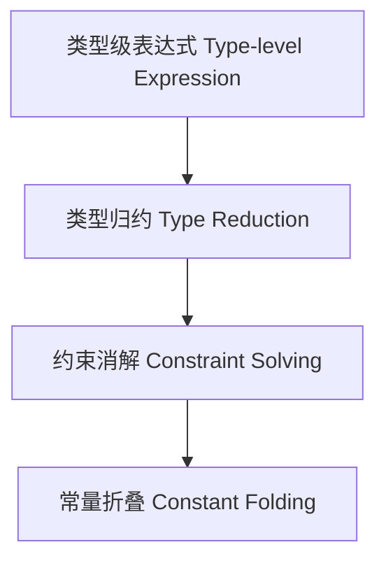

# 类型级优化（Type-Level Optimization in Haskell）

## 定义 Definition

- **中文**：类型级优化是指在类型系统层面进行的编译期优化，包括类型归约、约束消解、类型级常量折叠等，以提升类型推断效率和类型安全。
- **English**: Type-level optimization refers to compile-time optimizations performed at the type system level, such as type reduction, constraint solving, and type-level constant folding, to improve type inference efficiency and type safety.

## Haskell 语法与实现 Syntax & Implementation

```haskell
{-# LANGUAGE TypeFamilies, TypeOperators, UndecidableInstances #-}
-- 类型级常量折叠示例
import GHC.TypeLits

type family Simplify (a :: Nat) (b :: Nat) :: Nat where
  Simplify 0 b = b
  Simplify a 0 = a
  Simplify a b = a + b
```

## 类型级优化策略 Optimization Strategies

- 类型归约（Type Reduction）
- 约束消解（Constraint Solving）
- 常量折叠（Constant Folding）
- 类型级缓存（Type-level Memoization）

## 形式化证明 Formal Reasoning

- **类型归约正确性证明**：证明优化前后类型等价。
- **Proof of type reduction correctness**: Show type equivalence before and after optimization.

### 证明示例 Proof Example

- 对于 `Simplify a b`，可归纳证明 `Simplify 0 b = b`，`Simplify a 0 = a`，`Simplify a b = a + b` 与原始类型等价。

## 工程应用 Engineering Application

- 类型级优化可提升类型推断速度，减少编译期资源消耗。
- Type-level optimization improves type inference speed and reduces compile-time resource usage.

## 范畴论映射 Category Theory Mapping

- 类型级优化可视为范畴中的同构变换（Isomorphic transformation），保持类型结构不变。

## 结构图 Structure Diagram



## 本地跳转 Local References

- [类型级编程 Type-level Programming](../12-Type-Level-Programming/01-Type-Level-Programming-in-Haskell.md)
- [类型推断 Type Inference](../06-Type-Inference-and-Polymorphism/01-Type-Inference-and-Polymorphism-in-Haskell.md)
