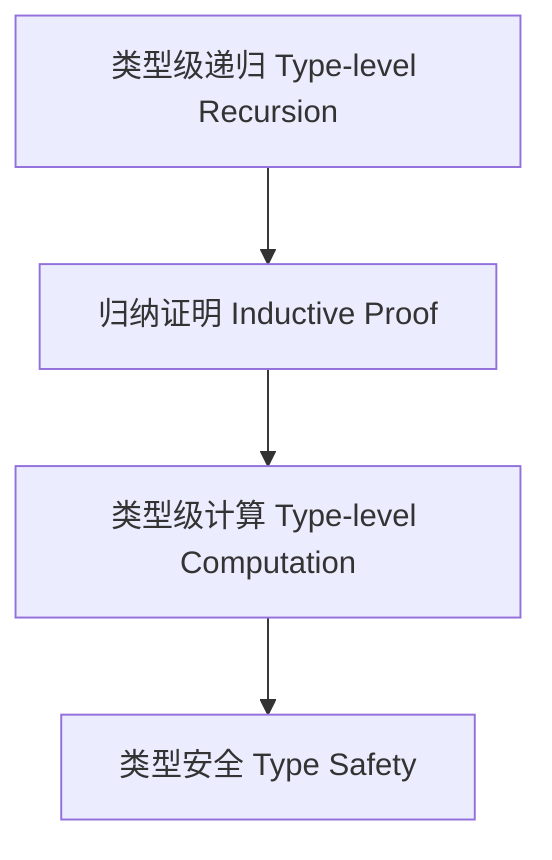

# 类型级归纳与递归（Type-Level Induction & Recursion in Haskell）

## 定义 Definition

- **中文**：类型级归纳与递归是指在类型系统层面通过递归定义和归纳法进行类型推导与证明的机制，广泛应用于类型族、GADT、类型级编程等。
- **English**: Type-level induction and recursion refer to mechanisms at the type system level for type inference and proof via recursive definitions and induction, widely used in type families, GADTs, and type-level programming in Haskell.

## Haskell 语法与实现 Syntax & Implementation

```haskell
{-# LANGUAGE TypeFamilies, DataKinds, TypeOperators, UndecidableInstances #-}
import GHC.TypeLits

-- 类型级归纳定义自然数加法

type family Add (a :: Nat) (b :: Nat) :: Nat where
  Add 0 b = b
  Add a b = 1 + Add (a - 1) b
```

## 归纳证明 Inductive Proof

- 基础情形（Base case）：证明递归定义在基础输入下成立
- 归纳情形（Inductive case）：假设 n 成立，证明 n+1 也成立

### 证明示例 Proof Example

- 对 `Add a b`，对 `a` 归纳：
  - 基础：`a=0`，`Add 0 b = b` 成立
  - 归纳：假设 `Add (a-1) b` 成立，则 `Add a b = 1 + Add (a-1) b` 也成立

## 工程应用 Engineering Application

- 类型级递归用于类型安全的容器、类型级计算、泛型编程等
- Type-level recursion is used in type-safe containers, type-level computation, generic programming, etc.

## 范畴论映射 Category Theory Mapping

- 类型级归纳对应于范畴中的初始代数（Initial algebra）结构

## 结构图 Structure Diagram



## 本地跳转 Local References

- [类型级编程 Type-level Programming](../12-Type-Level-Programming/01-Type-Level-Programming-in-Haskell.md)
- [GADT](../09-GADT/01-GADT-in-Haskell.md)
- [类型族 Type Family](../11-Type-Family/01-Type-Family-in-Haskell.md)
