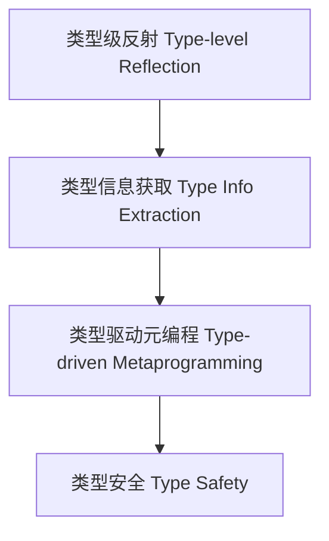

# 类型级反射高级应用（Type-Level Reflection Advanced in Haskell）

## 定义 Definition

- **中文**：类型级反射高级应用是指在类型系统层面动态获取、分析和操作类型信息的高级机制，支持类型驱动的元编程与类型安全的自动化推导。
- **English**: Type-level reflection advanced refers to advanced mechanisms for dynamically obtaining, analyzing, and manipulating type information at the type system level, supporting type-driven metaprogramming and type-safe automation in Haskell.

## Haskell 语法与实现 Syntax & Implementation

```haskell
{-# LANGUAGE TypeApplications, TypeFamilies, ScopedTypeVariables, AllowAmbiguousTypes #-}
import Data.Proxy

-- 类型级反射示例：通过 Proxy 获取类型信息
class TypeName a where
  typeName :: proxy a -> String

instance TypeName Int where
  typeName _ = "Int"

instance TypeName Bool where
  typeName _ = "Bool"
```

## 类型级反射机制 Type-Level Reflection Mechanism

- 利用 Typeable、Proxy、TypeFamilies 等机制在类型层级获取类型信息
- 支持类型驱动的自动推导与元编程

## 工程应用 Engineering Application

- 类型安全的自动注册、类型驱动的 DSL、泛型推导
- Type-safe auto-registration, type-driven DSLs, generic derivation

## 形式化证明 Formal Reasoning

- **类型级反射一致性证明**：证明类型反射机制不会破坏类型安全
- **Proof of consistency for type-level reflection**: Show that type reflection mechanisms preserve type safety

## 范畴论映射 Category Theory Mapping

- 类型级反射可视为范畴中的自同构（Automorphism）或同构检测

## 结构图 Structure Diagram



## 本地跳转 Local References

- [类型反射 Type Reflection](../15-Type-Reflection/01-Type-Reflection-in-Haskell.md)
- [类型元编程 Type Metaprogramming](../18-Type-Metaprogramming/01-Type-Metaprogramming-in-Haskell.md)
- [类型级编程 Type-level Programming](../12-Type-Level-Programming/01-Type-Level-Programming-in-Haskell.md)
