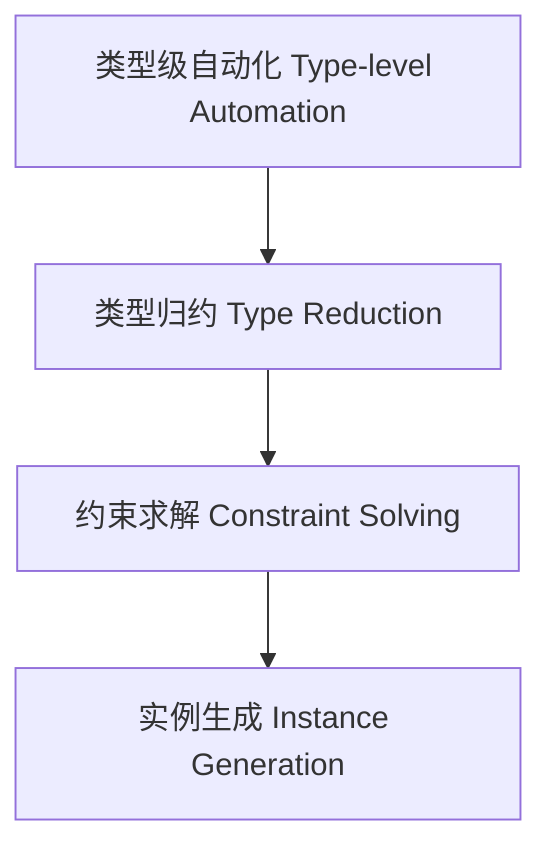

# 类型级自动化推导（Type-Level Automation in Haskell）

## 定义 Definition

- **中文**：类型级自动化推导是指在类型系统层面自动完成类型归约、约束求解、实例生成等任务的机制，提升类型系统的表达力与自动化能力。
- **English**: Type-level automation refers to mechanisms at the type system level for automatically performing type reduction, constraint solving, instance generation, etc., enhancing the expressiveness and automation of the type system in Haskell.

## Haskell 语法与实现 Syntax & Implementation

```haskell
{-# LANGUAGE TypeFamilies, MultiParamTypeClasses, FlexibleInstances, UndecidableInstances #-}

-- 类型级自动实例生成
class AutoInstance a where
  type Result a
  auto :: a -> Result a

instance AutoInstance Int where
  type Result Int = Bool
  auto n = n > 0

instance AutoInstance Bool where
  type Result Bool = Int
  auto b = if b then 1 else 0
```

## 类型级自动化机制 Type-Level Automation Mechanism

- 类型族、类型类、GADT等协同实现类型级自动归约与实例生成
- 支持类型级约束自动传播与消解

## 形式化证明 Formal Reasoning

- **自动化推导一致性证明**：证明自动化机制不会破坏类型系统一致性
- **Proof of automation consistency**: Show that automation mechanisms preserve type system consistency

## 工程应用 Engineering Application

- 类型安全的自动推导、类型驱动的代码生成、泛型库
- Type-safe automatic inference, type-driven code generation, generic libraries

## 范畴论映射 Category Theory Mapping

- 类型级自动化可视为范畴中的函子自动提升（Functor lifting）

## 结构图 Structure Diagram



## 本地跳转 Local References

- [类型族 Type Family](../11-Type-Family/01-Type-Family-in-Haskell.md)
- [类型级编程 Type-level Programming](../12-Type-Level-Programming/01-Type-Level-Programming-in-Haskell.md)
- [类型级约束求解 Type-Level Constraint Solving](../22-Type-Level-Constraint-Solving/01-Type-Level-Constraint-Solving-in-Haskell.md)
