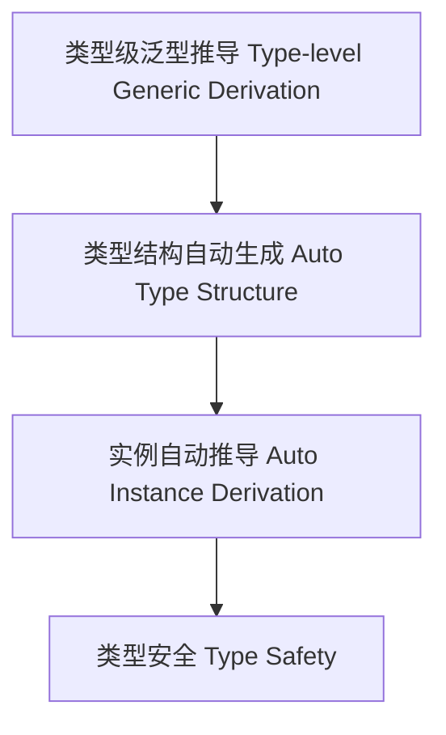

# 类型级泛型推导（Type-Level Generic Derivation in Haskell）

## 定义 Definition

- **中文**：类型级泛型推导是指在类型系统层面自动推导类型结构、实例和算法的机制，支持类型安全的泛型编程与自动化代码生成。
- **English**: Type-level generic derivation refers to mechanisms at the type system level for automatically deriving type structures, instances, and algorithms, supporting type-safe generic programming and automated code generation in Haskell.

## Haskell 语法与实现 Syntax & Implementation

```haskell
{-# LANGUAGE TypeFamilies, GADTs, DeriveGeneric, DefaultSignatures #-}
import GHC.Generics

-- 泛型推导示例：自动为数据类型生成类型级结构

data Tree a = Leaf a | Node (Tree a) (Tree a) deriving (Generic)

type family RepTree a where
  RepTree (Tree a) = Rep (Tree a)
```

## 泛型推导机制 Generic Derivation Mechanism

- 利用 GHC.Generics 自动生成类型级结构
- 支持类型级算法与实例自动推导

## 形式化证明 Formal Reasoning

- **泛型推导正确性证明**：证明自动推导的类型结构与原始类型等价
- **Proof of correctness for generic derivation**: Show that the automatically derived type structure is equivalent to the original type

### 证明示例 Proof Example

- 对 `RepTree (Tree a)`，归纳证明其结构与 `Tree a` 一一对应

## 工程应用 Engineering Application

- 类型安全的泛型库、自动化序列化/反序列化、DSL 框架
- Type-safe generic libraries, automated serialization/deserialization, DSL frameworks

## 范畴论映射 Category Theory Mapping

- 泛型推导对应于范畴中的函子同构（Functor isomorphism）

## 结构图 Structure Diagram



## 本地跳转 Local References

- [类型级泛型 Type-level Generic](../24-Type-Level-Generic/01-Type-Level-Generic-in-Haskell.md)
- [类型级自动化 Type-Level Automation](../27-Type-Level-Automation/01-Type-Level-Automation-in-Haskell.md)
- [类型元编程 Type Metaprogramming](../18-Type-Metaprogramming/01-Type-Metaprogramming-in-Haskell.md)
