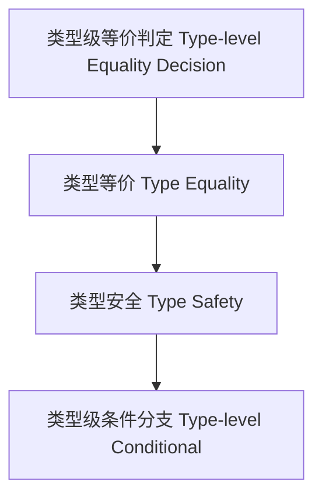

# 类型级等价判定（Type-Level Equality Decision in Haskell）

## 定义 Definition

- **中文**：类型级等价判定是指在类型系统层面判断两个类型是否等价的机制，广泛应用于类型安全、类型推断和类型级编程。
- **English**: Type-level equality decision refers to mechanisms at the type system level for determining whether two types are equivalent, widely used in type safety, type inference, and type-level programming in Haskell.

## Haskell 语法与实现 Syntax & Implementation

```haskell
{-# LANGUAGE TypeFamilies, TypeOperators, DataKinds, GADTs #-}

-- 类型级等价判定示例

data Equal a b where
  Refl :: Equal a a

-- 类型族实现类型等价判定

type family EqType a b where
  EqType a a = 'True
  EqType a b = 'False
```

## 等价判定机制 Equality Decision Mechanism

- 利用 GADT、类型族等实现类型等价判定
- 支持类型安全的条件分支与类型级约束

## 形式化证明 Formal Reasoning

- **等价判定正确性证明**：证明 EqType a b 的判定与类型系统一致
- **Proof of correctness for equality decision**: Show that EqType a b matches the type system's notion of equality

### 证明示例 Proof Example

- 对于 `EqType a b`，若 a 与 b 类型相同则为 True，否则为 False

## 工程应用 Engineering Application

- 类型安全的泛型编程、类型级条件分支、类型驱动的 DSL
- Type-safe generic programming, type-level conditional branching, type-driven DSLs

## 范畴论映射 Category Theory Mapping

- 类型等价判定对应于范畴中的同构判定（Isomorphism decision）

## 结构图 Structure Diagram



## 本地跳转 Local References

- [类型等价 Type Equality](../13-Type-Equality/01-Type-Equality-in-Haskell.md)
- [类型级编程 Type-level Programming](../12-Type-Level-Programming/01-Type-Level-Programming-in-Haskell.md)
- [类型安全 Type Safety](../14-Type-Safety/01-Type-Safety-in-Haskell.md)
