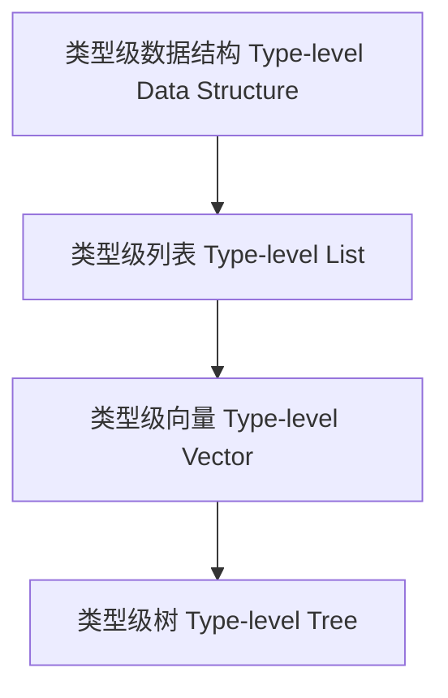

# 类型级数据结构（Type-Level Data Structure in Haskell）

## 定义 Definition

- **中文**：类型级数据结构是指在类型系统层面定义和操作的数据结构，支持编译期类型安全和类型级计算。
- **English**: Type-level data structure refers to data structures defined and manipulated at the type system level, supporting compile-time type safety and type-level computation in Haskell.

## Haskell 语法与实现 Syntax & Implementation

```haskell
{-# LANGUAGE DataKinds, TypeFamilies, GADTs, KindSignatures #-}

-- 类型级自然数和向量

data Nat = Z | S Nat

data Vec :: * -> Nat -> * where
  VNil  :: Vec a 'Z
  VCons :: a -> Vec a n -> Vec a ('S n)

-- 类型级列表拼接

type family Append (xs :: [k]) (ys :: [k]) :: [k] where
  Append '[] ys = ys
  Append (x ': xs) ys = x ': Append xs ys
```

## 类型级数据结构设计 Data Structure Design

- 类型级列表、向量、树等
- 支持类型级递归、归纳、泛型操作

## 形式化证明 Formal Reasoning

- **数据结构不变性证明**：如归纳证明 Append 保持类型结构一致性
- **Proof of invariance for data structures**: e.g., inductive proof that Append preserves type structure

### 证明示例 Proof Example

- 对 `Append xs ys`，对 `xs` 归纳：
  - 基础：`xs = []`，`Append [] ys = ys` 成立
  - 归纳：假设 `Append xs ys` 成立，则 `Append (x:xs) ys = x : Append xs ys` 也成立

## 工程应用 Engineering Application

- 类型安全的容器、类型级算法、嵌入式系统
- Type-safe containers, type-level algorithms, embedded systems

## 范畴论映射 Category Theory Mapping

- 类型级数据结构可视为范畴中的对象与态射的类型级建模

## 结构图 Structure Diagram



## 本地跳转 Local References

- [类型级泛型 Type-level Generic](../24-Type-Level-Generic/01-Type-Level-Generic-in-Haskell.md)
- [类型级递归优化 Type-Level Recursion Optimization](../31-Type-Level-Recursion-Optimization/01-Type-Level-Recursion-Optimization-in-Haskell.md)
- [类型级编程 Type-level Programming](../12-Type-Level-Programming/01-Type-Level-Programming-in-Haskell.md)
