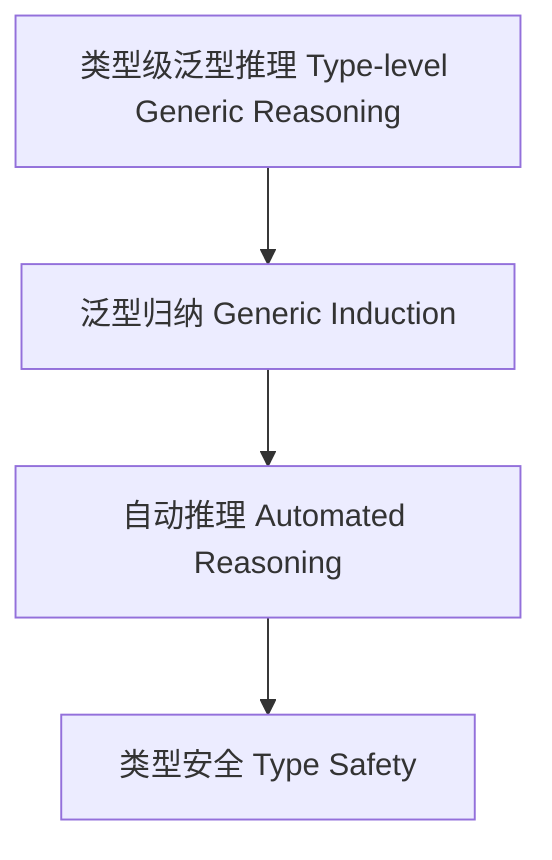

# 类型级泛型推理（Type-Level Generic Reasoning in Haskell）

## 定义 Definition

- **中文**：类型级泛型推理是指在类型系统层面对泛型类型及其属性进行自动化推理、归纳和验证的机制，支持类型安全的泛型编程与自动化证明。
- **English**: Type-level generic reasoning refers to mechanisms at the type system level for automated reasoning, induction, and verification of generic types and their properties, supporting type-safe generic programming and automated proofs in Haskell.

## Haskell 语法与实现 Syntax & Implementation

```haskell
{-# LANGUAGE TypeFamilies, DataKinds, TypeOperators, GADTs #-}

-- 类型级泛型推理示例：类型级列表映射与验证

type family Map (f :: k -> l) (xs :: [k]) :: [l] where
  Map f '[] = '[]
  Map f (x ': xs) = f x ': Map f xs

type family AllTrue (xs :: [Bool]) :: Bool where
  AllTrue '[] = 'True
  AllTrue ( 'True ': xs) = AllTrue xs
  AllTrue ( 'False ': xs) = 'False
```

## 泛型推理机制 Generic Reasoning Mechanism

- 类型族递归推理、类型类泛型属性分析
- 支持泛型类型属性的自动推理与归纳证明

## 形式化证明 Formal Reasoning

- **泛型推理正确性证明**：归纳证明 AllTrue (Map f xs) 能准确判断所有映射结果为 True
- **Proof of correctness for generic reasoning**: Inductive proof that AllTrue (Map f xs) correctly determines if all mapped results are True

### 证明示例 Proof Example

- 对 `Map f xs` 和 `AllTrue`，对 `xs` 归纳：
  - 基础：`xs = []`，`AllTrue [] = True` 成立
  - 归纳：递归判断每个元素映射结果

## 工程应用 Engineering Application

- 类型安全的泛型库、自动化推理、DSL 框架
- Type-safe generic libraries, automated reasoning, DSL frameworks

## 结构图 Structure Diagram



## 本地跳转 Local References

- [类型级泛型 Type-level Generic](../24-Type-Level-Generic/01-Type-Level-Generic-in-Haskell.md)
- [类型级泛型推理 Type-Level Generic Inference](../43-Type-Level-Generic-Inference/01-Type-Level-Generic-Inference-in-Haskell.md)
- [类型安全 Type Safety](../14-Type-Safety/01-Type-Safety-in-Haskell.md)
