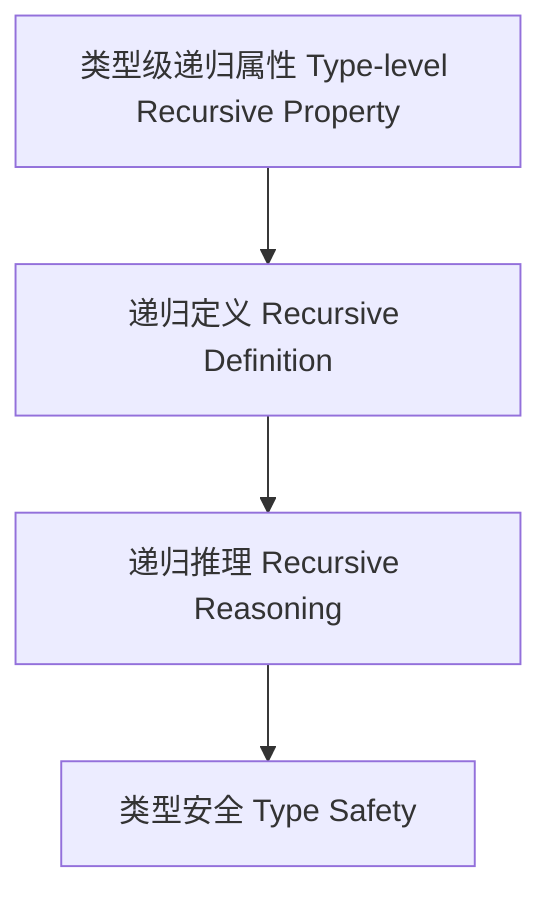

# 类型级递归属性（Type-Level Recursive Property in Haskell）

## 定义 Definition

- **中文**：类型级递归属性是指在类型系统层面对类型属性进行递归定义、递归推理和递归验证的机制，支持类型安全的自动化推理与泛型编程。
- **English**: Type-level recursive property refers to mechanisms at the type system level for recursively defining, reasoning, and verifying type properties, supporting type-safe automated reasoning and generic programming in Haskell.

## Haskell 语法与实现 Syntax & Implementation

```haskell
{-# LANGUAGE TypeFamilies, DataKinds, TypeOperators, GADTs #-}

-- 类型级递归属性示例：类型级列表是否严格递增

type family StrictlyIncreasing (xs :: [Nat]) :: Bool where
  StrictlyIncreasing '[] = 'True
  StrictlyIncreasing (x ': '[]) = 'True
  StrictlyIncreasing (x ': y ': xs) = (x < y) && StrictlyIncreasing (y ': xs)
```

## 递归属性机制 Recursive Property Mechanism

- 类型族递归定义、类型类递归推理
- 支持类型属性的递归定义、推理与验证

## 形式化证明 Formal Reasoning

- **递归属性正确性证明**：归纳证明 StrictlyIncreasing xs 能准确判断列表是否严格递增
- **Proof of correctness for recursive property**: Inductive proof that StrictlyIncreasing xs correctly determines if a list is strictly increasing

### 证明示例 Proof Example

- 对 `StrictlyIncreasing xs`，对 `xs` 归纳：
  - 基础：`xs = []` 或 `xs = [x]`，均为 True
  - 归纳：判断首对元素后递归判断余下元素

## 工程应用 Engineering Application

- 类型安全的属性验证、自动化推理、泛型库
- Type-safe property verification, automated reasoning, generic libraries

## 结构图 Structure Diagram



## 本地跳转 Local References

- [类型级属性推理 Type-Level Property Reasoning](../56-Type-Level-Property-Reasoning/01-Type-Level-Property-Reasoning-in-Haskell.md)
- [类型级递归推理 Type-Level Recursive Reasoning](../58-Type-Level-Recursive-Reasoning/01-Type-Level-Recursive-Reasoning-in-Haskell.md)
- [类型安全 Type Safety](../14-Type-Safety/01-Type-Safety-in-Haskell.md)
