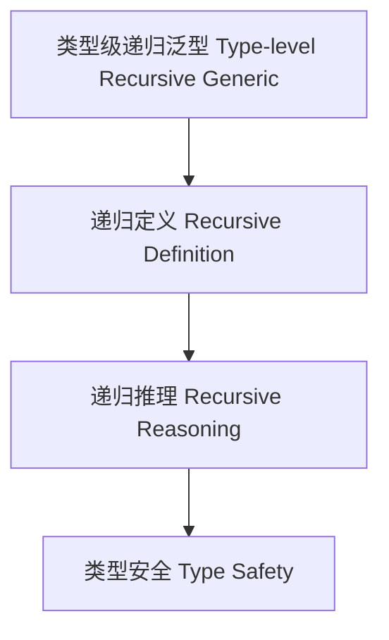

# 类型级递归泛型（Type-Level Recursive Generic in Haskell）

## 定义 Definition

- **中文**：类型级递归泛型是指在类型系统层面对泛型类型和算法进行递归定义、递归推理和递归验证的机制，支持类型安全的泛型编程与自动化推理。
- **English**: Type-level recursive generic refers to mechanisms at the type system level for recursively defining, reasoning, and verifying generic types and algorithms, supporting type-safe generic programming and automated reasoning in Haskell.

## Haskell 语法与实现 Syntax & Implementation

```haskell
{-# LANGUAGE TypeFamilies, DataKinds, TypeOperators, GADTs #-}

-- 类型级递归泛型示例：类型级泛型映射

type family Map (f :: k -> l) (xs :: [k]) :: [l] where
  Map f '[] = '[]
  Map f (x ': xs) = f x ': Map f xs
```

## 递归泛型机制 Recursive Generic Mechanism

- 类型族递归定义、类型类递归推理
- 支持泛型类型和算法的递归定义、推理与验证

## 形式化证明 Formal Reasoning

- **递归泛型正确性证明**：归纳证明 Map f xs 能正确映射所有元素
- **Proof of correctness for recursive generic**: Inductive proof that Map f xs correctly maps all elements

### 证明示例 Proof Example

- 对 `Map f xs`，对 `xs` 归纳：
  - 基础：`xs = []`，`Map f [] = []` 成立
  - 归纳：递归映射每个元素

## 工程应用 Engineering Application

- 类型安全的泛型库、自动化推理、DSL 框架
- Type-safe generic libraries, automated reasoning, DSL frameworks

## 结构图 Structure Diagram



## 本地跳转 Local References

- [类型级泛型推理 Type-Level Generic Reasoning](../57-Type-Level-Generic-Reasoning/01-Type-Level-Generic-Reasoning-in-Haskell.md)
- [类型级递归推理 Type-Level Recursive Reasoning](../58-Type-Level-Recursive-Reasoning/01-Type-Level-Recursive-Reasoning-in-Haskell.md)
- [类型安全 Type Safety](../14-Type-Safety/01-Type-Safety-in-Haskell.md)
