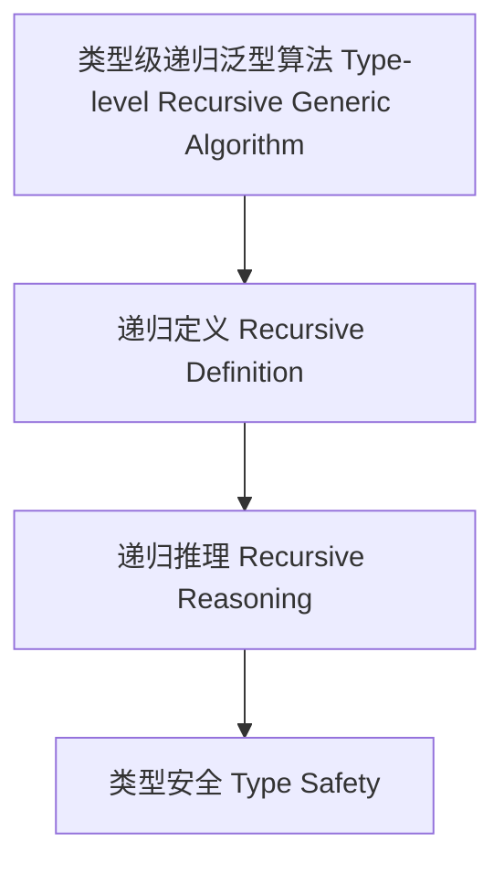

# 类型级递归泛型算法（Type-Level Recursive Generic Algorithm in Haskell）

## 定义 Definition

- **中文**：类型级递归泛型算法是指在类型系统层面对泛型算法进行递归定义、递归推理和递归验证的机制，支持类型安全的泛型编程与自动化推理。
- **English**: Type-level recursive generic algorithm refers to mechanisms at the type system level for recursively defining, reasoning, and verifying generic algorithms, supporting type-safe generic programming and automated reasoning in Haskell.

## Haskell 语法与实现 Syntax & Implementation

```haskell
{-# LANGUAGE TypeFamilies, DataKinds, TypeOperators, GADTs #-}

-- 类型级递归泛型算法示例：类型级列表反转

type family Reverse (xs :: [k]) :: [k] where
  Reverse '[] = '[]
  Reverse (x ': xs) = Append (Reverse xs) '[x]

type family Append (xs :: [k]) (ys :: [k]) :: [k] where
  Append '[] ys = ys
  Append (x ': xs) ys = x ': Append xs ys
```

## 递归泛型算法机制 Recursive Generic Algorithm Mechanism

- 类型族递归定义、类型类递归推理
- 支持泛型算法的递归定义、推理与验证

## 形式化证明 Formal Reasoning

- **递归泛型算法正确性证明**：归纳证明 Reverse (Reverse xs) = xs
- **Proof of correctness for recursive generic algorithm**: Inductive proof that Reverse (Reverse xs) = xs

### 证明示例 Proof Example

- 对 `Reverse xs`，对 `xs` 递归归纳：
  - 基础：`xs = []`，`Reverse [] = []` 成立
  - 归纳：递归反转后再反转回原列表

## 工程应用 Engineering Application

- 类型安全的泛型算法库、自动化推理、DSL 框架
- Type-safe generic algorithm libraries, automated reasoning, DSL frameworks

## 结构图 Structure Diagram



## 本地跳转 Local References

- [类型级泛型算法 Type-Level Generic Algorithm](../33-Type-Level-Generic-Algorithm/01-Type-Level-Generic-Algorithm-in-Haskell.md)
- [类型级递归推理 Type-Level Recursive Reasoning](../58-Type-Level-Recursive-Reasoning/01-Type-Level-Recursive-Reasoning-in-Haskell.md)
- [类型安全 Type Safety](../14-Type-Safety/01-Type-Safety-in-Haskell.md)
