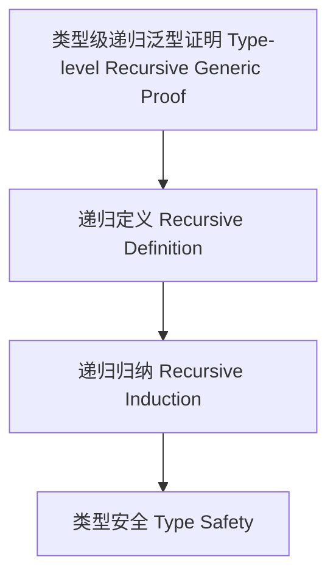

# 类型级递归泛型证明（Type-Level Recursive Generic Proof in Haskell）

## 定义 Definition

- **中文**：类型级递归泛型证明是指在类型系统层面对泛型类型和算法进行递归归纳证明的机制，支持类型安全的泛型编程与自动化推理。
- **English**: Type-level recursive generic proof refers to mechanisms at the type system level for recursively and inductively proving properties of generic types and algorithms, supporting type-safe generic programming and automated reasoning in Haskell.

## Haskell 语法与实现 Syntax & Implementation

```haskell
{-# LANGUAGE TypeFamilies, DataKinds, TypeOperators, GADTs #-}

-- 类型级递归泛型证明示例：类型级列表反转的归纳证明

type family Reverse (xs :: [k]) :: [k] where
  Reverse '[] = '[]
  Reverse (x ': xs) = Append (Reverse xs) '[x]

type family Append (xs :: [k]) (ys :: [k]) :: [k] where
  Append '[] ys = ys
  Append (x ': xs) ys = x ': Append xs ys

-- 归纳证明 Reverse (Reverse xs) = xs
-- 省略具体证明代码，理论上可用类型等价与递归归纳法表达
```

## 递归泛型证明机制 Recursive Generic Proof Mechanism

- 类型族递归定义、类型类递归归纳
- 支持泛型类型和算法的递归归纳证明

## 形式化证明 Formal Reasoning

- **递归泛型证明严谨性**：每一步都需保证类型系统一致性
- **Rigorousness of recursive generic proof**: Each step must preserve type system consistency

### 证明示例 Proof Example

- 对 `Reverse xs`，对 `xs` 递归归纳：
  - 基础：`xs = []`，`Reverse [] = []` 成立
  - 归纳：递归反转后再反转回原列表

## 工程应用 Engineering Application

- 类型安全性证明、泛型算法正确性证明、自动化推理
- Type safety proofs, generic algorithm correctness proofs, automated reasoning

## 结构图 Structure Diagram



## 本地跳转 Local References

- [类型级递归泛型算法 Type-Level Recursive Generic Algorithm](../72-Type-Level-Recursive-Generic-Algorithm/01-Type-Level-Recursive-Generic-Algorithm-in-Haskell.md)
- [类型级递归证明 Type-Level Recursive Proof](../69-Type-Level-Recursive-Proof/01-Type-Level-Recursive-Proof-in-Haskell.md)
- [类型安全 Type Safety](../14-Type-Safety/01-Type-Safety-in-Haskell.md)
