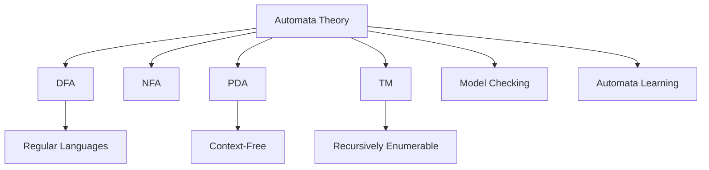
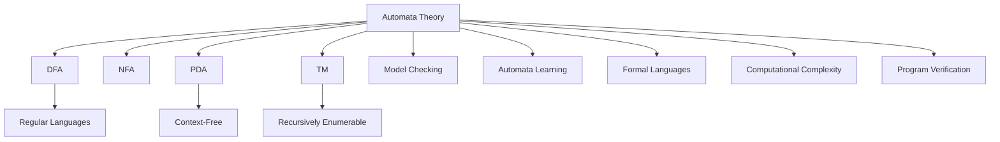

# 10.1 自动机理论的定义 Definition of Automata Theory #AutomataTheory-10.1

## 目录 Table of Contents

- 10.1 定义 Definition
- 10.2 哲学背景 Philosophical Background
- 10.3 核心概念 Core Concepts
- 10.4 历史发展 Historical Development
- 10.5 形式化语义 Formal Semantics
- 10.6 关键定理 Key Theorems
- 10.7 与其他理论的关系 Relationship to Other Theories
- 10.8 交叉引用 Cross References
- 10.9 参考文献 References
- 10.10 定义-属性-关系-解释-论证-形式化证明骨架
- 10.11 课程与行业案例对齐 Courses & Industry Alignment

## 定义 Definition

### 基本定义 Basic Definition

- **中文**：自动机理论是理论计算机科学和数理逻辑的分支，研究抽象计算模型（自动机）及其与形式语言、可计算性、复杂性等的关系。它关注于有限自动机、下推自动机、图灵机等模型的结构、能力与局限，为计算理论和编程语言提供理论基础。
- **English**: Automata theory is a branch of theoretical computer science and mathematical logic that studies abstract computational models (automata) and their relationships with formal languages, computability, and complexity. It focuses on the structure, power, and limitations of models such as finite automata, pushdown automata, and Turing machines, providing theoretical foundations for computation theory and programming languages.

### 形式化定义 Formal Definition

#### 自动机 Automaton

一个自动机 $A$ 是一个五元组 $(Q, \Sigma, \delta, q_0, F)$，其中：

- $Q$ 是有限状态集合
- $\Sigma$ 是输入字母表
- $\delta: Q \times \Sigma \rightarrow Q$ 是状态转移函数
- $q_0 \in Q$ 是初始状态
- $F \subseteq Q$ 是接受状态集合

#### 自动机执行 Automaton Execution

对于输入字符串 $w = a_1a_2\ldots a_n$，自动机的执行定义为：

$$q_0 \xrightarrow{a_1} q_1 \xrightarrow{a_2} q_2 \xrightarrow{a_3} \ldots \xrightarrow{a_n} q_n$$

其中 $q_i = \delta(q_{i-1}, a_i)$。

#### 语言识别 Language Recognition

自动机 $A$ 识别的语言定义为：

$$L(A) = \{w \in \Sigma^* \mid \delta^*(q_0, w) \in F\}$$

其中 $\delta^*$ 是转移函数的扩展。

## 哲学背景 Philosophical Background

### 机械哲学 Mechanical Philosophy

- **中文**：自动机理论体现了机械哲学思想，将计算过程视为机械化的状态转换过程，通过有限的状态和规则来描述复杂的计算行为。
- **English**: Automata theory embodies mechanical philosophy, viewing computational processes as mechanized state transition processes, describing complex computational behaviors through finite states and rules.

### 形式化思维 Formal Thinking

- **中文**：自动机理论体现了形式化思维，通过严格的数学定义和形式化规则来描述计算过程，强调精确性和可预测性。
- **English**: Automata theory embodies formal thinking, describing computational processes through rigorous mathematical definitions and formal rules, emphasizing precision and predictability.

### 抽象化哲学 Abstraction Philosophy

- **中文**：自动机理论体现了抽象化哲学，将复杂的计算过程抽象为简单的状态转换模型，通过抽象来理解计算的本质。
- **English**: Automata theory embodies abstraction philosophy, abstracting complex computational processes into simple state transition models, understanding the essence of computation through abstraction.

## 核心概念 Core Concepts

### 有限自动机 Finite Automaton

#### 确定性有限自动机 Deterministic Finite Automaton (DFA)

```haskell
-- 确定性有限自动机
data DFA = DFA
  { states :: Set State
  , alphabet :: Set Char
  , transition :: State -> Char -> State
  , startState :: State
  , acceptStates :: Set State
  }

type State = Int

-- DFA执行
runDFA :: DFA -> String -> Bool
runDFA dfa input = 
  let finalState = foldl (transition dfa) (startState dfa) input
  in finalState `elem` acceptStates dfa

-- 状态转移
stepDFA :: DFA -> State -> Char -> State
stepDFA dfa state symbol = transition dfa state symbol
```

#### 非确定性有限自动机 Nondeterministic Finite Automaton (NFA)

```haskell
-- 非确定性有限自动机
data NFA = NFA
  { states :: Set State
  , alphabet :: Set Char
  , transitions :: Map (State, Char) (Set State)
  , startStates :: Set State
  , acceptStates :: Set State
  }

-- NFA执行
runNFA :: NFA -> String -> Bool
runNFA nfa input = 
  let finalStates = foldl (stepNFA nfa) (startStates nfa) input
  in not (null (finalStates `intersection` acceptStates nfa))

-- 状态转移
stepNFA :: NFA -> Set State -> Char -> Set State
stepNFA nfa currentStates symbol = 
  foldr union emptySet 
    [fromJust (lookup (state, symbol) (transitions nfa)) 
     | state <- toList currentStates]
```

### 下推自动机 Pushdown Automaton

#### 确定性下推自动机 Deterministic Pushdown Automaton (DPDA)

```haskell
-- 确定性下推自动机
data DPDA = DPDA
  { states :: Set State
  , alphabet :: Set Char
  , stackAlphabet :: Set Char
  , transitions :: Map (State, Char, Char) (State, [Char])
  , startState :: State
  , startStack :: Char
  , acceptStates :: Set State
  }

-- DPDA配置
data PDAConfig = PDAConfig
  { currentState :: State
  , remainingInput :: String
  , stack :: [Char]
  }

-- DPDA执行
runDPDA :: DPDA -> String -> Bool
runDPDA dpda input = 
  let initialConfig = PDAConfig (startState dpda) input [startStack dpda]
      finalConfigs = allComputations dpda initialConfig
  in any (\config -> currentState config `elem` acceptStates dpda) finalConfigs

-- DPDA计算
allComputations :: DPDA -> PDAConfig -> [PDAConfig]
allComputations dpda config = 
  case stepDPDA dpda config of
    [] -> [config]  -- 无法继续
    nextConfigs -> config : concatMap (allComputations dpda) nextConfigs

-- DPDA步骤
stepDPDA :: DPDA -> PDAConfig -> [PDAConfig]
stepDPDA dpda (PDAConfig state (c:input) (top:stack)) = 
  case lookup (state, c, top) (transitions dpda) of
    Just (newState, push) -> 
      [PDAConfig newState input (push ++ stack)]
    Nothing -> []
stepDPDA _ _ = []
```

### 图灵机 Turing Machine

#### 标准图灵机 Standard Turing Machine

```haskell
-- 图灵机
data TuringMachine = TuringMachine
  { states :: Set State
  , alphabet :: Set Char
  , tapeAlphabet :: Set Char
  , transitions :: Map (State, Char) (State, Char, Direction)
  , startState :: State
  , blankSymbol :: Char
  , acceptStates :: Set State
  , rejectStates :: Set State
  }

data Direction = Left | Right | Stay

-- 图灵机配置
data TMConfig = TMConfig
  { currentState :: State
  , tape :: [Char]
  , headPosition :: Int
  }

-- 图灵机执行
runTuringMachine :: TuringMachine -> String -> Bool
runTuringMachine tm input = 
  let initialConfig = TMConfig (startState tm) (input ++ repeat (blankSymbol tm)) 0
      finalConfig = runUntilHalt tm initialConfig
  in currentState finalConfig `elem` acceptStates tm

-- 运行直到停机
runUntilHalt :: TuringMachine -> TMConfig -> TMConfig
runUntilHalt tm config = 
  case stepTM tm config of
    Just nextConfig -> runUntilHalt tm nextConfig
    Nothing -> config

-- 图灵机步骤
stepTM :: TuringMachine -> TMConfig -> Maybe TMConfig
stepTM tm (TMConfig state tape pos) = 
  let currentSymbol = tape !! pos
  in case lookup (state, currentSymbol) (transitions tm) of
    Just (newState, newSymbol, direction) -> 
      let newTape = updateAt pos newSymbol tape
          newPos = case direction of
            Left -> max 0 (pos - 1)
            Right -> pos + 1
            Stay -> pos
      in Just (TMConfig newState newTape newPos)
    Nothing -> Nothing
```

### 自动机层次结构 Automata Hierarchy

#### 乔姆斯基层次结构 Chomsky Hierarchy

1. **正则语言 (Regular Languages)**
   - 被有限自动机识别
   - 表达能力最弱
   - 形式：$A \rightarrow aB$ 或 $A \rightarrow a$

2. **上下文无关语言 (Context-Free Languages)**
   - 被下推自动机识别
   - 表达能力中等
   - 形式：$A \rightarrow \alpha$

3. **上下文相关语言 (Context-Sensitive Languages)**
   - 被线性有界自动机识别
   - 表达能力较强
   - 形式：$\alpha A \beta \rightarrow \alpha \gamma \beta$

4. **递归可枚举语言 (Recursively Enumerable Languages)**
   - 被图灵机识别
   - 表达能力最强
   - 形式：$\alpha \rightarrow \beta$

#### 自动机能力比较

```haskell
-- 自动机类型
data AutomatonType = 
  FiniteAutomaton | PushdownAutomaton | TuringMachine

-- 计算能力
data ComputationalPower = 
  Regular | ContextFree | ContextSensitive | RecursivelyEnumerable

-- 自动机能力映射
automatonPower :: AutomatonType -> ComputationalPower
automatonPower FiniteAutomaton = Regular
automatonPower PushdownAutomaton = ContextFree
automatonPower TuringMachine = RecursivelyEnumerable

-- 语言识别能力
canRecognize :: AutomatonType -> LanguageClass -> Bool
canRecognize FiniteAutomaton Regular = True
canRecognize FiniteAutomaton _ = False
canRecognize PushdownAutomaton ContextFree = True
canRecognize PushdownAutomaton Regular = True
canRecognize PushdownAutomaton _ = False
canRecognize TuringMachine _ = True
```

## 历史发展 Historical Development

### 理论基础 Theoretical Foundation

#### 自动机理论的起源 (1930s-1940s)

- **Alan Turing** 提出图灵机模型 (1936)
- **Warren McCulloch** 和 **Walter Pitts** 提出神经网络模型 (1943)
- **Stephen Kleene** 发展正则表达式理论 (1956)

#### 有限自动机理论的发展 (1950s-1960s)

- **Michael Rabin** 和 **Dana Scott** 发展有限自动机理论 (1959)
- **John Myhill** 和 **Anil Nerode** 提出Myhill-Nerode定理
- **Arto Salomaa** 研究自动机的代数性质

### 现代发展 Modern Development

#### 模型检测 (1980s-2020s)

```haskell
-- 模型检测
data ModelChecker = ModelChecker
  { system :: Automaton
  , specification :: TemporalFormula
  , algorithm :: ModelCheckingAlgorithm
  }

-- 模型检测算法
data ModelCheckingAlgorithm = 
  ExplicitState | Symbolic | Bounded

-- 模型检测结果
data ModelCheckingResult = 
  Satisfied | Violated | Unknown

-- 执行模型检测
modelCheck :: ModelChecker -> ModelCheckingResult
modelCheck checker = 
  case algorithm checker of
    ExplicitState -> explicitStateCheck (system checker) (specification checker)
    Symbolic -> symbolicCheck (system checker) (specification checker)
    Bounded -> boundedCheck (system checker) (specification checker)
```

#### 自动机学习 (1990s-2020s)

```haskell
-- 自动机学习
data AutomatonLearning = AutomatonLearning
  { examples :: [String]
  , counterexamples :: [String]
  , algorithm :: LearningAlgorithm
  }

data LearningAlgorithm = 
  LStar | Angluin | RPNI

-- 学习自动机
learnAutomaton :: AutomatonLearning -> Automaton
learnAutomaton learning = 
  case algorithm learning of
    LStar -> lStarAlgorithm learning
    Angluin -> angluinAlgorithm learning
    RPNI -> rpniAlgorithm learning
```

## 形式化语义 Formal Semantics

### 操作语义 Operational Semantics

#### 自动机执行语义

对于自动机 $A$ 和输入 $w$，执行语义定义为：

$$A(w) = \begin{cases}
\text{accept} & \text{if } \delta^*(q_0, w) \in F \\
\text{reject} & \text{otherwise}
\end{cases}$$

#### 语言识别语义

对于自动机 $A$，语言识别语义定义为：

$$L(A) = \{w \in \Sigma^* \mid A(w) = \text{accept}\}$$

### 指称语义 Denotational Semantics

#### 自动机语义

对于自动机 $A$，其指称语义定义为：

$$[\![A]\!] = L(A)$$

#### 自动机组合语义

对于自动机 $A_1$ 和 $A_2$，组合语义定义为：

$$[\![A_1 \times A_2]\!] = [\![A_1]\!] \cap [\![A_2]\!]$$

### 关键定理 Key Theorems（陈述/骨架）

- **Kleene 定理（表达式-自动机等价）**:
  正则表达式与有限自动机识别的语言类相同；存在相互构造。

- **NFA-DFA 等价**:
  ∀NFA 存在等价 DFA（子集构造）；最小化 DFA 唯一（至同构）。

- **PDA 与 CFG 对应**:
  上下文无关语言与下推自动机识别语言类相同；CFG 与 PDA 可相互构造。

（形式化方向）以接受关系/转换闭包定义自动机语义，证明构造保语言等价与闭包性质。

## 与其他理论的关系 Relationship to Other Theories

### 与形式语言理论的关系

- **中文**：自动机理论与形式语言理论紧密相关，每种自动机类型都对应特定的语言类，形成了完整的语言-自动机对应关系。
- **English**: Automata theory is closely related to formal language theory, where each automaton type corresponds to a specific language class, forming a complete language-automaton correspondence.

### 与计算理论的关系

- **中文**：自动机理论为计算理论提供模型基础，通过自动机的计算能力来研究可计算性和计算复杂性。
- **English**: Automata theory provides model foundations for computation theory, studying computability and computational complexity through automaton computational power.

### 与编程语言理论的关系

- **中文**：自动机理论为编程语言理论提供实现基础，编译器、解释器和语法分析器都基于自动机理论。
- **English**: Automata theory provides implementation foundations for programming language theory, where compilers, interpreters, and parsers are based on automata theory.

## 交叉引用 Cross References

- [形式语言理论 Formal Language Theory](../FormalLanguageTheory/README.md)
- [计算理论 Computation Theory](../Recursion_Computability_Theory/README.md)
- [编程语言理论 Programming Language Theory](../ProgrammingLanguageTheory/README.md)
- [形式化定义 Formal Definitions](../FormalDefinitions/README.md)
- [定理与证明 Theorems & Proofs](../Theorems_Proofs/README.md)

## 参考文献 References

1. Turing, A. M. (1936). On computable numbers, with an application to the Entscheidungsproblem. Proceedings of the London Mathematical Society, 2(42), 230-265.
2. Rabin, M. O., & Scott, D. (1959). Finite automata and their decision problems. IBM Journal of Research and Development, 3(2), 114-125.
3. Hopcroft, J. E., Motwani, R., & Ullman, J. D. (2006). Introduction to automata theory, languages, and computation. Pearson.
4. Sipser, M. (2012). Introduction to the theory of computation. Cengage Learning.
5. Kozen, D. C. (1997). Automata and computability. Springer.
6. Clarke, E. M., Grumberg, O., & Peled, D. A. (1999). Model checking. MIT Press.
7. Angluin, D. (1987). Learning regular sets from queries and counterexamples. Information and Computation, 75(2), 87-106.
8. Myhill, J. (1957). Finite automata and the representation of events. WADC Technical Report, 57-624.

## 定义-属性-关系-解释-论证-形式化证明骨架

- **定义 Definition**: DFA/NFA/PDA/TM 的状态机构成、执行、识别语言。
- **属性 Properties**: 等价性（NFA↔DFA）、闭包、判定性、可计算性界限。
- **关系 Relations**: 语言类与自动机层次的同构映射；模型检测/学习联系。
- **解释 Explanation**: 识别 vs 生成、构造算法、复杂性影响。
- **论证 Arguments**: Myhill–Nerode 定理、Kleene 定理、泵引理关联。
- **形式化证明 Formal Proofs**: 在 Coq/Lean 形式化自动机与接受关系，证明等价与闭包。

## 课程与行业案例对齐 Courses & Industry Alignment

- **课程**: 计算理论/自动机课程（Sipser/Hopcroft-Ullman）；编译原理词法/语法分析。
- **行业**: 正则/解析器引擎、模型检测、协议验证、模糊测试反馈自动机。

参考模板：参见 `../course_case_alignment_template.md`

## 对比分析 Comparison

- **中文**：自动机 vs 形式语言 vs 计算复杂性
  - 关系：自动机给出识别模型，文法给出生成模型，复杂性衡量资源边界。
  - 取舍：表达力↑→可判定性/可构造性↓；工程上需选安全子集。
- **English**: Automata vs formal languages vs complexity
  - Relation: automata recognize, grammars generate, complexity bounds resources.
  - Trade-off: more expressive ⇒ less decidable/constructible; pick safe subsets.

## 争议与批判 Controversies & Critique

- **中文**：
  - 真实系统非确定性/并发/时序特性难以用经典自动机直接刻画；
  - 高表达力模型（如 TM）缺乏工程可验证性与工具链支撑。
- **English**:
  - Nondeterminism/concurrency/temporal aspects challenge classic models;
  - Highly expressive models (TM) lack verification/tooling practicality.

## 前沿趋势 Frontier Trends

- **中文**：
  - 时序/概率/混杂自动机与模型检测；
  - 学习型自动机（L* 等）在协议推断与模糊测试中的应用；
  - 以范畴/代数视角统一自动机组合与并发。
- **English**:
  - Temporal/probabilistic/hybrid automata with model checking;
  - Automata learning (e.g., L*) for protocol inference and fuzzing;
  - Categorical/algebraic views for composition and concurrency.

## 常见陷阱 Common Pitfalls

- **中文**：
  - 子集构造遗漏 ε-闭包；最小化时合并不可达/等价类错误；
  - PDA 转换 CFG 时遗失栈操作约束；TM 转换边界条件处理不当。
- **English**:
  - Missing epsilon-closure in subset construction; faulty DFA minimization;
  - Losing stack constraints in PDA↔CFG; mishandling TM boundary conditions.

## 扩展交叉引用 Extended Cross References

- [形式语言理论 Formal Language Theory](../FormalLanguageTheory/README.md)
- [计算复杂性 Complexity Theory](../Recursion_Computability_Theory/README.md)
- [范畴论 Category Theory](../CategoryTheory/README.md)

## 知识图谱 Knowledge Graph



## 对比分析 Comparison

- **中文**：自动机理论 vs 形式语言理论 vs 计算复杂性理论 vs 程序验证理论
  - 自动机理论关注"抽象计算模型"；形式语言理论聚焦"语言结构"；计算复杂性理论强调"计算资源"；程序验证理论注重"程序正确性"。
- **English**: Automata theory vs formal language theory vs computational complexity theory vs program verification theory
  - Automata focuses on "abstract computational models"; formal language on "language structures"; complexity on "computational resources"; verification on "program correctness".

## 争议与批判 Controversies & Critique

- **中文**：
  - 有限状态模型的表达能力限制；非确定性 vs 确定性的实用性争议；
  - 自动机学习中的可解释性问题；模型检查的状态爆炸问题。
- **English**:
  - Expressiveness limitations of finite state models; controversies over nondeterminism vs determinism;
  - Interpretability issues in automata learning; state explosion in model checking.

## 前沿趋势 Frontier Trends

- **中文**：
  - 量子自动机与量子计算；神经符号自动机学习；
  - 分布式自动机与区块链验证；自动机在AI中的新应用。
- **English**:
  - Quantum automata and quantum computing; neuro-symbolic automata learning;
  - Distributed automata and blockchain verification; new applications of automata in AI.

## 常见陷阱 Common Pitfalls

- **中文**：
  - 过度简化复杂系统为有限状态模型；忽视自动机的表达能力限制；
  - 状态空间设计不当导致模型不可用；自动机学习中的过拟合问题。
- **English**:
  - Over-simplifying complex systems as finite state models; ignoring expressiveness limitations of automata;
  - Poor state space design leading to unusable models; overfitting in automata learning.

## 扩展交叉引用 Extended Cross References

- [形式语言理论 Formal Language Theory](../FormalLanguageTheory/README.md)
- [递归与可计算性理论 Recursion & Computability Theory](../Recursion_Computability_Theory/README.md)
- [语义模型 Semantic Models](../SemanticModels/README.md)
- [工程应用 Engineering Applications](../EngineeringApplications/README.md)
- [实践价值 Practical Value](../PracticalValue/README.md)
- [系统理论 System Theory](../SystemTheory/README.md)

## 知识图谱 Knowledge Graph


