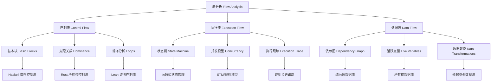

# 3. 控制流、执行流与数据流分析 Control Flow, Execution Flow & Data Flow Analysis

## 3.1 主题简介 Overview #ControlFlow-3.1

- **中文**：控制流、执行流与数据流分析是编程语言理论与工程中的核心分析方法，用于描述和推理程序的结构、运行顺序与数据依赖关系。这些分析为程序正确性验证、性能优化和安全性保证提供理论基础。
- **English**: Control flow, execution flow, and data flow analysis are core analytical methods in programming language theory and engineering, used to describe and reason about program structure, execution order, and data dependencies. These analyses provide theoretical foundations for program correctness verification, performance optimization, and security guarantees.

## 3.2 定义 Definition

### 基本定义 Basic Definition

- **中文**：控制流分析研究程序执行路径的流向和分支，执行流分析研究程序的实际执行顺序和状态转换，数据流分析研究数据在程序中的传播、使用和依赖关系。
- **English**: Control flow analysis studies the flow and branching of program execution paths, execution flow analysis studies the actual execution order and state transitions of programs, and data flow analysis studies the propagation, usage, and dependencies of data in programs.

### 形式化定义 Formal Definition

#### 控制流图 Control Flow Graph

一个控制流图 $G_{CF}$ 是一个四元组 $(V, E, entry, exit)$，其中：

- $V$ 是基本块集合
- $E \subseteq V \times V$ 是控制流边集合
- $entry \in V$ 是入口节点
- $exit \in V$ 是出口节点

#### 数据流方程 Data Flow Equations

对于数据流分析，基本方程为：

$$IN[B] = \bigcup_{P \in pred(B)} OUT[P]$$
$$OUT[B] = GEN[B] \cup (IN[B] - KILL[B])$$

其中 $IN[B]$ 是基本块 $B$ 的输入状态，$OUT[B]$ 是输出状态。

#### 执行流 Execution Flow

执行流 $F$ 是一个序列：

$$F = (s_0, s_1, s_2, \ldots, s_n)$$

其中 $s_i$ 是程序状态，$s_{i+1} = step(s_i)$。

## 3.3 哲学背景 Philosophical Background

### 决定论哲学 Deterministic Philosophy

- **中文**：控制流分析体现了决定论哲学思想，假设程序执行路径在给定输入下是确定的，可以通过静态分析来预测。
- **English**: Control flow analysis embodies deterministic philosophy, assuming that program execution paths are deterministic under given inputs and can be predicted through static analysis.

### 过程哲学 Process Philosophy

- **中文**：执行流分析体现了过程哲学思想，将程序执行视为一个动态过程，强调状态转换和过程演化。
- **English**: Execution flow analysis embodies process philosophy, viewing program execution as a dynamic process, emphasizing state transitions and process evolution.

### 信息哲学 Information Philosophy

- **中文**：数据流分析体现了信息哲学思想，将数据视为信息载体，研究信息在程序中的传播和转换。
- **English**: Data flow analysis embodies information philosophy, viewing data as information carriers, studying the propagation and transformation of information in programs.

## 3.4 核心概念 Core Concepts

### 控制流分析 Control Flow Analysis

#### 基本块分析 Basic Block Analysis

```haskell
-- 基本块
data BasicBlock = BasicBlock
  { blockId :: BlockId
  , instructions :: [Instruction]
  , predecessors :: [BlockId]
  , successors :: [BlockId]
  }

-- 控制流图
data ControlFlowGraph = ControlFlowGraph
  { blocks :: Map BlockId BasicBlock
  , entry :: BlockId
  , exit :: BlockId
  , edges :: [(BlockId, BlockId)]
  }

-- 控制流分析
analyzeControlFlow :: Program -> ControlFlowGraph
analyzeControlFlow program = ControlFlowGraph
  { blocks = extractBasicBlocks program
  , entry = findEntryBlock program
  , exit = findExitBlock program
  , edges = extractControlFlowEdges program
  }

-- 路径分析
findPaths :: ControlFlowGraph -> BlockId -> BlockId -> [[BlockId]]
findPaths cfg start end = 
  let allPaths = findAllPaths (blocks cfg) (edges cfg) start end
  in filter isValidPath allPaths
```

#### 循环分析 Loop Analysis

```haskell
-- 循环结构
data Loop = Loop
  { header :: BlockId
  , body :: [BlockId]
  , exit :: BlockId
  , type_ :: LoopType
  }

data LoopType = 
  WhileLoop
  | ForLoop
  | DoWhileLoop
  | NestedLoop

-- 循环检测
detectLoops :: ControlFlowGraph -> [Loop]
detectLoops cfg = 
  let dominators = calculateDominators cfg
      backEdges = findBackEdges cfg dominators
  in extractLoops cfg backEdges

-- 循环优化
optimizeLoops :: [Loop] -> [OptimizedLoop]
optimizeLoops loops = 
  map optimizeLoop loops
  where
    optimizeLoop loop = 
      case type_ loop of
        WhileLoop -> optimizeWhileLoop loop
        ForLoop -> optimizeForLoop loop
        DoWhileLoop -> optimizeDoWhileLoop loop
        NestedLoop -> optimizeNestedLoop loop
```

### 执行流分析 Execution Flow Analysis

#### 状态转换 State Transitions

```haskell
-- 程序状态
data ProgramState = ProgramState
  { variables :: Map Variable Value
  , callStack :: [CallFrame]
  , heap :: Heap
  , programCounter :: ProgramCounter
  }

-- 状态转换
data StateTransition = StateTransition
  { from :: ProgramState
  , to :: ProgramState
  , action :: Action
  , condition :: Maybe Condition
  }

-- 执行跟踪
data ExecutionTrace = ExecutionTrace
  { states :: [ProgramState]
  , transitions :: [StateTransition]
  , metadata :: TraceMetadata
  }

-- 执行流分析
analyzeExecutionFlow :: Program -> Input -> ExecutionTrace
analyzeExecutionFlow program input = ExecutionTrace
  { states = executeProgram program input
  , transitions = extractTransitions program input
  , metadata = generateTraceMetadata program input
  }
```

#### 并发执行流 Concurrent Execution Flow

```haskell
-- 并发执行流
data ConcurrentExecutionFlow = ConcurrentExecutionFlow
  { threads :: [Thread]
  , synchronization :: [SynchronizationPoint]
  , raceConditions :: [RaceCondition]
  , deadlocks :: [Deadlock]
  }

-- 线程
data Thread = Thread
  { threadId :: ThreadId
  , state :: ThreadState
  , executionTrace :: ExecutionTrace
  , resources :: [Resource]
  }

-- 同步点
data SynchronizationPoint = SynchronizationPoint
  { type_ :: SyncType
  , participants :: [ThreadId]
  , condition :: Condition
  , result :: SyncResult
  }

-- 并发分析
analyzeConcurrency :: Program -> ConcurrentExecutionFlow
analyzeConcurrency program = ConcurrentExecutionFlow
  { threads = extractThreads program
  , synchronization = findSynchronizationPoints program
  , raceConditions = detectRaceConditions program
  , deadlocks = detectDeadlocks program
  }
```

### 数据流分析 Data Flow Analysis

#### 数据依赖 Data Dependencies

```haskell
-- 数据依赖
data DataDependency = DataDependency
  { source :: Variable
  , target :: Variable
  , type_ :: DependencyType
  , strength :: DependencyStrength
  }

data DependencyType = 
  FlowDependency
  | AntiDependency
  | OutputDependency
  | ControlDependency

-- 数据流图
data DataFlowGraph = DataFlowGraph
  { nodes :: Map NodeId DataNode
  , edges :: Map EdgeId DataEdge
  , defs :: Map Variable [NodeId]
  , uses :: Map Variable [NodeId]
  }

-- 数据节点
data DataNode = DataNode
  { nodeId :: NodeId
  , operation :: Operation
  , inputs :: [Variable]
  , outputs :: [Variable]
  }

-- 数据流分析
analyzeDataFlow :: Program -> DataFlowGraph
analyzeDataFlow program = DataFlowGraph
  { nodes = extractDataNodes program
  , edges = extractDataEdges program
  , defs = findDefinitions program
  , uses = findUses program
  }
```

#### 活跃变量分析 Live Variable Analysis

```haskell
-- 活跃变量
data LiveVariable = LiveVariable
  { variable :: Variable
  , definition :: NodeId
  , uses :: [NodeId]
  , liveness :: LivenessRange
  }

-- 活跃性范围
data LivenessRange = LivenessRange
  { start :: NodeId
  , end :: NodeId
  , blocks :: [BlockId]
  }

-- 活跃变量分析
analyzeLiveVariables :: DataFlowGraph -> Map NodeId [Variable]
analyzeLiveVariables dfg = 
  let worklist = initializeWorklist dfg
      inSets = Map.empty
      outSets = Map.empty
  in iterateUntilFixedPoint worklist inSets outSets
  where
    iterateUntilFixedPoint worklist inSets outSets =
      if null worklist then
        inSets
      else
        let (node, rest) = (head worklist, tail worklist)
            (newIn, newOut) = updateSets node inSets outSets
            changed = newIn /= (Map.lookup node inSets) || newOut /= (Map.lookup node outSets)
        in if changed then
             iterateUntilFixedPoint (rest ++ successors node) newIn newOut
           else
             iterateUntilFixedPoint rest newIn newOut
```

## 3.5 历史发展 Historical Development

### 理论基础 Theoretical Foundation

#### 控制流分析的起源 (1960s-1970s)

- **Frances Allen** 发展控制流分析 (1966)
- **John Cocke** 研究程序优化 (1970s)
- **Ken Thompson** 开发Unix工具链 (1969)

#### 数据流分析的发展 (1970s-1980s)

- **Gary Kildall** 提出数据流方程 (1973)
- **Susan Graham** 研究全局优化 (1980s)
- **Alfred Aho** 发展编译器理论 (1986)

### 现代发展 Modern Development

#### 现代流分析 (1990s-2020s)

```haskell
-- 现代流分析
data ModernFlowAnalysis = ModernFlowAnalysis
  { interprocedural :: InterproceduralAnalysis
  , contextSensitive :: ContextSensitiveAnalysis
  , pointsTo :: PointsToAnalysis
  , shape :: ShapeAnalysis
  }

-- 过程间分析
data InterproceduralAnalysis = InterproceduralAnalysis
  { callGraph :: CallGraph
  , summary :: FunctionSummary
  , propagation :: InterproceduralPropagation
  }

-- 上下文敏感分析
data ContextSensitiveAnalysis = ContextSensitiveAnalysis
  { contexts :: [Context]
  , contextMapping :: Map Context AnalysisResult
  , contextMerge :: ContextMergeStrategy
  }
```

## 3.6 形式化语义 Formal Semantics

### 控制流语义 Control Flow Semantics

#### 控制流解释

对于控制流图 $G_{CF}$，其语义定义为：

$$[\![G_{CF}]\!] = \{(p, q) \mid p, q \in V, (p, q) \in E\}$$

#### 可达性语义

节点 $q$ 从节点 $p$ 可达当且仅当：

$$\exists \pi: p \rightarrow^* q$$

### 数据流语义 Data Flow Semantics

#### 数据流解释

对于数据流方程，其语义定义为：

$$[\![IN[B]]\!] = \bigcup_{P \in pred(B)} [\![OUT[P]]\!]$$

#### 不动点语义

数据流分析的不动点定义为：

$$F(X) = X$$

其中 $F$ 是数据流函数。

## 3.7 与其他理论的关系 Relationship to Other Theories

### 与类型理论的关系

- **中文**：控制流和数据流分析为类型理论提供运行时行为分析，类型理论为流分析提供静态保证。
- **English**: Control flow and data flow analysis provide runtime behavior analysis for type theory, while type theory provides static guarantees for flow analysis.

### 与程序验证的关系

- **中文**：流分析为程序验证提供行为模型，程序验证为流分析提供正确性保证。
- **English**: Flow analysis provides behavior models for program verification, while program verification provides correctness guarantees for flow analysis.

### 与编译器理论的关系

- **中文**：流分析是编译器优化的核心，编译器理论为流分析提供应用场景。
- **English**: Flow analysis is the core of compiler optimization, while compiler theory provides application scenarios for flow analysis.

## 3.8 例子与对比 Examples & Comparison

### Haskell流分析示例

```haskell
-- Haskell控制流分析
class ControlFlow a where
  controlFlow :: a -> ControlFlowGraph
  dataFlow :: a -> DataFlowGraph
  executionFlow :: a -> ExecutionTrace

-- 惰性求值控制流
data LazyControlFlow = LazyControlFlow
  { thunks :: Map ThunkId Thunk
  , evaluation :: EvaluationOrder
  , sharing :: SharingAnalysis
  }

-- 函数式数据流
data FunctionalDataFlow = FunctionalDataFlow
  { pureFunctions :: [PureFunction]
  , sideEffects :: [SideEffect]
  , dataTransformations :: [DataTransformation]
  }

-- 流分析实例
instance ControlFlow HaskellProgram where
  controlFlow program = analyzeHaskellControlFlow program
  dataFlow program = analyzeHaskellDataFlow program
  executionFlow program = analyzeHaskellExecutionFlow program
```

### Rust流分析示例

```rust
// Rust控制流分析
trait ControlFlow {
    type ControlFlowGraph;
    type DataFlowGraph;
    type ExecutionTrace;
    
    fn control_flow(&self) -> Self::ControlFlowGraph;
    fn data_flow(&self) -> Self::DataFlowGraph;
    fn execution_flow(&self) -> Self::ExecutionTrace;
}

// 所有权控制流
struct OwnershipControlFlow {
    ownership_graph: OwnershipGraph,
    borrowing_rules: Vec<BorrowingRule>,
    lifetime_analysis: LifetimeAnalysis,
}

// 内存安全数据流
struct MemorySafeDataFlow {
    ownership_flow: OwnershipFlow,
    borrowing_flow: BorrowingFlow,
    lifetime_flow: LifetimeFlow,
}

// Rust程序实现
impl ControlFlow for RustProgram {
    type ControlFlowGraph = RustControlFlowGraph;
    type DataFlowGraph = RustDataFlowGraph;
    type ExecutionTrace = RustExecutionTrace;
    
    fn control_flow(&self) -> Self::ControlFlowGraph {
        self.analyze_rust_control_flow()
    }
    
    fn data_flow(&self) -> Self::DataFlowGraph {
        self.analyze_rust_data_flow()
    }
    
    fn execution_flow(&self) -> Self::ExecutionTrace {
        self.analyze_rust_execution_flow()
    }
}
```

### Lean流分析示例

```lean
-- Lean控制流分析
class ControlFlow (α : Type) where
  controlFlow : α → ControlFlowGraph
  dataFlow : α → DataFlowGraph
  executionFlow : α → ExecutionTrace

-- 证明驱动控制流
structure ProofDrivenControlFlow where
  proofSteps : List ProofStep
  tacticApplications : List TacticApplication
  goalTransformations : List GoalTransformation

-- 依赖类型数据流
structure DependentTypeDataFlow where
  typeDependencies : List TypeDependency
  valueDependencies : List ValueDependency
  proofDependencies : List ProofDependency

-- Lean程序实例
instance ControlFlow LeanProgram where
  controlFlow := analyzeLeanControlFlow
  dataFlow := analyzeLeanDataFlow
  executionFlow := analyzeLeanExecutionFlow
```

## 3.9 典型对比表格 Typical Comparison Table

| 特性/语言 | Haskell | Rust | Lean |
|-----------|---------|------|------|
| 控制流     | 高阶函数、惰性 | 显式分支、所有权 | 证明驱动、递归 |
| 数据流     | 纯函数、不可变 | 可变/不可变借用 | 依赖类型、不可变 |
| 执行流     | 惰性求值 | 显式生命周期 | 证明步进 |
| 分析精度   | 高 | 高 | 最高 |
| 分析复杂度 | 中等 | 高 | 最高 |
| 工程实用性 | 高 | 高 | 中等 |

## 3.10 哲学批判与争议 Philosophical Critique & Controversies

### 决定论与非决定论

- **中文**：控制流分析面临决定论与非决定论的争议，如何在非确定性程序中应用确定性分析方法。
- **English**: Control flow analysis faces debates between determinism and non-determinism, how to apply deterministic analysis methods in non-deterministic programs.

### 静态与动态分析

- **中文**：流分析面临静态与动态分析的争议，如何在静态分析中捕获动态行为。
- **English**: Flow analysis faces controversies between static and dynamic analysis, how to capture dynamic behavior in static analysis.

### 精度与效率

- **中文**：流分析面临精度与效率的权衡，如何在保证分析精度的同时提高分析效率。
- **English**: Flow analysis faces trade-offs between precision and efficiency, how to improve analysis efficiency while ensuring analysis precision.

## 3.11 国际对比与标准 International Comparison & Standards

### 国际标准

- **ISO/IEC 14882** - C++语言标准
- **IEEE 754** - 浮点数标准
- **RFC文档** - 网络协议标准

### 学术规范

- **ACM/IEEE** - 计算机科学学术规范
- **Springer/LNCS** - 形式化方法学术规范

## 3.12 知识论证的完备性 Completeness of Epistemic Argumentation

### 完备性要求

- **中文**：需覆盖控制结构、数据依赖、执行路径、静态与动态分析、类型与安全性等知识点，确保理论与实践的闭环。
- **English**: Should cover control structures, data dependencies, execution paths, static and dynamic analysis, types and safety, ensuring a closed loop between theory and practice.

### 一致性检查

```haskell
-- 一致性检查
checkConsistency :: FlowAnalysis -> Bool
checkConsistency analysis = 
  let controlConsistency = checkControlFlowConsistency analysis
      dataConsistency = checkDataFlowConsistency analysis
      executionConsistency = checkExecutionFlowConsistency analysis
  in controlConsistency && dataConsistency && executionConsistency
```

## 3.13 交叉引用 Cross References

- [语法与语义 Syntax & Semantics](../Syntax_Semantics/README.md)
- [类型系统 Type Systems](../TypeSystems/README.md)
- [语义模型 Semantic Models](../SemanticModels/README.md)
- [工程应用 Engineering Applications](../EngineeringApplications/README.md)
- [形式化定义 Formal Definitions](../FormalDefinitions/README.md)

## 3.14 参考文献 References

1. Allen, F. E. (1970). Control flow analysis. ACM SIGPLAN Notices, 5(7), 1-19.
2. Kildall, G. A. (1973). A unified approach to global program optimization. POPL, 194-206.
3. Aho, A. V., Lam, M. S., Sethi, R., & Ullman, J. D. (2006). Compilers: Principles, techniques, and tools. Pearson Education.
4. Muchnick, S. S. (1997). Advanced compiler design and implementation. Morgan Kaufmann.
5. Nielson, F., Nielson, H. R., & Hankin, C. (2010). Principles of program analysis. Springer.
6. Cousot, P., & Cousot, R. (1977). Abstract interpretation: A unified lattice model for static analysis of programs by construction or approximation of fixpoints. POPL, 238-252.
7. Reps, T. W., Horwitz, S., & Sagiv, M. (1995). Precise interprocedural dataflow analysis via graph reachability. POPL, 49-61.
8. Steensgaard, B. (1996). Points-to analysis in almost linear time. POPL, 32-41.

## 3.15 批判性小结 Critical Summary

- **中文**：控制流、执行流与数据流分析为程序正确性与优化提供理论基础，但需兼顾理论深度、工程可用性与分析的可扩展性。未来需要关注并发分析、机器学习集成与自动化工具的发展。
- **English**: Control, execution, and data flow analysis provide a theoretical foundation for program correctness and optimization, but must balance theoretical depth, engineering usability, and scalability of analysis. Future work should focus on concurrent analysis, machine learning integration, and automated tools.

## 3.16 进一步批判性分析 Further Critical Analysis

### 挑战与机遇

- **并发复杂性**：流分析需要应对并发程序的复杂性挑战
- **机器学习集成**：需要结合机器学习技术，提高分析的智能化水平
- **自动化工具**：需要开发更好的自动化分析工具

### 未来发展方向

- **智能流分析**：结合人工智能技术，实现智能化的流分析
- **并发流分析**：发展并发程序的流分析理论和方法
- **自动化工具链**：推动流分析工具链的自动化进程

## 3.17 控制流分析框架 Control Flow Analysis Framework

### 3.17.1 形式化框架 Formal Framework

```haskell
-- 控制流分析框架
data ControlFlowAnalysis = ControlFlowAnalysis
  { cfg :: ControlFlowGraph
  , dominators :: Map BlockId [BlockId]
  , postDominators :: Map BlockId [BlockId]
  , loops :: [Loop]
  , regions :: [Region]
  }

-- 支配关系分析
data DominanceAnalysis = DominanceAnalysis
  { immediateDominators :: Map BlockId BlockId
  , dominanceFrontiers :: Map BlockId [BlockId]
  , dominanceTree :: DominanceTree
  }

-- 循环分析
data LoopAnalysis = LoopAnalysis
  { naturalLoops :: [NaturalLoop]
  , loopNesting :: LoopNestingTree
  , loopOptimizations :: [LoopOptimization]
  }

-- 区域分析
data RegionAnalysis = RegionAnalysis
  { regions :: [Region]
  , regionHierarchy :: RegionHierarchy
  , regionOptimizations :: [RegionOptimization]
  }
```

### 3.17.2 语言特定分析 Language-Specific Analysis

#### Haskell 控制流分析

```haskell
-- Haskell 惰性控制流
data HaskellControlFlow = HaskellControlFlow
  { thunkGraph :: ThunkGraph
  , evaluationOrder :: EvaluationOrder
  , sharingAnalysis :: SharingAnalysis
  , strictnessAnalysis :: StrictnessAnalysis
  }

-- Thunk 图
data ThunkGraph = ThunkGraph
  { thunks :: Map ThunkId Thunk
  , dependencies :: Map ThunkId [ThunkId]
  , evaluationPaths :: [EvaluationPath]
  }

-- 严格性分析
data StrictnessAnalysis = StrictnessAnalysis
  { strictFunctions :: Set FunctionId
  , strictArguments :: Map FunctionId [ArgumentPosition]
  , strictnessProperties :: [StrictnessProperty]
  }
```

#### Rust 控制流分析

```rust
// Rust 所有权控制流
struct RustControlFlow {
    ownership_graph: OwnershipGraph,
    borrowing_rules: Vec<BorrowingRule>,
    lifetime_analysis: LifetimeAnalysis,
    drop_analysis: DropAnalysis,
}

// 所有权图
struct OwnershipGraph {
    owners: Map<Variable, Owner>,
    borrowers: Map<Variable, Vec<Borrower>>,
    moves: Vec<Move>,
    drops: Vec<Drop>,
}

// 生命周期分析
struct LifetimeAnalysis {
    lifetimes: Map<Variable, Lifetime>,
    lifetime_constraints: Vec<LifetimeConstraint>,
    lifetime_inference: LifetimeInference,
}
```

#### Lean 控制流分析

```lean
-- Lean 证明控制流
structure LeanControlFlow where
  proofSteps : List ProofStep
  tacticApplications : List TacticApplication
  goalTransformations : List GoalTransformation
  proofDependencies : List ProofDependency

-- 证明步骤
structure ProofStep where
  tactic : Tactic
  goals : List Goal
  subgoals : List Goal
  proofTerm : ProofTerm

-- 目标转换
structure GoalTransformation where
  before : Goal
  after : Goal
  transformation : Transformation
  justification : Justification
```

## 3.18 执行流模型 Execution Flow Models

### 3.18.1 状态机模型 State Machine Model

```haskell
-- 状态机模型
data StateMachine = StateMachine
  { states :: Set State
  , transitions :: Map State [Transition]
  , initial :: State
  , accepting :: Set State
  }

-- 状态
data State = State
  { stateId :: StateId
  , variables :: Map Variable Value
  , programCounter :: ProgramCounter
  , callStack :: [CallFrame]
  }

-- 转换
data Transition = Transition
  { from :: State
  , to :: State
  , action :: Action
  , condition :: Maybe Condition
  , guard :: Maybe Guard
  }
```

### 3.18.2 并发执行模型 Concurrent Execution Model

```haskell
-- 并发执行模型
data ConcurrentExecutionModel = ConcurrentExecutionModel
  { threads :: Map ThreadId Thread
  , synchronization :: [SynchronizationPoint]
  , sharedState :: SharedState
  , interleaving :: [Interleaving]
  }

-- 线程
data Thread = Thread
  { threadId :: ThreadId
  , state :: ThreadState
  , executionTrace :: ExecutionTrace
  , resources :: Set Resource
  }

-- 同步点
data SynchronizationPoint = SynchronizationPoint
  { syncType :: SyncType
  , participants :: Set ThreadId
  , condition :: Condition
  , result :: SyncResult
  }
```

## 3.19 数据流分析模型 Data Flow Analysis Models

### 3.19.1 数据依赖图 Data Dependency Graph

```haskell
-- 数据依赖图
data DataDependencyGraph = DataDependencyGraph
  { nodes :: Map NodeId DataNode
  , edges :: Map EdgeId DataEdge
  , defs :: Map Variable [NodeId]
  , uses :: Map Variable [NodeId]
  }

-- 数据节点
data DataNode = DataNode
  { nodeId :: NodeId
  , operation :: Operation
  , inputs :: [Variable]
  , outputs :: [Variable]
  , constraints :: [Constraint]
  }

-- 数据边
data DataEdge = DataEdge
  { edgeId :: EdgeId
  , source :: NodeId
  , target :: NodeId
  , dependencyType :: DependencyType
  , strength :: DependencyStrength
  }
```

### 3.19.2 活跃变量分析 Live Variable Analysis

```haskell
-- 活跃变量分析
data LiveVariableAnalysis = LiveVariableAnalysis
  { liveVariables :: Map NodeId (Set Variable)
  , liveRanges :: Map Variable LiveRange
  , interferenceGraph :: InterferenceGraph
  }

-- 活跃范围
data LiveRange = LiveRange
  { variable :: Variable
  , start :: NodeId
  , end :: NodeId
  , blocks :: Set BlockId
  }

-- 干扰图
data InterferenceGraph = InterferenceGraph
  { nodes :: Set Variable
  , edges :: Set (Variable, Variable)
  , coloring :: Map Variable Color
  }
```

## 3.20 语言对比 Language Comparison

### 3.20.1 控制流特性对比 Control Flow Feature Comparison

| 特性 Feature | Haskell | Rust | Lean |
|-------------|---------|------|------|
| 控制结构 Control Structures | 高阶函数 | 显式分支 | 证明驱动 |
| 求值策略 Evaluation Strategy | 惰性 | 严格 | 严格 |
| 并发模型 Concurrency Model | STM/IO | 线程/异步 | 单线程 |
| 错误处理 Error Handling | Maybe/Either | Result | 证明保证 |

### 3.20.2 数据流特性对比 Data Flow Feature Comparison

| 特性 Feature | Haskell | Rust | Lean |
|-------------|---------|------|------|
| 数据模型 Data Model | 不可变 | 可变/不可变 | 不可变 |
| 内存管理 Memory Management | GC | 所有权 | GC |
| 数据依赖 Data Dependencies | 函数依赖 | 所有权依赖 | 类型依赖 |
| 数据转换 Data Transformations | 纯函数 | 命令式 | 函数式 |

### 3.20.3 执行流特性对比 Execution Flow Feature Comparison

| 特性 Feature | Haskell | Rust | Lean |
|-------------|---------|------|------|
| 执行模型 Execution Model | 惰性求值 | 严格求值 | 证明步进 |
| 状态管理 State Management | 函数式 | 命令式 | 函数式 |
| 并发执行 Concurrent Execution | STM | 线程 | 单线程 |
| 错误恢复 Error Recovery | 异常处理 | 错误类型 | 证明保证 |

## 3.21 结构图 Structure Diagram



## 3.17 1控制流分析框架 Control Flow Analysis Framework

### 3.17.1 1形式化框架 Formal Framework

```haskell
-- 控制流分析框架
data ControlFlowAnalysis = ControlFlowAnalysis
  { cfg :: ControlFlowGraph
  , dominators :: Map BlockId [BlockId]
  , postDominators :: Map BlockId [BlockId]
  , loops :: [Loop]
  , regions :: [Region]
  }

-- 支配关系分析
data DominanceAnalysis = DominanceAnalysis
  { immediateDominators :: Map BlockId BlockId
  , dominanceFrontiers :: Map BlockId [BlockId]
  , dominanceTree :: DominanceTree
  }

-- 循环分析
data LoopAnalysis = LoopAnalysis
  { naturalLoops :: [NaturalLoop]
  , loopNesting :: LoopNestingTree
  , loopOptimizations :: [LoopOptimization]
  }

-- 区域分析
data RegionAnalysis = RegionAnalysis
  { regions :: [Region]
  , regionHierarchy :: RegionHierarchy
  , regionOptimizations :: [RegionOptimization]
  }
```

### 3.17.2 1语言特定分析 Language-Specific Analysis

#### Haskell 1控制流分析

```haskell
-- Haskell 惰性控制流
data HaskellControlFlow = HaskellControlFlow
  { thunkGraph :: ThunkGraph
  , evaluationOrder :: EvaluationOrder
  , sharingAnalysis :: SharingAnalysis
  , strictnessAnalysis :: StrictnessAnalysis
  }

-- Thunk 图
data ThunkGraph = ThunkGraph
  { thunks :: Map ThunkId Thunk
  , dependencies :: Map ThunkId [ThunkId]
  , evaluationPaths :: [EvaluationPath]
  }

-- 严格性分析
data StrictnessAnalysis = StrictnessAnalysis
  { strictFunctions :: Set FunctionId
  , strictArguments :: Map FunctionId [ArgumentPosition]
  , strictnessProperties :: [StrictnessProperty]
  }
```

#### Rust 1控制流分析

```rust
// Rust 所有权控制流
struct RustControlFlow {
    ownership_graph: OwnershipGraph,
    borrowing_rules: Vec<BorrowingRule>,
    lifetime_analysis: LifetimeAnalysis,
    drop_analysis: DropAnalysis,
}

// 所有权图
struct OwnershipGraph {
    owners: Map<Variable, Owner>,
    borrowers: Map<Variable, Vec<Borrower>>,
    moves: Vec<Move>,
    drops: Vec<Drop>,
}

// 生命周期分析
struct LifetimeAnalysis {
    lifetimes: Map<Variable, Lifetime>,
    lifetime_constraints: Vec<LifetimeConstraint>,
    lifetime_inference: LifetimeInference,
}
```

#### Lean 1控制流分析

```lean
-- Lean 证明控制流
structure LeanControlFlow where
  proofSteps : List ProofStep
  tacticApplications : List TacticApplication
  goalTransformations : List GoalTransformation
  proofDependencies : List ProofDependency

-- 证明步骤
structure ProofStep where
  tactic : Tactic
  goals : List Goal
  subgoals : List Goal
  proofTerm : ProofTerm

-- 目标转换
structure GoalTransformation where
  before : Goal
  after : Goal
  transformation : Transformation
  justification : Justification
```

## 3.18 1执行流模型 Execution Flow Models

### 3.18.1 1状态机模型 State Machine Model

```haskell
-- 状态机模型
data StateMachine = StateMachine
  { states :: Set State
  , transitions :: Map State [Transition]
  , initial :: State
  , accepting :: Set State
  }

-- 状态
data State = State
  { stateId :: StateId
  , variables :: Map Variable Value
  , programCounter :: ProgramCounter
  , callStack :: [CallFrame]
  }

-- 转换
data Transition = Transition
  { from :: State
  , to :: State
  , action :: Action
  , condition :: Maybe Condition
  , guard :: Maybe Guard
  }
```

### 3.18.2 1并发执行模型 Concurrent Execution Model

```haskell
-- 并发执行模型
data ConcurrentExecutionModel = ConcurrentExecutionModel
  { threads :: Map ThreadId Thread
  , synchronization :: [SynchronizationPoint]
  , sharedState :: SharedState
  , interleaving :: [Interleaving]
  }

-- 线程
data Thread = Thread
  { threadId :: ThreadId
  , state :: ThreadState
  , executionTrace :: ExecutionTrace
  , resources :: Set Resource
  }

-- 同步点
data SynchronizationPoint = SynchronizationPoint
  { syncType :: SyncType
  , participants :: Set ThreadId
  , condition :: Condition
  , result :: SyncResult
  }
```

## 3.19 1数据流分析模型 Data Flow Analysis Models

### 3.19.1 1数据依赖图 Data Dependency Graph

```haskell
-- 数据依赖图
data DataDependencyGraph = DataDependencyGraph
  { nodes :: Map NodeId DataNode
  , edges :: Map EdgeId DataEdge
  , defs :: Map Variable [NodeId]
  , uses :: Map Variable [NodeId]
  }

-- 数据节点
data DataNode = DataNode
  { nodeId :: NodeId
  , operation :: Operation
  , inputs :: [Variable]
  , outputs :: [Variable]
  , constraints :: [Constraint]
  }

-- 数据边
data DataEdge = DataEdge
  { edgeId :: EdgeId
  , source :: NodeId
  , target :: NodeId
  , dependencyType :: DependencyType
  , strength :: DependencyStrength
  }
```

### 3.19.2 1活跃变量分析 Live Variable Analysis

```haskell
-- 活跃变量分析
data LiveVariableAnalysis = LiveVariableAnalysis
  { liveVariables :: Map NodeId (Set Variable)
  , liveRanges :: Map Variable LiveRange
  , interferenceGraph :: InterferenceGraph
  }

-- 活跃范围
data LiveRange = LiveRange
  { variable :: Variable
  , start :: NodeId
  , end :: NodeId
  , blocks :: Set BlockId
  }

-- 干扰图
data InterferenceGraph = InterferenceGraph
  { nodes :: Set Variable
  , edges :: Set (Variable, Variable)
  , coloring :: Map Variable Color
  }
```

## 3.20 1语言对比 Language Comparison

### 3.20.1 1控制流特性对比 Control Flow Feature Comparison

| 特性 Feature | Haskell | Rust | Lean |
|-------------|---------|------|------|
| 控制结构 Control Structures | 高阶函数 | 显式分支 | 证明驱动 |
| 求值策略 Evaluation Strategy | 惰性 | 严格 | 严格 |
| 并发模型 Concurrency Model | STM/IO | 线程/异步 | 单线程 |
| 错误处理 Error Handling | Maybe/Either | Result | 证明保证 |

### 3.20.2 1数据流特性对比 Data Flow Feature Comparison

| 特性 Feature | Haskell | Rust | Lean |
|-------------|---------|------|------|
| 数据模型 Data Model | 不可变 | 可变/不可变 | 不可变 |
| 内存管理 Memory Management | GC | 所有权 | GC |
| 数据依赖 Data Dependencies | 函数依赖 | 所有权依赖 | 类型依赖 |
| 数据转换 Data Transformations | 纯函数 | 命令式 | 函数式 |

### 3.20.3 1执行流特性对比 Execution Flow Feature Comparison

| 特性 Feature | Haskell | Rust | Lean |
|-------------|---------|------|------|
| 执行模型 Execution Model | 惰性求值 | 严格求值 | 证明步进 |
| 状态管理 State Management | 函数式 | 命令式 | 函数式 |
| 并发执行 Concurrent Execution | STM | 线程 | 单线程 |
| 错误恢复 Error Recovery | 异常处理 | 错误类型 | 证明保证 |

## 3.21 1结构图 Structure Diagram


