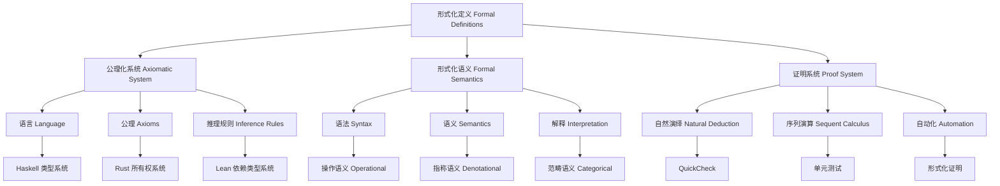

# 8. 形式化定义 Formal Definitions

## 8.1 主题简介 Overview #FormalDefinitions-8.1

- **中文**：本节收录Haskell、Rust、Lean及相关理论的核心形式化定义，强调严谨性与可验证性。形式化定义是理论计算机科学的基础，为编程语言、类型系统、语义模型等提供严格的数学基础。
- **English**: This section collects core formal definitions from Haskell, Rust, Lean, and related theories, emphasizing rigor and verifiability. Formal definitions are the foundation of theoretical computer science, providing rigorous mathematical foundations for programming languages, type systems, semantic models, etc.

## 8.2 定义 Definition

### 基本定义 Basic Definition

- **中文**：形式化定义是通过严格的数学语言对概念、规则、系统进行精确描述的方法。它使用符号、公式、公理和推理规则来确保定义的准确性和可验证性。
- **English**: Formal definitions are methods of precisely describing concepts, rules, and systems through rigorous mathematical language. They use symbols, formulas, axioms, and inference rules to ensure the accuracy and verifiability of definitions.

### 形式化定义 Formal Definition

#### 形式化系统 Formal System

一个形式化系统 $F$ 是一个四元组 $(S, A, R, T)$，其中：

- $S$ 是符号集合
- $A$ 是公理集合
- $R$ 是推理规则集合
- $T$ 是定理集合

#### 1形式化定义 Formal Definition

对于概念 $C$，其形式化定义是一个映射：

$$D: C \rightarrow \text{FormalExpression}$$

其中 FormalExpression 是形式化表达式集合。

## 8.3 哲学背景 Philosophical Background

### 形式主义哲学 Formalist Philosophy

- **中文**：形式化定义体现了形式主义哲学思想，强调通过严格的符号系统来建立数学和逻辑的基础，确保推理的准确性和可靠性。
- **English**: Formal definitions embody formalist philosophy, emphasizing the establishment of mathematical and logical foundations through rigorous symbolic systems, ensuring the accuracy and reliability of reasoning.

### 逻辑实证主义 Logical Positivism

- **中文**：形式化定义体现了逻辑实证主义思想，通过精确的语言和逻辑来消除歧义，确保概念的可验证性和可操作性。
- **English**: Formal definitions embody logical positivism, eliminating ambiguity through precise language and logic, ensuring the verifiability and operability of concepts.

### 构造主义 Constructivism

- **中文**：形式化定义体现了构造主义思想，通过构造性的方法来定义概念，确保定义的可计算性和可实现性。
- **English**: Formal definitions embody constructivism, defining concepts through constructive methods, ensuring the computability and realizability of definitions.

## 8.4 核心概念 Core Concepts

### 类型系统定义 Type System Definitions

#### 类型判断 Type Judgment

```haskell
-- 类型判断的形式化定义
data TypeJudgment = TypeJudgment
  { context :: TypeContext
  , expression :: Expression
  , type_ :: Type
  }

-- 类型环境
type TypeContext = Map Variable Type

-- 类型规则
data TypeRule = TypeRule
  { premises :: [TypeJudgment]
  , conclusion :: TypeJudgment
  , name :: String
  }

-- 变量规则
variableRule :: Variable -> Type -> TypeJudgment
variableRule x t = TypeJudgment (singleton x t) (Variable x) t

-- 抽象规则
abstractionRule :: Variable -> Type -> TypeJudgment -> TypeJudgment
abstractionRule x t1 (TypeJudgment ctx body t2) = 
  TypeJudgment (delete x ctx) (Lambda x body) (Function t1 t2)

-- 应用规则
applicationRule :: TypeJudgment -> TypeJudgment -> TypeJudgment
applicationRule (TypeJudgment ctx1 func (Function t1 t2)) 
                (TypeJudgment ctx2 arg t1') = 
  if t1 == t1' then TypeJudgment (union ctx1 ctx2) (Application func arg) t2
  else error "Type mismatch"
```

#### 类型安全 Type Safety

```haskell
-- 类型安全的形式化定义
data TypeSafety = TypeSafety
  { progress :: Progress
  , preservation :: Preservation
  }

-- 进展定理
data Progress = Progress
  { wellTyped :: Expression -> Bool
  , canStep :: Expression -> Bool
  , isValue :: Expression -> Bool
  }

-- 保持定理
data Preservation = Preservation
  { typePreserved :: Expression -> Expression -> Type -> Bool
  , stepPreservesType :: Expression -> Expression -> Bool
  }

-- 类型安全证明
proveTypeSafety :: TypeSystem -> TypeSafety
proveTypeSafety ts = TypeSafety
  { progress = proveProgress ts
  , preservation = provePreservation ts
  }
```

### 语义模型定义 Semantic Model Definitions

#### 操作语义 Operational Semantics

```haskell
-- 操作语义的形式化定义
data OperationalSemantics = OperationalSemantics
  { configurations :: Set Configuration
  , transitions :: Map Configuration Configuration
  , evaluation :: Evaluation
  }

data Configuration = Configuration
  { expression :: Expression
  , environment :: Environment
  , store :: Store
  }

-- 小步语义
data SmallStepSemantics = SmallStepSemantics
  { step :: Configuration -> Maybe Configuration
  , multiStep :: Configuration -> Configuration
  }

-- 大步语义
data BigStepSemantics = BigStepSemantics
  { evaluate :: Configuration -> Value
  , environment :: Environment
  }

-- 语义规则
semanticRule :: Expression -> Environment -> Value
semanticRule (Literal v) env = v
semanticRule (Variable x) env = fromJust (lookup x env)
semanticRule (Application func arg) env = 
  let funcVal = semanticRule func env
      argVal = semanticRule arg env
  in apply funcVal argVal
```

#### 指称语义 Denotational Semantics

```haskell
-- 指称语义的形式化定义
data DenotationalSemantics = DenotationalSemantics
  { semanticFunction :: SemanticFunction
  , semanticDomain :: SemanticDomain
  , compositionality :: Compositionality
  }

data SemanticFunction = SemanticFunction
  { meaning :: Expression -> Environment -> Value
  , environment :: Environment
  }

-- 语义域
data SemanticDomain = SemanticDomain
  { values :: Set Value
  , functions :: Set (Value -> Value)
  , partialOrders :: [PartialOrder]
  }

-- 组合性
compositionality :: Expression -> SemanticFunction -> Bool
compositionality expr sem = 
  case expr of
    Application func arg -> 
      meaning sem expr == apply (meaning sem func) (meaning sem arg)
    _ -> True
```

### 证明系统定义 Proof System Definitions

#### 自然演绎 Natural Deduction

```haskell
-- 自然演绎的形式化定义
data NaturalDeduction = NaturalDeduction
  { rules :: [InferenceRule]
  , proofs :: [Proof]
  , soundness :: Soundness
  }

data InferenceRule = InferenceRule
  { premises :: [Formula]
  , conclusion :: Formula
  , name :: String
  }

-- 连接词规则
data ConnectiveRules = ConnectiveRules
  { andIntro :: Formula -> Formula -> Formula
  , andElim :: Formula -> (Formula, Formula)
  , orIntro :: Formula -> Formula -> Formula
  , orElim :: Formula -> Formula -> Formula -> Formula
  , implIntro :: Formula -> Formula -> Formula
  , implElim :: Formula -> Formula -> Formula
  }

-- 证明构造
data Proof = Proof
  { assumptions :: [Formula]
  , steps :: [ProofStep]
  , conclusion :: Formula
  }

data ProofStep = ProofStep
  { formula :: Formula
  , rule :: InferenceRule
  , premises :: [Int]
  }
```

#### 序列演算 Sequent Calculus

```haskell
-- 序列演算的形式化定义
data SequentCalculus = SequentCalculus
  { sequents :: [Sequent]
  , rules :: [SequentRule]
  , cutElimination :: CutElimination
  }

data Sequent = Sequent
  { antecedent :: [Formula]
  , succedent :: [Formula]
  }

data SequentRule = SequentRule
  { premises :: [Sequent]
  , conclusion :: Sequent
  , name :: String
  }

-- 左规则
leftRule :: Formula -> Sequent -> [Sequent]
leftRule (And a b) (Sequent ant suc) = 
  [Sequent (a:b:ant) suc]

-- 右规则
rightRule :: Formula -> Sequent -> [Sequent]
rightRule (And a b) (Sequent ant suc) = 
  [Sequent ant [a], Sequent ant [b]]
```

## 8.5 历史发展 Historical Development

### 理论基础 Theoretical Foundation

#### 形式化定义的起源 (1900s-1930s)

- **David Hilbert** 发展形式化方法 (1900s)
- **Bertrand Russell** 和 **Alfred North Whitehead** 建立数理逻辑 (1910-1913)
- **Kurt Gödel** 证明不完备性定理 (1931)

#### 形式化定义的发展 (1940s-1970s)

- **Alonzo Church** 发展λ演算 (1930s-1940s)
- **Alan Turing** 建立计算理论 (1936)
- **John McCarthy** 发展LISP (1958)

### 现代发展 Modern Development

#### 现代形式化定义 (1980s-2020s)

```haskell
-- 现代形式化定义
data ModernFormalDefinitions = ModernFormalDefinitions
  { dependentTypes :: DependentTypeDefinitions
  , linearTypes :: LinearTypeDefinitions
  , effectTypes :: EffectTypeDefinitions
  , sessionTypes :: SessionTypeDefinitions
  }

-- 依赖类型定义
data DependentTypeDefinitions = DependentTypeDefinitions
  { piTypes :: PiTypeDefinition
  , sigmaTypes :: SigmaTypeDefinition
  , identityTypes :: IdentityTypeDefinition
  }

-- 线性类型定义
data LinearTypeDefinitions = LinearTypeDefinitions
  { linearTypes :: LinearTypeDefinition
  , affineTypes :: AffineTypeDefinition
  , unrestrictedTypes :: UnrestrictedTypeDefinition
  }
```

## 8.6 形式化语义 Formal Semantics

### 定义语义 Definition Semantics

#### 定义解释

对于形式化定义 $D$，其语义定义为：

$$[\![D]\!] = \{(c, m) \mid c \text{ is concept, } m \text{ is meaning}\}$$

#### 定义等价性

两个定义 $D_1$ 和 $D_2$ 等价当且仅当：

$$\forall c. [\![D_1]\!](c) = [\![D_2]\!](c)$$

### 一致性语义 Consistency Semantics

#### 定义一致性

形式化定义系统是一致的当且仅当：

$$\forall c. \neg(D(c) \land \neg D(c))$$

## 8.7 与其他理论的关系 Relationship to Other Theories

### 与类型理论的关系

- **中文**：形式化定义为类型理论提供严格的基础，类型理论为形式化定义提供应用场景。
- **English**: Formal definitions provide rigorous foundations for type theory, while type theory provides application scenarios for formal definitions.

### 与逻辑学的关系

- **中文**：形式化定义与逻辑学相互支撑，逻辑学为形式化定义提供推理框架。
- **English**: Formal definitions and logic support each other, with logic providing reasoning frameworks for formal definitions.

### 与数学的关系

- **中文**：形式化定义以数学为基础，数学为形式化定义提供符号系统和推理方法。
- **English**: Formal definitions are based on mathematics, with mathematics providing symbolic systems and reasoning methods for formal definitions.

## 8.8 例子与对比 Examples & Comparison

### Haskell形式化定义

```haskell
-- Haskell类型类定义
class Eq a where
  (==) :: a -> a -> Bool
  (/=) :: a -> a -> Bool
  x /= y = not (x == y)

-- 函子定义
class Functor f where
  fmap :: (a -> b) -> f a -> f b

-- 单子定义
class Monad m where
  return :: a -> m a
  (>>=) :: m a -> (a -> m b) -> m b
```

### Rust形式化定义

```rust
// Rust trait定义
trait Eq {
    fn eq(&self, other: &Self) -> bool;
    fn ne(&self, other: &Self) -> bool {
        !self.eq(other)
    }
}

// 所有权系统
struct Ownership<T> {
    value: T,
    owner: ThreadId,
}

impl<T> Ownership<T> {
    fn new(value: T) -> Self {
        Ownership {
            value,
            owner: thread::current().id(),
        }
    }
}
```

### Lean形式化定义

```lean
-- Lean类型定义
inductive Nat : Type
| zero : Nat
| succ : Nat → Nat

-- 命题定义
inductive And : Prop → Prop → Prop
| intro : ∀ {A B : Prop}, A → B → And A B

-- 证明定义
theorem and_comm : ∀ A B : Prop, And A B → And B A :=
λ A B h, match h with
| And.intro ha hb => And.intro hb ha
```

## 8.9 典型对比表格 Typical Comparison Table

| 定义类型 | Haskell | Rust | Lean |
|----------|---------|------|------|
| 类型系统 | H-M类型推断、类型类 | trait、所有权 | 依赖类型、类型类 |
| 语义模型 | 操作/范畴语义 | 内存模型、生命周期 | 证明步进、范畴语义 |
| 证明系统 | QuickCheck、有限支持 | 单元测试、有限支持 | 自然演绎、序列演算、内建 |
| 形式化程度 | 中等 | 中等 | 高 |
| 可验证性 | 部分 | 部分 | 完全 |

## 8.10 哲学批判与争议 Philosophical Critique & Controversies

### 形式主义与直觉主义之争

- **中文**：形式化定义在哲学上涉及形式主义与直觉主义的争论，形式主义强调符号系统的严格性，直觉主义强调构造性证明。
- **English**: Formal definitions involve debates between formalism and intuitionism in philosophy, with formalism emphasizing the rigor of symbolic systems and intuitionism emphasizing constructive proofs.

### 可计算性与可判定性

- **中文**：形式化定义面临可计算性和可判定性的挑战，某些定义可能无法在有限时间内验证。
- **English**: Formal definitions face challenges of computability and decidability, with some definitions potentially unverifiable in finite time.

## 8.11 国际对比与标准 International Comparison & Standards

### 国际标准

- **ISO/IEC 14882** - C++语言标准
- **IEEE 754** - 浮点数标准
- **RFC文档** - 网络协议标准

### 学术规范

- **ACM/IEEE** - 计算机科学学术规范
- **Springer/LNCS** - 形式化方法学术规范

## 8.12 知识论证的完备性 Completeness of Epistemic Argumentation

### 完备性要求

- **中文**：形式化定义需覆盖类型、语义、证明等核心知识点，确保理论体系的自洽与可验证性。
- **English**: Formal definitions should cover core knowledge points such as types, semantics, proofs, etc., ensuring the coherence and verifiability of the theoretical system.

### 一致性检查

```haskell
-- 一致性检查
checkConsistency :: FormalSystem -> Bool
checkConsistency fs = 
  let axioms = axioms fs
      rules = rules fs
      theorems = deriveTheorems axioms rules
  in not (hasContradiction theorems)
```

## 8.21 交叉引用 Cross References

- [定理与证明 Theorems & Proofs](../Theorems_Proofs/README.md)
- [类型系统 Type Systems](../TypeSystems/README.md)
- [语义模型 Semantic Models](../SemanticModels/README.md)
- [证明论 Proof Theory](../ProofTheory/README.md)
- [模型论 Model Theory](../ModelTheory/README.md)
- [语法与语义 Syntax & Semantics](../Syntax_Semantics/README.md)

## 8.22 参考文献 References

1. Hilbert, D. (1925). On the infinite. Mathematische Annalen, 95, 161-190.
2. Russell, B., & Whitehead, A. N. (1910-1913). Principia mathematica. Cambridge University Press.
3. Gödel, K. (1931). Über formal unentscheidbare Sätze der Principia Mathematica und verwandter Systeme I. Monatshefte für Mathematik und Physik, 38(1), 173-198.
4. Church, A. (1936). An unsolvable problem of elementary number theory. American Journal of Mathematics, 58(2), 345-363.
5. Turing, A. M. (1936). On computable numbers, with an application to the Entscheidungsproblem. Proceedings of the London Mathematical Society, 2(42), 230-265.
6. Pierce, B. C. (2002). Types and programming languages. MIT Press.
7. Winskel, G. (1993). The formal semantics of programming languages. MIT Press.
8. Prawitz, D. (1965). Natural deduction: A proof-theoretical study. Almqvist & Wiksell.
9. Gentzen, G. (1935). Untersuchungen über das logische Schließen. Mathematische Zeitschrift, 39(1), 176-210.
10. Tarski, A. (1936). Der Wahrheitsbegriff in den formalisierten Sprachen. Studia Philosophica, 1, 261-405.

## 8.23 批判性小结 Critical Summary

- **中文**：形式化定义的知识论证需兼顾理论严谨与工程可用，持续完善定义的表达力与可验证性。未来需要关注定义自动化、跨范式兼容与形式化工具链的发展。
- **English**: Epistemic argumentation of formal definitions should balance theoretical rigor and engineering usability, continuously improving the expressiveness and verifiability of definitions. Future work should focus on definition automation, cross-paradigm compatibility, and formal toolchains.

## 8.24 进一步批判性分析 Further Critical Analysis

### 挑战与机遇

- **表达力与复杂性的权衡**：形式化定义需要在表达力和复杂性之间找到平衡
- **自动化工具的发展**：需要开发更好的自动化工具来辅助形式化定义
- **跨领域应用**：形式化定义需要扩展到更多领域，如人工智能、量子计算等

### 未来发展方向

- **智能形式化**：结合人工智能技术，实现智能化的形式化定义生成
- **可视化形式化**：开发可视化的形式化定义工具，提高可理解性
- **标准化进程**：推动形式化定义的标准化，提高互操作性

## 8.17 形式化定义框架 Formal Definition Framework

### 8.17.1 公理化系统 Axiomatic System

```haskell
-- 公理化系统框架
data AxiomaticSystem = AxiomaticSystem
  { language :: FormalLanguage
  , axioms :: [Axiom]
  , inferenceRules :: [InferenceRule]
  , theorems :: [Theorem]
  }

-- 形式化语言
data FormalLanguage = FormalLanguage
  { symbols :: Set Symbol
  , terms :: Set Term
  , formulas :: Set Formula
  , sentences :: Set Sentence
  }

-- 公理
data Axiom = Axiom
  { axiomId :: AxiomId
  , formula :: Formula
  , description :: String
  , category :: AxiomCategory
  }

-- 推理规则
data InferenceRule = InferenceRule
  { ruleId :: RuleId
  , premises :: [Formula]
  , conclusion :: Formula
  , name :: String
  , conditions :: [Condition]
  }

-- 定理
data Theorem = Theorem
  { theoremId :: TheoremId
  , statement :: Formula
  , proof :: Proof
  , dependencies :: [TheoremId]
  }
```

### 8.17.2 形式化语义框架 Formal Semantics Framework

```haskell
-- 形式化语义框架
data FormalSemanticsFramework = FormalSemanticsFramework
  { syntax :: Syntax
  , semantics :: Semantics
  , interpretation :: Interpretation
  , soundness :: Soundness
  }

-- 语法
data Syntax = Syntax
  { alphabet :: Set Symbol
  , grammar :: Grammar
  , wellFormed :: Formula -> Bool
  }

-- 语义
data Semantics = Semantics
  { domain :: Domain
  , interpretation :: Interpretation
  , satisfaction :: Satisfaction
  }

-- 解释
data Interpretation = Interpretation
  { constantInterpretation :: Map Constant DomainElement
  , functionInterpretation :: Map Function (DomainElement -> DomainElement)
  , predicateInterpretation :: Map Predicate (DomainElement -> Bool)
  }

-- 满足关系
satisfaction :: Interpretation -> Formula -> Bool
satisfaction interp formula = 
  case formula of
    Atomic pred args -> predicateInterpretation interp pred (map (interpret interp) args)
    And f1 f2 -> satisfaction interp f1 && satisfaction interp f2
    Or f1 f2 -> satisfaction interp f1 || satisfaction interp f2
    Implies f1 f2 -> not (satisfaction interp f1) || satisfaction interp f2
    Not f -> not (satisfaction interp f)
    ForAll var f -> all (\val -> satisfaction (extend interp var val) f) (domain interp)
    Exists var f -> any (\val -> satisfaction (extend interp var val) f) (domain interp)
```

## 8.18 语言特定定义 Language-Specific Definitions

### 8.18.1 Haskell 形式化定义

#### 类型系统定义

```haskell
-- Haskell 类型系统形式化定义
data HaskellTypeSystem = HaskellTypeSystem
  { typeClasses :: [TypeClass]
  , typeFamilies :: [TypeFamily]
  , gadt :: [GADT]
  , linearTypes :: [LinearType]
  }

-- 类型类定义
data TypeClass = TypeClass
  { className :: String
  , methods :: [Method]
  , laws :: [Law]
  , instances :: [Instance]
  }

-- 方法
data Method = Method
  { methodName :: String
  , signature :: TypeSignature
  , defaultImpl :: Maybe Expression
  }

-- 类型签名
data TypeSignature = TypeSignature
  { parameters :: [TypeParameter]
  , constraints :: [Constraint]
  , resultType :: Type
  }

-- 类型族
data TypeFamily = TypeFamily
  { familyName :: String
  , kind :: Kind
  , equations :: [TypeEquation]
  }

-- 类型方程
data TypeEquation = TypeEquation
  { left :: TypePattern
  , right :: Type
  , conditions :: [Condition]
  }
```

#### 语义定义

```haskell
-- Haskell 语义形式化定义
data HaskellSemantics = HaskellSemantics
  { operationalSemantics :: OperationalSemantics
  , denotationalSemantics :: DenotationalSemantics
  , categoricalSemantics :: CategoricalSemantics
  }

-- 操作语义
data HaskellOperationalSemantics = HaskellOperationalSemantics
  { evaluation :: Evaluation
  , patternMatching :: PatternMatching
  , lazyEvaluation :: LazyEvaluation
  }

-- 求值关系
data Evaluation = Evaluation
  { step :: Expression -> Maybe Expression
  , value :: Expression -> Bool
  , normalForm :: Expression -> Expression
  }

-- 模式匹配
data PatternMatching = PatternMatching
  { match :: Expression -> Pattern -> Maybe Substitution
  , exhaustiveness :: [Pattern] -> Bool
  , redundancy :: [Pattern] -> Bool
  }
```

### 8.18.2 Rust 形式化定义

#### 所有权系统定义

```rust
// Rust 所有权系统形式化定义
struct RustOwnershipSystem {
    ownership_rules: Vec<OwnershipRule>,
    borrowing_rules: Vec<BorrowingRule>,
    lifetime_rules: Vec<LifetimeRule>,
    drop_rules: Vec<DropRule>,
}

// 所有权规则
struct OwnershipRule {
    rule_id: RuleId,
    condition: OwnershipCondition,
    action: OwnershipAction,
    constraints: Vec<Constraint>,
}

// 借用规则
struct BorrowingRule {
    rule_id: RuleId,
    borrow_type: BorrowType,
    lifetime: Lifetime,
    restrictions: Vec<Restriction>,
}

// 生命周期规则
struct LifetimeRule {
    rule_id: RuleId,
    lifetime_name: String,
    scope: Scope,
    relationships: Vec<LifetimeRelationship>,
}

// 所有权条件
enum OwnershipCondition {
    VariableDeclared(Variable),
    Assignment(Expression, Expression),
    FunctionCall(Function, Vec<Expression>),
    Return(Expression),
}

// 所有权动作
enum OwnershipAction {
    Move(Expression, Expression),
    Copy(Expression, Expression),
    Borrow(Expression, BorrowType),
    Drop(Expression),
}
```

#### 1类型系统定义

```rust
// Rust 类型系统形式化定义
struct RustTypeSystem {
    traits: Vec<Trait>,
    generics: Vec<Generic>,
    associated_types: Vec<AssociatedType>,
    impl_blocks: Vec<ImplBlock>,
}

// Trait 定义
struct Trait {
    trait_name: String,
    methods: Vec<TraitMethod>,
    associated_types: Vec<AssociatedType>,
    super_traits: Vec<Trait>,
}

// Trait 方法
struct TraitMethod {
    method_name: String,
    signature: MethodSignature,
    default_impl: Option<MethodBody>,
}

// 泛型定义
struct Generic {
    generic_name: String,
    bounds: Vec<TraitBound>,
    constraints: Vec<Constraint>,
}

// 关联类型
struct AssociatedType {
    type_name: String,
    trait_name: String,
    bounds: Vec<TraitBound>,
    default: Option<Type>,
}
```

### 8.18.3 Lean 形式化定义

#### 依赖类型系统定义

```lean
-- Lean 依赖类型系统形式化定义
structure LeanDependentTypeSystem where
  universes : List Universe
  inductiveTypes : List InductiveType
  typeClasses : List TypeClass
  theorems : List Theorem

-- 宇宙
structure Universe where
  name : String
  level : Nat
  constraints : List Constraint

-- 归纳类型
structure InductiveType where
  typeName : String
  parameters : List Parameter
  constructors : List Constructor
  eliminator : Eliminator

-- 构造子
structure Constructor where
  constructorName : String
  arguments : List Argument
  returnType : Type

-- 参数
structure Parameter where
  paramName : String
  paramType : Type
  isImplicit : Bool

-- 定理
structure Theorem where
  theoremName : String
  statement : Prop
  proof : Proof
  dependencies : List String
```

#### 证明系统定义

```lean
-- Lean 证明系统形式化定义
structure LeanProofSystem where
  tactics : List Tactic
  proofMethods : List ProofMethod
  automation : Automation
  verification : Verification

-- 战术
structure Tactic where
  tacticName : String
  input : List Expression
  output : List Goal
  applicability : Applicability

-- 证明方法
structure ProofMethod where
  methodName : String
  strategy : ProofStrategy
  successConditions : List Condition
  failureHandling : FailureHandling

-- 自动化
structure Automation where
  autoTactics : List Tactic
  decisionProcedures : List DecisionProcedure
  hintDatabases : List HintDatabase

-- 验证
structure Verification where
  typeChecking : TypeChecking
  proofChecking : ProofChecking
  consistencyChecking : ConsistencyChecking
```

## 8.19 语言对比 Language Comparison

### 8.19.1 形式化程度对比 Formalization Level Comparison

| 方面 Aspect | Haskell | Rust | Lean |
|------------|---------|------|------|
| 类型系统 Type System | 强类型，类型类 | 强类型，trait | 依赖类型，类型类 |
| 语义模型 Semantic Model | 操作语义，范畴语义 | 内存模型，操作语义 | 证明语义，范畴语义 |
| 证明系统 Proof System | QuickCheck，有限 | 单元测试，有限 | 自然演绎，内建 |
| 形式化验证 Formal Verification | 部分支持 | 部分支持 | 完全支持 |
| 公理化程度 Axiomatic Level | 中等 | 中等 | 高 |

### 8.19.2 定义表达能力对比 Definition Expressiveness Comparison

| 特性 Feature | Haskell | Rust | Lean |
|-------------|---------|------|------|
| 高阶类型 Higher-Order Types | 支持 | 支持 | 支持 |
| 依赖类型 Dependent Types | 扩展支持 | 不支持 | 原生支持 |
| 线性类型 Linear Types | 扩展支持 | 原生支持 | 理论支持 |
| 效应类型 Effect Types | 单子 | 有限支持 | 理论支持 |
| 会话类型 Session Types | 理论支持 | 有限支持 | 理论支持 |

### 8.19.3 验证能力对比 Verification Capability Comparison

| 能力 Capability | Haskell | Rust | Lean |
|----------------|---------|------|------|
| 类型安全 Type Safety | 编译时 | 编译时 | 编译时 |
| 内存安全 Memory Safety | GC | 编译时 | GC |
| 函数正确性 Function Correctness | QuickCheck | 单元测试 | 形式化证明 |
| 程序等价性 Program Equivalence | 理论支持 | 有限支持 | 形式化证明 |
| 并发安全 Concurrency Safety | STM | 编译时 | 理论支持 |

## 8.20 结构图 Structure Diagram


