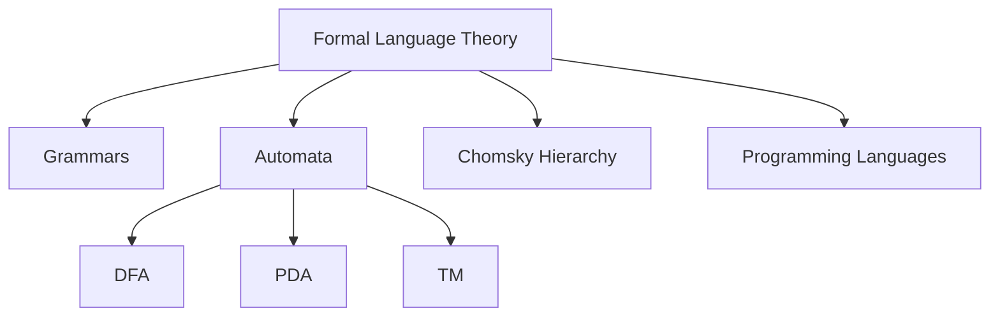
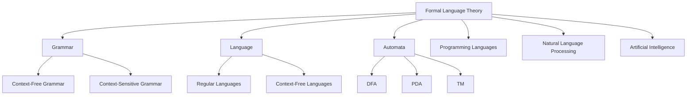

# 9.1 形式语言理论的定义 Definition of Formal Language Theory #FormalLanguageTheory-9.1

## 目录 Table of Contents

- 9.1 定义 Definition
- 9.2 哲学背景 Philosophical Background
- 9.3 核心概念 Core Concepts
- 9.4 历史发展 Historical Development
- 9.5 形式化语义 Formal Semantics
- 9.6 关键定理 Key Theorems
- 9.7 与其他理论的关系 Relationship to Other Theories
- 9.8 交叉引用 Cross References
- 9.9 参考文献 References
- 9.10 定义-属性-关系-解释-论证-形式化证明骨架
- 9.11 课程与行业案例对齐 Courses & Industry Alignment

## 定义 Definition

### 基本定义 Basic Definition

- **中文**：形式语言理论是理论计算机科学和数理逻辑的分支，研究符号串的集合（语言）、文法、自动机及其相互关系。它关注于语言的生成、识别、分类、语法结构、正则性、上下文无关性等核心概念，为编程语言、自然语言处理和人工智能提供理论基础。
- **English**: Formal language theory is a branch of theoretical computer science and mathematical logic that studies sets of symbol strings (languages), grammars, automata, and their interrelations. It focuses on language generation, recognition, classification, syntactic structure, regularity, and context-freeness, providing theoretical foundations for programming languages, natural language processing, and artificial intelligence.

### 形式化定义 Formal Definition

#### 字母表 Alphabet

一个字母表 $\Sigma$ 是一个有限的符号集合：

$$\Sigma = \{a_1, a_2, \ldots, a_n\}$$

#### 字符串 String

对于字母表 $\Sigma$，字符串定义为：

$$\Sigma^* = \bigcup_{n=0}^{\infty} \Sigma^n$$

其中 $\Sigma^n$ 表示长度为 $n$ 的字符串集合，$\Sigma^0 = \{\epsilon\}$ 是空字符串。

#### 形式语言 Formal Language

一个形式语言 $L$ 是字母表 $\Sigma$ 上的字符串子集：

$$L \subseteq \Sigma^*$$

#### 文法 Grammar

一个文法 $G$ 是一个四元组 $(N, \Sigma, P, S)$，其中：

- $N$ 是非终结符集合
- $\Sigma$ 是终结符集合（字母表）
- $P$ 是产生式规则集合
- $S \in N$ 是开始符号

产生式规则的形式为：$\alpha \rightarrow \beta$，其中 $\alpha, \beta \in (N \cup \Sigma)^*$。

#### 语言生成 Language Generation

对于文法 $G$，语言 $L(G)$ 定义为：

$$L(G) = \{w \in \Sigma^* \mid S \Rightarrow^* w\}$$

其中 $\Rightarrow^*$ 表示通过产生式规则的推导关系。

## 哲学背景 Philosophical Background

### 符号哲学 Philosophy of Symbols

- **中文**：形式语言理论体现了符号哲学思想，将语言视为符号系统，通过符号的组合和变换来表达意义。它反映了符号与意义、形式与内容的关系。
- **English**: Formal language theory embodies the philosophy of symbols, viewing language as a symbolic system that expresses meaning through the combination and transformation of symbols. It reflects the relationship between symbols and meaning, form and content.

### 结构主义语言学 Structuralist Linguistics

- **中文**：形式语言理论体现了结构主义语言学思想，强调语言的结构性和系统性，通过形式化规则来描述语言的内在结构。
- **English**: Formal language theory embodies structuralist linguistics, emphasizing the structural and systematic nature of language, describing the internal structure of language through formal rules.

### 计算哲学 Philosophy of Computation

- **中文**：形式语言理论体现了计算哲学思想，将语言处理视为计算过程，通过算法和自动机来实现语言的生成和识别。
- **English**: Formal language theory embodies the philosophy of computation, viewing language processing as computational processes, implementing language generation and recognition through algorithms and automata.

## 核心概念 Core Concepts

### 语言分类 Language Classification

#### 乔姆斯基层次结构 Chomsky Hierarchy

1. **正则语言 (Regular Languages)**
   - 由正则文法生成
   - 被有限自动机识别
   - 形式：$A \rightarrow aB$ 或 $A \rightarrow a$

2. **上下文无关语言 (Context-Free Languages)**
   - 由上下文无关文法生成
   - 被下推自动机识别
   - 形式：$A \rightarrow \alpha$

3. **上下文相关语言 (Context-Sensitive Languages)**
   - 由上下文相关文法生成
   - 被线性有界自动机识别
   - 形式：$\alpha A \beta \rightarrow \alpha \gamma \beta$

4. **递归可枚举语言 (Recursively Enumerable Languages)**
   - 由无限制文法生成
   - 被图灵机识别
   - 形式：$\alpha \rightarrow \beta$

#### 语言分类实现

```haskell
-- 语言分类
data LanguageClass = 
  Regular | ContextFree | ContextSensitive | RecursivelyEnumerable

-- 文法类型
data Grammar = Grammar
  { nonTerminals :: Set String
  , terminals :: Set String
  , productions :: [Production]
  , startSymbol :: String
  }

data Production = Production
  { left :: String
  , right :: String
  }

-- 语言分类检查
classifyLanguage :: Grammar -> LanguageClass
classifyLanguage grammar = 
  if isRegular grammar then Regular
  else if isContextFree grammar then ContextFree
  else if isContextSensitive grammar then ContextSensitive
  else RecursivelyEnumerable

-- 正则文法检查
isRegular :: Grammar -> Bool
isRegular (Grammar _ _ productions _) = 
  all isRegularProduction productions
  where
    isRegularProduction (Production left right) = 
      length left == 1 && 
      (length right <= 2 && 
       (length right == 1 || 
        (length right == 2 && 
         head right `elem` terminals grammar && 
         last right `elem` nonTerminals grammar)))
```

### 自动机理论 Automata Theory

#### 有限自动机 Finite Automaton

```haskell
-- 有限自动机
data FiniteAutomaton = FiniteAutomaton
  { states :: Set State
  , alphabet :: Set Char
  , transitions :: Map (State, Char) State
  , startState :: State
  , acceptStates :: Set State
  }

type State = Int

-- 自动机执行
runAutomaton :: FiniteAutomaton -> String -> Bool
runAutomaton fa input = 
  let finalState = foldl (step fa) (startState fa) input
  in finalState `elem` acceptStates fa

-- 状态转移
step :: FiniteAutomaton -> State -> Char -> State
step fa state symbol = 
  fromJust $ lookup (state, symbol) (transitions fa)
```

#### 下推自动机 Pushdown Automaton

```haskell
-- 下推自动机
data PushdownAutomaton = PushdownAutomaton
  { states :: Set State
  , alphabet :: Set Char
  , stackAlphabet :: Set Char
  , transitions :: [PDATransition]
  , startState :: State
  , startStack :: Char
  , acceptStates :: Set State
  }

data PDATransition = PDATransition
  { fromState :: State
  , inputSymbol :: Maybe Char
  , stackTop :: Char
  , toState :: State
  , stackPush :: [Char]
  }

-- PDA执行
runPDA :: PushdownAutomaton -> String -> Bool
runPDA pda input = 
  let config = PDAConfig (startState pda) input [startStack pda]
  in any (\final -> finalState final `elem` acceptStates pda) 
         (allComputations pda config)

data PDAConfig = PDAConfig
  { currentState :: State
  , remainingInput :: String
  , stack :: [Char]
  }
```

### 文法理论 Grammar Theory

#### 正则文法 Regular Grammar

```haskell
-- 正则文法
data RegularGrammar = RegularGrammar
  { nonTerminals :: Set String
  , terminals :: Set Char
  , productions :: [RegularProduction]
  , startSymbol :: String
  }

data RegularProduction = RegularProduction
  { from :: String
  , to :: Either Char (Char, String)  -- 右线性或左线性
  }

-- 正则文法生成语言
generateRegularLanguage :: RegularGrammar -> [String]
generateRegularLanguage grammar = 
  generateFrom grammar (startSymbol grammar)
  where
    generateFrom g symbol = 
      concatMap generateProduction (productionsFor g symbol)
    
    generateProduction (RegularProduction _ (Left c)) = [c:"", ""]
    generateProduction (RegularProduction _ (Right (c, next))) = 
      map (c:) (generateFrom g next)
```

#### 上下文无关文法 Context-Free Grammar

```haskell
-- 上下文无关文法
data CFGrammar = CFGrammar
  { nonTerminals :: Set String
  , terminals :: Set Char
  , productions :: [CFProduction]
  , startSymbol :: String
  }

data CFProduction = CFProduction
  { left :: String
  , right :: [Symbol]
  }

data Symbol = Terminal Char | NonTerminal String

-- CFG解析
parseCFG :: CFGrammar -> String -> Bool
parseCFG grammar input = 
  parseFrom grammar (startSymbol grammar) input

parseFrom :: CFGrammar -> String -> String -> Bool
parseFrom grammar symbol input = 
  any (\prod -> parseProduction grammar prod input) 
      (productionsFor grammar symbol)

parseProduction :: CFGrammar -> CFProduction -> String -> Bool
parseProduction grammar (CFProduction _ symbols) input = 
  parseSymbols grammar symbols input
```

## 历史发展 Historical Development

### 理论基础 Theoretical Foundation

#### 形式语言理论的起源 (1950s)

- **Noam Chomsky** 创立形式语言理论
- 1956年发表《Three models for the description of language》
- 提出乔姆斯基层次结构

#### 自动机理论的发展 (1950s-1960s)

- **Alan Turing** 提出图灵机模型
- **Stephen Kleene** 发展正则表达式理论
- **Michael Rabin** 和 **Dana Scott** 发展有限自动机理论

### 现代发展 Modern Development

#### 编程语言理论 (1970s-1980s)

```haskell
-- 编程语言语法
data ProgrammingLanguage = ProgrammingLanguage
  { syntax :: CFGrammar
  , semantics :: SemanticRules
  , typeSystem :: TypeSystem
  }

-- 语法分析器
data Parser a = Parser
  { parse :: String -> Either String a
  , grammar :: CFGrammar
  }

-- 组合子解析器
instance Applicative Parser where
  pure a = Parser (\_ -> Right a) undefined
  (<*>) p1 p2 = Parser (\input -> 
    case parse p1 input of
      Left err -> Left err
      Right f -> case parse p2 input of
        Left err -> Left err
        Right a -> Right (f a)) undefined
```

#### 自然语言处理 (1990s-2020s)

```haskell
-- 自然语言语法
data NaturalLanguage = NaturalLanguage
  { morphology :: MorphologicalRules
  , syntax :: SyntacticRules
  , semantics :: SemanticRules
  , pragmatics :: PragmaticRules
  }

-- 句法分析
data SyntaxTree = SyntaxTree
  { label :: String
  , children :: [SyntaxTree]
  , attributes :: Map String String
  }

-- 依存句法分析
data DependencyTree = DependencyTree
  { word :: String
  , pos :: String
  , head :: Maybe Int
  , relation :: String
  }
```

## 形式化语义 Formal Semantics

### 操作语义 Operational Semantics

#### 文法推导 Grammar Derivation

对于文法 $G$，推导关系定义为：

$$\alpha \Rightarrow \beta \text{ iff } \alpha = \gamma A \delta, \beta = \gamma \omega \delta, A \rightarrow \omega \in P$$

其中 $\Rightarrow^*$ 表示推导关系的自反传递闭包。

#### 语言识别 Language Recognition

对于自动机 $M$，语言识别定义为：

$$L(M) = \{w \in \Sigma^* \mid M \text{ accepts } w\}$$

### 指称语义 Denotational Semantics

#### 语言语义 Language Semantics

对于语言 $L$，其语义定义为：

$$[\![L]\!] = \{w \mid w \in L\}$$

#### 文法语义 Grammar Semantics

对于文法 $G$，其语义定义为：

$$[\![G]\!] = L(G)$$

### 关键定理 Key Theorems（陈述/骨架）

- **正则语言泵引理 Pumping Lemma (Regular)**:
  若语言 L 为正则，则存在 p，使任意 |w|≥p 的 w∈L，可分解为 w=xyz，满足 |xy|≤p，|y|>0，且 ∀i≥0，xy^i z ∈ L。

- **上下文无关语言泵引理 Pumping Lemma (CFG)**:
  若 L 为上下文无关，则存在 p，使任意 |w|≥p 的 w∈L，可写作 w=uvxyz，满足 |vxy|≤p，|vy|>0，且 ∀i≥0，u v^i x y^i z ∈ L。

- **Myhill–Nerode 定理**:
  L 正则 ⇔ L 的 Nerode 等价类有限 ⇔ 存在最小 DFA 识别 L。

（形式化方向）在 Coq/Lean 中以归纳关系定义推导与等价关系，证明泵引理与 Myhill–Nerode 的蕴含关系与构造。

## 与其他理论的关系 Relationship to Other Theories

### 与自动机理论的关系

- **中文**：形式语言理论与自动机理论紧密相关，每种语言类都有对应的自动机模型来识别它。
- **English**: Formal language theory is closely related to automata theory, where each language class has a corresponding automaton model to recognize it.

### 与计算理论的关系

- **中文**：形式语言理论为计算理论提供语言基础，通过语言分类来研究计算复杂性。
- **English**: Formal language theory provides linguistic foundations for computation theory, studying computational complexity through language classification.

### 与语言学的关系

- **中文**：形式语言理论为语言学提供形式化工具，用于描述和分析自然语言的结构。
- **English**: Formal language theory provides formal tools for linguistics, used to describe and analyze the structure of natural languages.

## 扩展交叉引用 Extended Cross References

- [自动机理论 Automata Theory](../AutomataTheory/README.md)
- [计算理论 Computation Theory](../Recursion_Computability_Theory/README.md)
- [语法语义 Syntax & Semantics](../Syntax_Semantics/README.md)
- [形式化定义 Formal Definitions](../FormalDefinitions/README.md)
- [定理与证明 Theorems & Proofs](../Theorems_Proofs/README.md)

## 参考文献 References

1. Chomsky, N. (1956). Three models for the description of language. IRE Transactions on Information Theory, 2(3), 113-124.
2. Hopcroft, J. E., Motwani, R., & Ullman, J. D. (2006). Introduction to automata theory, languages, and computation. Pearson.
3. Sipser, M. (2012). Introduction to the theory of computation. Cengage Learning.
4. Kozen, D. C. (1997). Automata and computability. Springer.
5. Harrison, M. A. (1978). Introduction to formal language theory. Addison-Wesley.
6. Salomaa, A. (1973). Formal languages. Academic Press.
7. Rozenberg, G., & Salomaa, A. (1997). Handbook of formal languages. Springer.
8. Aho, A. V., & Ullman, J. D. (1972). The theory of parsing, translation, and compiling. Prentice Hall.

## 定义-属性-关系-解释-论证-形式化证明骨架

- **定义 Definition**: 字母表/字符串/语言/文法/推导/自动机。
- **属性 Properties**: 闭包性质、判定性、正则/上下文无关等类的闭包与泵引理。
- **关系 Relations**: 乔姆斯基层次与自动机对应（DFA/PDA/TM）。
- **解释 Explanation**: 生成/识别视角、语法-语义映射、编程语言语法基础。
- **论证 Arguments**: 典型定理（Myhill–Nerode、泵引理）之直观与形式化陈述。
- **形式化证明 Formal Proofs**: 在 Coq/Lean 以归纳定义文法与推导，证明闭包与识别等价。

## 课程与行业案例对齐 Courses & Industry Alignment

- **课程**: MIT/Sipser 计算理论课程；编译原理（Aho/Dragon Book）语法/自动机构建。
- **行业**: 解析器生成器、正则引擎、协议状态机、静态分析（抽象解释）。

参考模板：参见 `../course_case_alignment_template.md`

## 对比分析 Comparison

- **中文**：形式语言 vs 自动机 vs 编程语言语义
  - 生成/识别：文法生成语言，自动机识别语言，语义为程序赋予意义。
  - 粒度：文法/自动机偏语法结构，语义侧重可观察行为与含义。
- **English**: Formal languages vs automata vs PL semantics
  - Generation/recognition vs meaning assignment.
  - Grammar/automata are syntactic; semantics emphasizes observable behavior and meaning.

## 争议与批判 Controversies & Critique

- **中文**：
  - 自然语言适配的局限；工程实现中的二义性与可维护性；复杂度界导致的实用性折衷。
- **English**:
  - Limits for natural language; ambiguity/maintainability in engineering; complexity-driven trade-offs.

## 前沿趋势 Frontier Trends

- **中文**：
  - 可验证解析与语法制导编辑；基于代数效应的语法-语义一体化；图灵完备正则扩展的安全子集。
- **English**:
  - Verified parsing and syntax-directed editing; algebraic-effects-based unified grammar-semantics; safe subsets of powerful regex engines.

## 常见陷阱 Common Pitfalls

- **中文**：
  - 用正则刻画非正则语言；忽视 ε-产生式/左递归处理；自动机转换中丢失接受条件。
- **English**:
  - Using regex for non-regular languages; ignoring epsilon-productions/left recursion; losing acceptance conditions in automata conversions.

## 交叉引用 Cross References

- [自动机理论 Automata Theory](../AutomataTheory/README.md)
- [编程语言语义 Programming Language Semantics](../Syntax_Semantics/README.md)
- [模型论 Model Theory](../ModelTheory/README.md)

## 知识图谱 Knowledge Graph



## 对比分析 Comparison1

- **中文**：形式语言理论 vs 自然语言理论 vs 编程语言理论 vs 计算语言学
  - 形式语言理论关注"数学化的语言结构"；自然语言理论聚焦"人类语言现象"；编程语言理论强调"计算机语言设计"；计算语言学注重"语言的计算处理"。
- **English**: Formal language theory vs natural language theory vs programming language theory vs computational linguistics
  - Formal focuses on "mathematical language structures"; natural language on "human language phenomena"; programming language on "computer language design"; computational linguistics on "computational language processing".

## 争议与批判 Controversies & Critique1

- **中文**：
  - 乔姆斯基层次结构的表达能力限制；上下文无关文法的实用性争议；
  - 形式化方法 vs 经验主义方法；语言复杂性与计算复杂性的关系。
- **English**:
  - Expressiveness limitations of Chomsky hierarchy; controversies over practicality of context-free grammars;
  - Formal methods vs empirical methods; relationship between language complexity and computational complexity.

## 前沿趋势 Frontier Trends1

- **中文**：
  - 神经符号语言学习；量子语言理论；
  - 分布式语言处理；多模态语言理论。
- **English**:
  - Neuro-symbolic language learning; quantum language theory;
  - Distributed language processing; multimodal language theory.

## 常见陷阱 Common Pitfalls1

- **中文**：
  - 过度简化自然语言为形式语言；忽视语言的语义和语用维度；
  - 文法设计的表达能力不足；语言学习的过拟合问题。
- **English**:
  - Over-simplifying natural languages as formal languages; ignoring semantic and pragmatic dimensions of language;
  - Insufficient expressiveness in grammar design; overfitting in language learning.

## 扩展交叉引用 Extended Cross References1

- [自动机理论 Automata Theory](../AutomataTheory/README.md)
- [递归与可计算性理论 Recursion & Computability Theory](../Recursion_Computability_Theory/README.md)
- [语义模型 Semantic Models](../SemanticModels/README.md)
- [工程应用 Engineering Applications](../EngineeringApplications/README.md)
- [实践价值 Practical Value](../PracticalValue/README.md)
- [系统理论 System Theory](../SystemTheory/README.md)

## 知识图谱 Knowledge Graph1


