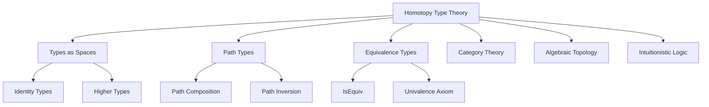

# 6.1 定义 Definition #HOTT-6.1

## 定义 Definition

### 基本定义 Basic Definition

- **中文**：同伦类型论（HOTT）是将同伦论与类型论结合的理论，强调等价、路径和高阶结构。它将类型视为空间，将类型间的函数视为连续映射，为数学基础提供了新的视角。
- **English**: Homotopy type theory (HOTT) is a theory combining homotopy theory and type theory, emphasizing equivalence, paths, and higher structures. It views types as spaces and functions between types as continuous maps, providing new perspectives for mathematical foundations.

### 形式化定义 Formal Definition

#### 同伦类型系统 Homotopy Type System

一个同伦类型系统是一个六元组 $(T, \Gamma, \vdash, \rightsquigarrow, \mathcal{P}, \mathcal{E})$，其中：

- $T$ 是类型集合
- $\Gamma$ 是类型环境
- $\vdash$ 是类型判断关系
- $\rightsquigarrow$ 是类型归约关系
- $\mathcal{P}$ 是路径类型集合
- $\mathcal{E}$ 是等价类型集合

#### 路径类型 Path Types

对于类型 $A$ 和元素 $a, b : A$，路径类型定义为：

$$\text{Path}_A(a, b) = \{ p : a =_A b \}$$

其中 $=_A$ 是类型 $A$ 上的相等关系。

#### 等价类型 Equivalence Types

对于类型 $A$ 和 $B$，等价类型定义为：

$$\text{Equiv}(A, B) = \sum_{f : A \to B} \text{isEquiv}(f)$$

其中 $\text{isEquiv}(f)$ 表示 $f$ 是等价函数。

## 哲学背景 Philosophical Background

### 等价本体论 Equivalence Ontology

- **中文**：同伦类型论体现了等价本体论思想，认为数学对象通过等价关系而非严格相等来识别。这反映了"结构决定性质"的哲学理念。
- **English**: Homotopy type theory embodies equivalence ontology, viewing mathematical objects as identified through equivalence relations rather than strict equality. This reflects the philosophical concept that "structure determines properties."

### 结构主义哲学 Structuralist Philosophy

- **中文**：同伦类型论体现了结构主义哲学，强调数学对象的结构性质比其具体表示更重要，等价的结构被视为相同的。
- **English**: Homotopy type theory embodies structuralist philosophy, emphasizing that the structural properties of mathematical objects are more important than their concrete representations, with equivalent structures viewed as identical.

### 空间化哲学 Philosophy of Spatialization

- **中文**：同伦类型论将类型视为空间，将计算视为在空间中的运动，体现了"类型即空间"的哲学思想。
- **English**: Homotopy type theory views types as spaces and computation as movement within spaces, embodying the philosophical concept that "types are spaces."

## 核心概念 Core Concepts

### 1路径类型 Path Types

#### 路径的定义 Path Definition

```haskell
-- 路径类型的基本定义
data Path a where
  Refl :: a -> Path a  -- 自反路径
  
-- 路径的复合
compose :: Path a -> Path a -> Path a
compose p q = undefined  -- 路径复合操作

-- 路径的逆
inverse :: Path a -> Path a
inverse p = undefined  -- 路径逆操作
```

#### 路径代数 Path Algebra

```haskell
-- 路径代数结构
class PathAlgebra a where
  -- 路径复合
  (.) :: Path a -> Path a -> Path a
  -- 路径逆
  inv :: Path a -> Path a
  -- 单位路径
  idPath :: a -> Path a

-- 路径代数公理
-- 1. 结合律: (p . q) . r = p . (q . r)
-- 2. 单位律: idPath x . p = p = p . idPath y
-- 3. 逆律: p . inv p = idPath x
```

### 1等价类型 Equivalence Types

#### 等价的定义 Equivalence Definition

```haskell
-- 等价类型
data Equiv a b = Equiv 
  { to :: a -> b
  , from :: b -> a
  , toFrom :: forall x. to (from x) = x
  , fromTo :: forall x. from (to x) = x
  }

-- 等价的性质
class Equivalence a b where
  toEquiv :: Equiv a b
  fromEquiv :: Equiv b a
```

#### 单值性公理 Univalence Axiom

```haskell
-- 单值性公理
-- 等价类型之间的路径对应于等价
univalence :: Equiv A B -> Path Type A B
univalence equiv = undefined  -- 单值性公理的实现

-- 单值性的推论
-- 如果两个类型等价，那么它们在类型宇宙中相等
```

### 高阶结构 Higher Structures

#### 群结构 Group Structure

```haskell
-- 基本群
data FundamentalGroup a = FundamentalGroup
  { basePoint :: a
  , loops :: [Path a]  -- 以basePoint为基点的环路
  }

-- 群运算
instance Semigroup (FundamentalGroup a) where
  (<>) = composeLoops

instance Monoid (FundamentalGroup a) where
  mempty = FundamentalGroup basePoint []

-- 群逆
instance Group (FundamentalGroup a) where
  invert = inverseLoop
```

#### 高阶同伦群 Higher Homotopy Groups

```haskell
-- n维同伦群
data HomotopyGroup n a = HomotopyGroup
  { dimension :: n
  , basePoint :: a
  , spheres :: [Sphere n a]  -- n维球面到类型a的映射
  }

-- 球面类型
data Sphere n a where
  S0 :: Sphere Zero a  -- 0维球面（两点）
  S1 :: Sphere (Succ Zero) a  -- 1维球面（圆）
  Sn :: Sphere n a -> Sphere (Succ n) a  -- n+1维球面
```

## 历史发展 Historical Development

### 理论基础 Theoretical Foundation

#### 同伦论的起源 (1900s)

- **Henri Poincaré** 创立同伦论
- 研究拓扑空间中的连续变形
- 为同伦类型论奠定拓扑基础

#### 类型论的早期发展 (1930s-1980s)

- **Alonzo Church** 和 **Per Martin-Löf** 发展类型论
- **Jean-Yves Girard** 引入构造演算
- **Thierry Coquand** 开发构造演算

### 同伦类型论的创立 (2000s-2010s)

#### Vladimir Voevodsky的贡献

- **2006年**: 提出同伦类型论的基本思想
- **2009年**: 引入单值性公理
- **2013年**: 发表《Univalent Foundations》

#### 现代发展 Modern Development

```haskell
-- 现代同伦类型论实现
-- Lean中的同伦类型论
def is_equiv {α β : Type u} (f : α → β) : Prop :=
  ∃ g : β → α, (∀ x, g (f x) = x) ∧ (∀ y, f (g y) = y)

def equiv (α β : Type u) : Type u :=
  { f : α → β // is_equiv f }

-- 单值性公理
axiom univalence : ∀ {α β : Type u}, equiv α β → α = β
```

## 形式化语义 Formal Semantics

### 同伦语义 Homotopy Semantics

#### 类型作为空间 Types as Spaces

对于类型 $A$，其同伦语义为：

$$[\![A]\!] = \text{空间}$$

对于函数 $f : A \to B$，其语义为：

$$[\![f]\!] = \text{连续映射} : [\![A]\!] \to [\![B]\!]$$

#### 路径语义 Path Semantics

对于路径 $p : a =_A b$，其语义为：

$$[\![p]\!] = \text{连续路径} : [0,1] \to [\![A]\!]$$

满足 $[\![p]\!](0) = [\![a]\!]$ 和 $[\![p]\!](1) = [\![b]\!]$。

### 模型论语义 Model-Theoretic Semantics

#### 准范畴模型 Quasi-Category Model

```haskell
-- 准范畴模型
data QuasiCategory = QuasiCategory
  { objects :: [Type]
  , morphisms :: [(Type, Type, Path)]
  , compositions :: [(Path, Path, Path)]
  }

-- 准范畴中的同伦类型
interpretInQuasiCategory :: Type -> QuasiCategory -> Space
interpretInQuasiCategory t qc = undefined
```

## 与其他理论的关系 Relationship to Other Theories

### 与类型理论的关系

- **中文**：同伦类型论是类型理论的扩展，通过引入路径类型和等价类型，为类型理论提供了几何解释。
- **English**: Homotopy type theory extends type theory by introducing path types and equivalence types, providing geometric interpretations for type theory.

### 与范畴论的关系

- **中文**：同伦类型论与范畴论密切相关，类型对应范畴中的对象，路径对应态射，高阶结构对应高阶范畴。
- **English**: Homotopy type theory is closely related to category theory, with types corresponding to objects, paths to morphisms, and higher structures to higher categories.

### 与代数拓扑的关系

- **中文**：同伦类型论将代数拓扑的概念引入类型理论，为计算提供了拓扑直觉。
- **English**: Homotopy type theory introduces algebraic topology concepts into type theory, providing topological intuition for computation.

## 交叉引用 Cross References

- [类型理论 Type Theory](../TypeTheory/README.md)
- [范畴论 Category Theory](../CategoryTheory/README.md)
- [模型论 Model Theory](../ModelTheory/README.md)
- [形式化定义 Formal Definitions](../FormalDefinitions/README.md)
- [定理与证明 Theorems & Proofs](../Theorems_Proofs/README.md)

## 参考文献 References

## 对比分析 Comparison

- **中文**：同伦类型论 vs 经典类型论 vs 集合论 vs 范畴论
  - 同伦类型论关注"类型作为空间"；经典类型论强调"类型作为集合"；集合论注重"基础集合结构"；范畴论聚焦"对象与态射"。
- **English**: Homotopy type theory vs classical type theory vs set theory vs category theory
  - HOTT focuses on "types as spaces"; classical type theory on "types as sets"; set theory on "fundamental set structures"; category theory on "objects and morphisms".

## 争议与批判 Controversies & Critique

- **中文**：
  - 同伦类型论作为数学基础的争议；等价 vs 相等的哲学问题；
  - 计算复杂性与形式化验证的权衡；同伦类型论的实际应用价值。
- **English**:
  - Controversies over HOTT as mathematical foundation; philosophical issues of equivalence vs equality;
  - Trade-off between computational complexity and formal verification; practical application value of HOTT.

## 前沿趋势 Frontier Trends

- **中文**：
  - 同伦类型论在计算机科学中的应用；量子同伦类型论；
  - 同伦类型论与机器学习的结合；分布式同伦类型论。
- **English**:
  - Applications of HOTT in computer science; quantum homotopy type theory;
  - Integration of HOTT with machine learning; distributed homotopy type theory.

## 常见陷阱 Common Pitfalls

- **中文**：
  - 混淆等价与相等；忽视同伦类型的计算复杂性；
  - 过度依赖形式化验证；同伦类型论的学习曲线陡峭。
- **English**:
  - Confusing equivalence with equality; ignoring computational complexity of homotopy types;
  - Over-reliance on formal verification; steep learning curve of HOTT.

## 扩展交叉引用 Extended Cross References

- [类型理论 Type Theory](../TypeTheory/README.md)
- [范畴论 Category Theory](../CategoryTheory/README.md)
- [语义模型 Semantic Models](../SemanticModels/README.md)
- [工程应用 Engineering Applications](../EngineeringApplications/README.md)
- [实践价值 Practical Value](../PracticalValue/README.md)
- [系统理论 System Theory](../SystemTheory/README.md)

## 知识图谱 Knowledge Graph



## 参考文献 References1

1. Voevodsky, V. (2014). An experimental library of formalized mathematics based on the univalent foundations. Mathematical Structures in Computer Science, 25(5), 1278-1294.
2. The Univalent Foundations Program. (2013). Homotopy type theory: Univalent foundations of mathematics. Institute for Advanced Study.
3. Awodey, S., & Warren, M. A. (2009). Homotopy theoretic models of identity types. Mathematical Proceedings of the Cambridge Philosophical Society, 146(1), 45-55.
4. Coquand, T., & Huet, G. (1988). The calculus of constructions. Information and Computation, 76(2-3), 95-120.
5. Martin-Löf, P. (1984). Intuitionistic type theory. Bibliopolis.
6. Joyal, A. (2008). Notes on quasi-categories. Preprint.
7. Lurie, J. (2009). Higher topos theory. Princeton University Press.
8. Awodey, S. (2010). Category theory. Oxford University Press.
