# 10. 国际化对标与中英双语扩展 Internationalization & Bilingual Expansion

## 10.1 主题简介 Overview #InternationalizationBilingual-10.1

- **中文**：本节总结Haskell、Rust、Lean及相关理论的国际化标准、Wiki风格与中英双语实践。国际化与双语扩展是知识传播的重要方式，为跨文化交流和学术合作提供基础。
- **English**: This section summarizes the internationalization standards, Wiki style, and bilingual practices of Haskell, Rust, Lean, and related theories. Internationalization and bilingual expansion are important ways of knowledge dissemination, providing foundations for cross-cultural communication and academic collaboration.

## 10.2 定义 Definition

### 基本定义 Basic Definition

- **中文**：国际化是指将知识内容适应不同语言、文化和地区的过程，双语扩展是指同时提供两种语言版本的内容，确保知识传播的准确性和可理解性。
- **English**: Internationalization refers to the process of adapting knowledge content to different languages, cultures, and regions, while bilingual expansion refers to providing content in two languages simultaneously, ensuring accuracy and comprehensibility of knowledge dissemination.

### 形式化定义 Formal Definition

#### 国际化函数 Internationalization Function

一个国际化函数 $I$ 是一个映射：

$$I: \text{Content} \times \text{Locale} \rightarrow \text{LocalizedContent}$$

其中 Content 是原始内容集合，Locale 是地区集合，LocalizedContent 是本地化内容集合。

#### 双语映射 Bilingual Mapping

对于内容 $C$ 和语言对 $(L_1, L_2)$，双语映射定义为：

$$B(C, L_1, L_2) = (C_{L_1}, C_{L_2})$$

其中 $C_{L_1}$ 和 $C_{L_2}$ 分别是语言 $L_1$ 和 $L_2$ 的内容版本。

#### 术语对齐 Term Alignment

对于术语集合 $T_1$ 和 $T_2$，术语对齐定义为：

$$A(T_1, T_2) = \{(t_1, t_2) \mid t_1 \in T_1, t_2 \in T_2, \text{meaning}(t_1) = \text{meaning}(t_2)\}$$

## 10.3 哲学背景 Philosophical Background

### 普遍性与特殊性哲学 Universality and Particularity Philosophy

- **中文**：国际化与双语扩展体现了普遍性与特殊性的哲学思想，探讨知识如何在保持普遍性的同时适应特殊性的需求。
- **English**: Internationalization and bilingual expansion embody the philosophy of universality and particularity, exploring how knowledge can adapt to particular needs while maintaining universality.

### 语言哲学 Philosophy of Language

- **中文**：国际化与双语扩展体现了语言哲学思想，探讨语言与思维、语言与文化的关系，以及多语言表达中的意义保持。
- **English**: Internationalization and bilingual expansion embody the philosophy of language, exploring the relationship between language and thought, language and culture, and meaning preservation in multilingual expression.

### 知识传播哲学 Philosophy of Knowledge Dissemination

- **中文**：国际化与双语扩展体现了知识传播哲学思想，强调知识传播的准确性、可理解性和文化适应性。
- **English**: Internationalization and bilingual expansion embody the philosophy of knowledge dissemination, emphasizing accuracy, comprehensibility, and cultural adaptability in knowledge dissemination.

## 10.4 核心概念 Core Concepts

### Wiki风格与国际标准 Wiki Style & International Standards

#### Wiki风格 Wiki Style

```haskell
-- Wiki风格定义
data WikiStyle = WikiStyle
  { structure :: DocumentStructure
  , formatting :: FormattingRules
  , references :: ReferenceSystem
  , crossReferences :: CrossReferenceSystem
  }

-- 文档结构
data DocumentStructure = DocumentStructure
  { title :: String
  , sections :: [Section]
  , navigation :: Navigation
  , metadata :: Metadata
  }

-- 格式化规则
data FormattingRules = FormattingRules
  { headings :: HeadingStyle
  , lists :: ListStyle
  , code :: CodeStyle
  , tables :: TableStyle
  }

-- 引用系统
data ReferenceSystem = ReferenceSystem
  { citations :: [Citation]
  , bibliography :: Bibliography
  , links :: [Link]
  }

-- Wiki文档生成
generateWikiDocument :: WikiStyle -> Content -> WikiDocument
generateWikiDocument style content = WikiDocument
  { structure = applyStructure (structure style) content
  , formatting = applyFormatting (formatting style) content
  , references = generateReferences (references style) content
  , crossReferences = generateCrossReferences (crossReferences style) content
  }
```

#### 国际标准 International Standards

```haskell
-- 国际标准定义
data InternationalStandard = InternationalStandard
  { standard :: StandardSpecification
  , compliance :: ComplianceRules
  , certification :: CertificationProcess
  , maintenance :: MaintenanceProcess
  }

-- 标准规范
data StandardSpecification = StandardSpecification
  { name :: String
  , version :: Version
  , scope :: Scope
  , requirements :: [Requirement]
  }

-- 合规性规则
data ComplianceRules = ComplianceRules
  { mandatory :: [Requirement]
  , optional :: [Requirement]
  , testing :: TestingProcedure
  , validation :: ValidationProcedure
  }

-- 标准检查
checkCompliance :: InternationalStandard -> Content -> ComplianceReport
checkCompliance standard content = ComplianceReport
  { mandatoryCompliance = checkMandatory (mandatory (compliance standard)) content
  , optionalCompliance = checkOptional (optional (compliance standard)) content
  , overallCompliance = calculateOverallCompliance content
  }
```

### 中英双语实践 Bilingual Practice

#### 1术语对齐 Term Alignment

```haskell
-- 术语对齐系统
data TermAlignment = TermAlignment
  { sourceTerms :: [Term]
  , targetTerms :: [Term]
  , alignments :: Map Term Term
  , confidence :: Map (Term, Term) Double
  }

-- 术语
data Term = Term
  { term :: String
  , language :: Language
  , definition :: String
  , context :: Context
  }

-- 对齐算法
alignTerms :: [Term] -> [Term] -> TermAlignment
alignTerms source target = TermAlignment
  { sourceTerms = source
  , targetTerms = target
  , alignments = calculateAlignments source target
  , confidence = calculateConfidence source target
  }

-- 术语翻译
translateTerm :: Term -> Language -> Maybe Term
translateTerm term targetLang = 
  case lookup term (alignments termAlignment) of
    Just alignedTerm -> Just alignedTerm
    Nothing -> Nothing
```

#### 表达规范 Expression Norms

```haskell
-- 表达规范
data ExpressionNorms = ExpressionNorms
  { grammar :: GrammarRules
  , style :: StyleGuide
  , terminology :: TerminologyGuide
  , formatting :: FormattingGuide
  }

-- 语法规则
data GrammarRules = GrammarRules
  { sentenceStructure :: SentenceStructure
  , punctuation :: PunctuationRules
  , capitalization :: CapitalizationRules
  }

-- 风格指南
data StyleGuide = StyleGuide
  { tone :: Tone
  , formality :: FormalityLevel
  , clarity :: ClarityRequirements
  , consistency :: ConsistencyRules
  }

-- 表达检查
checkExpression :: ExpressionNorms -> Content -> ExpressionReport
checkExpression norms content = ExpressionReport
  { grammarCheck = checkGrammar (grammar norms) content
  , styleCheck = checkStyle (style norms) content
  , terminologyCheck = checkTerminology (terminology norms) content
  , formattingCheck = checkFormatting (formatting norms) content
  }
```

### 结构化对比 Structured Comparison

#### 对比框架 Comparison Framework

```haskell
-- 对比框架
data ComparisonFramework = ComparisonFramework
  { dimensions :: [Dimension]
  , metrics :: Map Dimension Metric
  , weights :: Map Dimension Double
  , thresholds :: Map Dimension Double
  }

-- 维度
data Dimension = Dimension
  { name :: String
  , description :: String
  , measurement :: MeasurementMethod
  , scale :: Scale
  }

-- 度量
data Metric = Metric
  { name :: String
  , unit :: String
  , calculation :: CalculationMethod
  , interpretation :: InterpretationGuide
  }

-- 对比分析
compareContent :: ComparisonFramework -> Content -> Content -> ComparisonReport
compareContent framework content1 content2 = ComparisonReport
  { dimensionScores = map (\dim -> (dim, calculateScore dim content1 content2)) (dimensions framework)
  , overallScore = calculateOverallScore framework content1 content2
  , recommendations = generateRecommendations framework content1 content2
  }
```

## 10.5 历史发展 Historical Development

### 理论基础 Theoretical Foundation

#### 国际化的起源 (1950s-1960s)

- **UNESCO** 建立国际标准化组织 (1945)
- **ISO** 发展国际标准体系 (1947)
- **IEEE** 建立技术标准体系 (1963)

#### 双语扩展的发展 (1970s-1990s)

- **Wikipedia** 建立多语言百科 (2001)
- **W3C** 发展Web国际化标准 (1994)
- **Unicode** 建立字符编码标准 (1991)

### 现代发展 Modern Development

#### 现代国际化 (2000s-2020s)

```haskell
-- 现代国际化
data ModernInternationalization = ModernInternationalization
  { digitalStandards :: DigitalStandards
  , multilingualSupport :: MultilingualSupport
  , culturalAdaptation :: CulturalAdaptation
  , accessibility :: Accessibility
  }

-- 数字标准
data DigitalStandards = DigitalStandards
  { unicode :: UnicodeStandard
  , i18n :: I18nStandard
  , l10n :: L10nStandard
  , a11y :: A11yStandard
  }

-- 多语言支持
data MultilingualSupport = MultilingualSupport
  { languageDetection :: LanguageDetection
  , machineTranslation :: MachineTranslation
  , terminologyManagement :: TerminologyManagement
  , qualityAssurance :: QualityAssurance
  }
```

## 10.6 形式化语义 Formal Semantics

### 国际化语义 Internationalization Semantics

#### 本地化语义

对于国际化函数 $I$，其语义定义为：

$$[\![I]\!] = \{(C, L, C_L) \mid I(C, L) = C_L\}$$

#### 双语语义

对于双语映射 $B$，其语义定义为：

$$[\![B]\!] = \{(C, L_1, L_2, C_1, C_2) \mid B(C, L_1, L_2) = (C_1, C_2)\}$$

### 语义保持语义 Semantic Preservation Semantics

#### 语义保持

国际化函数 $I$ 保持语义当且仅当：

$$\forall C, L. [\![C]\!] = [\![I(C, L)]\!]$$

## 10.7 与其他理论的关系 Relationship to Other Theories

### 与语言理论的关系

- **中文**：国际化与双语扩展为语言理论提供应用场景，语言理论为国际化提供理论基础。
- **English**: Internationalization and bilingual expansion provide application scenarios for language theory, while language theory provides theoretical foundations for internationalization.

### 与知识管理的关系

- **中文**：国际化与双语扩展为知识管理提供方法，知识管理为国际化提供管理框架。
- **English**: Internationalization and bilingual expansion provide methods for knowledge management, while knowledge management provides management frameworks for internationalization.

### 与文化研究的关系

- **中文**：国际化与双语扩展与文化研究密切相关，文化研究为国际化提供文化理解基础。
- **English**: Internationalization and bilingual expansion are closely related to cultural studies, with cultural studies providing cultural understanding foundations for internationalization.

## 10.8 例子与对比 Examples & Comparison

### Haskell国际化示例

```haskell
-- Haskell国际化支持
class Internationalized a where
  localize :: a -> Locale -> Localized a
  translate :: a -> Language -> Maybe a
  validate :: a -> ValidationResult

-- 本地化内容
data Localized a = Localized
  { original :: a
  , locale :: Locale
  , translated :: a
  , metadata :: LocalizationMetadata
  }

-- 本地化元数据
data LocalizationMetadata = LocalizationMetadata
  { translator :: String
  , date :: Date
  , quality :: QualityScore
  , reviewStatus :: ReviewStatus
  }

-- 国际化检查
checkInternationalization :: Internationalized a => a -> InternationalizationReport
checkInternationalization content = InternationalizationReport
  { completeness = checkCompleteness content
  , accuracy = checkAccuracy content
  , consistency = checkConsistency content
  , culturalAppropriateness = checkCulturalAppropriateness content
  }
```

### Rust国际化示例

```rust
// Rust国际化支持
trait Internationalized {
    type Localized;
    type Locale;
    type Language;
    
    fn localize(&self, locale: Self::Locale) -> Self::Localized;
    fn translate(&self, language: Self::Language) -> Option<Self>;
    fn validate(&self) -> ValidationResult;
}

// 本地化内容
struct Localized<T> {
    original: T,
    locale: Locale,
    translated: T,
    metadata: LocalizationMetadata,
}

// 本地化元数据
struct LocalizationMetadata {
    translator: String,
    date: DateTime<Utc>,
    quality: f64,
    review_status: ReviewStatus,
}

// 国际化检查
impl<T: Internationalized> T {
    fn check_internationalization(&self) -> InternationalizationReport {
        InternationalizationReport {
            completeness: self.check_completeness(),
            accuracy: self.check_accuracy(),
            consistency: self.check_consistency(),
            cultural_appropriateness: self.check_cultural_appropriateness(),
        }
    }
}
```

### Lean国际化示例

```lean
-- Lean国际化支持
class Internationalized (α : Type) where
  localize : α → Locale → Localized α
  translate : α → Language → Option α
  validate : α → ValidationResult

-- 本地化内容
structure Localized (α : Type) where
  original : α
  locale : Locale
  translated : α
  metadata : LocalizationMetadata

-- 本地化元数据
structure LocalizationMetadata where
  translator : String
  date : Date
  quality : ℝ
  reviewStatus : ReviewStatus

-- 国际化检查
def checkInternationalization {α : Type} [Internationalized α] 
  (content : α) : InternationalizationReport :=
  {
    completeness := checkCompleteness content,
    accuracy := checkAccuracy content,
    consistency := checkConsistency content,
    culturalAppropriateness := checkCulturalAppropriateness content
  }
```

## 10.9 典型对比表格 Typical Comparison Table

| 维度/语言 | Haskell | Rust | Lean |
|-----------|---------|------|------|
| 国际化标准 | Haskell 2010, ISO | Rust Reference, ISO | Lean Reference, mathlib |
| Wiki条目   | 丰富 | 丰富 | 理论为主 |
| 双语文档   | 有限 | 有限 | 社区支持 |
| 术语标准化 | 中等 | 高 | 高 |
| 文化适应性 | 中等 | 高 | 中等 |
| 可访问性 | 中等 | 高 | 中等 |

## 10.10 哲学批判与争议 Philosophical Critique & Controversies

### 普遍性与特殊性的张力

- **中文**：国际化面临普遍性与特殊性的张力，如何在保持知识普遍性的同时适应不同文化的特殊性。
- **English**: Internationalization faces tension between universality and particularity, how to maintain knowledge universality while adapting to the particularity of different cultures.

### 语言霸权与文化多样性

- **中文**：国际化面临语言霸权与文化多样性的争议，如何平衡主导语言与少数语言的关系。
- **English**: Internationalization faces controversies between linguistic hegemony and cultural diversity, how to balance the relationship between dominant languages and minority languages.

### 知识传播的准确性

- **中文**：双语扩展面临知识传播准确性的挑战，如何在翻译过程中保持原意的准确性。
- **English**: Bilingual expansion faces challenges in the accuracy of knowledge dissemination, how to maintain the accuracy of original meaning in the translation process.

## 10.11 国际对比与标准 International Comparison & Standards

### 国际标准

- **ISO 639** - 语言代码标准
- **ISO 3166** - 国家和地区代码标准
- **Unicode** - 字符编码标准

### 学术规范

- **W3C I18n** - Web国际化标准
- **IEEE 1003.1** - POSIX国际化标准

## 10.12 知识论证的完备性 Completeness of Epistemic Argumentation

### 完备性要求

- **中文**：国际化与双语扩展需覆盖术语对齐、表达规范、结构化对比等知识点，确保知识传播的准确性与可用性。
- **English**: Internationalization and bilingual expansion should cover terminology alignment, expression norms, structured comparison, etc., ensuring the accuracy and usability of knowledge dissemination.

### 一致性检查

```haskell
-- 一致性检查
checkConsistency :: InternationalizedContent -> Bool
checkConsistency content = 
  let terminologyConsistency = checkTerminologyConsistency content
      styleConsistency = checkStyleConsistency content
      formatConsistency = checkFormatConsistency content
  in terminologyConsistency && styleConsistency && formatConsistency
```

## 10.13 交叉引用 Cross References

- [实用价值 Practical Value](../PracticalValue/README.md)
- [哲科思脉与知识体系结构 Philosophical Context & Knowledge Structure](../Philosophy_KnowledgeGraph/README.md)
- [形式化定义 Formal Definitions](../FormalDefinitions/README.md)
- [定理与证明 Theorems & Proofs](../Theorems_Proofs/README.md)

## 10.14 参考文献 References

1. UNESCO. (1945). Constitution of the United Nations Educational, Scientific and Cultural Organization.
2. ISO. (1947). International Organization for Standardization.
3. Unicode Consortium. (1991). The Unicode Standard.
4. W3C. (1994). World Wide Web Consortium.
5. Wikipedia. (2001). Wikipedia: The Free Encyclopedia.
6. IEEE. (1963). Institute of Electrical and Electronics Engineers.
7. IETF. (1986). Internet Engineering Task Force.
8. ECMA International. (1961). European Computer Manufacturers Association.

## 10.15 批判性小结 Critical Summary

- **中文**：国际化与双语扩展的知识论证需兼顾普适性与本地化，持续完善知识传播的深度与广度。未来需要关注多语言协同、文化适应性和技术标准化的发展。
- **English**: Epistemic argumentation of internationalization and bilingual expansion should balance universality and localization, continuously improving the depth and breadth of knowledge dissemination. Future work should focus on multilingual synergy, cultural adaptability, and technical standardization.

## 10.16 进一步批判性分析 Further Critical Analysis

### 挑战与机遇

- **多语言协同**：国际化需要应对多语言协同的挑战
- **文化适应性**：需要发展更好的文化适应性方法
- **技术标准化**：需要推动技术标准的国际化

### 未来发展方向

- **智能国际化**：结合人工智能技术，实现智能化的国际化
- **文化智能**：发展文化智能的国际化系统
- **标准化进程**：推动国际化的标准化进程

## 10.17 国际化框架 Internationalization Framework

### 10.17.1 国际化架构 Internationalization Architecture

```haskell
-- 国际化架构
data InternationalizationArchitecture = InternationalizationArchitecture
  { contentLayer :: ContentLayer
  , languageLayer :: LanguageLayer
  , cultureLayer :: CultureLayer
  , technologyLayer :: TechnologyLayer
  }

-- 内容层
data ContentLayer = ContentLayer
  { originalContent :: OriginalContent
  , translatedContent :: TranslatedContent
  , metadata :: ContentMetadata
  , versioning :: VersioningSystem
  }

-- 语言层
data LanguageLayer = LanguageLayer
  { sourceLanguage :: Language
  , targetLanguages :: [Language]
  , translationEngine :: TranslationEngine
  , qualityAssurance :: QualityAssurance
  }

-- 文化层
data CultureLayer = CultureLayer
  { culturalContext :: CulturalContext
  , adaptationRules :: AdaptationRules
  , sensitivityChecks :: SensitivityChecks
  , localizationGuidelines :: LocalizationGuidelines
  }

-- 技术层
data TechnologyLayer = TechnologyLayer
  { encodingStandards :: EncodingStandards
  , platformSupport :: PlatformSupport
  , accessibility :: AccessibilityFeatures
  , performance :: PerformanceOptimization
  }

-- 国际化处理流程
processInternationalization :: InternationalizationArchitecture -> Content -> InternationalizedContent
processInternationalization arch content = InternationalizedContent
  { original = content
  , translations = map (translateContent content) (targetLanguages (languageLayer arch))
  , culturalAdaptations = map (adaptToCulture content) (culturalContext (cultureLayer arch))
  , technicalOptimizations = optimizeForPlatform (technologyLayer arch) content
  }
```

### 10.17.2 双语标准 Bilingual Standards

```haskell
-- 双语标准框架
data BilingualStandard = BilingualStandard
  { terminologyStandard :: TerminologyStandard
  , grammarStandard :: GrammarStandard
  , styleStandard :: StyleStandard
  , formatStandard :: FormatStandard
  }

-- 术语标准
data TerminologyStandard = TerminologyStandard
  { termDictionary :: Map Term Term
  , contextRules :: [ContextRule]
  , consistencyChecks :: [ConsistencyCheck]
  , updateProcedures :: UpdateProcedures
  }

-- 语法标准
data GrammarStandard = GrammarStandard
  { grammarRules :: [GrammarRule]
  , sentencePatterns :: [SentencePattern]
  , punctuationRules :: [PunctuationRule]
  , validationChecks :: [ValidationCheck]
  }

-- 风格标准
data StyleStandard = StyleStandard
  { toneGuidelines :: ToneGuidelines
  , formalityLevels :: [FormalityLevel]
  , clarityRequirements :: ClarityRequirements
  , consistencyRules :: [ConsistencyRule]
  }

-- 格式标准
data FormatStandard = FormatStandard
  { layoutRules :: LayoutRules
  , typographyRules :: TypographyRules
  , spacingRules :: SpacingRules
  , alignmentRules :: AlignmentRules
  }

-- 双语内容生成
generateBilingualContent :: BilingualStandard -> Content -> BilingualContent
generateBilingualContent standard content = BilingualContent
  { sourceLanguage = content
  , targetLanguage = applyTranslation (terminologyStandard standard) content
  , qualityMetrics = assessQuality standard content
  , complianceReport = checkCompliance standard content
  }
```

## 10.18 多语言支持 Multilingual Support

### 10.18.1 语言检测与识别 Language Detection and Recognition

```haskell
-- 语言检测系统
data LanguageDetection = LanguageDetection
  { detectionAlgorithms :: [DetectionAlgorithm]
  , confidenceScoring :: ConfidenceScoring
  , fallbackStrategies :: [FallbackStrategy]
  , performanceMetrics :: PerformanceMetrics
  }

-- 检测算法
data DetectionAlgorithm = DetectionAlgorithm
  { name :: String
  , method :: DetectionMethod
  , accuracy :: Double
  , speed :: Speed
  }

-- 检测方法
data DetectionMethod = DetectionMethod
  { statisticalAnalysis :: StatisticalAnalysis
  , patternMatching :: PatternMatching
  , machineLearning :: MachineLearning
  , ruleBased :: RuleBased
  }

-- 语言识别
detectLanguage :: LanguageDetection -> Text -> LanguageResult
detectLanguage detection text = LanguageResult
  { detectedLanguage = runDetection (detectionAlgorithms detection) text
  , confidence = calculateConfidence (confidenceScoring detection) text
  , alternatives = generateAlternatives detection text
  , metadata = extractMetadata text
  }
```

### 10.18.2 机器翻译集成 Machine Translation Integration

```haskell
-- 机器翻译系统
data MachineTranslation = MachineTranslation
  { translationEngines :: [TranslationEngine]
  , qualityAssessment :: QualityAssessment
  , postProcessing :: PostProcessing
  , humanReview :: HumanReview
  }

-- 翻译引擎
data TranslationEngine = TranslationEngine
  { name :: String
  , model :: TranslationModel
  , supportedLanguages :: [LanguagePair]
  , performance :: EnginePerformance
  }

-- 翻译模型
data TranslationModel = TranslationModel
  { architecture :: ModelArchitecture
  , trainingData :: TrainingData
  , parameters :: ModelParameters
  , evaluation :: ModelEvaluation
  }

-- 翻译处理
translateContent :: MachineTranslation -> Content -> Language -> TranslationResult
translateContent mt content targetLang = TranslationResult
  { translatedContent = runTranslation (translationEngines mt) content targetLang
  , qualityScore = assessQuality (qualityAssessment mt) content
  , postProcessed = applyPostProcessing (postProcessing mt) content
  , reviewStatus = scheduleReview (humanReview mt) content
  }
```

## 10.19 文化适应性 Cultural Adaptation

### 10.19.1 文化上下文分析 Cultural Context Analysis

```haskell
-- 文化上下文分析
data CulturalContextAnalysis = CulturalContextAnalysis
  { culturalMarkers :: [CulturalMarker]
  , contextRules :: [ContextRule]
  , adaptationStrategies :: [AdaptationStrategy]
  , sensitivityChecks :: [SensitivityCheck]
  }

-- 文化标记
data CulturalMarker = CulturalMarker
  { marker :: String
  , culturalContext :: CulturalContext
  , significance :: Significance
  , adaptationNeeded :: Bool
  }

-- 上下文规则
data ContextRule = ContextRule
  { pattern :: Pattern
  , culturalContext :: CulturalContext
  , adaptation :: Adaptation
  , priority :: Priority
  }

-- 文化适应
adaptToCulture :: CulturalContextAnalysis -> Content -> CulturalContext -> AdaptedContent
adaptToCulture analysis content context = AdaptedContent
  { originalContent = content
  , culturalMarkers = identifyMarkers (culturalMarkers analysis) content
  , adaptations = applyAdaptations (adaptationStrategies analysis) content context
  , sensitivityReport = checkSensitivity (sensitivityChecks analysis) content
  , culturalCompliance = assessCulturalCompliance content context
  }
```

### 10.19.2 本地化指南 Localization Guidelines

```haskell
-- 本地化指南
data LocalizationGuidelines = LocalizationGuidelines
  { culturalGuidelines :: [CulturalGuideline]
  , technicalGuidelines :: [TechnicalGuideline]
  , qualityGuidelines :: [QualityGuideline]
  , processGuidelines :: [ProcessGuideline]
  }

-- 文化指南
data CulturalGuideline = CulturalGuideline
  { culturalAspect :: CulturalAspect
  , guidelines :: [String]
  , examples :: [Example]
  , bestPractices :: [BestPractice]
  }

-- 技术指南
data TechnicalGuideline = TechnicalGuideline
  { technicalAspect :: TechnicalAspect
  , requirements :: [Requirement]
  , implementation :: Implementation
  , testing :: Testing
  }

-- 本地化处理
localizeContent :: LocalizationGuidelines -> Content -> Locale -> LocalizedContent
localizeContent guidelines content locale = LocalizedContent
  { originalContent = content
  , culturalAdaptations = applyCulturalGuidelines (culturalGuidelines guidelines) content locale
  , technicalAdaptations = applyTechnicalGuidelines (technicalGuidelines guidelines) content locale
  , qualityAssurance = applyQualityGuidelines (qualityGuidelines guidelines) content
  , processCompliance = checkProcessCompliance (processGuidelines guidelines) content
  }
```

## 10.20 质量保证 Quality Assurance

### 10.20.1 翻译质量评估 Translation Quality Assessment

```haskell
-- 翻译质量评估
data TranslationQualityAssessment = TranslationQualityAssessment
  { accuracyMetrics :: [AccuracyMetric]
  , fluencyMetrics :: [FluencyMetric]
  , adequacyMetrics :: [AdequacyMetric]
  , consistencyMetrics :: [ConsistencyMetric]
  }

-- 准确性指标
data AccuracyMetric = AccuracyMetric
  { metric :: String
  , measurement :: MeasurementMethod
  , threshold :: Double
  , weight :: Double
  }

-- 流畅性指标
data FluencyMetric = FluencyMetric
  { metric :: String
  , measurement :: MeasurementMethod
  , threshold :: Double
  , weight :: Double
  }

-- 质量评估
assessTranslationQuality :: TranslationQualityAssessment -> Translation -> QualityReport
assessTranslationQuality assessment translation = QualityReport
  { accuracyScore = calculateAccuracy (accuracyMetrics assessment) translation
  , fluencyScore = calculateFluency (fluencyMetrics assessment) translation
  , adequacyScore = calculateAdequacy (adequacyMetrics assessment) translation
  , consistencyScore = calculateConsistency (consistencyMetrics assessment) translation
  , overallScore = calculateOverallScore assessment translation
  , recommendations = generateRecommendations assessment translation
  }
```

### 10.20.2 一致性检查 Consistency Checking

```haskell
-- 一致性检查
data ConsistencyChecking = ConsistencyChecking
  { terminologyConsistency :: TerminologyConsistency
  , styleConsistency :: StyleConsistency
  , formatConsistency :: FormatConsistency
  , crossReferenceConsistency :: CrossReferenceConsistency
  }

-- 术语一致性
data TerminologyConsistency = TerminologyConsistency
  { termDatabase :: TermDatabase
  , consistencyRules :: [ConsistencyRule]
  , violationDetection :: ViolationDetection
  , correctionSuggestions :: CorrectionSuggestions
  }

-- 风格一致性
data StyleConsistency = StyleConsistency
  { styleGuide :: StyleGuide
  , consistencyRules :: [StyleRule]
  , violationDetection :: StyleViolationDetection
  , correctionSuggestions :: StyleCorrectionSuggestions
  }

-- 一致性检查
checkConsistency :: ConsistencyChecking -> Content -> ConsistencyReport
checkConsistency checking content = ConsistencyReport
  { terminologyIssues = checkTerminologyConsistency (terminologyConsistency checking) content
  , styleIssues = checkStyleConsistency (styleConsistency checking) content
  , formatIssues = checkFormatConsistency (formatConsistency checking) content
  , crossReferenceIssues = checkCrossReferenceConsistency (crossReferenceConsistency checking) content
  , overallConsistency = calculateOverallConsistency content
  , improvementSuggestions = generateImprovementSuggestions checking content
  }
```

## 10.21 结构图 Structure Diagram

```mermaid
graph TD
  A[国际化与双语 Internationalization & Bilingual] --> B[国际化框架 Internationalization Framework]
  A --> C[双语标准 Bilingual Standards]
  A --> D[多语言支持 Multilingual Support]
  A --> E[文化适应性 Cultural Adaptation]
  A --> F[质量保证 Quality Assurance]
  
  B --> G[内容层 Content Layer]
  B --> H[语言层 Language Layer]
  B --> I[文化层 Culture Layer]
  B --> J[技术层 Technology Layer]
  
  C --> K[术语标准 Terminology Standard]
  C --> L[语法标准 Grammar Standard]
  C --> M[风格标准 Style Standard]
  C --> N[格式标准 Format Standard]
  
  D --> O[语言检测 Language Detection]
  D --> P[机器翻译 Machine Translation]
  D --> Q[术语管理 Terminology Management]
  D --> R[质量评估 Quality Assessment]
  
  E --> S[文化上下文 Cultural Context]
  E --> T[本地化指南 Localization Guidelines]
  E --> U[敏感性检查 Sensitivity Checks]
  E --> V[适应性策略 Adaptation Strategies]
  
  F --> W[翻译质量 Translation Quality]
  F --> X[一致性检查 Consistency Checking]
  F --> Y[人工审核 Human Review]
  F --> Z[持续改进 Continuous Improvement]
  
  G --> AA[Haskell 国际化]
  H --> BB[Rust 多语言支持]
  I --> CC[Lean 文化适应]
  J --> DD[技术标准化]
  
  K --> EE[术语对齐]
  L --> FF[语法规范]
  M --> GG[风格指南]
  N --> HH[格式标准]
  
  O --> II[自动检测]
  P --> JJ[智能翻译]
  Q --> KK[术语库]
  R --> LL[质量指标]
```


