# 1.6 三语言对比 Comparison (Haskell/Rust/Lean)

Tag: #MappingTheoryLanguage-1.6

## 总览 Overview

- 从理论构造到语言机制的对应
- 表达力/可判定性/可验证性/工程复杂度的权衡

## 体系映射框架 Theoretical Mapping Framework

### 理论到语言的映射关系 Theory-to-Language Mapping

#### 类型理论映射 Type Theory Mapping

```haskell
-- 理论构造到语言机制的映射
data TheoryMapping = TheoryMapping
  { categoryTheory :: CategoryTheoryMapping
  , typeTheory :: TypeTheoryMapping
  , linearTheory :: LinearTheoryMapping
  , proofTheory :: ProofTheoryMapping
  }

-- 范畴论映射
data CategoryTheoryMapping = CategoryTheoryMapping
  { haskell :: "Monad/Applicative/Functor"
  , rust :: "Traits/Associated Types"
  , lean :: "Type Classes/Instances"
  }

-- 类型论映射
data TypeTheoryMapping = TypeTheoryMapping
  { haskell :: "GADTs/Type Families/DataKinds"
  , rust :: "Generics/Trait Bounds"
  , lean :: "Dependent Types/Inductive Types"
  }
```

#### 形式化映射关系 Formal Mapping Relations

- **Haskell**：以范畴论为基础，通过类型类、单子、函子等构造实现理论映射
- **Rust**：以线性/仿射类型理论为基础，通过所有权、借用、生命周期等机制实现理论映射
- **Lean**：以依赖类型理论为基础，通过归纳类型、类型族、证明构造等实现理论映射

## 对比表 Comparison Table

| 维度 Dimension | Haskell | Rust | Lean |
|---|---|---|---|
| 理论承载 Theoretical Carrier | Category/Type Theory/Effects | Linear/Affine ideas, Type Theory | Dependent Type Theory/Proof Theory |
| 落地机制 Realization | Monad/TypeFamilies/LinearTypes | Ownership/Borrowing/Traits/Lifetimes | Inductive families/Type classes |
| 验证 Verification | QuickCheck/Coq/Agda bridges | RustBelt/Prusti/Miri | Kernel-checked proofs |
| 复杂度 Complexity | 中（抽象高、工具成熟） | 中-高（系统工程） | 高（证明负担） |

## 多语言对照案例 Multi-Language Comparison Cases

### 案例1：函数式编程 Functional Programming

#### Haskell 实现

```haskell
-- 高阶函数
map :: (a -> b) -> [a] -> [b]
map _ [] = []
map f (x:xs) = f x : map f xs

-- 类型类
class Functor f where
  fmap :: (a -> b) -> f a -> f b

instance Functor [] where
  fmap = map

-- 单子
class Monad m where
  return :: a -> m a
  (>>=) :: m a -> (a -> m b) -> m b

instance Monad Maybe where
  return = Just
  Nothing >>= _ = Nothing
  Just x >>= f = f x
```

#### Rust 实现

```rust
// 迭代器
fn map<T, U, F>(iter: impl Iterator<Item = T>, f: F) -> impl Iterator<Item = U>
where
    F: FnMut(T) -> U,
{
    iter.map(f)
}

// Trait
trait Functor {
    type Output;
    fn fmap<F>(self, f: F) -> Self::Output
    where
        F: FnMut(Self::Item) -> U;
}

// 实现
impl<T> Functor for Vec<T> {
    type Output = Vec<U>;
    fn fmap<F>(self, f: F) -> Self::Output
    where
        F: FnMut(T) -> U,
    {
        self.into_iter().map(f).collect()
    }
}
```

#### Lean 实现

```lean
-- 高阶函数
def map {α β : Type} (f : α → β) : List α → List β
| [] => []
| (x :: xs) => f x :: map f xs

-- 类型类
class Functor (f : Type → Type) where
  fmap : {α β : Type} → (α → β) → f α → f β

-- 实例
instance : Functor List where
  fmap := map

-- 单子
class Monad (m : Type → Type) where
  pure : {α : Type} → α → m α
  bind : {α β : Type} → m α → (α → m β) → m β
```

### 案例2：类型系统 Type Systems

#### Haskell 类型系统

```haskell
-- 高级类型
data GADT a where
  IntVal :: Int -> GADT Int
  BoolVal :: Bool -> GADT Bool
  StringVal :: String -> GADT String

-- 类型族
type family ElementType (f :: * -> *) :: *
type instance ElementType [] = a
type instance ElementType Maybe = a

-- 数据种类
data Nat = Zero | Succ Nat
data Vec (n :: Nat) a where
  Nil :: Vec Zero a
  Cons :: a -> Vec n a -> Vec (Succ n) a
```

#### Rust 类型系统

```rust
// 泛型
struct Container<T> {
    value: T,
}

// Trait 约束
trait Display {
    fn display(&self) -> String;
}

impl<T: Display> Container<T> {
    fn show(&self) -> String {
        self.value.display()
    }
}

// 生命周期
struct RefContainer<'a, T> {
    reference: &'a T,
}

// 关联类型
trait Iterator {
    type Item;
    fn next(&mut self) -> Option<Self::Item>;
}
```

#### Lean 类型系统

```lean
-- 依赖类型
def Vector (α : Type) : Nat → Type
  | 0 => Unit
  | n + 1 => α × Vector α n

-- 归纳类型
inductive Nat where
  | zero : Nat
  | succ : Nat → Nat

-- 类型族
def List (α : Type) : Type :=
  | nil : List α
  | cons : α → List α → List α

-- 宇宙
universe u
def TypeVec (α : Type u) : Nat → Type u
  | 0 => PUnit
  | n + 1 => α × TypeVec α n
```

## 形式化映射 Formal Mapping

### 映射函数 Mapping Functions

```haskell
-- 理论到语言的映射函数
data MappingFunction = MappingFunction
  { theoryDomain :: TheoryDomain
  , languageCodomain :: LanguageCodomain
  , mappingRules :: [MappingRule]
  , validationCriteria :: [ValidationCriterion]
  }

-- 理论域
data TheoryDomain = TheoryDomain
  { mathematicalTheories :: [MathematicalTheory]
  , logicalTheories :: [LogicalTheory]
  , computationalTheories :: [ComputationalTheory]
  }

-- 语言陪域
data LanguageCodomain = LanguageCodomain
  { haskellFeatures :: [HaskellFeature]
  , rustFeatures :: [RustFeature]
  , leanFeatures :: [LeanFeature]
  }

-- 映射规则
data MappingRule = MappingRule
  { sourceTheory :: Theory
  , targetLanguage :: Language
  , mappingMethod :: MappingMethod
  , constraints :: [Constraint]
  }

-- 映射验证
validateMapping :: MappingFunction -> Theory -> Language -> ValidationResult
validateMapping mapping theory language = ValidationResult
  { correctness = checkCorrectness mapping theory language
  , completeness = checkCompleteness mapping theory language
  , consistency = checkConsistency mapping theory language
  , efficiency = checkEfficiency mapping theory language
  }
```

### 映射关系 Mapping Relations

```haskell
-- 映射关系类型
data MappingRelation = MappingRelation
  { oneToOne :: OneToOneMapping
  , oneToMany :: OneToManyMapping
  , manyToOne :: ManyToOneMapping
  , manyToMany :: ManyToManyMapping
  }

-- 一对一映射
data OneToOneMapping = OneToOneMapping
  { source :: Theory
  , target :: LanguageFeature
  , bijection :: Bijection
  , inverse :: InverseMapping
  }

-- 一对多映射
data OneToManyMapping = OneToManyMapping
  { source :: Theory
  , targets :: [LanguageFeature]
  , distribution :: Distribution
  , coordination :: Coordination
  }

-- 多对一映射
data ManyToOneMapping = ManyToOneMapping
  { sources :: [Theory]
  , target :: LanguageFeature
  , aggregation :: Aggregation
  , conflictResolution :: ConflictResolution
  }

-- 多对多映射
data ManyToManyMapping = ManyToManyMapping
  { sources :: [Theory]
  , targets :: [LanguageFeature]
  , mappingMatrix :: MappingMatrix
  , optimization :: Optimization
  }
```

## 工程实践对比 Engineering Practice Comparison

### 开发效率对比

```haskell
-- 开发效率指标
data DevelopmentEfficiency = DevelopmentEfficiency
  { haskellEfficiency :: HaskellEfficiency
  , rustEfficiency :: RustEfficiency
  , leanEfficiency :: LeanEfficiency
  }

-- Haskell 效率
data HaskellEfficiency = HaskellEfficiency
  { typeInference :: TypeInferenceEfficiency
  , abstractionLevel :: AbstractionEfficiency
  , toolingMaturity :: ToolingEfficiency
  , learningCurve :: LearningEfficiency
  }

-- Rust 效率
data RustEfficiency = RustEfficiency
  { ownershipSystem :: OwnershipEfficiency
  , compilationSpeed :: CompilationEfficiency
  , errorHandling :: ErrorHandlingEfficiency
  , ecosystemGrowth :: EcosystemEfficiency
  }

-- Lean 效率
data LeanEfficiency = LeanEfficiency
  { proofAutomation :: ProofEfficiency
  , mathematicalLibraries :: LibraryEfficiency
  , formalVerification :: VerificationEfficiency
  , researchIntegration :: ResearchEfficiency
  }
```

### 性能对比

```haskell
-- 性能指标
data PerformanceMetrics = PerformanceMetrics
  { haskellPerformance :: HaskellPerformance
  , rustPerformance :: RustPerformance
  , leanPerformance :: LeanPerformance
  }

-- Haskell 性能
data HaskellPerformance = HaskellPerformance
  { runtimePerformance :: RuntimePerformance
  , memoryEfficiency :: MemoryEfficiency
  , concurrencyPerformance :: ConcurrencyPerformance
  , optimizationLevel :: OptimizationLevel
  }

-- Rust 性能
data RustPerformance = RustPerformance
  { zeroCostAbstractions :: ZeroCostEfficiency
  , memorySafety :: MemorySafetyPerformance
  , compilationOptimization :: CompilationOptimization
  , runtimeGuarantees :: RuntimeGuarantees
  }

-- Lean 性能
data LeanPerformance = LeanPerformance
  { proofChecking :: ProofCheckingPerformance
  , mathematicalComputation :: MathematicalPerformance
  , typeChecking :: TypeCheckingPerformance
  , automationEfficiency :: AutomationEfficiency
  }
```

## 结构图 Structure Diagram

```mermaid
graph TD
  A[映射理论与语言 Mapping Theory & Language] --> B[理论映射 Theoretical Mapping]
  A --> C[语言对比 Language Comparison]
  A --> D[形式化映射 Formal Mapping]
  A --> E[工程实践 Engineering Practice]
  
  B --> F[范畴论映射 Category Theory Mapping]
  B --> G[类型论映射 Type Theory Mapping]
  B --> H[线性论映射 Linear Theory Mapping]
  B --> I[证明论映射 Proof Theory Mapping]
  
  C --> J[Haskell 特征]
  C --> K[Rust 特征]
  C --> L[Lean 特征]
  C --> M[对比分析]
  
  D --> N[映射函数 Mapping Functions]
  D --> O[映射关系 Mapping Relations]
  D --> P[验证标准 Validation Criteria]
  D --> Q[优化策略 Optimization Strategies]
  
  E --> R[开发效率 Development Efficiency]
  E --> S[性能对比 Performance Comparison]
  E --> T[工具链对比 Toolchain Comparison]
  E --> U[生态系统 Ecosystem]
  
  F --> V[Monad/Applicative/Functor]
  G --> W[GADTs/Type Families/DataKinds]
  H --> X[Ownership/Borrowing/Lifetimes]
  I --> Y[Dependent Types/Inductive Types]
  
  J --> Z[函数式编程]
  K --> AA[系统编程]
  L --> BB[定理证明]
  M --> CC[表达能力对比]
  
  N --> DD[理论到语言映射]
  O --> EE[一对一/一对多映射]
  P --> FF[正确性/完备性验证]
  Q --> GG[性能/可维护性优化]
  
  R --> HH[Haskell 类型推断]
  S --> II[Rust 零成本抽象]
  T --> JJ[Lean 证明自动化]
  U --> KK[社区/库/工具支持]
```



## 交叉引用 Cross References

- [类型理论 Type Theory](../TypeTheory/README.md)
- [范畴论 Category Theory](../CategoryTheory/README.md)
- [线性类型理论 Linear Type Theory](../LinearTypeTheory/README.md)
- [依赖类型理论 Dependent Type Theory](../DependentTypeTheory/README.md)
- [证明理论 Proof Theory](../ProofTheory/README.md)

## 参考文献 References

1. Peyton Jones, S. (2003). The Haskell 98 language and libraries: the revised report. Journal of functional programming, 13(1), 0-255.
2. Jung, R., et al. (2018). RustBelt: Securing the foundations of the Rust programming language. Proceedings of the ACM on Programming Languages, 2(POPL), 1-34.
3. de Moura, L., & Ullrich, S. (2021). The Lean 4 theorem prover and programming language. Automated Deduction–CADE 28, 625-635.
4. Wadler, P. (1992). The essence of functional programming. Proceedings of the 19th ACM SIGPLAN-SIGACT symposium on Principles of programming languages, 1-14.
5. Jung, R., et al. (2017). Iris: Monoids and invariants as an orthogonal basis for concurrent reasoning. ACM SIGPLAN Notices, 52(1), 637-650.
