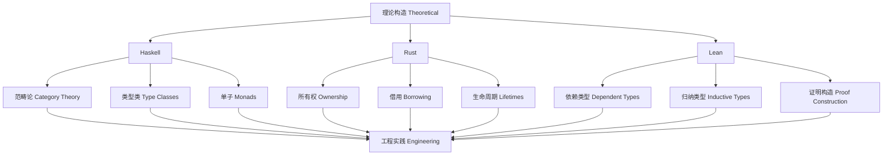

# 1.6 三语言对比 Comparison (Haskell/Rust/Lean)

Tag: #MappingTheoryLanguage-1.6

## 总览 Overview

- 从理论构造到语言机制的对应
- 表达力/可判定性/可验证性/工程复杂度的权衡

## 体系映射框架 Theoretical Mapping Framework

### 理论到语言的映射关系 Theory-to-Language Mapping

#### 类型理论映射 Type Theory Mapping

```haskell
-- 理论构造到语言机制的映射
data TheoryMapping = TheoryMapping
  { categoryTheory :: CategoryTheoryMapping
  , typeTheory :: TypeTheoryMapping
  , linearTheory :: LinearTheoryMapping
  , proofTheory :: ProofTheoryMapping
  }

-- 范畴论映射
data CategoryTheoryMapping = CategoryTheoryMapping
  { haskell :: "Monad/Applicative/Functor"
  , rust :: "Traits/Associated Types"
  , lean :: "Type Classes/Instances"
  }

-- 类型论映射
data TypeTheoryMapping = TypeTheoryMapping
  { haskell :: "GADTs/Type Families/DataKinds"
  , rust :: "Generics/Trait Bounds"
  , lean :: "Dependent Types/Inductive Types"
  }
```

#### 形式化映射关系 Formal Mapping Relations

- **Haskell**：以范畴论为基础，通过类型类、单子、函子等构造实现理论映射
- **Rust**：以线性/仿射类型理论为基础，通过所有权、借用、生命周期等机制实现理论映射
- **Lean**：以依赖类型理论为基础，通过归纳类型、类型族、证明构造等实现理论映射

## 对比表 Comparison Table

| 维度 Dimension | Haskell | Rust | Lean |
|---|---|---|---|
| 理论承载 Theoretical Carrier | Category/Type Theory/Effects | Linear/Affine ideas, Type Theory | Dependent Type Theory/Proof Theory |
| 落地机制 Realization | Monad/TypeFamilies/LinearTypes | Ownership/Borrowing/Traits/Lifetimes | Inductive families/Type classes |
| 验证 Verification | QuickCheck/Coq/Agda bridges | RustBelt/Prusti/Miri | Kernel-checked proofs |
| 复杂度 Complexity | 中（抽象高、工具成熟） | 中-高（系统工程） | 高（证明负担） |

## 多语言对照案例 Multi-Language Comparison Cases

### 案例1：函数式编程 Functional Programming

#### Haskell 实现

```haskell
-- 高阶函数
map :: (a -> b) -> [a] -> [b]
map _ [] = []
map f (x:xs) = f x : map f xs

-- 类型类
class Functor f where
  fmap :: (a -> b) -> f a -> f b

instance Functor [] where
  fmap = map

-- 单子
class Monad m where
  return :: a -> m a
  (>>=) :: m a -> (a -> m b) -> m b

instance Monad Maybe where
  return = Just
  Nothing >>= _ = Nothing
  Just x >>= f = f x
```

#### Rust 实现

```rust
// 迭代器
fn map<T, U, F>(iter: impl Iterator<Item = T>, f: F) -> impl Iterator<Item = U>
where
    F: FnMut(T) -> U,
{
    iter.map(f)
}

// Trait
trait Functor {
    type Output;
    fn fmap<F>(self, f: F) -> Self::Output
    where
        F: FnMut(Self::Item) -> U;
}

// Option 实现
impl<T> Option<T> {
    fn map<U, F>(self, f: F) -> Option<U>
    where
        F: FnOnce(T) -> U,
    {
        match self {
            Some(x) => Some(f(x)),
            None => None,
        }
    }
}
```

#### Lean 实现

```lean
-- 高阶函数
def map {α β : Type} (f : α → β) : List α → List β
| [] => []
| (x :: xs) => f x :: map f xs

-- 类型类
class Functor (f : Type → Type) where
  map : ∀ {α β : Type}, (α → β) → f α → f β

instance : Functor List where
  map := map

-- 单子
class Monad (m : Type → Type) where
  pure : ∀ {α : Type}, α → m α
  bind : ∀ {α β : Type}, m α → (α → m β) → m β
```

### 案例2：类型安全 Type Safety

#### Haskell 类型安全

```haskell
-- 长度索引向量
{-# LANGUAGE DataKinds, GADTs, KindSignatures #-}

data Nat = Z | S Nat

data Vec (n :: Nat) a where
  VNil  :: Vec 'Z a
  VCons :: a -> Vec n a -> Vec ('S n) a

-- 类型安全的head函数
headVec :: Vec ('S n) a -> a
headVec (VCons x _) = x

-- 编译时检查
safeHead :: Vec n a -> Maybe a
safeHead VNil = Nothing
safeHead (VCons x _) = Just x
```

#### Rust 类型安全

```rust
// 所有权系统
fn main() {
    let s1 = String::from("hello");
    let s2 = s1; // s1 被移动到 s2
    // println!("{}", s1); // 编译错误：s1 已被移动
    
    let s3 = &s2; // 借用
    println!("{}", s2); // 可以访问
    println!("{}", s3); // 可以访问
}

// 生命周期
fn longest<'a>(x: &'a str, y: &'a str) -> &'a str {
    if x.len() > y.len() { x } else { y }
}
```

#### Lean 类型安全

```lean
-- 依赖类型
inductive Vec (α : Type) : Nat → Type
| nil : Vec α 0
| cons : ∀ {n : Nat}, α → Vec α n → Vec α (n + 1)

-- 类型安全的head函数
def head {α : Type} {n : Nat} (v : Vec α (n + 1)) : α :=
match v with
| Vec.cons x _ => x

-- 证明类型安全
theorem head_safe {α : Type} {n : Nat} (v : Vec α (n + 1)) :
  ∃ x : α, head v = x :=
⟨head v, rfl⟩
```

## 1形式化映射关系 Formal Mapping Relations

### 理论构造映射 Theoretical Construction Mapping

#### 范畴论构造 Category Theory Constructions

```haskell
-- Haskell: 范畴论映射
class Category cat where
  id :: cat a a
  (.) :: cat b c -> cat a b -> cat a c

class Functor f where
  fmap :: (a -> b) -> f a -> f b

class Applicative f where
  pure :: a -> f a
  (<*>) :: f (a -> b) -> f a -> f b

class Monad m where
  return :: a -> m a
  (>>=) :: m a -> (a -> m b) -> m b
```

```rust
// Rust: 范畴论映射
trait Functor {
    type Output;
    fn fmap<F>(self, f: F) -> Self::Output;
}

trait Applicative: Functor {
    fn pure<T>(value: T) -> Self;
    fn apply<F>(self, f: Self) -> Self::Output;
}

trait Monad: Applicative {
    fn bind<F>(self, f: F) -> Self::Output;
}
```

```lean
-- Lean: 范畴论映射
class Category (obj : Type) (hom : obj → obj → Type) where
  id : ∀ a : obj, hom a a
  comp : ∀ {a b c : obj}, hom b c → hom a b → hom a c

class Functor (F : Type → Type) where
  map : ∀ {α β : Type}, (α → β) → F α → F β
```

### 1类型理论映射 Type Theory Mapping

#### 依赖类型映射 Dependent Type Mapping

```haskell
-- Haskell: 依赖类型（通过扩展）
{-# LANGUAGE DataKinds, GADTs, TypeFamilies #-}

data Nat = Z | S Nat

type family Add (n :: Nat) (m :: Nat) :: Nat where
  Add 'Z m = m
  Add ('S n) m = 'S (Add n m)

data Vec (n :: Nat) a where
  VNil  :: Vec 'Z a
  VCons :: a -> Vec n a -> Vec ('S n) a
```

```lean
-- Lean: 原生依赖类型
inductive Nat
| zero : Nat
| succ : Nat → Nat

def add : Nat → Nat → Nat
| Nat.zero, m => m
| Nat.succ n, m => Nat.succ (add n m)

inductive Vec (α : Type) : Nat → Type
| nil : Vec α Nat.zero
| cons : ∀ {n : Nat}, α → Vec α n → Vec α (Nat.succ n)
```

## 工程实践对比 Engineering Practice Comparison

### 开发效率 Development Efficiency

#### Haskell 开发效率

- **优势**：高级抽象、类型推导、快速原型
- **挑战**：学习曲线陡峭、调试复杂
- **工具链**：GHC、Cabal、Stack、HLS

```haskell
-- 快速原型示例
quickSort :: Ord a => [a] -> [a]
quickSort [] = []
quickSort (x:xs) = 
  quickSort [y | y <- xs, y <= x] ++ 
  [x] ++ 
  quickSort [y | y <- xs, y > x]
```

#### Rust 开发效率

- **优势**：内存安全、性能、并发安全
- **挑战**：所有权学习、编译时间长
- **工具链**：Cargo、rustc、Clippy、rust-analyzer

```rust
// 内存安全示例
fn process_data(data: Vec<i32>) -> Vec<i32> {
    data.into_iter()
        .filter(|&x| x > 0)
        .map(|x| x * 2)
        .collect()
}
```

#### Lean 开发效率

- **优势**：形式化证明、类型安全
- **挑战**：证明负担、学习成本高
- **工具链**：Lean、Mathlib、VSCode

```lean
-- 形式化证明示例
theorem add_zero (n : Nat) : add n Nat.zero = n :=
by induction n with
| zero => rw [add]
| succ n ih => rw [add, ih]
```

### 性能对比 Performance Comparison

| 语言 Language | 内存管理 Memory | 运行时开销 Runtime | 编译时间 Compile | 执行速度 Execution |
|---|---|---|---|---|
| Haskell | GC | 中等 | 快 | 快 |
| Rust | 零开销 | 低 | 慢 | 很快 |
| Lean | GC | 中等 | 中等 | 中等 |

## 结构图 Structure Diagram



## 交叉引用 Cross References

- [类型理论 Type Theory](../TypeTheory/README.md)
- [范畴论 Category Theory](../CategoryTheory/README.md)
- [线性类型理论 Linear Type Theory](../LinearTypeTheory/README.md)
- [依赖类型理论 Dependent Type Theory](../DependentTypeTheory/README.md)
- [证明理论 Proof Theory](../ProofTheory/README.md)

## 参考文献 References

1. Peyton Jones, S. (2003). The Haskell 98 language and libraries: the revised report. Journal of functional programming, 13(1), 0-255.
2. Jung, R., et al. (2018). RustBelt: Securing the foundations of the Rust programming language. Proceedings of the ACM on Programming Languages, 2(POPL), 1-34.
3. de Moura, L., & Ullrich, S. (2021). The Lean 4 theorem prover and programming language. Automated Deduction–CADE 28, 625-635.
4. Wadler, P. (1992). The essence of functional programming. Proceedings of the 19th ACM SIGPLAN-SIGACT symposium on Principles of programming languages, 1-14.
5. Jung, R., et al. (2017). Iris: Monoids and invariants as an orthogonal basis for concurrent reasoning. ACM SIGPLAN Notices, 52(1), 637-650.
