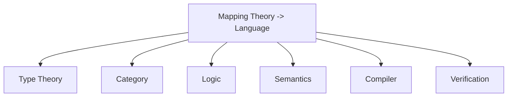

# 1.1 理论到语言映射的定义 Definition of Mapping Theory to Language #MappingTheoryLanguage-1.1

## 定义 Definition

### 基本定义 Basic Definition

- **中文**：理论到语言映射（Mapping Theory to Language）研究抽象理论结构（如类型理论、范畴论、逻辑系统）如何系统地落实为编程语言要素（语法、类型系统、语义、库、编译器与验证工具）。它关注表达力与可判定性的平衡、组合性与可验证性的保证，以及语义对齐与等价保持。
- **English**: Mapping theory to language studies how abstract theoretical structures (e.g., type theory, category theory, logic systems) are systematically realized as language features (syntax, type systems, semantics, libraries, compilers, and verification tools). It focuses on balancing expressiveness and decidability, ensuring compositionality and verifiability, and maintaining semantic alignment and equivalence preservation.

### 形式化定义 Formal Definition

#### 映射函数 Mapping Function

一个理论到语言的映射函数 $\mathcal{M}$ 是一个映射：

$$\mathcal{M}: \text{Theory} \rightarrow \text{Language}$$

其中 Theory 是理论结构的集合，Language 是语言特征的集合。

#### 映射关系 Mapping Relation

对于理论结构 $T$ 和语言特征 $L$，映射关系定义为：

$$T \mapsto L \text{ iff } \mathcal{M}(T) = L$$

#### 映射等价性 Mapping Equivalence

两个映射 $\mathcal{M}_1$ 和 $\mathcal{M}_2$ 等价当且仅当：

$$\forall T. \mathcal{M}_1(T) \equiv \mathcal{M}_2(T)$$

其中 $\equiv$ 表示语义等价。

## 哲学背景 Philosophical Background

### 实现哲学 Philosophy of Implementation

- **中文**：理论到语言映射体现了实现哲学思想，探讨抽象理论如何具体化为可执行的程序，反映了理论与实践、抽象与具体的关系。
- **English**: Mapping theory to language embodies the philosophy of implementation, exploring how abstract theories are concretized into executable programs, reflecting the relationship between theory and practice, abstraction and concreteness.

### 结构对应哲学 Structural Correspondence Philosophy

- **中文**：理论到语言映射体现了结构对应哲学思想，强调理论结构与语言结构之间的同构关系，通过结构保持来实现语义保持。
- **English**: Mapping theory to language embodies structural correspondence philosophy, emphasizing the isomorphic relationship between theoretical structures and language structures, achieving semantic preservation through structural preservation.

### 形式化哲学 Formal Philosophy

- **中文**：理论到语言映射体现了形式化哲学思想，通过严格的数学方法来保证理论到语言的正确映射，强调精确性和可验证性。
- **English**: Mapping theory to language embodies formal philosophy, ensuring correct mapping from theory to language through rigorous mathematical methods, emphasizing precision and verifiability.

## 核心概念 Core Concepts

### 类型理论映射 Type Theory Mapping

#### 依赖类型映射 Dependent Type Mapping

```haskell
-- 依赖类型理论到语言映射
data DependentTypeMapping = DependentTypeMapping
  { theory :: DependentTypeTheory
  , language :: ProgrammingLanguage
  , mapping :: Map TypeConstructor LanguageFeature
  }

data DependentTypeTheory = DependentTypeTheory
  { universes :: [Universe]
  , typeFormers :: [TypeFormer]
  , eliminators :: [Eliminator]
  }

-- 类型构造器映射
mapTypeConstructor :: TypeConstructor -> LanguageFeature
mapTypeConstructor Pi = FunctionType
mapTypeConstructor Sigma = ProductType
mapTypeConstructor Id = IdentityType
mapTypeConstructor Nat = NaturalNumberType

-- 类型检查器映射
mapTypeChecker :: TypeChecker -> LanguageTypeChecker
mapTypeChecker tc = LanguageTypeChecker
  { checkType = mapTypeChecking tc
  , inferType = mapTypeInference tc
  , normalize = mapNormalization tc
  }
```

#### 线性类型映射 Linear Type Mapping

```haskell
-- 线性类型理论到语言映射
data LinearTypeMapping = LinearTypeMapping
  { linearTheory :: LinearTypeTheory
  , targetLanguage :: ProgrammingLanguage
  , resourceMapping :: ResourceMapping
  }

data LinearTypeTheory = LinearTypeTheory
  { linearTypes :: [LinearType]
  , linearLogic :: LinearLogic
  , resourceSemantics :: ResourceSemantics
  }

-- 线性类型映射
mapLinearType :: LinearType -> LanguageType
mapLinearType (Linear a) = LinearType (mapType a)
mapLinearType (Affine a) = AffineType (mapType a)
mapLinearType (Unrestricted a) = UnrestrictedType (mapType a)

-- 资源管理映射
mapResourceManagement :: ResourceManagement -> LanguageResourceManagement
mapResourceManagement rm = LanguageResourceManagement
  { acquire = mapAcquire rm
  , release = mapRelease rm
  , transfer = mapTransfer rm
  }
```

### 范畴论映射 Category Theory Mapping

#### 函子映射 Functor Mapping

```haskell
-- 范畴论到语言映射
data CategoryTheoryMapping = CategoryTheoryMapping
  { category :: Category
  , language :: ProgrammingLanguage
  , functorMapping :: FunctorMapping
  }

data Category = Category
  { objects :: Set Object
  , morphisms :: Map (Object, Object) (Set Morphism)
  , composition :: Composition
  , identity :: Identity
  }

-- 函子映射
mapFunctor :: Functor -> LanguageFunctor
mapFunctor (Functor fmap' pure' join') = LanguageFunctor
  { fmap = mapFmap fmap'
  , pure = mapPure pure'
  , join = mapJoin join'
  }

-- 自然变换映射
mapNaturalTransformation :: NaturalTransformation -> LanguageNaturalTransformation
mapNaturalTransformation nt = LanguageNaturalTransformation
  { components = mapComponents nt
  , naturality = mapNaturality nt
  }
```

#### 单子映射 Monad Mapping

```haskell
-- 单子理论到语言映射
data MonadMapping = MonadMapping
  { monadTheory :: MonadTheory
  , language :: ProgrammingLanguage
  , monadImplementation :: MonadImplementation
  }

data MonadTheory = MonadTheory
  { monad :: Monad
  , laws :: MonadLaws
  , semantics :: MonadSemantics
  }

-- 单子映射
mapMonad :: Monad -> LanguageMonad
mapMonad (Monad unit bind) = LanguageMonad
  { return = mapReturn unit
  , bind = mapBind bind
  , laws = mapMonadLaws
  }

-- 单子变换器映射
mapMonadTransformer :: MonadTransformer -> LanguageMonadTransformer
mapMonadTransformer mt = LanguageMonadTransformer
  { lift = mapLift mt
  , transform = mapTransform mt
  }
```

### 逻辑系统映射 Logic System Mapping

#### 直觉逻辑映射 Intuitionistic Logic Mapping

```haskell
-- 直觉逻辑到语言映射
data IntuitionisticLogicMapping = IntuitionisticLogicMapping
  { logic :: IntuitionisticLogic
  , language :: ProgrammingLanguage
  , proofMapping :: ProofMapping
  }

data IntuitionisticLogic = IntuitionisticLogic
  { propositions :: [Proposition]
  , rules :: [InferenceRule]
  , semantics :: KripkeSemantics
  }

-- 命题映射
mapProposition :: Proposition -> LanguageType
mapProposition (Implication a b) = FunctionType (mapProposition a) (mapProposition b)
mapProposition (Conjunction a b) = ProductType (mapProposition a) (mapProposition b)
mapProposition (Disjunction a b) = SumType (mapProposition a) (mapProposition b)
mapProposition (Falsehood) = VoidType

-- 证明映射
mapProof :: Proof -> LanguageTerm
mapProof (Lambda x p) = Lambda x (mapProof p)
mapProof (Application p q) = Application (mapProof p) (mapProof q)
mapProof (Pair p q) = Pair (mapProof p) (mapProof q)
```

#### 线性逻辑映射 Linear Logic Mapping

```haskell
-- 线性逻辑到语言映射
data LinearLogicMapping = LinearLogicMapping
  { linearLogic :: LinearLogic
  , language :: ProgrammingLanguage
  , resourceMapping :: ResourceMapping
  }

data LinearLogic = LinearLogic
  { multiplicative :: MultiplicativeConnectives
  , additive :: AdditiveConnectives
  , exponential :: ExponentialConnectives
  }

-- 线性连接词映射
mapLinearConnective :: LinearConnective -> LanguageType
mapLinearConnective (Tensor a b) = LinearProduct (mapType a) (mapType b)
mapLinearConnective (Par a b) = LinearSum (mapType a) (mapType b)
mapLinearConnective (With a b) = AdditiveProduct (mapType a) (mapType b)
mapLinearConnective (Plus a b) = AdditiveSum (mapType a) (mapType b)
```

### 语义保持 Semantic Preservation

#### 语义等价性 Semantic Equivalence

```haskell
-- 语义等价性检查
data SemanticEquivalence = SemanticEquivalence
  { theorySemantics :: TheorySemantics
  , languageSemantics :: LanguageSemantics
  , equivalenceCheck :: EquivalenceCheck
  }

-- 语义等价性检查
checkSemanticEquivalence :: Theory -> Language -> Bool
checkSemanticEquivalence theory language = 
  all (\construct -> 
        theorySemantics theory construct == 
        languageSemantics language (mapConstruct construct))
      (theoryConstructs theory)

-- 语义保持映射
semanticPreservingMapping :: Mapping -> Bool
semanticPreservingMapping mapping = 
  all (\theoryConstruct -> 
        preservesSemantics mapping theoryConstruct)
      (domain mapping)
```

#### 组合性保持 Compositionality Preservation

```haskell
-- 组合性保持
data CompositionalityPreservation = CompositionalityPreservation
  { theoryComposition :: TheoryComposition
  , languageComposition :: LanguageComposition
  , preservationCheck :: PreservationCheck
  }

-- 组合性检查
checkCompositionality :: Mapping -> Bool
checkCompositionality mapping = 
  all (\theoryComposition -> 
        mapComposition mapping theoryComposition == 
        composeLanguageFeatures mapping (components theoryComposition))
      (theoryCompositions mapping)
```

## 历史发展 Historical Development

### 理论基础 Theoretical Foundation

#### 理论映射的起源 (1960s-1970s)

- **Christopher Strachey** 研究类型理论与语言映射 (1960s)
- **Dana Scott** 发展域理论与语言语义 (1970s)
- **Robin Milner** 研究类型系统与语言设计 (1970s)

#### 理论映射的发展 (1980s-1990s)

- **Philip Wadler** 研究范畴论与函数式编程 (1980s)
- **John Reynolds** 研究类型理论与语言实现 (1990s)
- **Samson Abramsky** 发展博弈语义与语言映射 (1990s)

### 现代发展 Modern Development

#### 现代理论映射 (2000s-2020s)

```haskell
-- 现代理论映射
data ModernTheoryMapping = ModernTheoryMapping
  { typeTheoryMapping :: TypeTheoryMapping
  , categoryTheoryMapping :: CategoryTheoryMapping
  , logicMapping :: LogicMapping
  , verificationMapping :: VerificationMapping
  }

-- 映射组合
composeMappings :: ModernTheoryMapping -> ModernTheoryMapping -> ModernTheoryMapping
composeMappings mapping1 mapping2 = 
  ModernTheoryMapping
    { typeTheoryMapping = composeTypeTheory (typeTheoryMapping mapping1) (typeTheoryMapping mapping2)
    , categoryTheoryMapping = composeCategoryTheory (categoryTheoryMapping mapping1) (categoryTheoryMapping mapping2)
    , logicMapping = composeLogic (logicMapping mapping1) (logicMapping mapping2)
    , verificationMapping = composeVerification (verificationMapping mapping1) (verificationMapping mapping2)
    }
```

## 形式化语义 Formal Semantics

### 映射语义 Mapping Semantics

#### 映射函数语义

对于映射函数 $\mathcal{M}$，其语义定义为：

$$[\![\mathcal{M}]\!] = \{(T, L) \mid \mathcal{M}(T) = L\}$$

#### 映射等价性语义

两个映射 $\mathcal{M}_1$ 和 $\mathcal{M}_2$ 语义等价当且仅当：

$$[\![\mathcal{M}_1]\!] = [\![\mathcal{M}_2]\!]$$

### 语义保持语义 Semantic Preservation Semantics

#### 语义保持

映射 $\mathcal{M}$ 保持语义当且仅当：

$$\forall T. [\![T]\!] = [\![\mathcal{M}(T)]\!]$$

## 与其他理论的关系 Relationship to Other Theories

### 与类型理论的关系

- **中文**：理论到语言映射为类型理论提供实现基础，类型理论为映射提供类型安全保证。
- **English**: Mapping theory to language provides implementation foundations for type theory, while type theory provides type safety guarantees for mappings.

### 与编译器理论的关系

- **中文**：理论到语言映射为编译器理论提供理论基础，编译器通过映射来实现理论到语言的转换。
- **English**: Mapping theory to language provides theoretical foundations for compiler theory, where compilers use mappings to implement theory-to-language transformations.

### 与程序验证的关系

- **中文**：理论到语言映射为程序验证提供语义基础，通过映射来保证程序与理论的一致性。
- **English**: Mapping theory to language provides semantic foundations for program verification, ensuring consistency between programs and theories through mappings.

## 交叉引用 Cross References

- [类型理论 Type Theory](../TypeTheory/README.md)
- [编译器理论 Compiler Theory](../CompilerTheory/README.md)
- [程序验证 Program Verification](../ProgramVerification/README.md)
- [形式化定义 Formal Definitions](../FormalDefinitions/README.md)
- [定理与证明 Theorems & Proofs](../Theorems_Proofs/README.md)

## 对比分析 Comparison

- **中文**：理论→语言映射 vs 语义模型 vs 编译器实现 vs 验证
  - 映射关注“从理论到特性”的系统化路径；语义模型关注含义；编译器关注可实现与优化；验证关注正确性与一致性。
- **English**: Theory→Language mapping vs semantic models vs compiler implementation vs verification
  - Mapping emphasizes the systematic path from theory to features; semantics focuses on meaning; compilers on implementability/optimization; verification on correctness/consistency.

## 争议与批判 Controversies & Critique

- **中文**：
  - 表达力与可判定性的取舍；理论纯度与工程可用性的张力；
  - 语义保持的边界与等价判定的复杂性。
- **English**:
  - Trade-offs between expressiveness and decidability; tension between theoretical purity and engineering usability;
  - Limits of semantic preservation and complexity of equivalence checking.

## 前沿趋势 Frontier Trends

- **中文**：
  - 依赖类型/会话类型的工业化；可验证编译与证据携带代码；
  - 形式化与机器学习的结合（合成/验证）。
- **English**:
  - Industrial adoption of dependent/session types; verified compilation and PCC;
  - Integrating formal methods with ML (synthesis/verification).

## 常见陷阱 Common Pitfalls

- **中文**：
  - 漏掉副作用/并发/资源模型的系统化映射；
  - 未提供从定理到测试/工具链的一致路径；
  - 只给“点状对照”，缺少“组合性保持”的全局策略。
- **English**:
  - Missing systematic mapping for effects/concurrency/resources;
  - No consistent path from theorems to tests/toolchains;
  - Pointwise correspondences without global compositionality strategy.

## 扩展交叉引用 Extended Cross References

- [类型系统 Type Systems](../TypeSystems/README.md)
- [语法与语义 Syntax & Semantics](../Syntax_Semantics/README.md)
- [编译器理论 Compiler Theory](../CompilerTheory/README.md)
- [程序验证 Program Verification](../ProgramVerification/README.md)

## 知识图谱 Knowledge Graph



## 参考文献 References

1. Strachey, C. (1967). Fundamental concepts in programming languages. Oxford University.
2. Scott, D. (1970). Outline of a mathematical theory of computation. Oxford University.
3. Milner, R. (1978). A theory of type polymorphism in programming. Journal of Computer and System Sciences, 17(3), 348-375.
4. Wadler, P. (1989). Theorems for free! FPCA, 347-359.
5. Reynolds, J. C. (1983). Types, abstraction, and parametric polymorphism. Information Processing, 83, 513-523.
6. Abramsky, S., & McCusker, G. (1999). Game semantics. Computational Logic, 1-55.
7. Pierce, B. C. (2002). Types and programming languages. MIT Press.
8. Mitchell, J. C. (1996). Foundations for programming languages. MIT Press.
