# 11. 哲科思脉与知识体系结构 Philosophical Context & Knowledge Structure

## 11.1 主题简介 Overview #PhilosophyKnowledgeGraph-11.1

- **中文**：本节梳理Haskell、Rust、Lean及相关理论的哲学思脉、知识体系与结构化图谱。哲科思脉与知识体系结构是理解理论发展脉络和知识组织方式的重要工具，为跨学科研究和知识整合提供基础。
- **English**: This section reviews the philosophical context, knowledge systems, and structured maps of Haskell, Rust, Lean, and related theories. Philosophical context and knowledge structure are important tools for understanding theoretical development trajectories and knowledge organization methods, providing foundations for interdisciplinary research and knowledge integration.

## 11.2 定义 Definition

### 基本定义 Basic Definition

- **中文**：哲科思脉是指理论发展背后的哲学思想和科学脉络，知识体系结构是指知识要素之间的组织关系和层次结构，知识图谱是指知识实体及其关系的可视化表示。
- **English**: Philosophical context refers to the philosophical ideas and scientific trajectories behind theoretical development, knowledge system structure refers to the organizational relationships and hierarchical structures among knowledge elements, and knowledge graph refers to the visual representation of knowledge entities and their relationships.

### 形式化定义 Formal Definition

#### 知识实体 Knowledge Entity

一个知识实体 $E$ 是一个四元组 $(id, type, attributes, relationships)$，其中：

- $id$ 是实体标识符
- $type$ 是实体类型
- $attributes$ 是属性集合
- $relationships$ 是关系集合

#### 知识关系 Knowledge Relationship

对于知识实体 $E_1$ 和 $E_2$，知识关系定义为：

$$R(E_1, E_2) = (type, weight, direction)$$

其中 $type$ 是关系类型，$weight$ 是关系权重，$direction$ 是关系方向。

#### 知识图谱 Knowledge Graph

一个知识图谱 $G$ 是一个三元组 $(V, E, A)$，其中：

- $V$ 是顶点集合（知识实体）
- $E$ 是边集合（知识关系）
- $A$ 是属性集合

## 11.3 哲学背景 Philosophical Background

### 整体论哲学 Holistic Philosophy

- **中文**：知识体系结构体现了整体论哲学思想，强调知识系统的整体性大于其组成部分的简单总和，知识具有涌现性质和整体功能。
- **English**: Knowledge system structure embodies holistic philosophy, emphasizing that the whole of a knowledge system is greater than the simple sum of its parts, with knowledge exhibiting emergent properties and holistic functions.

### 结构主义哲学 Structuralist Philosophy

- **中文**：知识体系结构体现了结构主义哲学思想，关注知识的结构和组织方式，认为知识的性质由其结构关系决定。
- **English**: Knowledge system structure embodies structuralist philosophy, focusing on the structure and organization of knowledge, believing that knowledge properties are determined by structural relationships.

### 系统哲学 System Philosophy

- **中文**：知识体系结构体现了系统哲学思想，将知识视为一个动态的系统，强调知识要素之间的相互作用和系统演化。
- **English**: Knowledge system structure embodies system philosophy, viewing knowledge as a dynamic system, emphasizing interactions among knowledge elements and system evolution.

## 11.4 核心概念 Core Concepts

### 哲学思脉 Philosophical Context

#### 哲学思潮 Philosophical Trends

```haskell
-- 哲学思潮
data PhilosophicalTrend = PhilosophicalTrend
  { name :: String
  , period :: TimePeriod
  , keyFigures :: [Philosopher]
  , coreIdeas :: [CoreIdea]
  , influence :: Influence
  }

-- 哲学家
data Philosopher = Philosopher
  { name :: String
  , period :: TimePeriod
  , works :: [Work]
  , contributions :: [Contribution]
  , influence :: Influence
  }

-- 核心思想
data CoreIdea = CoreIdea
  { name :: String
  , description :: String
  , implications :: [Implication]
  , applications :: [Application]
  }

-- 哲学影响
data Influence = Influence
  { directInfluence :: [Theory]
  , indirectInfluence :: [Theory]
  , contemporaryImpact :: [Impact]
  , historicalSignificance :: Significance
  }

-- 哲学脉络分析
analyzePhilosophicalContext :: [PhilosophicalTrend] -> PhilosophicalContext
analyzePhilosophicalContext trends = PhilosophicalContext
  { trends = trends
  , relationships = analyzeRelationships trends
  , evolution = analyzeEvolution trends
  , impact = analyzeImpact trends
  }
```

#### 科学脉络 Scientific Trajectory

```haskell
-- 科学脉络
data ScientificTrajectory = ScientificTrajectory
  { field :: ScientificField
  , development :: [DevelopmentStage]
  , breakthroughs :: [Breakthrough]
  , methodology :: Methodology
  }

-- 科学发展阶段
data DevelopmentStage = DevelopmentStage
  { stage :: String
  , period :: TimePeriod
  , keyDevelopments :: [Development]
  , keyFigures :: [Scientist]
  , significance :: Significance
  }

-- 科学突破
data Breakthrough = Breakthrough
  { discovery :: Discovery
  , impact :: Impact
  , methodology :: Methodology
  , implications :: [Implication]
  }

-- 科学方法论
data Methodology = Methodology
  { approach :: Approach
  , techniques :: [Technique]
  , validation :: ValidationMethod
  , limitations :: [Limitation]
  }
```

### 知识体系结构 Knowledge System Structure

#### 知识层次 Knowledge Hierarchy

```haskell
-- 知识层次
data KnowledgeHierarchy = KnowledgeHierarchy
  { levels :: [KnowledgeLevel]
  , relationships :: Map LevelId [LevelId]
  , transitions :: [LevelTransition]
  }

-- 知识层次
data KnowledgeLevel = KnowledgeLevel
  { levelId :: LevelId
  , name :: String
  , description :: String
  , entities :: [KnowledgeEntity]
  , abstraction :: AbstractionLevel
  }

-- 层次转换
data LevelTransition = LevelTransition
  { from :: LevelId
  , to :: LevelId
  , method :: TransitionMethod
  , conditions :: [Condition]
  }

-- 知识抽象
data AbstractionLevel = 
  Concrete
  | Abstract
  | Meta
  | MetaMeta

-- 层次分析
analyzeHierarchy :: KnowledgeHierarchy -> HierarchyAnalysis
analyzeHierarchy hierarchy = HierarchyAnalysis
  { levels = levels hierarchy
  , relationships = relationships hierarchy
  , transitions = transitions hierarchy
  , complexity = calculateComplexity hierarchy
  }
```

#### 知识分类 Knowledge Classification

```haskell
-- 知识分类
data KnowledgeClassification = KnowledgeClassification
  { categories :: [KnowledgeCategory]
  , taxonomy :: Taxonomy
  , ontology :: Ontology
  , classification :: ClassificationMethod
  }

-- 知识类别
data KnowledgeCategory = KnowledgeCategory
  { categoryId :: CategoryId
  , name :: String
  , description :: String
  , subcategories :: [KnowledgeCategory]
  , entities :: [KnowledgeEntity]
  }

-- 分类法
data Taxonomy = Taxonomy
  { hierarchy :: HierarchicalStructure
  , relationships :: [TaxonomicRelationship]
  , rules :: [ClassificationRule]
  }

-- 本体论
data Ontology = Ontology
  { concepts :: [Concept]
  , relationships :: [OntologicalRelationship]
  , axioms :: [Axiom]
  , constraints :: [Constraint]
  }

-- 分类方法
data ClassificationMethod = ClassificationMethod
  { algorithm :: ClassificationAlgorithm
  , criteria :: [Criterion]
  , validation :: ValidationMethod
  , evaluation :: EvaluationMetric
  }
```

### 知识图谱 Knowledge Graph

#### 图谱构建 Graph Construction

```haskell
-- 知识图谱
data KnowledgeGraph = KnowledgeGraph
  { vertices :: Map VertexId KnowledgeEntity
  , edges :: Map EdgeId KnowledgeRelationship
  , attributes :: Map AttributeId Attribute
  , metadata :: GraphMetadata
  }

-- 知识实体
data KnowledgeEntity = KnowledgeEntity
  { entityId :: EntityId
  , entityType :: EntityType
  , properties :: Map PropertyId Property
  , relationships :: [RelationshipId]
  }

-- 知识关系
data KnowledgeRelationship = KnowledgeRelationship
  { relationshipId :: RelationshipId
  , source :: EntityId
  , target :: EntityId
  , relationshipType :: RelationshipType
  , weight :: Double
  , properties :: Map PropertyId Property
  }

-- 图谱构建
buildKnowledgeGraph :: [KnowledgeEntity] -> [KnowledgeRelationship] -> KnowledgeGraph
buildKnowledgeGraph entities relationships = KnowledgeGraph
  { vertices = Map.fromList [(entityId e, e) | e <- entities]
  , edges = Map.fromList [(relationshipId r, r) | r <- relationships]
  , attributes = extractAttributes entities relationships
  , metadata = generateMetadata entities relationships
  }
```

#### 图谱分析 Graph Analysis

```haskell
-- 图谱分析
data GraphAnalysis = GraphAnalysis
  { centrality :: Map EntityId Double
  , communities :: [Community]
  , paths :: Map (EntityId, EntityId) [Path]
  , metrics :: GraphMetrics
  }

-- 中心性分析
analyzeCentrality :: KnowledgeGraph -> Map EntityId Double
analyzeCentrality graph = 
  let vertices = Map.keys (vertices graph)
      edges = Map.elems (edges graph)
  in Map.fromList [(v, calculateCentrality v vertices edges) | v <- vertices]

-- 社区发现
discoverCommunities :: KnowledgeGraph -> [Community]
discoverCommunities graph = 
  let adjacencyMatrix = buildAdjacencyMatrix graph
  in detectCommunities adjacencyMatrix

-- 路径分析
analyzePaths :: KnowledgeGraph -> Map (EntityId, EntityId) [Path]
analyzePaths graph = 
  let vertices = Map.keys (vertices graph)
      pairs = [(v1, v2) | v1 <- vertices, v2 <- vertices, v1 /= v2]
  in Map.fromList [(pair, findPaths graph pair) | pair <- pairs]
```

## 11.5 历史发展 Historical Development

### 理论基础 Theoretical Foundation

#### 哲学思脉的起源 (古代-1800s)

- **柏拉图** 建立理念论 (公元前427-347年)
- **亚里士多德** 发展逻辑学 (公元前384-322年)
- **笛卡尔** 建立理性主义 (1596-1650)

#### 知识体系结构的发展 (1900s-1970s)

- **Bertrand Russell** 发展逻辑原子主义 (1900s)
- **Ludwig Wittgenstein** 研究语言哲学 (1920s)
- **Thomas Kuhn** 提出范式理论 (1962)

### 现代发展 Modern Development

#### 现代知识体系 (1980s-2020s)

```haskell
-- 现代知识体系
data ModernKnowledgeSystem = ModernKnowledgeSystem
  { digitalKnowledge :: DigitalKnowledge
  , semanticWeb :: SemanticWeb
  , artificialIntelligence :: AIKnowledge
  , interdisciplinary :: InterdisciplinaryKnowledge
  }

-- 数字知识
data DigitalKnowledge = DigitalKnowledge
  { digitalization :: DigitalizationProcess
  , representation :: KnowledgeRepresentation
  , storage :: KnowledgeStorage
  , retrieval :: KnowledgeRetrieval
  }

-- 语义网
data SemanticWeb = SemanticWeb
  { ontologies :: [Ontology]
  , linkedData :: LinkedData
  , reasoning :: ReasoningEngine
  , interoperability :: Interoperability
  }
```

## 11.6 形式化语义 Formal Semantics

### 知识语义 Knowledge Semantics

#### 实体语义

对于知识实体 $E$，其语义定义为：

$$[\![E]\!] = \{(id, type, attributes, relationships)\}$$

#### 关系语义

对于知识关系 $R$，其语义定义为：

$$[\![R]\!] = \{(E_1, E_2, type, weight, direction)\}$$

### 图谱语义 Graph Semantics

#### 图谱解释

对于知识图谱 $G$，其语义定义为：

$$[\![G]\!] = \{(V, E, A) \mid V \text{ are entities}, E \text{ are relationships}, A \text{ are attributes}\}$$

#### 图谱等价性

两个知识图谱 $G_1$ 和 $G_2$ 等价当且仅当：

$$[\![G_1]\!] = [\![G_2]\!]$$

## 11.7 与其他理论的关系 Relationship to Other Theories

### 与认知科学的关系

- **中文**：知识体系结构为认知科学提供知识组织模型，认知科学为知识体系结构提供认知基础。
- **English**: Knowledge system structure provides knowledge organization models for cognitive science, while cognitive science provides cognitive foundations for knowledge system structure.

### 与信息科学的关系

- **中文**：知识体系结构与信息科学密切相关，信息科学为知识体系结构提供信息处理技术。
- **English**: Knowledge system structure is closely related to information science, with information science providing information processing technologies for knowledge system structure.

### 与人工智能的关系

- **中文**：知识体系结构为人工智能提供知识表示方法，人工智能为知识体系结构提供自动化处理技术。
- **English**: Knowledge system structure provides knowledge representation methods for artificial intelligence, while artificial intelligence provides automated processing technologies for knowledge system structure.

## 11.8 例子与对比 Examples & Comparison

### Haskell知识体系示例

```haskell
-- Haskell知识体系
data HaskellKnowledgeSystem = HaskellKnowledgeSystem
  { typeTheory :: TypeTheoryKnowledge
  , categoryTheory :: CategoryTheoryKnowledge
  , functionalProgramming :: FunctionalProgrammingKnowledge
  , mathematicalFoundations :: MathematicalFoundations
  }

-- 类型理论知识
data TypeTheoryKnowledge = TypeTheoryKnowledge
  { basicTypes :: [BasicType]
  , typeClasses :: [TypeClass]
  , typeFamilies :: [TypeFamily]
  , advancedTypes :: [AdvancedType]
  }

-- 范畴论知识
data CategoryTheoryKnowledge = CategoryTheoryKnowledge
  { categories :: [Category]
  , functors :: [Functor]
  , naturalTransformations :: [NaturalTransformation]
  , monads :: [Monad]
  }

-- 知识图谱构建
buildHaskellKnowledgeGraph :: HaskellKnowledgeSystem -> KnowledgeGraph
buildHaskellKnowledgeGraph hks = KnowledgeGraph
  { vertices = extractEntities hks
  , edges = extractRelationships hks
  , attributes = extractAttributes hks
  , metadata = generateMetadata hks
  }
```

### Rust知识体系示例

```rust
// Rust知识体系
struct RustKnowledgeSystem {
    ownership_system: OwnershipKnowledge,
    type_system: TypeSystemKnowledge,
    memory_safety: MemorySafetyKnowledge,
    concurrency: ConcurrencyKnowledge,
}

// 所有权系统知识
struct OwnershipKnowledge {
    ownership_rules: Vec<OwnershipRule>,
    borrowing_rules: Vec<BorrowingRule>,
    lifetime_rules: Vec<LifetimeRule>,
    move_semantics: MoveSemantics,
}

// 类型系统知识
struct TypeSystemKnowledge {
    basic_types: Vec<BasicType>,
    compound_types: Vec<CompoundType>,
    traits: Vec<Trait>,
    generics: Vec<Generic>,
}

// 知识图谱构建
impl RustKnowledgeSystem {
    fn build_knowledge_graph(&self) -> KnowledgeGraph {
        KnowledgeGraph {
            vertices: self.extract_entities(),
            edges: self.extract_relationships(),
            attributes: self.extract_attributes(),
            metadata: self.generate_metadata(),
        }
    }
}
```

### Lean知识体系示例

```lean
-- Lean知识体系
structure LeanKnowledgeSystem where
  dependentTypes : DependentTypeKnowledge
  proofTheory : ProofTheoryKnowledge
  mathematicalLibraries : MathematicalLibraries
  formalVerification : FormalVerificationKnowledge

-- 依赖类型知识
structure DependentTypeKnowledge where
  piTypes : List PiType
  sigmaTypes : List SigmaType
  identityTypes : List IdentityType
  universes : List Universe

-- 证明论知识
structure ProofTheoryKnowledge where
  naturalDeduction : NaturalDeduction
  sequentCalculus : SequentCalculus
  typeChecking : TypeChecking
  normalization : Normalization

-- 知识图谱构建
def buildLeanKnowledgeGraph (lks : LeanKnowledgeSystem) : KnowledgeGraph :=
  {
    vertices := extractEntities lks,
    edges := extractRelationships lks,
    attributes := extractAttributes lks,
    metadata := generateMetadata lks
  }
```

## 11.9 典型对比表格 Typical Comparison Table

| 结构/领域 | Haskell | Rust | Lean |
|-----------|---------|------|------|
| 理论基础   | 类型理论、范畴论 | 所有权、类型系统 | 依赖类型、证明论 |
| 知识图谱   | 学术为主 | 工程为主 | 数学为主 |
| 交叉领域   | 数学、工程 | 系统、嵌入式 | 数学、形式化 |
| 哲学基础   | 函数式哲学 | 系统哲学 | 形式化哲学 |
| 应用领域   | 函数式编程 | 系统编程 | 定理证明 |

## 11.10 哲学批判与争议 Philosophical Critique & Controversies

### 整体论与还原论之争

- **中文**：知识体系结构面临整体论与还原论的争议，整体论强调知识的系统性，还原论强调知识的原子性。
- **English**: Knowledge system structure faces debates between holism and reductionism, with holism emphasizing the systematicity of knowledge and reductionism emphasizing the atomicity of knowledge.

### 知识客观性与主观性

- **中文**：知识体系结构面临知识客观性与主观性的争议，如何在知识组织中平衡客观事实与主观理解。
- **English**: Knowledge system structure faces controversies between knowledge objectivity and subjectivity, how to balance objective facts and subjective understanding in knowledge organization.

### 知识统一性与多样性

- **中文**：知识体系结构面临知识统一性与多样性的张力，如何在保持知识统一性的同时尊重知识多样性。
- **English**: Knowledge system structure faces tension between knowledge unity and diversity, how to respect knowledge diversity while maintaining knowledge unity.

## 11.11 国际对比与标准 International Comparison & Standards

### 国际标准

- **ISO 25964** - 知识组织系统标准
- **W3C SKOS** - 简单知识组织系统
- **Dublin Core** - 元数据标准

### 学术规范

- **ACM/IEEE** - 计算机科学学术规范
- **Springer/LNCS** - 形式化方法学术规范

## 11.12 知识论证的完备性 Completeness of Epistemic Argumentation

### 完备性要求

- **中文**：知识体系结构需覆盖理论、人物、流派、交叉领域等知识点，确保知识论证的系统性与完备性。
- **English**: Knowledge system structure should cover theories, figures, schools, interdisciplinary fields, etc., ensuring the systematicity and completeness of epistemic argumentation.

### 一致性检查

```haskell
-- 一致性检查
checkConsistency :: KnowledgeSystem -> Bool
checkConsistency ks = 
  let logicalConsistency = checkLogicalConsistency ks
      structuralConsistency = checkStructuralConsistency ks
      semanticConsistency = checkSemanticConsistency ks
  in logicalConsistency && structuralConsistency && semanticConsistency
```

## 11.13 交叉引用 Cross References

- [理论基础与历史脉络 Theoretical Foundations & History](../TypeTheory/README.md)
- [定理与证明 Theorems & Proofs](../Theorems_Proofs/README.md)
- [国际化对标与中英双语扩展 Internationalization & Bilingual Expansion](../Internationalization_Bilingual/README.md)
- [形式化定义 Formal Definitions](../FormalDefinitions/README.md)

## 11.14 参考文献 References

1. Russell, B. (1918). The philosophy of logical atomism. The Monist, 28(4), 495-527.
2. Wittgenstein, L. (1922). Tractatus Logico-Philosophicus. Routledge.
3. Kuhn, T. S. (1962). The structure of scientific revolutions. University of Chicago Press.
4. Popper, K. R. (1959). The logic of scientific discovery. Hutchinson.
5. Feyerabend, P. (1975). Against method. Verso.
6. Lakatos, I. (1978). The methodology of scientific research programmes. Cambridge University Press.
7. Quine, W. V. O. (1951). Two dogmas of empiricism. The Philosophical Review, 60(1), 20-43.
8. Putnam, H. (1975). Mind, language, and reality. Cambridge University Press.

## 11.15 批判性小结 Critical Summary

- **中文**：知识体系结构的知识论证需兼顾系统性与灵活性，持续完善理论创新与知识整合。未来需要关注知识自动化、跨学科整合与智能知识管理的发展。
- **English**: Epistemic argumentation of knowledge system structure should balance systematicity and flexibility, continuously improving theoretical innovation and knowledge integration. Future work should focus on knowledge automation, interdisciplinary integration, and intelligent knowledge management.

## 11.16 进一步批判性分析 Further Critical Analysis

### 挑战与机遇

- **知识爆炸**：知识体系结构需要应对知识爆炸的挑战
- **跨学科整合**：需要发展更好的跨学科知识整合方法
- **智能知识管理**：需要结合人工智能技术，实现智能化的知识管理

### 未来发展方向

- **智能知识图谱**：结合人工智能技术，实现智能化的知识图谱构建
- **跨学科知识整合**：发展跨学科的知识整合理论和方法
- **知识自动化**：推动知识管理的自动化进程

## 11.17 哲学框架 Philosophical Framework

### 11.17.1 哲学方法论 Philosophical Methodology

```haskell
-- 哲学方法论框架
data PhilosophicalMethodology = PhilosophicalMethodology
  { analyticalMethod :: AnalyticalMethod
  , syntheticMethod :: SyntheticMethod
  , dialecticalMethod :: DialecticalMethod
  , phenomenologicalMethod :: PhenomenologicalMethod
  }

-- 分析方法
data AnalyticalMethod = AnalyticalMethod
  { decomposition :: DecompositionStrategy
  , logicalAnalysis :: LogicalAnalysis
  , conceptualClarification :: ConceptualClarification
  , argumentation :: Argumentation
  }

-- 综合方法
data SyntheticMethod = SyntheticMethod
  { integration :: IntegrationStrategy
  , synthesis :: Synthesis
  , generalization :: Generalization
  , abstraction :: Abstraction
  }

-- 辩证方法
data DialecticalMethod = DialecticalMethod
  { thesis :: Thesis
  , antithesis :: Antithesis
  , synthesis :: Synthesis
  , development :: Development
  }

-- 现象学方法
data PhenomenologicalMethod = PhenomenologicalMethod
  { reduction :: Reduction
  , intuition :: Intuition
  , description :: Description
  , interpretation :: Interpretation
  }

-- 哲学分析
analyzePhilosophically :: PhilosophicalMethodology -> Subject -> PhilosophicalAnalysis
analyzePhilosophically methodology subject = PhilosophicalAnalysis
  { analyticalResults = applyAnalytical (analyticalMethod methodology) subject
  , syntheticResults = applySynthetic (syntheticMethod methodology) subject
  , dialecticalResults = applyDialectical (dialecticalMethod methodology) subject
  , phenomenologicalResults = applyPhenomenological (phenomenologicalMethod methodology) subject
  }
```

### 11.17.2 认知模型 Cognitive Model

```haskell
-- 认知模型框架
data CognitiveModel = CognitiveModel
  { perception :: PerceptionModel
  , memory :: MemoryModel
  , reasoning :: ReasoningModel
  , learning :: LearningModel
  }

-- 感知模型
data PerceptionModel = PerceptionModel
  { sensoryInput :: SensoryInput
  , patternRecognition :: PatternRecognition
  , attention :: Attention
  , interpretation :: Interpretation
  }

-- 记忆模型
data MemoryModel = MemoryModel
  { shortTermMemory :: ShortTermMemory
  , longTermMemory :: LongTermMemory
  , workingMemory :: WorkingMemory
  , retrieval :: Retrieval
  }

-- 推理模型
data ReasoningModel = ReasoningModel
  { deductiveReasoning :: DeductiveReasoning
  , inductiveReasoning :: InductiveReasoning
  , abductiveReasoning :: AbductiveReasoning
  , analogicalReasoning :: AnalogicalReasoning
  }

-- 学习模型
data LearningModel = LearningModel
  { associativeLearning :: AssociativeLearning
  , cognitiveLearning :: CognitiveLearning
  , socialLearning :: SocialLearning
  , metaLearning :: MetaLearning
  }

-- 认知分析
analyzeCognitively :: CognitiveModel -> Knowledge -> CognitiveAnalysis
analyzeCognitively model knowledge = CognitiveAnalysis
  { perceptualAnalysis = analyzePerception (perception model) knowledge
  , memoryAnalysis = analyzeMemory (memory model) knowledge
  , reasoningAnalysis = analyzeReasoning (reasoning model) knowledge
  , learningAnalysis = analyzeLearning (learning model) knowledge
  }
```

## 11.18 知识图谱构建 Knowledge Graph Construction

### 11.18.1 实体识别 Entity Recognition

```haskell
-- 实体识别系统
data EntityRecognition = EntityRecognition
  { namedEntityRecognition :: NamedEntityRecognition
  , conceptExtraction :: ConceptExtraction
  , relationshipExtraction :: RelationshipExtraction
  , attributeExtraction :: AttributeExtraction
  }

-- 命名实体识别
data NamedEntityRecognition = NamedEntityRecognition
  { personRecognition :: PersonRecognition
  , organizationRecognition :: OrganizationRecognition
  , locationRecognition :: LocationRecognition
  , temporalRecognition :: TemporalRecognition
  }

-- 概念提取
data ConceptExtraction = ConceptExtraction
  { domainConcepts :: DomainConceptExtraction
  , technicalTerms :: TechnicalTermExtraction
  , abstractConcepts :: AbstractConceptExtraction
  , hierarchicalConcepts :: HierarchicalConceptExtraction
  }

-- 关系提取
data RelationshipExtraction = RelationshipExtraction
  { semanticRelations :: SemanticRelationExtraction
  , syntacticRelations :: SyntacticRelationExtraction
  , logicalRelations :: LogicalRelationExtraction
  , causalRelations :: CausalRelationExtraction
  }

-- 实体识别
recognizeEntities :: EntityRecognition -> Text -> [Entity]
recognizeEntities recognition text = 
  let namedEntities = extractNamedEntities (namedEntityRecognition recognition) text
      concepts = extractConcepts (conceptExtraction recognition) text
      relationships = extractRelationships (relationshipExtraction recognition) text
      attributes = extractAttributes (attributeExtraction recognition) text
  in combineEntities namedEntities concepts relationships attributes
```

### 11.18.2 图谱推理 Graph Reasoning

```haskell
-- 图谱推理系统
data GraphReasoning = GraphReasoning
  { logicalReasoning :: LogicalReasoning
  , statisticalReasoning :: StatisticalReasoning
  , analogicalReasoning :: AnalogicalReasoning
  , causalReasoning :: CausalReasoning
  }

-- 逻辑推理
data LogicalReasoning = LogicalReasoning
  { deductiveInference :: DeductiveInference
  , inductiveInference :: InductiveInference
  , abductiveInference :: AbductiveInference
  , constraintReasoning :: ConstraintReasoning
  }

-- 统计推理
data StatisticalReasoning = StatisticalReasoning
  { probabilisticInference :: ProbabilisticInference
  , bayesianReasoning :: BayesianReasoning
  , statisticalLearning :: StatisticalLearning
  , uncertaintyQuantification :: UncertaintyQuantification
  }

-- 类比推理
data AnalogicalReasoning = AnalogicalReasoning
  { similarityMatching :: SimilarityMatching
  , mappingGeneration :: MappingGeneration
  , transferLearning :: TransferLearning
  , generalization :: Generalization
  }

-- 因果推理
data CausalReasoning = CausalReasoning
  { causalDiscovery :: CausalDiscovery
  , causalInference :: CausalInference
  , counterfactualReasoning :: CounterfactualReasoning
  , interventionAnalysis :: InterventionAnalysis
  }

-- 图谱推理
reasonOverGraph :: GraphReasoning -> KnowledgeGraph -> Query -> ReasoningResult
reasonOverGraph reasoning graph query = ReasoningResult
  { logicalResults = applyLogicalReasoning (logicalReasoning reasoning) graph query
  , statisticalResults = applyStatisticalReasoning (statisticalReasoning reasoning) graph query
  , analogicalResults = applyAnalogicalReasoning (analogicalReasoning reasoning) graph query
  , causalResults = applyCausalReasoning (causalReasoning reasoning) graph query
  }
```

## 11.19 知识整合 Knowledge Integration

### 11.19.1 跨领域整合 Cross-Domain Integration

```haskell
-- 跨领域整合框架
data CrossDomainIntegration = CrossDomainIntegration
  { domainMapping :: DomainMapping
  , conceptAlignment :: ConceptAlignment
  , knowledgeFusion :: KnowledgeFusion
  , conflictResolution :: ConflictResolution
  }

-- 领域映射
data DomainMapping = DomainMapping
  { domainIdentification :: DomainIdentification
  , boundaryDefinition :: BoundaryDefinition
  , overlapDetection :: OverlapDetection
  , relationshipMapping :: RelationshipMapping
  }

-- 概念对齐
data ConceptAlignment = ConceptAlignment
  { semanticAlignment :: SemanticAlignment
  , structuralAlignment :: StructuralAlignment
  , functionalAlignment :: FunctionalAlignment
  , temporalAlignment :: TemporalAlignment
  }

-- 知识融合
data KnowledgeFusion = KnowledgeFusion
  { dataFusion :: DataFusion
  , modelFusion :: ModelFusion
  , ruleFusion :: RuleFusion
  , ontologyFusion :: OntologyFusion
  }

-- 冲突解决
data ConflictResolution = ConflictResolution
  { conflictDetection :: ConflictDetection
  , conflictClassification :: ConflictClassification
  , resolutionStrategy :: ResolutionStrategy
  , consensusBuilding :: ConsensusBuilding
  }

-- 跨领域整合
integrateCrossDomain :: CrossDomainIntegration -> [KnowledgeDomain] -> IntegratedKnowledge
integrateCrossDomain integration domains = IntegratedKnowledge
  { domainMappings = mapDomains (domainMapping integration) domains
  , conceptAlignments = alignConcepts (conceptAlignment integration) domains
  , fusedKnowledge = fuseKnowledge (knowledgeFusion integration) domains
  , resolvedConflicts = resolveConflicts (conflictResolution integration) domains
  }
```

### 11.19.2 知识演化 Knowledge Evolution

```haskell
-- 知识演化框架
data KnowledgeEvolution = KnowledgeEvolution
  { knowledgeGrowth :: KnowledgeGrowth
  , knowledgeRefinement :: KnowledgeRefinement
  , knowledgeReplacement :: KnowledgeReplacement
  , knowledgeExtinction :: KnowledgeExtinction
  }

-- 知识增长
data KnowledgeGrowth = KnowledgeGrowth
  { incrementalGrowth :: IncrementalGrowth
  , exponentialGrowth :: ExponentialGrowth
  , branchingGrowth :: BranchingGrowth
  , convergentGrowth :: ConvergentGrowth
  }

-- 知识精化
data KnowledgeRefinement = KnowledgeRefinement
  { accuracyImprovement :: AccuracyImprovement
  , precisionEnhancement :: PrecisionEnhancement
  , consistencyRefinement :: ConsistencyRefinement
  , completenessEnhancement :: CompletenessEnhancement
  }

-- 知识替换
data KnowledgeReplacement = KnowledgeReplacement
  { obsolescenceDetection :: ObsolescenceDetection
  , replacementStrategy :: ReplacementStrategy
  , transitionManagement :: TransitionManagement
  , legacyPreservation :: LegacyPreservation
  }

-- 知识灭绝
data KnowledgeExtinction = KnowledgeExtinction
  { relevanceAssessment :: RelevanceAssessment
  , usageAnalysis :: UsageAnalysis
  , preservationDecision :: PreservationDecision
  , archivalProcess :: ArchivalProcess
  }

-- 知识演化
evolveKnowledge :: KnowledgeEvolution -> KnowledgeGraph -> TimePeriod -> EvolvedKnowledge
evolveKnowledge evolution graph period = EvolvedKnowledge
  { grownKnowledge = growKnowledge (knowledgeGrowth evolution) graph period
  , refinedKnowledge = refineKnowledge (knowledgeRefinement evolution) graph period
  , replacedKnowledge = replaceKnowledge (knowledgeReplacement evolution) graph period
  , extinctKnowledge = extinctKnowledge (knowledgeExtinction evolution) graph period
  }
```

## 11.20 智能知识管理 Intelligent Knowledge Management

### 11.20.1 自动化知识处理 Automated Knowledge Processing

```haskell
-- 自动化知识处理
data AutomatedKnowledgeProcessing = AutomatedKnowledgeProcessing
  { knowledgeExtraction :: KnowledgeExtraction
  , knowledgeClassification :: KnowledgeClassification
  , knowledgeValidation :: KnowledgeValidation
  , knowledgeMaintenance :: KnowledgeMaintenance
  }

-- 知识提取
data KnowledgeExtraction = KnowledgeExtraction
  { textMining :: TextMining
  , dataMining :: DataMining
  , webMining :: WebMining
  , multimediaMining :: MultimediaMining
  }

-- 知识分类
data KnowledgeClassification = KnowledgeClassification
  { supervisedClassification :: SupervisedClassification
  , unsupervisedClassification :: UnsupervisedClassification
  , semiSupervisedClassification :: SemiSupervisedClassification
  , activeLearning :: ActiveLearning
  }

-- 知识验证
data KnowledgeValidation = KnowledgeValidation
  { consistencyChecking :: ConsistencyChecking
  , completenessChecking :: CompletenessChecking
  , accuracyChecking :: AccuracyChecking
  , relevanceChecking :: RelevanceChecking
  }

-- 知识维护
data KnowledgeMaintenance = KnowledgeMaintenance
  { updateManagement :: UpdateManagement
  , versionControl :: VersionControl
  , qualityAssurance :: QualityAssurance
  , performanceOptimization :: PerformanceOptimization
  }

-- 自动化处理
processKnowledgeAutomatically :: AutomatedKnowledgeProcessing -> RawData -> ProcessedKnowledge
processKnowledgeAutomatically processing rawData = ProcessedKnowledge
  { extractedKnowledge = extractKnowledge (knowledgeExtraction processing) rawData
  , classifiedKnowledge = classifyKnowledge (knowledgeClassification processing) rawData
  , validatedKnowledge = validateKnowledge (knowledgeValidation processing) rawData
  , maintainedKnowledge = maintainKnowledge (knowledgeMaintenance processing) rawData
  }
```

### 11.20.2 智能知识服务 Intelligent Knowledge Services

```haskell
-- 智能知识服务
data IntelligentKnowledgeServices = IntelligentKnowledgeServices
  { knowledgeSearch :: KnowledgeSearch
  , knowledgeRecommendation :: KnowledgeRecommendation
  , knowledgeVisualization :: KnowledgeVisualization
  , knowledgeCollaboration :: KnowledgeCollaboration
  }

-- 知识搜索
data KnowledgeSearch = KnowledgeSearch
  { semanticSearch :: SemanticSearch
  , facetedSearch :: FacetedSearch
  , federatedSearch :: FederatedSearch
  , personalizedSearch :: PersonalizedSearch
  }

-- 知识推荐
data KnowledgeRecommendation = KnowledgeRecommendation
  { contentBasedRecommendation :: ContentBasedRecommendation
  , collaborativeFiltering :: CollaborativeFiltering
  , hybridRecommendation :: HybridRecommendation
  , contextualRecommendation :: ContextualRecommendation
  }

-- 知识可视化
data KnowledgeVisualization = KnowledgeVisualization
  { graphVisualization :: GraphVisualization
  , hierarchicalVisualization :: HierarchicalVisualization
  , temporalVisualization :: TemporalVisualization
  , interactiveVisualization :: InteractiveVisualization
  }

-- 知识协作
data KnowledgeCollaboration = KnowledgeCollaboration
  { collaborativeEditing :: CollaborativeEditing
  , knowledgeSharing :: KnowledgeSharing
  , consensusBuilding :: ConsensusBuilding
  , conflictResolution :: ConflictResolution
  }

-- 智能服务
provideIntelligentServices :: IntelligentKnowledgeServices -> KnowledgeGraph -> UserQuery -> ServiceResponse
provideIntelligentServices services graph query = ServiceResponse
  { searchResults = searchKnowledge (knowledgeSearch services) graph query
  , recommendations = recommendKnowledge (knowledgeRecommendation services) graph query
  , visualizations = visualizeKnowledge (knowledgeVisualization services) graph query
  , collaborationTools = enableCollaboration (knowledgeCollaboration services) graph query
  }
```

## 11.21 结构图 Structure Diagram

```mermaid
graph TD
  A[哲学与知识图谱 Philosophy & Knowledge Graph] --> B[哲学框架 Philosophical Framework]
  A --> C[知识图谱构建 Knowledge Graph Construction]
  A --> D[知识整合 Knowledge Integration]
  A --> E[智能知识管理 Intelligent Knowledge Management]
  
  B --> F[哲学方法论 Philosophical Methodology]
  B --> G[认知模型 Cognitive Model]
  B --> H[哲学分析 Philosophical Analysis]
  B --> I[认知分析 Cognitive Analysis]
  
  C --> J[实体识别 Entity Recognition]
  C --> K[图谱推理 Graph Reasoning]
  C --> L[关系提取 Relationship Extraction]
  C --> M[属性提取 Attribute Extraction]
  
  D --> N[跨领域整合 Cross-Domain Integration]
  D --> O[知识演化 Knowledge Evolution]
  D --> P[概念对齐 Concept Alignment]
  D --> Q[冲突解决 Conflict Resolution]
  
  E --> R[自动化知识处理 Automated Knowledge Processing]
  E --> S[智能知识服务 Intelligent Knowledge Services]
  E --> T[知识维护 Knowledge Maintenance]
  E --> U[质量保证 Quality Assurance]
  
  F --> V[分析方法 Analytical Method]
  G --> W[感知模型 Perception Model]
  J --> X[命名实体识别 Named Entity Recognition]
  K --> Y[逻辑推理 Logical Reasoning]
  
  N --> Z[领域映射 Domain Mapping]
  O --> AA[知识增长 Knowledge Growth]
  R --> BB[知识提取 Knowledge Extraction]
  S --> CC[知识搜索 Knowledge Search]
  
  V --> DD[Haskell 函数式哲学]
  W --> EE[Rust 系统认知]
  X --> FF[Lean 形式化实体]
  Y --> GG[类型论推理]
  
  Z --> HH[跨语言整合]
  AA --> II[理论演化]
  BB --> JJ[自动提取]
  CC --> KK[智能搜索]
```


