# 递归与可计算理论 Recursion & Computability Theory

## 1. 主题结构 Theme Structure

- 1.1 [定义 Definition](./definition.md) #RecursionComputabilityTheory-1.1
- 1.2 [历史与发展 History & Development](./history.md) #RecursionComputabilityTheory-1.2
- 1.3 [理论特性分析 Feature Analysis](./feature_analysis.md) #RecursionComputabilityTheory-1.3
- 1.4 [应用 Applications](./applications.md) #RecursionComputabilityTheory-1.4
- 1.5 [典型例子 Examples](./examples.md) #RecursionComputabilityTheory-1.5
- 1.6 [三语言对比 Comparison (Haskell/Rust/Lean)](./comparison.md) #RecursionComputabilityTheory-1.6
- 1.7 [哲学批判与争议 Controversies & Critique](./controversies.md) #RecursionComputabilityTheory-1.7
- 1.8 [形式化证明 Formal Proofs](./formal_proofs.md) #RecursionComputabilityTheory-1.8
- 1.9 [批判性小结 Critical Summary](./critical_summary.md) #RecursionComputabilityTheory-1.9
- 1.10 [知识图谱 Knowledge Graph](./knowledge_graph.mmd) #RecursionComputabilityTheory-1.10
- 1.11 [交叉引用 Cross References](./cross_references.md) #RecursionComputabilityTheory-1.11
- 1.12 [常见误区 Common Pitfalls](./common_pitfalls.md) #RecursionComputabilityTheory-1.12
- 1.13 [前沿趋势 Frontier Trends](./frontier_trends.md) #RecursionComputabilityTheory-1.13
- 1.14 [目录索引 Catalog](./目录.md) #RecursionComputabilityTheory-1.14

## 2. 质量标准 Quality Standards

- 双语、严格编号、唯一 tag；可验证的定义与证明；与 Haskell/Rust/Lean 的实现对照。
- 关注：停机问题、判定性、可还原性、复杂度边界等核心问题。

## 3. 导航 Navigation

- 根导航 / Root: [README](../README.md)
- 本分支目录 / Catalog: [目录.md](./目录.md)

## 4. 递归理论框架 Recursion Theory Framework

### 4.1 递归函数理论 Recursive Function Theory

```haskell
-- 递归函数理论框架
data RecursiveFunctionTheory = RecursiveFunctionTheory
  { primitiveRecursive :: PrimitiveRecursive
  , muRecursive :: MuRecursive
  , partialRecursive :: PartialRecursive
  , totalRecursive :: TotalRecursive
  }

-- 原始递归函数
data PrimitiveRecursive = PrimitiveRecursive
  { basicFunctions :: [BasicFunction]
  , composition :: Composition
  , primitiveRecursion :: PrimitiveRecursion
  , closure :: Closure
  }

-- 基本函数
data BasicFunction = BasicFunction
  { zeroFunction :: ZeroFunction
  , successorFunction :: SuccessorFunction
  , projectionFunction :: ProjectionFunction
  }

-- 零函数
data ZeroFunction = ZeroFunction
  { arity :: Arity
  , definition :: Definition
  , properties :: [Property]
  }

-- 后继函数
data SuccessorFunction = SuccessorFunction
  { input :: Natural
  , output :: Natural
  , definition :: Definition
  }

-- 投影函数
data ProjectionFunction = ProjectionFunction
  { arity :: Arity
  , position :: Position
  , definition :: Definition
  }

-- 复合
data Composition = Composition
  { outerFunction :: Function
  , innerFunctions :: [Function]
  , result :: Function
  }

-- 原始递归
data PrimitiveRecursion = PrimitiveRecursion
  { baseCase :: Function
  , recursiveCase :: Function
  , result :: Function
  }

-- μ递归函数
data MuRecursive = MuRecursive
  { primitiveRecursive :: PrimitiveRecursive
  , minimization :: Minimization
  , properties :: [Property]
  }

-- 最小化
data Minimization = Minimization
  { function :: Function
  , predicate :: Predicate
  , result :: PartialFunction
  }
```

### 4.2 可计算性理论 Computability Theory

```haskell
-- 可计算性理论框架
data ComputabilityTheory = ComputabilityTheory
  { turingMachines :: TuringMachines
  , lambdaCalculus :: LambdaCalculus
  , recursiveFunctions :: RecursiveFunctions
  , churchTuringThesis :: ChurchTuringThesis
  }

-- 图灵机
data TuringMachines = TuringMachines
  { deterministic :: DeterministicTuringMachine
  , nonDeterministic :: NonDeterministicTuringMachine
  , universal :: UniversalTuringMachine
  , multiTape :: MultiTapeTuringMachine
  }

-- 确定性图灵机
data DeterministicTuringMachine = DeterministicTuringMachine
  { states :: [State]
  , alphabet :: [Symbol]
  , transitionFunction :: TransitionFunction
  , initialState :: State
  , acceptingStates :: [State]
  }

-- 状态
data State = State
  { stateId :: StateId
  , stateType :: StateType
  , properties :: [Property]
  }

-- 符号
data Symbol = Symbol
  { symbolId :: SymbolId
  , symbolType :: SymbolType
  , representation :: Representation
  }

-- 转移函数
data TransitionFunction = TransitionFunction
  { domain :: TransitionDomain
  , codomain :: TransitionCodomain
  , definition :: TransitionDefinition
  }

-- λ演算
data LambdaCalculus = LambdaCalculus
  { variables :: [Variable]
  , abstractions :: [Abstraction]
  , applications :: [Application]
  , reduction :: Reduction
  }

-- 变量
data Variable = Variable
  { variableId :: VariableId
  , variableType :: VariableType
  , scope :: Scope
  }

-- 抽象
data Abstraction = Abstraction
  { parameter :: Variable
  , body :: Expression
  , type :: Type
  }

-- 应用
data Application = Application
  { function :: Expression
  , argument :: Expression
  , result :: Expression
  }

-- 归约
data Reduction = Reduction
  { betaReduction :: BetaReduction
  , alphaReduction :: AlphaReduction
  , etaReduction :: EtaReduction
  , normalForm :: NormalForm
  }
```

## 5. 语言实现对比 Language Implementation Comparison

### 5.1 Haskell 递归实现

```haskell
-- Haskell 递归实现
data HaskellRecursion = HaskellRecursion
  { structuralRecursion :: StructuralRecursion
  , primitiveRecursion :: PrimitiveRecursion
  , mutualRecursion :: MutualRecursion
  , tailRecursion :: TailRecursion
  }

-- 结构递归
data StructuralRecursion = StructuralRecursion
  { patternMatching :: PatternMatching
  , baseCase :: BaseCase
  , recursiveCase :: RecursiveCase
  , termination :: Termination
  }

-- 模式匹配
data PatternMatching = PatternMatching
  { patterns :: [Pattern]
  , guards :: [Guard]
  , whereClauses :: [WhereClause]
  }

-- 原始递归
data PrimitiveRecursion = PrimitiveRecursion
  { naturalNumbers :: NaturalNumbers
  , lists :: Lists
  , trees :: Trees
  , customTypes :: CustomTypes
  }

-- 自然数递归
data NaturalNumbers = NaturalNumbers
  { zero :: Zero
  , successor :: Successor
  , arithmetic :: Arithmetic
  }

-- 列表递归
data Lists = Lists
  { emptyList :: EmptyList
  , cons :: Cons
  , listOperations :: ListOperations
  }

-- 树递归
data Trees = Trees
  { leaf :: Leaf
  , node :: Node
  , treeOperations :: TreeOperations
  }

-- 互递归
data MutualRecursion = MutualRecursion
  { functions :: [Function]
  , dependencies :: [Dependency]
  , termination :: Termination
  }

-- 尾递归
data TailRecursion = TailRecursion
  { tailCall :: TailCall
  , optimization :: Optimization
  , stackEfficiency :: StackEfficiency
  }

-- 递归函数示例
factorial :: Integer -> Integer
factorial 0 = 1  -- 基本情况
factorial n = n * factorial (n - 1)  -- 递归情况

-- 尾递归优化
factorialTail :: Integer -> Integer
factorialTail n = go n 1
  where
    go 0 acc = acc
    go n acc = go (n - 1) (n * acc)

-- 结构递归
data Tree a = Leaf a | Node (Tree a) (Tree a)

treeSum :: Num a => Tree a -> a
treeSum (Leaf x) = x
treeSum (Node left right) = treeSum left + treeSum right

-- 互递归
data Expr = Lit Int | Add Expr Expr | Mul Expr Expr

eval :: Expr -> Int
eval (Lit n) = n
eval (Add e1 e2) = eval e1 + eval e2
eval (Mul e1 e2) = eval e1 * eval e2

size :: Expr -> Int
size (Lit _) = 1
size (Add e1 e2) = size e1 + size e2
size (Mul e1 e2) = size e1 + size e2
```

### 5.2 Rust 递归实现

```rust
// Rust 递归实现
struct RustRecursion {
    structural_recursion: StructuralRecursion,
    primitive_recursion: PrimitiveRecursion,
    mutual_recursion: MutualRecursion,
    tail_recursion: TailRecursion,
}

// 结构递归
struct StructuralRecursion {
    pattern_matching: PatternMatching,
    base_case: BaseCase,
    recursive_case: RecursiveCase,
    termination: Termination,
}

// 模式匹配
struct PatternMatching {
    patterns: Vec<Pattern>,
    guards: Vec<Guard>,
    where_clauses: Vec<WhereClause>,
}

// 原始递归
struct PrimitiveRecursion {
    natural_numbers: NaturalNumbers,
    vectors: Vectors,
    trees: Trees,
    custom_types: CustomTypes,
}

// 自然数递归
struct NaturalNumbers {
    zero: Zero,
    successor: Successor,
    arithmetic: Arithmetic,
}

// 向量递归
struct Vectors {
    empty_vector: EmptyVector,
    push: Push,
    vector_operations: VectorOperations,
}

// 树递归
struct Trees {
    leaf: Leaf,
    node: Node,
    tree_operations: TreeOperations,
}

// 互递归
struct MutualRecursion {
    functions: Vec<Function>,
    dependencies: Vec<Dependency>,
    termination: Termination,
}

// 尾递归
struct TailRecursion {
    tail_call: TailCall,
    optimization: Optimization,
    stack_efficiency: StackEfficiency,
}

// 递归函数示例
fn factorial(n: u64) -> u64 {
    match n {
        0 => 1,  // 基本情况
        n => n * factorial(n - 1),  // 递归情况
    }
}

// 尾递归优化
fn factorial_tail(n: u64) -> u64 {
    fn go(n: u64, acc: u64) -> u64 {
        match n {
            0 => acc,
            n => go(n - 1, n * acc),
        }
    }
    go(n, 1)
}

// 结构递归
#[derive(Debug)]
enum Tree<T> {
    Leaf(T),
    Node(Box<Tree<T>>, Box<Tree<T>>),
}

fn tree_sum<T: std::ops::Add<Output = T> + Copy>(tree: &Tree<T>) -> T {
    match tree {
        Tree::Leaf(x) => *x,
        Tree::Node(left, right) => tree_sum(left) + tree_sum(right),
    }
}

// 互递归
#[derive(Debug)]
enum Expr {
    Lit(i32),
    Add(Box<Expr>, Box<Expr>),
    Mul(Box<Expr>, Box<Expr>),
}

fn eval(expr: &Expr) -> i32 {
    match expr {
        Expr::Lit(n) => *n,
        Expr::Add(e1, e2) => eval(e1) + eval(e2),
        Expr::Mul(e1, e2) => eval(e1) * eval(e2),
    }
}

fn size(expr: &Expr) -> usize {
    match expr {
        Expr::Lit(_) => 1,
        Expr::Add(e1, e2) => size(e1) + size(e2),
        Expr::Mul(e1, e2) => size(e1) + size(e2),
    }
}
```

### 5.3 Lean 递归实现

```lean
-- Lean 递归实现
structure LeanRecursion where
  structuralRecursion : StructuralRecursion
  primitiveRecursion : PrimitiveRecursion
  mutualRecursion : MutualRecursion
  wellFoundedRecursion : WellFoundedRecursion

-- 结构递归
structure StructuralRecursion where
  patternMatching : PatternMatching
  baseCase : BaseCase
  recursiveCase : RecursiveCase
  termination : Termination

-- 模式匹配
structure PatternMatching where
  patterns : List Pattern
  guards : List Guard
  whereClauses : List WhereClause

-- 原始递归
structure PrimitiveRecursion where
  naturalNumbers : NaturalNumbers
  lists : Lists
  trees : Trees
  customTypes : CustomTypes

-- 自然数递归
structure NaturalNumbers where
  zero : Zero
  successor : Successor
  arithmetic : Arithmetic

-- 列表递归
structure Lists where
  emptyList : EmptyList
  cons : Cons
  listOperations : ListOperations

-- 树递归
structure Trees where
  leaf : Leaf
  node : Node
  treeOperations : TreeOperations

-- 互递归
structure MutualRecursion where
  functions : List Function
  dependencies : List Dependency
  termination : Termination

-- 良基递归
structure WellFoundedRecursion where
  wellFoundedRelation : WellFoundedRelation
  terminationProof : TerminationProof
  correctnessProof : CorrectnessProof

-- 递归函数示例
def factorial : Nat → Nat
  | 0 => 1  -- 基本情况
  | (n + 1) => (n + 1) * factorial n  -- 递归情况

-- 结构递归
inductive Tree (α : Type)
  | leaf : α → Tree α
  | node : Tree α → Tree α → Tree α

def treeSum {α : Type} [Add α] [OfNat α 0] : Tree α → α
  | Tree.leaf x => x
  | Tree.node left right => treeSum left + treeSum right

-- 互递归
inductive Expr
  | lit : Nat → Expr
  | add : Expr → Expr → Expr
  | mul : Expr → Expr → Expr

def eval : Expr → Nat
  | Expr.lit n => n
  | Expr.add e1 e2 => eval e1 + eval e2
  | Expr.mul e1 e2 => eval e1 * eval e2

def size : Expr → Nat
  | Expr.lit _ => 1
  | Expr.add e1 e2 => size e1 + size e2
  | Expr.mul e1 e2 => size e1 + size e2

-- 良基递归
def ackermann : Nat → Nat → Nat
  | 0, n => n + 1
  | (m + 1), 0 => ackermann m 1
  | (m + 1), (n + 1) => ackermann m (ackermann (m + 1) n)

-- 终止性证明
theorem ackermann_terminates (m n : Nat) : ∃ k, ackermann m n = k := by
  induction m with
  | zero => simp [ackermann]
  | succ m ih =>
    induction n with
    | zero => simp [ackermann]
    | succ n ih_n => simp [ackermann]
```

## 6. 可计算性分析 Computability Analysis

### 6.1 停机问题 Halting Problem

```haskell
-- 停机问题
data HaltingProblem = HaltingProblem
  { problemDefinition :: ProblemDefinition
  , undecidability :: Undecidability
  , implications :: [Implication]
  , applications :: [Application]
  }

-- 问题定义
data ProblemDefinition = ProblemDefinition
  { input :: TuringMachine
  , question :: Question
  , expectedOutput :: ExpectedOutput
  }

-- 问题：给定图灵机 M 和输入 w，M 在输入 w 上是否会停机？
data Question = Question
  { machine :: TuringMachine
  , input :: Input
  , halts :: Bool
  }

-- 不可判定性
data Undecidability = Undecidability
  { proof :: Proof
  , method :: ProofMethod
  , consequences :: [Consequence]
  }

-- 证明方法
data ProofMethod = ProofMethod
  { diagonalization :: Diagonalization
  , reduction :: Reduction
  , contradiction :: Contradiction
  }

-- 对角化
data Diagonalization = Diagonalization
  { construction :: Construction
  , contradiction :: Contradiction
  , conclusion :: Conclusion
  }

-- 构造
data Construction = Construction
  { universalMachine :: UniversalMachine
  , selfReference :: SelfReference
  , diagonalFunction :: DiagonalFunction
  }

-- 自引用
data SelfReference = SelfReference
  { machine :: TuringMachine
  , input :: Input
  , behavior :: Behavior
  }

-- 对角函数
data DiagonalFunction = DiagonalFunction
  { input :: Input
  , output :: Output
  , definition :: Definition
  }
```

### 6.2 判定性问题 Decision Problems

```haskell
-- 判定性问题
data DecisionProblems = DecisionProblems
  { decidable :: [DecidableProblem]
  , undecidable :: [UndecidableProblem]
  , semiDecidable :: [SemiDecidableProblem]
  , complexity :: ComplexityAnalysis
  }

-- 可判定问题
data DecidableProblem = DecidableProblem
  { problem :: Problem
  , algorithm :: Algorithm
  , complexity :: Complexity
  , decidability :: Decidability
  }

-- 不可判定问题
data UndecidableProblem = UndecidableProblem
  { problem :: Problem
  , undecidability :: Undecidability
  , proof :: Proof
  , implications :: [Implication]
  }

-- 半可判定问题
data SemiDecidableProblem = SemiDecidableProblem
  { problem :: Problem
  , partialAlgorithm :: PartialAlgorithm
  , properties :: [Property]
  , applications :: [Application]
  }

-- 复杂度分析
data ComplexityAnalysis = ComplexityAnalysis
  { timeComplexity :: TimeComplexity
  , spaceComplexity :: SpaceComplexity
  , complexityClasses :: [ComplexityClass]
  , hierarchy :: Hierarchy
  }

-- 时间复杂度
data TimeComplexity = TimeComplexity
  { polynomial :: Polynomial
  , exponential :: Exponential
  , factorial :: Factorial
  , undecidable :: Undecidable
  }

-- 空间复杂度
data SpaceComplexity = SpaceComplexity
  { logarithmic :: Logarithmic
  , linear :: Linear
  , polynomial :: Polynomial
  , exponential :: Exponential
  }

-- 复杂度类
data ComplexityClass = ComplexityClass
  { p :: P
  , np :: NP
  , pspace :: PSPACE
  , exptime :: EXPTIME
  }
```

## 7. 结构图 Structure Diagram

```mermaid
graph TD
  A[递归与可计算性理论 Recursion & Computability Theory] --> B[递归理论 Recursion Theory]
  A --> C[可计算性理论 Computability Theory]
  A --> D[语言实现 Language Implementation]
  A --> E[可计算性分析 Computability Analysis]
  
  B --> F[原始递归 Primitive Recursion]
  B --> G[μ递归 μ-Recursion]
  B --> H[部分递归 Partial Recursion]
  B --> I[完全递归 Total Recursion]
  
  C --> J[图灵机 Turing Machines]
  C --> K[λ演算 Lambda Calculus]
  C --> L[递归函数 Recursive Functions]
  C --> M[丘奇-图灵论题 Church-Turing Thesis]
  
  D --> N[Haskell 递归]
  D --> O[Rust 递归]
  D --> P[Lean 递归]
  D --> Q[实现对比 Implementation Comparison]
  
  E --> R[停机问题 Halting Problem]
  E --> S[判定性问题 Decision Problems]
  E --> T[复杂度分析 Complexity Analysis]
  E --> U[可还原性 Reducibility]
  
  F --> V[基本函数 Basic Functions]
  G --> W[复合 Composition]
  H --> X[原始递归 Primitive Recursion]
  I --> Y[最小化 Minimization]
  
  J --> Z[确定性图灵机 DTM]
  K --> AA[非确定性图灵机 NTM]
  L --> BB[通用图灵机 UTM]
  M --> CC[多带图灵机 Multi-tape TM]
  
  N --> DD[结构递归 Structural Recursion]
  O --> EE[模式匹配 Pattern Matching]
  P --> FF[尾递归 Tail Recursion]
  Q --> GG[互递归 Mutual Recursion]
  
  R --> HH[不可判定性 Undecidability]
  S --> II[对角化 Diagonalization]
  T --> JJ[自引用 Self-reference]
  U --> KK[复杂度类 Complexity Classes]
```


