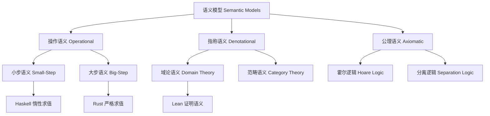

# 4. 语义模型 Semantic Models

## 4.1 主题简介 Overview #SemanticModels-4.1

- **中文**：本节介绍Haskell、Rust、Lean的语义模型，包括操作语义、范畴语义、类型语义等。
- **English**: This section introduces the semantic models of Haskell, Rust, and Lean, including operational semantics, categorical semantics, type semantics, etc.

## 4.2 操作语义 Operational Semantics #SemanticModels-4.2

- **中文**：描述程序执行的规则与状态转移。
- **English**: Describe the rules of program execution and state transitions.

## 4.3 范畴语义 Categorical Semantics #SemanticModels-4.3

- **中文**：以范畴论为基础的抽象语义建模。
- **English**: Abstract semantic modeling based on category theory.

## 4.4 类型语义 Type Semantics #SemanticModels-4.4

- **中文**：类型系统与语义的对应关系。
- **English**: The correspondence between type systems and semantics.

## 4.5 例子与对比 Examples & Comparison #SemanticModels-4.5

- **中文**：展示不同语义模型下的代码或推理。
- **English**: Show code or reasoning under different semantic models.

## 4.6 哲学批判与争议 Philosophical Critique & Controversies #SemanticModels-4.6

- **中文**：语义模型的抽象性在哲学上引发可解释性与可操作性的争论，知识论上模型的完备性与一致性是核心问题。
- **English**: The abstraction of semantic models raises debates about interpretability and operability in philosophy; completeness and consistency of models are key epistemic issues.

## 4.7 国际对比与标准 International Comparison & Standards #SemanticModels-4.7

- **中文**：操作语义、范畴语义等均有国际标准与Wiki定义，Haskell、Rust、Lean在语义建模上各有特色。
- **English**: Operational semantics, categorical semantics, etc., have international standards and Wiki definitions; Haskell, Rust, and Lean each have unique features in semantic modeling.

## 4.8 知识论证的完备性 Completeness of Epistemic Argumentation #SemanticModels-4.8

- **中文**：语义模型需覆盖操作规则、抽象结构、类型对应等知识点，确保理论与实践的闭环。
- **English**: Semantic models should cover operational rules, abstract structures, type correspondences, etc., ensuring a closed loop between theory and practice.

## 4.9 典型对比与案例 Typical Comparisons & Cases #SemanticModels-4.9

- **中文**：如Haskell的范畴语义、Rust的内存模型、Lean的证明语义，均有国际标准与学术论证。
- **English**: Haskell's categorical semantics, Rust's memory model, and Lean's proof semantics all have international standards and academic arguments.

## 4.10 语义模型框架 Semantic Model Framework

### 操作语义框架 Operational Semantics Framework

```haskell
-- 小步语义 Small-Step Semantics
data Step a = Step a | Done a

-- 求值关系 Evaluation Relation
eval :: Expression -> Step Expression
eval (Application (Lambda x body) arg) = 
  Step (substitute body x arg)
eval (Application func arg) = 
  case eval func of
    Step func' -> Step (Application func' arg)
    Done func' -> eval (Application func' arg)
eval expr = Done expr

-- 多步求值 Multi-Step Evaluation
evalStar :: Expression -> Expression
evalStar expr = 
  case eval expr of
    Step expr' -> evalStar expr'
    Done expr' -> expr'
```

### 范畴语义框架 Categorical Semantics Framework

```haskell
-- 范畴构造 Category Construction
class Category cat where
  id :: cat a a
  (.) :: cat b c -> cat a b -> cat a c

-- 函子构造 Functor Construction
class Functor f where
  fmap :: (a -> b) -> f a -> f b

-- 单子构造 Monad Construction
class Monad m where
  return :: a -> m a
  (>>=) :: m a -> (a -> m b) -> m b

-- 语义解释 Semantic Interpretation
interpret :: Expression -> SemanticValue
interpret (Lambda x body) = 
  SemanticFunction (\env -> interpret body (extend env x))
interpret (Application func arg) = 
  case interpret func of
    SemanticFunction f -> f (interpret arg)
```

## 4.11 形式化语义 Formal Semantics

### 指称语义 Denotational Semantics

```haskell
-- 语义域 Semantic Domain
data SemanticValue = 
  SemanticInt Int
  | SemanticBool Bool
  | SemanticFunction (SemanticValue -> SemanticValue)
  | SemanticError String

-- 语义函数 Semantic Function
semantic :: Expression -> Environment -> SemanticValue
semantic (Literal n) env = SemanticInt n
semantic (Variable x) env = lookup x env
semantic (Lambda x body) env = 
  SemanticFunction (\val -> semantic body (extend env x val))
semantic (Application func arg) env = 
  case semantic func env of
    SemanticFunction f -> f (semantic arg env)
    _ -> SemanticError "Not a function"
```

### 公理语义 Axiomatic Semantics

```haskell
-- 前置条件 Precondition
data Precondition = Precondition String

-- 后置条件 Postcondition
data Postcondition = Postcondition String

-- 霍尔三元组 Hoare Triple
data HoareTriple = HoareTriple Precondition Expression Postcondition

-- 语义规则 Semantic Rules
hoareSemantics :: HoareTriple -> Bool
hoareSemantics (HoareTriple pre expr post) = 
  -- 验证霍尔逻辑规则
  verifyHoareRules pre expr post
```

## 4.12 典型对比表格 Typical Comparison Table #SemanticModels-4.12

| 特性/语言 | Haskell | Rust | Lean |
|-----------|---------|------|------|
| 操作语义  | 惰性求值 | 严格求值 | 证明步进 |
| 范畴语义  | 强，Functor/Monad | 限支持 | 理论支持 |
| 类型语义  | 类型类 | trait | 依赖类型 |
| 指称语义  | 域论语义 | 内存模型 | 证明语义 |
| 公理语义  | QuickCheck | RustBelt | 霍尔逻辑 |

## 4.13 典型代码案例 Typical Code Example #SemanticModels-4.13

### Haskell 语义案例

```haskell
-- Haskell: Monad语义
instance Monad Maybe where
  return = Just
  (Just x) >>= f = f x
  Nothing  >>= _ = Nothing

-- 语义解释
maybeSemantics :: Maybe a -> SemanticValue
maybeSemantics (Just x) = SemanticValue x
maybeSemantics Nothing = SemanticError "No value"
```

### Rust 语义案例

```rust
// Rust: trait语义
trait Monad<T> {
    fn bind(self, f: impl FnOnce(T) -> Self) -> Self;
}

// 内存语义
fn ownership_semantics() {
    let s1 = String::from("hello");
    let s2 = s1; // 所有权转移
    // s1 不再可用
}
```

### Lean 语义案例

```lean
-- Lean: 证明步进语义
example (a b : Nat) : a + b = b + a := by simp [Nat.add_comm]

-- 语义解释
def proof_semantics (p : Prop) : Prop := p

-- 类型语义
def type_semantics (α : Type) : Type := α
```

## 4.14 应用案例 Application Cases

### 编译器语义 Compiler Semantics

```haskell
-- 编译时语义 Compile-Time Semantics
compileSemantics :: Expression -> ByteCode
compileSemantics (Literal n) = [Push n]
compileSemantics (Application func arg) = 
  compileSemantics arg ++ compileSemantics func ++ [Call]
compileSemantics (Lambda x body) = 
  [Closure (compileSemantics body) x]

-- 运行时语义 Runtime Semantics
runtimeSemantics :: ByteCode -> Stack -> Stack
runtimeSemantics (Push n : rest) stack = 
  runtimeSemantics rest (n : stack)
runtimeSemantics (Call : rest) (func : arg : stack) = 
  runtimeSemantics rest (apply func arg : stack)
```

### 验证语义 Verification Semantics

```haskell
-- 程序验证 Program Verification
verifyProgram :: Program -> Specification -> Bool
verifyProgram program spec = 
  all (\property -> verifyProperty program property) spec

-- 属性验证 Property Verification
verifyProperty :: Program -> Property -> Bool
verifyProperty program (Invariant pred) = 
  all (\state -> pred state) (reachableStates program)
```

## 4.15 结构图 Structure Diagram



## 4.16 交叉引用 Cross References #SemanticModels-4.16

- [类型系统 Type Systems](../TypeSystems/README.md)
- [控制流、执行流与数据流分析 Control Flow, Execution Flow & Data Flow Analysis](../ControlFlow_ExecutionFlow_DataFlow/README.md)
- [范畴论 Category Theory](../CategoryTheory/README.md)
- [类型理论 Type Theory](../TypeTheory/README.md)

## 4.17 参考文献 References #SemanticModels-4.17

- [Wikipedia: Operational semantics](https://en.wikipedia.org/wiki/Operational_semantics)
- [Wikipedia: Denotational semantics](https://en.wikipedia.org/wiki/Denotational_semantics)
- [Haskell 2010 Language Report](https://www.haskell.org/onlinereport/haskell2010/)
- [The Rust Programming Language](https://doc.rust-lang.org/book/)
- [Lean Reference Manual](https://leanprover.github.io/reference/)
- Plotkin, G. D. (1981). A structural approach to operational semantics. Aarhus University.
- Scott, D. (1970). Outline of a mathematical theory of computation. Oxford University.
- Hoare, C. A. R. (1969). An axiomatic basis for computer programming. Communications of the ACM, 12(10), 576-580.

## 4.18 进一步批判性分析 Further Critical Analysis #SemanticModels-4.18

- **中文**：语义模型的抽象性提升了理论统一性，但对工程可用性与自动化验证提出新要求。未来需关注语义模型的可组合性与工具链支持。
- **English**: The abstraction of semantic models enhances theoretical unification, but raises new requirements for engineering usability and automated verification. Future work should focus on composability of semantic models and toolchain support.

## 4.19 批判性小结 Critical Summary #SemanticModels-4.19

- **中文**：语义模型的知识论证需兼顾理论深度与工程可用性，持续完善可解释性与一致性。
- **English**: Epistemic argumentation of semantic models should balance theoretical depth and engineering usability, continuously improving interpretability and consistency.
