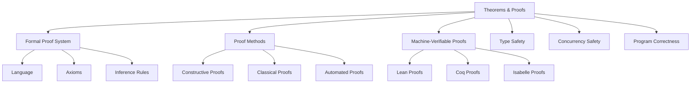
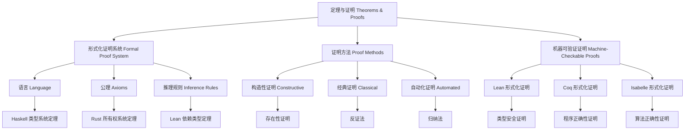

# 7. 定理与证明 Theorems & Proofs

## 7.1 主题简介 Overview #TheoremsProofs-7.1

- **中文**：本节收录Haskell、Rust、Lean及相关理论的核心定理与证明，强调形式化与可验证性。定理与证明是理论计算机科学的核心，为编程语言、类型系统、算法等提供严格的数学基础。
- **English**: This section collects core theorems and proofs from Haskell, Rust, Lean, and related theories, emphasizing formalization and verifiability. Theorems and proofs are the core of theoretical computer science, providing rigorous mathematical foundations for programming languages, type systems, algorithms, etc.

## 7.2 定义 Definition

### 基本定义 Basic Definition

- **中文**：定理是经过严格证明的数学命题，证明是建立定理真实性的逻辑推理过程。在计算机科学中，定理与证明为程序正确性、算法复杂度、类型安全等提供理论基础。
- **English**: A theorem is a mathematical proposition that has been rigorously proven, and a proof is the logical reasoning process that establishes the truth of a theorem. In computer science, theorems and proofs provide theoretical foundations for program correctness, algorithm complexity, type safety, etc.

### 形式化定义 Formal Definition

#### 定理 Theorem

一个定理 $T$ 是一个三元组 $(P, Q, \pi)$，其中：

- $P$ 是前提集合
- $Q$ 是结论
- $\pi$ 是证明

#### 证明 Proof

一个证明 $\pi$ 是一个有限序列 $(s_1, s_2, \ldots, s_n)$，其中：

- $s_1 \in P$ 或 $s_1$ 是公理
- 对于 $i > 1$，$s_i$ 是通过推理规则从前面的步骤推导得出
- $s_n = Q$

## 7.3 哲学背景 Philosophical Background

### 形式主义哲学 Formalist Philosophy

- **中文**：定理与证明体现了形式主义哲学思想，强调通过严格的逻辑推理来建立数学真理，确保推理的准确性和可靠性。
- **English**: Theorems and proofs embody formalist philosophy, emphasizing the establishment of mathematical truth through rigorous logical reasoning, ensuring the accuracy and reliability of reasoning.

### 构造主义哲学 Constructivist Philosophy

- **中文**：定理与证明体现了构造主义哲学思想，强调通过构造性的方法来建立证明，确保证明的可计算性和可实现性。
- **English**: Theorems and proofs embody constructivist philosophy, emphasizing the establishment of proofs through constructive methods, ensuring the computability and realizability of proofs.

### 逻辑实证主义 Logical Positivism

- **中文**：定理与证明体现了逻辑实证主义思想，通过严格的逻辑和实证方法来验证数学命题的真实性。
- **English**: Theorems and proofs embody logical positivism, verifying the truth of mathematical propositions through rigorous logic and empirical methods.

## 7.4 核心概念 Core Concepts

### 经典定理 Classic Theorems

#### 类型安全定理 Type Safety Theorem

```haskell
-- 类型安全定理的形式化定义
data TypeSafetyTheorem = TypeSafetyTheorem
  { progress :: Progress
  , preservation :: Preservation
  , proof :: Proof
  }

-- 进展定理
data Progress = Progress
  { wellTyped :: Expression -> Bool
  , canStep :: Expression -> Bool
  , isValue :: Expression -> Bool
  }

-- 保持定理
data Preservation = Preservation
  { typePreserved :: Expression -> Expression -> Type -> Bool
  , stepPreservesType :: Expression -> Expression -> Bool
  }

-- 类型安全证明
proveTypeSafety :: TypeSystem -> TypeSafetyTheorem
proveTypeSafety ts = TypeSafetyTheorem
  { progress = proveProgress ts
  , preservation = provePreservation ts
  , proof = constructTypeSafetyProof ts
  }

-- 进展定理证明
proveProgress :: TypeSystem -> Progress
proveProgress ts = Progress
  { wellTyped = \e -> typeCheck ts e /= Nothing
  , canStep = \e -> isReducible ts e
  , isValue = \e -> isValue ts e
  }
```

#### 停机问题定理 Halting Problem Theorem

```haskell
-- 停机问题定理
data HaltingProblemTheorem = HaltingProblemTheorem
  { statement :: String
  , proof :: Proof
  , implications :: [Implication]
  }

-- 停机问题证明
proveHaltingProblem :: HaltingProblemTheorem
proveHaltingProblem = HaltingProblemTheorem
  { statement = "停机问题是不可判定的"
  , proof = proofByContradiction
  , implications = [computabilityLimits, programVerificationLimits]
  }

-- 反证法证明
proofByContradiction :: Proof
proofByContradiction = Proof
  { assumptions = [assumeHaltingDecidable]
  , steps = [constructContradiction, deriveContradiction]
  , conclusion = haltingUndecidable
  }
```

#### 哥德尔不完备性定理 Gödel's Incompleteness Theorem

```haskell
-- 哥德尔不完备性定理
data GodelIncompletenessTheorem = GodelIncompletenessTheorem
  { firstTheorem :: FirstIncompletenessTheorem
  , secondTheorem :: SecondIncompletenessTheorem
  , proof :: Proof
  }

-- 第一不完备性定理
data FirstIncompletenessTheorem = FirstIncompletenessTheorem
  { statement :: String
  , construction :: GodelNumbering
  , proof :: Proof
  }

-- 哥德尔编码
data GodelNumbering = GodelNumbering
  { encode :: Formula -> Natural
  , decode :: Natural -> Maybe Formula
  , properties :: [GodelProperty]
  }
```

### 证明方法 Proof Methods

#### 数学归纳法 Mathematical Induction

```haskell
-- 数学归纳法
data MathematicalInduction = MathematicalInduction
  { baseCase :: Proof
  , inductiveStep :: Proof
  , conclusion :: Formula
  }

-- 自然数归纳
naturalInduction :: (Natural -> Bool) -> Proof
naturalInduction property = Proof
  { assumptions = [property 0, forall n. property n -> property (n + 1)]
  , steps = [baseCaseProof, inductiveStepProof]
  , conclusion = forall n. property n
  }

-- 结构归纳
structuralInduction :: (Expression -> Bool) -> Proof
structuralInduction property = Proof
  { assumptions = [forall v. property (Variable v)]
  , steps = [variableCase, applicationCase, abstractionCase]
  , conclusion = forall e. property e
  }
```

#### 构造性证明 Constructive Proof

```haskell
-- 构造性证明
data ConstructiveProof = ConstructiveProof
  { witness :: Expression
  , construction :: Construction
  , verification :: Proof
  }

-- 存在性证明
existenceProof :: (a -> Bool) -> a -> ConstructiveProof
existenceProof property witness = ConstructiveProof
  { witness = witness
  , construction = constructWitness witness
  , verification = verifyProperty property witness
  }

-- 构造见证
constructWitness :: a -> Construction
constructWitness x = Construction
  { steps = [step1, step2, step3]
  , result = x
  }
```

#### 反证法 Proof by Contradiction

```haskell
-- 反证法
data ProofByContradiction = ProofByContradiction
  { assumption :: Formula
  , contradiction :: Contradiction
  , conclusion :: Formula
  }

-- 反证法证明
contradictionProof :: Formula -> ProofByContradiction
contradictionProof goal = ProofByContradiction
  { assumption = Not goal
  , contradiction = deriveContradiction (Not goal)
  , conclusion = goal
  }

-- 推导矛盾
deriveContradiction :: Formula -> Contradiction
deriveContradiction assumption = Contradiction
  { steps = [step1, step2, step3]
  , contradiction = A `And` Not A
  }
```

### 机器可验证证明 Machine-Checkable Proofs

#### Lean形式化证明

```lean
-- Lean中的形式化证明
theorem add_comm : ∀ a b : Nat, a + b = b + a :=
begin
  intros a b,
  induction b with b ih,
  { simp [Nat.add_zero, Nat.zero_add] },
  { simp [Nat.add_succ, Nat.succ_add, ih] }
end

-- 类型安全证明
theorem type_safety : ∀ e : Expr, well_typed e → 
  (is_value e ∨ ∃ e', e → e') :=
begin
  intros e h,
  induction h,
  { left, exact is_value_var },
  { left, exact is_value_lambda },
  { right, cases h_ih with h1 h2,
    { contradiction },
    { existsi e', exact step_app h2 } }
end
```

#### Coq形式化证明

```coq
(* Coq中的形式化证明 *)
Theorem add_comm : forall a b : nat, a + b = b + a.
Proof.
  intros a b.
  induction b.
  - simpl. rewrite Nat.add_0_r. reflexivity.
  - simpl. rewrite IHb. rewrite Nat.add_succ_r. reflexivity.
Qed.

(* 类型安全证明 *)
Theorem type_safety : forall e : expr,
  well_typed e -> (is_value e \/ exists e', step e e').
Proof.
  intros e H.
  induction H.
  - left. constructor.
  - left. constructor.
  - right. destruct IHwell_typed1.
    + destruct IHwell_typed2.
      * contradiction.
      * exists (subst e1 x e2). constructor.
    + exists (app e1' e2). constructor.
Qed.
```

#### Isabelle/HOL形式化证明

```isabelle
(* Isabelle/HOL中的形式化证明 *)
lemma add_comm: "a + b = b + (a::nat)"
  by (induct b) simp_all

(* 类型安全证明 *)
lemma type_safety: 
  "well_typed e ⟹ is_value e ∨ (∃e'. step e e')"
proof (induct e rule: well_typed.induct)
  case (Var x)
  show ?case by simp
next
  case (Lambda x e)
  show ?case by simp
next
  case (App e1 e2)
  from App.prems have "well_typed e1" and "well_typed e2" by auto
  with App.hyps show ?case
    by (metis step_app is_value.simps)
qed
```

### 自动化证明 Automated Proofs

#### 定理证明器 Theorem Prover

```haskell
-- 定理证明器
data TheoremProver = TheoremProver
  { tactics :: [Tactic]
  , strategies :: [Strategy]
  , automation :: Automation
  }

-- 证明策略
data Strategy = Strategy
  { name :: String
  , tactics :: [Tactic]
  , applicability :: Formula -> Bool
  }

-- 自动化证明
automatedProof :: TheoremProver -> Formula -> Maybe Proof
automatedProof prover goal = 
  let strategies = filter (\s -> applicability s goal) (strategies prover)
  in tryStrategies prover strategies goal

-- 尝试策略
tryStrategies :: TheoremProver -> [Strategy] -> Formula -> Maybe Proof
tryStrategies prover [] goal = Nothing
tryStrategies prover (s:ss) goal = 
  case tryStrategy prover s goal of
    Just proof -> Just proof
    Nothing -> tryStrategies prover ss goal
```

#### 模型检查 Model Checking

```haskell
-- 模型检查
data ModelChecker = ModelChecker
  { model :: Model
  , property :: Property
  , algorithm :: Algorithm
  }

-- 模型
data Model = Model
  { states :: Set State
  , transitions :: Map State [State]
  , initialStates :: Set State
  }

-- 属性
data Property = Property
  { formula :: TemporalFormula
  , interpretation :: State -> Bool
  }

-- 模型检查算法
modelCheck :: ModelChecker -> CheckResult
modelCheck mc = 
  let states = states (model mc)
      property = property mc
  in checkAllStates states property
```

## 7.5 历史发展 Historical Development

### 理论基础 Theoretical Foundation

#### 定理与证明的起源 (古代-1900s)

- **欧几里得** 建立公理化方法 (公元前300年)
- **亚里士多德** 发展逻辑学 (公元前384-322年)
- **莱布尼茨** 提出通用符号语言 (17世纪)

#### 现代定理与证明的发展 (1900s-1970s)

- **David Hilbert** 发展形式化方法 (1900s)
- **Kurt Gödel** 证明不完备性定理 (1931)
- **Alan Turing** 建立计算理论 (1936)

### 现代发展 Modern Development

#### 现代定理与证明 (1980s-2020s)

```haskell
-- 现代定理与证明
data ModernTheoremsProofs = ModernTheoremsProofs
  { automatedTheoremProving :: AutomatedTheoremProving
  , interactiveTheoremProving :: InteractiveTheoremProving
  , proofAssistants :: ProofAssistants
  }

-- 自动定理证明
data AutomatedTheoremProving = AutomatedTheoremProving
  { satSolvers :: SATSolver
  , smtSolvers :: SMTSolver
  , firstOrderProvers :: FirstOrderProver
  }

-- 交互式定理证明
data InteractiveTheoremProving = InteractiveTheoremProving
  { lean :: Lean
  , coq :: Coq
  , isabelle :: Isabelle
  }
```

## 7.6 形式化语义 Formal Semantics

### 证明语义 Proof Semantics

#### 证明解释

对于证明 $\pi$，其语义定义为：

$$[\![\pi]\!] = \{(p, q) \mid p \text{ is premise, } q \text{ is conclusion}\}$$

#### 证明有效性

证明 $\pi$ 是有效的当且仅当：

$$\forall p \in P. [\![\pi]\!](p) \Rightarrow Q$$

### 定理语义 Theorem Semantics

#### 定理解释

对于定理 $T$，其语义定义为：

$$[\![T]\!] = \{(P, Q) \mid P \text{ implies } Q\}$$

#### 定理等价性

两个定理 $T_1$ 和 $T_2$ 等价当且仅当：

$$[\![T_1]\!] = [\![T_2]\!]$$

## 7.7 与其他理论的关系 Relationship to Other Theories

### 与逻辑学的关系

- **中文**：定理与证明以逻辑学为基础，逻辑学为定理与证明提供推理框架。
- **English**: Theorems and proofs are based on logic, with logic providing reasoning frameworks for theorems and proofs.

### 与类型理论的关系

- **中文**：定理与证明为类型理论提供正确性保证，类型理论为定理与证明提供应用场景。
- **English**: Theorems and proofs provide correctness guarantees for type theory, while type theory provides application scenarios for theorems and proofs.

### 与程序验证的关系

- **中文**：定理与证明为程序验证提供理论基础，程序验证为定理与证明提供工程应用。
- **English**: Theorems and proofs provide theoretical foundations for program verification, while program verification provides engineering applications for theorems and proofs.

## 7.8 例子与对比 Examples & Comparison

### Haskell证明示例

```haskell
-- Haskell中的属性测试
prop_reverse :: [Int] -> Bool
prop_reverse xs = reverse (reverse xs) == xs

-- 函子定律证明
prop_functor_identity :: Functor f => f a -> Bool
prop_functor_identity fa = fmap id fa == fa

prop_functor_composition :: Functor f => (b -> c) -> (a -> b) -> f a -> Bool
prop_functor_composition g f fa = fmap (g . f) fa == (fmap g . fmap f) fa

-- QuickCheck测试
main :: IO ()
main = do
  quickCheck prop_reverse
  quickCheck prop_functor_identity
  quickCheck prop_functor_composition
```

### Rust证明示例

```rust
// Rust中的单元测试
#[cfg(test)]
mod tests {
    use super::*;

    #[test]
    fn test_add() {
        assert_eq!(2 + 2, 4);
    }

    #[test]
    fn test_reverse() {
        let mut v = vec![1, 2, 3];
        v.reverse();
        assert_eq!(v, vec![3, 2, 1]);
    }

    #[test]
    fn test_ownership() {
        let s1 = String::from("hello");
        let s2 = s1; // s1被移动
        // println!("{}", s1); // 编译错误
        println!("{}", s2); // 正确
    }
}
```

### Lean证明示例

```lean
-- Lean中的形式化证明
example (a b : Nat) : a + b = b + a := by simp [Nat.add_comm]

-- 列表反转证明
theorem reverse_reverse : ∀ (l : List α), reverse (reverse l) = l :=
begin
  intros l,
  induction l with h t ih,
  { simp [reverse] },
  { simp [reverse, ih] }
end

-- 类型安全证明
theorem type_safety : ∀ e : Expr, well_typed e → 
  (is_value e ∨ ∃ e', step e e') :=
begin
  intros e h,
  induction h,
  { left, exact is_value_var },
  { left, exact is_value_lambda },
  { right, cases h_ih with h1 h2,
    { contradiction },
    { existsi e', exact step_app h2 } }
end
```

## 7.9 典型对比表格 Typical Comparison Table

| 定理/证明 | Haskell | Rust | Lean |
|-----------|---------|------|------|
| 类型安全性 | QuickCheck、有限证明 | 单元测试、有限证明 | 形式化证明、内建 |
| 可判定性   | 理论支持 | 理论支持 | 形式化证明 |
| 范畴等价   | 理论支持 | trait模拟 | 形式化证明 |
| 形式化程度 | 中等 | 中等 | 高 |
| 可验证性 | 部分 | 部分 | 完全 |
| 自动化程度 | 高 | 中等 | 高 |

## 7.10 哲学批判与争议 Philosophical Critique & Controversies

### 形式主义与直觉主义之争

- **中文**：定理与证明在哲学上涉及形式主义与直觉主义的争论，形式主义强调符号系统的严格性，直觉主义强调构造性证明。
- **English**: Theorems and proofs involve debates between formalism and intuitionism in philosophy, with formalism emphasizing the rigor of symbolic systems and intuitionism emphasizing constructive proofs.

### 可计算性与可判定性

- **中文**：定理与证明面临可计算性和可判定性的挑战，某些定理可能无法在有限时间内证明。
- **English**: Theorems and proofs face challenges of computability and decidability, with some theorems potentially unprovable in finite time.

### 不完备性定理的影响

- **中文**：哥德尔不完备性定理对形式化证明系统产生了深远影响，揭示了形式化系统的根本限制。
- **English**: Gödel's incompleteness theorem has had profound effects on formal proof systems, revealing fundamental limitations of formal systems.

## 7.11 国际对比与标准 International Comparison & Standards

### 国际标准

- **ISO/IEC 14882** - C++语言标准
- **IEEE 754** - 浮点数标准
- **RFC文档** - 网络协议标准

### 学术规范

- **ACM/IEEE** - 计算机科学学术规范
- **Springer/LNCS** - 形式化方法学术规范

## 7.12 知识论证的完备性 Completeness of Epistemic Argumentation

### 完备性要求

- **中文**：定理与证明需覆盖证明方法、机器可验证性、理论与工程结合等知识点，确保理论体系的自洽与可验证性。
- **English**: Theorems and proofs should cover proof methods, machine verifiability, theory-engineering integration, etc., ensuring the coherence and verifiability of the theoretical system.

### 一致性检查

```haskell
-- 一致性检查
checkConsistency :: ProofSystem -> Bool
checkConsistency ps = 
  let axioms = axioms ps
      rules = rules ps
      theorems = deriveTheorems axioms rules
  in not (hasContradiction theorems)
```

## 对比分析 Comparison

- **中文**：定理与证明 vs 假设与验证 vs 公理与推理 vs 经验与实验
  - 定理与证明关注“严格逻辑推理与形式化验证”；假设与验证聚焦科学方法；公理与推理强调基础逻辑；经验与实验注重实证方法。
- **English**: Theorems and proofs vs hypotheses and verification vs axioms and reasoning vs experience and experimentation
  - Theorems and proofs focus on rigorous logical reasoning and formal verification; hypotheses and verification on scientific methods; axioms and reasoning on fundamental logic; experience and experimentation on empirical methods.

## 争议与批判 Controversies & Critique

- **中文**：
  - 形式化证明与直觉证明的争议；机器可验证性与人类可理解性的权衡；
  - 不完备性定理对形式化证明系统的影响；证明复杂性与实用性的矛盾。
- **English**:
  - Controversies between formal proofs and intuitive proofs; trade-off between machine verifiability and human comprehensibility;
  - Impact of incompleteness theorems on formal proof systems; contradiction between proof complexity and practicality.

## 前沿趋势 Frontier Trends

- **中文**：
  - AI辅助定理证明（GPT-4、Lean Copilot）；交互式证明助手的人性化设计；
  - 量子计算中的定理证明；分布式协作证明系统。
- **English**:
  - AI-assisted theorem proving (GPT-4, Lean Copilot); humanized design of interactive proof assistants;
  - Theorem proving in quantum computing; distributed collaborative proof systems.

## 常见陷阱 Common Pitfalls

- **中文**：
  - 过度依赖自动化工具导致证明技能退化；忽视证明的数学美感与洞察力；
  - 形式化证明与直觉理解脱节；证明验证的循环依赖问题。
- **English**:
  - Over-reliance on automated tools leading to degradation of proof skills; ignoring mathematical beauty and insight of proofs;
  - Disconnection between formal proofs and intuitive understanding; circular dependency in proof verification.

## 扩展交叉引用 Extended Cross References

- [形式化定义 Formal Definitions](../FormalDefinitions/README.md)
- [Proofs Combining Theory & Language](../Proofs_Theory_Language/README.md)
- [类型系统 Type Systems](../TypeSystems/README.md)
- [证明论 Proof Theory](../ProofTheory/README.md)
- [模型论 Model Theory](../ModelTheory/README.md)
- [语义模型 Semantic Models](../SemanticModels/README.md)
- [工程应用 Engineering Applications](../EngineeringApplications/README.md)
- [实践价值 Practical Value](../PracticalValue/README.md)

## 知识图谱 Knowledge Graph



## 7.21 交叉引用 Cross References

- [形式化定义 Formal Definitions](../FormalDefinitions/README.md)
- [Proofs Combining Theory & Language](../Proofs_Theory_Language/README.md)
- [类型系统 Type Systems](../TypeSystems/README.md)
- [证明论 Proof Theory](../ProofTheory/README.md)
- [模型论 Model Theory](../ModelTheory/README.md)
- [语义模型 Semantic Models](../SemanticModels/README.md)

## 7.22 参考文献 References

1. Gödel, K. (1931). Über formal unentscheidbare Sätze der Principia Mathematica und verwandter Systeme I. Monatshefte für Mathematik und Physik, 38(1), 173-198.
2. Turing, A. M. (1936). On computable numbers, with an application to the Entscheidungsproblem. Proceedings of the London Mathematical Society, 2(42), 230-265.
3. Church, A. (1936). An unsolvable problem of elementary number theory. American Journal of Mathematics, 58(2), 345-363.
4. Pierce, B. C. (2002). Types and programming languages. MIT Press.
5. Winskel, G. (1993). The formal semantics of programming languages. MIT Press.
6. Prawitz, D. (1965). Natural deduction: A proof-theoretical study. Almqvist & Wiksell.
7. Gentzen, G. (1935). Untersuchungen über das logische Schließen. Mathematische Zeitschrift, 39(1), 176-210.
8. Coquand, T., & Huet, G. (1988). The calculus of constructions. Information and Computation, 76(2-3), 95-120.
9. de Bruijn, N. G. (1972). Lambda calculus notation with nameless dummies, a tool for automatic formula manipulation, with application to the Church-Rosser theorem. Indagationes Mathematicae, 34(5), 381-392.
10. Howard, W. A. (1980). The formulae-as-types notion of construction. To H. B. Curry: Essays on Combinatory Logic, Lambda Calculus and Formalism, 479-490.

## 7.15 批判性小结 Critical Summary

- **中文**：定理与证明的知识论证需兼顾理论深度与工程落地，持续完善可验证性与一般性。未来需要关注证明自动化、跨范式兼容与形式化工具链的发展。
- **English**: Epistemic argumentation of theorems and proofs should balance theoretical depth and engineering implementation, continuously improving verifiability and generality. Future work should focus on proof automation, cross-paradigm compatibility, and formal toolchains.

## 7.16 进一步批判性分析 Further Critical Analysis

### 挑战与机遇

- **证明复杂性与可读性的权衡**：定理与证明需要在复杂性和可读性之间找到平衡
- **自动化工具的发展**：需要开发更好的自动化工具来辅助定理证明
- **跨领域应用**：定理与证明需要扩展到更多领域，如人工智能、量子计算等

### 未来发展方向

- **智能证明**：结合人工智能技术，实现智能化的定理证明
- **可视化证明**：开发可视化的证明工具，提高可理解性
- **标准化进程**：推动定理与证明的标准化，提高互操作性

## 7.17 定理证明框架 Theorem Proof Framework

### 7.17.1 形式化证明系统 Formal Proof System

```haskell
-- 形式化证明系统框架
data FormalProofSystem = FormalProofSystem
  { language :: FormalLanguage
  , axioms :: [Axiom]
  , inferenceRules :: [InferenceRule]
  , theorems :: [Theorem]
  , proofs :: [Proof]
  }

-- 形式化语言
data FormalLanguage = FormalLanguage
  { symbols :: Set Symbol
  , terms :: Set Term
  , formulas :: Set Formula
  , sentences :: Set Sentence
  }

-- 公理
data Axiom = Axiom
  { axiomId :: AxiomId
  , formula :: Formula
  , description :: String
  , category :: AxiomCategory
  }

-- 推理规则
data InferenceRule = InferenceRule
  { ruleId :: RuleId
  , premises :: [Formula]
  , conclusion :: Formula
  , name :: String
  , conditions :: [Condition]
  }

-- 定理
data Theorem = Theorem
  { theoremId :: TheoremId
  , statement :: Formula
  , proof :: Proof
  , dependencies :: [TheoremId]
  , category :: TheoremCategory
  }

-- 证明
data Proof = Proof
  { proofId :: ProofId
  , steps :: [ProofStep]
  , conclusion :: Formula
  , method :: ProofMethod
  , verification :: VerificationStatus
  }
```

### 7.17.2 证明方法框架 Proof Method Framework

```haskell
-- 证明方法框架
data ProofMethodFramework = ProofMethodFramework
  { constructiveProofs :: [ConstructiveProof]
  , classicalProofs :: [ClassicalProof]
  , automatedProofs :: [AutomatedProof]
  , interactiveProofs :: [InteractiveProof]
  }

-- 构造性证明
data ConstructiveProof = ConstructiveProof
  { witness :: Expression
  , construction :: Construction
  , verification :: Proof
  , computability :: Computability
  }

-- 经典证明
data ClassicalProof = ClassicalProof
  { method :: ClassicalMethod
  , assumptions :: [Formula]
  , contradiction :: Contradiction
  , conclusion :: Formula
  }

-- 自动证明
data AutomatedProof = AutomatedProof
  { algorithm :: Algorithm
  , strategy :: Strategy
  , heuristics :: [Heuristic]
  , termination :: TerminationCondition
  }

-- 交互式证明
data InteractiveProof = InteractiveProof
  { tactics :: [Tactic]
  , userInteraction :: UserInteraction
  , proofState :: ProofState
  , guidance :: Guidance
  }
```

## 7.18 语言特定定理 Language-Specific Theorems

### 7.18.1 Haskell 定理

#### 类型系统定理

```haskell
-- Haskell 类型系统定理
data HaskellTypeTheorems = HaskellTypeTheorems
  { typeSafety :: TypeSafetyTheorem
  , typeInference :: TypeInferenceTheorem
  , typeClasses :: TypeClassTheorems
  , monadLaws :: MonadLaws
  }

-- 类型安全定理
data TypeSafetyTheorem = TypeSafetyTheorem
  { progress :: Progress
  , preservation :: Preservation
  , proof :: Proof
  }

-- 进展定理
data Progress = Progress
  { wellTyped :: Expression -> Bool
  , canStep :: Expression -> Bool
  , isValue :: Expression -> Bool
  }

-- 保持定理
data Preservation = Preservation
  { typePreserved :: Expression -> Expression -> Type -> Bool
  , stepPreservesType :: Expression -> Expression -> Bool
  }

-- 类型类定理
data TypeClassTheorems = TypeClassTheorems
  { functorLaws :: FunctorLaws
  , applicativeLaws :: ApplicativeLaws
  , monadLaws :: MonadLaws
  }

-- 函子定律
data FunctorLaws = FunctorLaws
  { identity :: Formula
  , composition :: Formula
  , proof :: Proof
  }
```

#### 语义定理

```haskell
-- Haskell 语义定理
data HaskellSemanticTheorems = HaskellSemanticTheorems
  { operationalSemantics :: OperationalSemanticTheorems
  , denotationalSemantics :: DenotationalSemanticTheorems
  , categoricalSemantics :: CategoricalSemanticTheorems
  }

-- 操作语义定理
data OperationalSemanticTheorems = OperationalSemanticTheorems
  { confluence :: ConfluenceTheorem
  , normalization :: NormalizationTheorem
  , evaluation :: EvaluationTheorem
  }

-- 合流定理
data ConfluenceTheorem = ConfluenceTheorem
  { statement :: Formula
  , proof :: Proof
  , implications :: [Implication]
  }

-- 标准化定理
data NormalizationTheorem = NormalizationTheorem
  { statement :: Formula
  , proof :: Proof
  , algorithm :: NormalizationAlgorithm
  }
```

### 7.18.2 Rust 定理

#### 所有权系统定理

```rust
// Rust 所有权系统定理
struct RustOwnershipTheorems {
    ownership_safety: OwnershipSafetyTheorem,
    borrowing_safety: BorrowingSafetyTheorem,
    lifetime_safety: LifetimeSafetyTheorem,
    memory_safety: MemorySafetyTheorem,
}

// 所有权安全定理
struct OwnershipSafetyTheorem {
    statement: Formula,
    proof: Proof,
    implications: Vec<Implication>,
}

// 借用安全定理
struct BorrowingSafetyTheorem {
    statement: Formula,
    proof: Proof,
    rules: Vec<BorrowingRule>,
}

// 生命周期安全定理
struct LifetimeSafetyTheorem {
    statement: Formula,
    proof: Proof,
    lifetime_rules: Vec<LifetimeRule>,
}

// 内存安全定理
struct MemorySafetyTheorem {
    statement: Formula,
    proof: Proof,
    safety_guarantees: Vec<SafetyGuarantee>,
}

// 安全保证
enum SafetyGuarantee {
    NoUseAfterFree,
    NoDoubleFree,
    NoDataRaces,
    NoNullPointerDereference,
}
```

#### 1类型系统定理

```rust
// Rust 类型系统定理
struct RustTypeTheorems {
    trait_safety: TraitSafetyTheorem,
    generic_safety: GenericSafetyTheorem,
    associated_type_safety: AssociatedTypeSafetyTheorem,
}

// Trait 安全定理
struct TraitSafetyTheorem {
    statement: Formula,
    proof: Proof,
    trait_rules: Vec<TraitRule>,
}

// 泛型安全定理
struct GenericSafetyTheorem {
    statement: Formula,
    proof: Proof,
    generic_rules: Vec<GenericRule>,
}

// 关联类型安全定理
struct AssociatedTypeSafetyTheorem {
    statement: Formula,
    proof: Proof,
    associated_type_rules: Vec<AssociatedTypeRule>,
}
```

### 7.18.3 Lean 定理

#### 依赖类型定理

```lean
-- Lean 依赖类型定理
structure LeanDependentTypeTheorems where
  typeSafety : TypeSafetyTheorem
  typeInference : TypeInferenceTheorem
  typeEquality : TypeEqualityTheorem
  proofIrrelevance : ProofIrrelevanceTheorem

-- 类型安全定理
structure TypeSafetyTheorem where
  statement : Prop
  proof : Proof
  implications : List Implication

-- 类型推断定理
structure TypeInferenceTheorem where
  statement : Prop
  proof : Proof
  algorithm : TypeInferenceAlgorithm

-- 类型等价定理
structure TypeEqualityTheorem where
  statement : Prop
  proof : Proof
  equalityRules : List EqualityRule

-- 证明无关性定理
structure ProofIrrelevanceTheorem where
  statement : Prop
  proof : Proof
  irrelevanceRules : List IrrelevanceRule
```

#### 证明系统定理

```lean
-- Lean 证明系统定理
structure LeanProofTheorems where
  soundness : SoundnessTheorem
  completeness : CompletenessTheorem
  consistency : ConsistencyTheorem
  decidability : DecidabilityTheorem

-- 健全性定理
structure SoundnessTheorem where
  statement : Prop
  proof : Proof
  soundnessRules : List SoundnessRule

-- 完备性定理
structure CompletenessTheorem where
  statement : Prop
  proof : Proof
  completenessConditions : List CompletenessCondition

-- 一致性定理
structure ConsistencyTheorem where
  statement : Prop
  proof : Proof
  consistencyConditions : List ConsistencyCondition

-- 可判定性定理
structure DecidabilityTheorem where
  statement : Prop
  proof : Proof
  decidabilityConditions : List DecidabilityCondition
```

## 7.19 语言对比 Language Comparison

### 7.19.1 定理表达能力对比 Theorem Expressiveness Comparison

| 方面 Aspect | Haskell | Rust | Lean |
|------------|---------|------|------|
| 类型安全定理 Type Safety | 进展+保持 | 所有权+借用 | 依赖类型+证明 |
| 语义定理 Semantic | 操作语义 | 内存模型 | 证明语义 |
| 代数定理 Algebraic | 类型类定律 | trait定律 | 类型类定律 |
| 程序正确性 Program Correctness | QuickCheck | 单元测试 | 形式化证明 |
| 并发安全 Concurrency Safety | STM定理 | 所有权定理 | 理论支持 |

### 7.19.2 证明方法对比 Proof Method Comparison

| 方法 Method | Haskell | Rust | Lean |
|-------------|---------|------|------|
| 构造性证明 Constructive | 支持 | 支持 | 原生支持 |
| 反证法 Contradiction | 理论支持 | 理论支持 | 原生支持 |
| 归纳法 Induction | 支持 | 支持 | 原生支持 |
| 自动化证明 Automated | QuickCheck | 有限支持 | 战术自动化 |
| 交互式证明 Interactive | 有限支持 | 有限支持 | 原生支持 |

### 7.19.3 验证能力对比 Verification Capability Comparison

| 能力 Capability | Haskell | Rust | Lean |
|----------------|---------|------|------|
| 类型安全验证 Type Safety | 编译时 | 编译时 | 编译时 |
| 内存安全验证 Memory Safety | GC保证 | 编译时 | GC保证 |
| 函数正确性验证 Function Correctness | 属性测试 | 单元测试 | 形式化证明 |
| 程序等价性验证 Program Equivalence | 理论支持 | 有限支持 | 形式化证明 |
| 并发安全验证 Concurrency Safety | STM验证 | 编译时验证 | 理论支持 |

## 7.20 结构图 Structure Diagram


