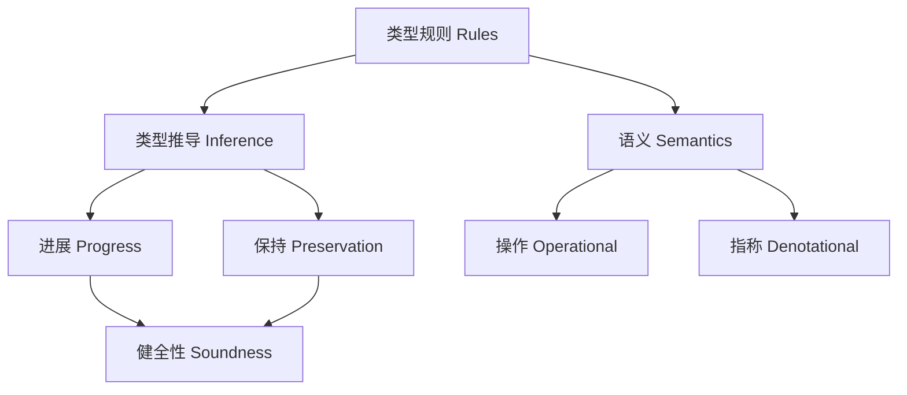

# 1.1 类型系统的定义 Definition of Type Systems #TypeSystems-1.1

## 定义 Definition

### 基本定义 Basic Definition

- **中文**：类型系统是对程序项进行分类与约束的形式化机制，通过类型赋予项以可判定的语义边界，以提升正确性、可验证性与可维护性。它为编程语言提供静态分析和安全保障，是现代编程语言的核心组成部分。
- **English**: A type system is a formal mechanism that classifies and constrains program terms with types, imposing decidable semantic boundaries to improve correctness, verifiability, and maintainability. It provides static analysis and safety guarantees for programming languages, serving as a core component of modern programming languages.

### 形式化定义 Formal Definition

#### 类型判断 Type Judgment

一个类型判断是一个三元组 $(\Gamma, e, T)$，记作：

$$\Gamma \vdash e : T$$

其中 $\Gamma$ 是类型环境，$e$ 是表达式，$T$ 是类型。

#### 类型环境 Type Environment

类型环境 $\Gamma$ 是一个从变量到类型的映射：

$$\Gamma : \text{Var} \rightarrow \text{Type}$$

#### 类型规则 Type Rules

类型系统由一组类型规则定义，包括：

1. **变量规则**：$\frac{x:T \in \Gamma}{\Gamma \vdash x : T}$
2. **抽象规则**：$\frac{\Gamma, x:T_1 \vdash e : T_2}{\Gamma \vdash \lambda x:T_1.e : T_1 \rightarrow T_2}$
3. **应用规则**：$\frac{\Gamma \vdash e_1 : T_1 \rightarrow T_2 \quad \Gamma \vdash e_2 : T_1}{\Gamma \vdash e_1 \, e_2 : T_2}$

## 哲学背景 Philosophical Background

### 分类哲学 Philosophy of Classification

- **中文**：类型系统体现了分类哲学思想，通过类型来对程序实体进行分类和抽象，反映了人类认知中的分类思维。
- **English**: Type systems embody the philosophy of classification, categorizing and abstracting program entities through types, reflecting the classificatory thinking in human cognition.

### 约束哲学 Philosophy of Constraint

- **中文**：类型系统体现了约束哲学思想，通过类型约束来限制程序的行为，确保程序的正确性和安全性。
- **English**: Type systems embody the philosophy of constraint, limiting program behavior through type constraints to ensure program correctness and safety.

### 抽象哲学 Philosophy of Abstraction

- **中文**：类型系统体现了抽象哲学思想，通过类型抽象来隐藏实现细节，提供高层次的程序接口。
- **English**: Type systems embody the philosophy of abstraction, hiding implementation details through type abstraction and providing high-level program interfaces.

## 核心概念 Core Concepts

### 基础类型系统 Basic Type System

#### 简单类型系统 Simple Type System

```haskell
-- 简单类型
data SimpleType = 
  Bool | Int | Float | String
  | Function SimpleType SimpleType
  | Product SimpleType SimpleType
  | Sum SimpleType SimpleType

-- 类型环境
type TypeEnvironment = Map String SimpleType

-- 类型检查
typeCheck :: TypeEnvironment -> Expression -> Maybe SimpleType
typeCheck env (Variable x) = lookup x env
typeCheck env (Lambda x t body) = 
  do
    bodyType <- typeCheck (insert x t env) body
    return (Function t bodyType)
typeCheck env (Application func arg) = 
  do
    funcType <- typeCheck env func
    argType <- typeCheck env arg
    case funcType of
      Function input output -> 
        if input == argType then Just output else Nothing
      _ -> Nothing
```

#### 多态类型系统 Polymorphic Type System

```haskell
-- 多态类型
data PolymorphicType = 
  TypeVar String
  | Forall String PolymorphicType
  | Function PolymorphicType PolymorphicType
  | Product PolymorphicType PolymorphicType

-- Hindley-Milner类型推导
hindleyMilner :: Expression -> Maybe PolymorphicType
hindleyMilner expr = 
  let constraints = generateConstraints expr
      substitution = unify constraints
  in applySubstitution substitution (inferType expr)

-- 类型约束生成
generateConstraints :: Expression -> [Constraint]
generateConstraints (Variable x) = []
generateConstraints (Lambda x body) = 
  let bodyConstraints = generateConstraints body
      xType = freshTypeVar
  in (xType, inferType body) : bodyConstraints
```

### 高级类型系统 Advanced Type System

#### 依赖类型系统 Dependent Type System

```haskell
-- 依赖类型
data DependentType = 
  Pi String DependentType DependentType
  | Sigma String DependentType DependentType
  | Id DependentType Expression Expression
  | Nat | Bool | Unit

-- 依赖类型检查
dependentTypeCheck :: Context -> Expression -> DependentType -> Bool
dependentTypeCheck ctx expr typ = 
  case (expr, typ) of
    (Lambda x body, Pi x' input output) -> 
      dependentTypeCheck (extend ctx x input) body (substitute output x' (Variable x))
    (Pair fst snd, Sigma x' fstType sndType) -> 
      dependentTypeCheck ctx fst fstType &&
      dependentTypeCheck ctx snd (substitute sndType x' fst)
    (Refl, Id typ' left right) -> 
      left == right && 
      dependentTypeCheck ctx left typ'
    _ -> False
```

#### 线性类型系统 Linear Type System

```haskell
-- 线性类型
data LinearType = 
  Linear Type
  | Affine Type
  | Unrestricted Type
  | LinearFunction LinearType LinearType

-- 线性类型检查
linearTypeCheck :: LinearContext -> Expression -> LinearType -> Bool
linearTypeCheck ctx (Variable x) typ = 
  case lookup x ctx of
    Just (Linear t) -> typ == Linear t && not (member x ctx)
    Just (Affine t) -> typ == Affine t
    Just (Unrestricted t) -> typ == Unrestricted t
    Nothing -> False

linearTypeCheck ctx (Lambda x body) (LinearFunction input output) = 
  linearTypeCheck (extend ctx x input) body output
```

### 类型推导 Type Inference

#### 统一算法 Unification Algorithm

```haskell
-- 类型统一
unify :: [Constraint] -> Maybe Substitution
unify [] = Just emptySubstitution
unify ((t1, t2):rest) = 
  case (t1, t2) of
    (TypeVar v, t) | not (occurs v t) -> 
      do
        sub <- unify (substitute rest v t)
        return (compose (singleton v t) sub)
    (t, TypeVar v) | not (occurs v t) -> 
      do
        sub <- unify (substitute rest v t)
        return (compose (singleton v t) sub)
    (Function a1 b1, Function a2 b2) -> 
      do
        sub1 <- unify [(a1, a2)]
        sub2 <- unify (substitute rest sub1)
        return (compose sub1 sub2)
    (t1, t2) | t1 == t2 -> unify rest
    _ -> Nothing
```

#### 类型推导算法 Type Inference Algorithm

```haskell
-- 类型推导
inferType :: Expression -> TypeScheme
inferType expr = 
  let constraints = generateConstraints expr
      substitution = unify constraints
      type' = applySubstitution substitution (freshType expr)
  in generalize type'

-- 类型泛化
generalize :: Type -> TypeScheme
generalize type' = 
  let freeVars = freeTypeVars type'
      boundVars = filter (\v -> not (member v (freeVars type'))) freeVars
  in Forall boundVars type'
```

### 类型安全 Type Safety

#### 进展定理 Progress Theorem

```haskell
-- 进展定理
progress :: Expression -> Bool
progress expr = 
  case expr of
    Value _ -> True
    Application (Lambda x body) arg -> 
      progress arg
    Application func arg -> 
      progress func && progress arg
    _ -> False

-- 类型安全证明
typeSafety :: Expression -> Type -> Bool
typeSafety expr typ = 
  typeCheck expr typ && 
  (isValue expr || progress expr)
```

#### 保持定理 Preservation Theorem

```haskell
-- 保持定理
preservation :: Expression -> Expression -> Type -> Bool
preservation expr expr' typ = 
  case (expr, expr') of
    (Application (Lambda x body) arg, substitute body x arg) -> 
      typeCheck expr typ && typeCheck expr' typ
    (Application func arg, Application func' arg) -> 
      preservation func func' (Function input output) &&
      typeCheck arg input
    _ -> True
```

### 健全性与完备性 Soundness and Completeness

- 健全性（Soundness）：类型系统证明的陈述在操作语义下成立。典型由“保持 + 进展”给出。
- 完备性（Completeness）：若在语义上成立，类型系统能推导出相应类型或性质（实际语言常不完全以换取判定性/推断性能）。

### 操作语义与指称语义 Operational vs. Denotational

- 操作语义：以归约/求值关系定义程序行为（小步/大步），用于证明保持/进展。
- 指称语义：以数学对象解释类型与项（域论/范畴语义），用于证明程序等价、健全性与规范化等。

### Haskell/Rust/Lean 对照 Haskell vs. Rust vs. Lean

- Haskell：以强类型、类型类、GADTs、Type Families、LinearTypes（可选）实现静态保证；有 TypeLits/DataKinds/Dependent Haskell 提案。
- Rust：所有权/借用/生命周期在类型系统中编码资源安全与并发内存安全，偏向仿射/线性约束与可预测性能。
- Lean（或 Coq/Agda）：原生依赖类型与证明内核，类型即命题、程序即证明，适合形式验证与可机检证明。

### 结构图 Structure Diagram



## 历史发展 Historical Development

### 理论基础 Theoretical Foundation

#### 类型系统的起源 (1960s-1970s)

- **Christopher Strachey** 研究多态类型 (1967)
- **Robin Milner** 发展Hindley-Milner类型系统 (1978)
- **John Reynolds** 研究参数化多态 (1974)

#### 类型系统的发展 (1980s-1990s)

- **Per Martin-Löf** 发展依赖类型理论 (1984)
- **Jean-Yves Girard** 发展系统F (1972)
- **Philip Wadler** 研究线性类型 (1990)

### 现代发展 Modern Development

#### 现代类型系统 (2000s-2020s)

```haskell
-- 现代类型系统
data ModernTypeSystem = ModernTypeSystem
  { dependentTypes :: DependentTypeSystem
  , linearTypes :: LinearTypeSystem
  , effectTypes :: EffectTypeSystem
  , sessionTypes :: SessionTypeSystem
  }

-- 依赖类型系统
data DependentTypeSystem = DependentTypeSystem
  { piTypes :: PiType
  , sigmaTypes :: SigmaType
  , identityTypes :: IdentityType
  }

-- 线性类型系统
data LinearTypeSystem = LinearTypeSystem
  { linearTypes :: LinearType
  , affineTypes :: AffineType
  , unrestrictedTypes :: UnrestrictedType
  }
```

## 形式化语义 Formal Semantics

### 类型语义 Type Semantics

#### 类型解释

对于类型 $T$，其语义定义为：

$$[\![T]\!] = \{v \mid v \text{ has type } T\}$$

#### 类型环境语义

对于类型环境 $\Gamma$，其语义定义为：

$$[\![\Gamma]\!] = \{\rho \mid \forall x:T \in \Gamma. \rho(x) \in [\![T]\!]\}$$

### 类型安全语义 Type Safety Semantics

#### 类型安全

类型系统是安全的当且仅当：

$$\forall e, T. \Gamma \vdash e : T \Rightarrow \text{either } e \text{ is a value or } e \rightarrow e'$$

#### 类型保持

类型系统保持类型当且仅当：

$$\forall e, e', T. \Gamma \vdash e : T \text{ and } e \rightarrow e' \Rightarrow \Gamma \vdash e' : T$$

## 与其他理论的关系 Relationship to Other Theories

### 与类型理论的关系

- **中文**：类型系统是类型理论的具体实现，类型理论为类型系统提供理论基础。
- **English**: Type systems are concrete implementations of type theory, with type theory providing theoretical foundations for type systems.

### 与程序验证的关系

- **中文**：类型系统为程序验证提供静态分析方法，程序验证为类型系统提供动态验证方法。
- **English**: Type systems provide static analysis methods for program verification, while program verification provides dynamic verification methods for type systems.

### 与编译器理论的关系

- **中文**：类型系统为编译器提供类型检查功能，编译器为类型系统提供实现平台。
- **English**: Type systems provide type checking functionality for compilers, while compilers provide implementation platforms for type systems.

## 交叉引用 Cross References

- [类型理论 Type Theory](../TypeTheory/README.md)
- [程序验证 Program Verification](../ProgramVerification/README.md)
- [编译器理论 Compiler Theory](../CompilerTheory/README.md)
- [形式化定义 Formal Definitions](../FormalDefinitions/README.md)
- [定理与证明 Theorems & Proofs](../Theorems_Proofs/README.md)

## 参考文献 References

1. Strachey, C. (1967). Fundamental concepts in programming languages. Oxford University.
2. Milner, R. (1978). A theory of type polymorphism in programming. Journal of Computer and System Sciences, 17(3), 348-375.
3. Reynolds, J. C. (1974). Towards a theory of type structure. Programming Symposium, 408-425.
4. Martin-Löf, P. (1984). Intuitionistic type theory. Bibliopolis.
5. Girard, J. Y. (1972). Interprétation fonctionnelle et élimination des coupures dans l'arithmétique d'ordre supérieur. PhD thesis, Université Paris VII.
6. Wadler, P. (1990). Linear types can change the world! Programming Concepts and Methods, 347-359.
7. Pierce, B. C. (2002). Types and programming languages. MIT Press.
8. Cardelli, L., & Wegner, P. (1985). On understanding types, data abstraction, and polymorphism. ACM Computing Surveys, 17(4), 471-523.
