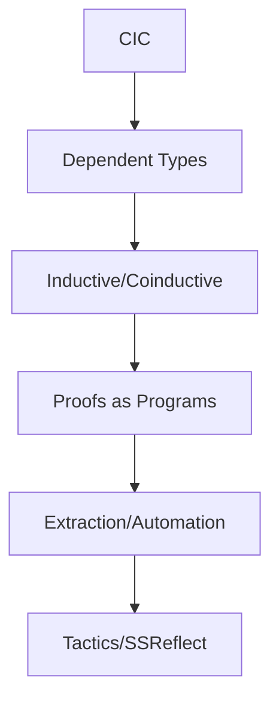

# Coq 形式语言与证明助理（Coq Proof Assistant & Formal Language）

> 对标 Wikipedia、SEP、nLab 与 Coq Reference Manual；中英双语；覆盖理论基础、工程实践与生态。

## 1. 定义与定位 Definition & Positioning

- 中文：Coq 是基于构造演算（Calculus of Inductive Constructions, CIC）的交互式定理证明器与函数式编程语言，支持以“命题即类型（Curry–Howard）”将证明写成可执行的程序。
- English: Coq is an interactive theorem prover and functional language based on CIC, supporting the propositions-as-types paradigm to write proofs as programs.

## 2. 理论基础 Theoretical Foundations

- CIC：CoC + Inductive Types + Universes（避免悖论）
- 依赖类型、归纳/协代数类型、模式匹配与递归/归纳原理
- Prop/Set/Type 层级与范畴/同伦理论的联系（HoTT 改造可选）

## 3. 工具链与生态 Tooling & Ecosystem

- 交互环境：CoqIDE、VS Code（VsCoq）、Proof General
- 标准库：Coq stdlib；生态：Mathematical Components、Iris、VST、CompCert、Ssreflect、MetaCoq
- 提取（Extraction）：到 OCaml/Haskell/Scheme 的程序提取

## 4. 工程实践 Engineering Practice

- 证明组织：模块/节（Sections）、公理/引理/定理、战术脚本（Ltac/SSReflect）
- 自动化：auto/eauto、lia/nia、ring/field、firstorder、congruence；决策过程插件
- CI/复用：将库作为 OPAM 包管理；持续集成（GitHub Actions）

## 5. 与 Haskell/Rust/Lean 对照 Comparison

- Haskell：以类型级编码近似证明；Coq 具原生依赖类型与证明内核
- Rust：所有权/借用面向资源正确性；Coq 面向数学/程序性质证明
- Lean：同为依赖类型证明助理，语法/战术/生态各异（Lean4 更偏工业化）

## 6. 结构图 Structure Diagram

## 7. 参考 References

- Coq Reference Manual；Coq stdlib 文档
- Wikipedia: Coq; nLab: Calculus of Inductive Constructions
- Software Foundations; Certified Programming with Dependent Types
