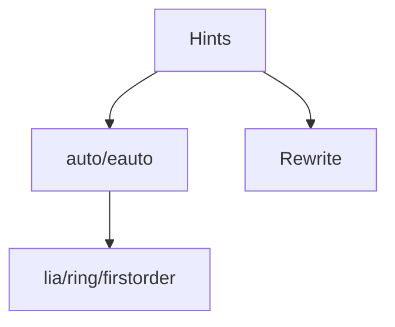

# Coq 自动化与决策过程（Automation & Decision Procedures）

> 中英双语；覆盖 auto/eauto、lia/nia、ring/field、firstorder、congruence、Hint 数据库与工程化用法。

## 1. 自动化战术 Automation Tactics

- auto/eauto：基于 Hint 的自动搜索；`eauto 8` 控制深度
- firstorder：一阶逻辑自动化
- congruence：等式闭包
- ring/field：环/域上的多项式归约
- lia/nia：线性/非线性整数算术

## 2. Hint 与数据库 Hints & Databases

- `Hint Resolve`/`Hint Constructors`/`Hint Rewrite`；自定义数据库 `:core :db` 等
- 在库中导出最小必要 Hint，避免全局性能退化

## 3. 工程策略 Engineering Strategies

- 将“简单目标”交给 auto/eauto/lia，把“结构性目标”留给专用战术
- 利用 `#[global] Hint` 精准开放；避免污染全局搜索
- 为关键引理提供 `Hint Rewrite`（左右方向谨慎）

## 4. 示例 Examples

```coq
Require Import Lia.

Lemma ex_ineq (x y : Z) : x <= y -> x <= y + 2.
Proof. lia. Qed.
```

## 5. 结构图 Structure Diagram



## 6. 参考 References

- Coq Refman; coq/hammer 文档；MathComp/SSReflect 自动化实践
