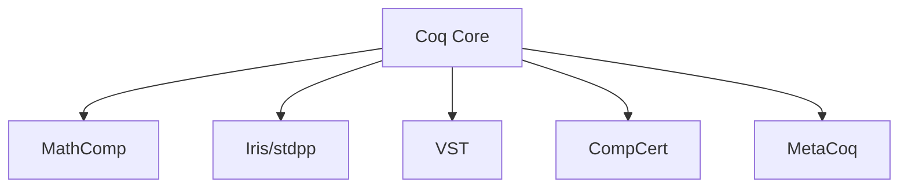

# Coq 生态与最佳实践（Ecosystem & Best Practices）

> 中英双语；覆盖核心生态（MathComp/Iris/VST/MetaCoq/CompCert）与工程化建议。

## 1. 生态概览 Ecosystem Overview

- Mathematical Components（SSReflect/CS/Algebra）
- Iris（并发分离逻辑）与 stdpp
- VST（Verified Software Toolchain）
- CompCert（经过验证的 C 编译器）
- MetaCoq（反射与元理论）

## 2. 工程化建议 Engineering Guidelines

- 规范化项目结构：区分核心库/战术/案例；OPAM 包化
- 证明可维护性：分层引理、命名约定、最小 Hint、自动化可控
- CI 与版本锁定：使用 Coq Platform/OPAM 固定版本；CI 测试脚本

## 3. 跨语言与集成 Interop & Integration

- 与 OCaml 的提取与 FFI；与 Haskell 的提取/桥接
- 文档与可视化：现成文档生成与 Mermaid 图表嵌入

## 4. 结构图 Structure Diagram

## 5. 参考 References

- Coq Platform；各项目 README/论文；OPAM 包索引
