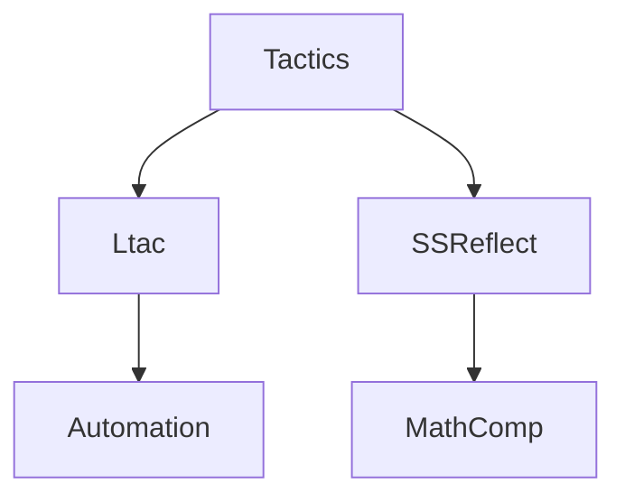

# Coq 战术与策略（Tactics & Strategies）

> 中英双语；覆盖 Ltac/SSReflect 常用战术、策略与示例，对标 Refman/SF/SSReflect 文档。

## 1. 战术综览 Overview

- 基础：intro/intros, apply, exact, refine, destruct, inversion, induction, rewrite, subst, simpl, reflexivity
- 自动化：auto/eauto, firstorder, lia/nia, ring/field, congruence, cbn/cbv
- 结构化：assert, pose proof, specialize, generalize dependent, remember

## 2. Ltac 与策略语言 Ltac & Strategy

- Ltac：自定义复合战术；模式匹配 `match goal with ... end`
- Hint 数据库：`Hint Resolve`, `Hint Rewrite`
- 结构化证明：`;` 复合、`repeat` 重复、`try` 宽松

## 3. SSReflect 风格 SSReflect Style

- 记号：`move=>`, `case`, `elim`, `rewrite`, `have`, `suff`
- Canonical Structures 与小战术库；MathComp 生态

## 4. 示例 Examples

```coq
From mathcomp Require Import all_ssreflect.

Lemma addn0 n : n + 0 = n.
Proof. by elim: n => // n IH; rewrite addSn IH. Qed.
```

## 5. 结构图 Structure Diagram



## 6. 参考 References

- Coq Reference Manual; SSReflect manual; Software Foundations; MathComp book
