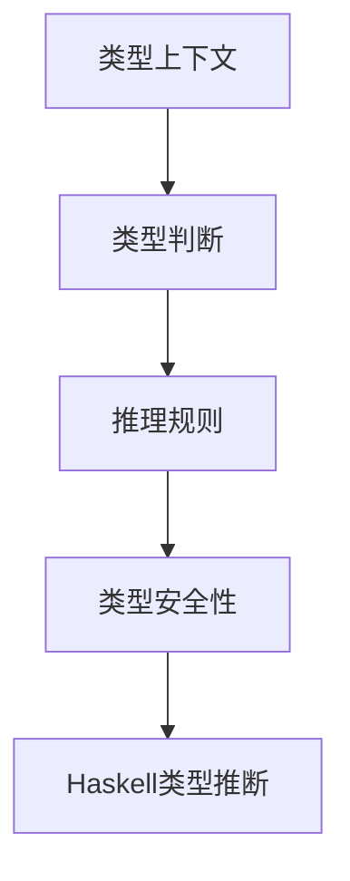

# 01. 类型理论基础（Type Theory Foundation）

> **中英双语核心定义 | Bilingual Core Definitions**

## 1.1 类型理论简介（Introduction to Type Theory）

- **定义（Definition）**：
  - **中文**：类型理论是一门研究“类型”及其在数学、逻辑和编程语言中作用的形式系统。它为程序设计语言的语法、语义和证明提供了坚实的数学基础。
  - **English**: Type theory is a formal system that studies "types" and their roles in mathematics, logic, and programming languages. It provides a solid mathematical foundation for the syntax, semantics, and proofs of programming languages.

- **Wiki风格国际化解释（Wiki-style Explanation）**：
  - 类型理论广泛应用于函数式编程（如Haskell）、定理证明（如Lean、Coq）和形式化验证等领域。
  - Type theory is widely used in functional programming (e.g., Haskell), theorem proving (e.g., Lean, Coq), and formal verification.

## 1.2 类型系统基本结构（Basic Structure of Type Systems）

- **类型上下文（Type Context）**
  - $\Gamma : \text{Var} \rightarrow \text{Type}$
  - **中文**：类型上下文是变量到类型的映射。
  - **English**: Type context is a mapping from variables to types.

- **类型判断（Type Judgement）**
  - $\Gamma \vdash e : \tau$
  - **中文**：在上下文$\Gamma$中，表达式$e$具有类型$\tau$。
  - **English**: In context $\Gamma$, expression $e$ has type $\tau$.

- **推理规则（Inference Rules）**

| 规则 | 数学形式 | 中文 | English |
|------|----------|------|---------|
| 变量 | $\frac{x : \tau \in \Gamma}{\Gamma \vdash x : \tau}$ | 变量类型 | Variable type |
| 函数 | $\frac{\Gamma, x : \tau_1 \vdash e : \tau_2}{\Gamma \vdash \lambda x.e : \tau_1 \rightarrow \tau_2}$ | 函数抽象 | Function abstraction |
| 应用 | $\frac{\Gamma \vdash e_1 : \tau_1 \rightarrow \tau_2 \quad \Gamma \vdash e_2 : \tau_1}{\Gamma \vdash e_1 e_2 : \tau_2}$ | 函数应用 | Function application |

## 1.3 Haskell类型系统与语义模型（Haskell Type System & Semantic Model）

- **Haskell类型推断（Hindley-Milner）**

```haskell
-- 类型推断算法W的简化实现
unify :: Type -> Type -> Substitution
unify (TVar a) t = if a `elem` ftv t then fail else [(a, t)]
unify t (TVar a) = unify (TVar a) t
unify (TArrow t1 t2) (TArrow t1' t2') = 
  let s1 = unify t1 t1'
      s2 = unify (apply s1 t2) (apply s1 t2')
  in compose s2 s1
unify (TCon a) (TCon b) = if a == b then [] else fail
```

- **类型安全性（Type Safety）**
  - **类型保持（Preservation）**：如果$\Gamma \vdash e : \tau$且$e \rightarrow e'$，则$\Gamma \vdash e' : \tau$。
  - **进展性（Progress）**：如果$\emptyset \vdash e : \tau$，则$e$要么是值，要么存在$e'$使得$e \rightarrow e'$。

- **Haskell类型检查器示例**

```haskell
typeCheck :: Context -> Expr -> Either TypeError Type
typeCheck ctx (Var x) = case lookup x ctx of
  Just t -> Right t
  Nothing -> Left (UnboundVariable x)
typeCheck ctx (App e1 e2) = do
  t1 <- typeCheck ctx e1
  t2 <- typeCheck ctx e2
  case t1 of
    TArrow t1' t2' | t1' == t2 -> Right t2'
    _ -> Left TypeMismatch
```

## 1.4 形式化证明与论证（Formal Proofs & Reasoning）

- **类型保持性证明（Preservation Proof）**
  - **中文**：对每个推理规则，证明类型在归约后保持不变。
  - **English**: For each inference rule, prove that the type is preserved after reduction.

- **进展性证明（Progress Proof）**
  - **中文**：对每个语法构造，证明要么是值，要么可以继续归约。
  - **English**: For each syntactic construct, prove it is either a value or can be further reduced.

## 1.5 多表征与本地跳转（Multi-representation & Local Reference）

- **类型系统结构图（Type System Structure Diagram）**



- **相关主题跳转**：
  - [线性类型理论 Linear Type Theory](../02-Linear-Type-Theory/01-Linear-Type-Theory-Foundation.md)
  - [仿射类型理论 Affine Type Theory](../03-Affine-Type-Theory/01-Affine-Type-Theory-Foundation.md)
  - [时序类型理论 Temporal Type Theory](../04-Temporal-Type-Theory/01-Temporal-Type-Theory-Foundation.md)

---

> 本文档为类型理论基础的中英双语、Haskell语义模型与形式化证明规范化输出，适合学术研究与工程实践参考。
