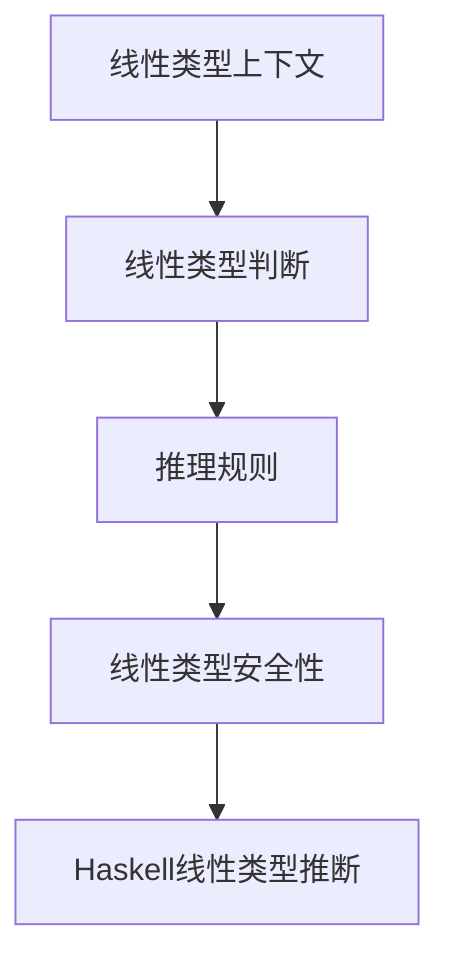

# 01. 线性类型理论基础（Linear Type Theory Foundation）

> **中英双语核心定义 | Bilingual Core Definitions**

## 1.1 线性类型理论简介（Introduction to Linear Type Theory）

- **定义（Definition）**：
  - **中文**：线性类型理论是一种类型系统，要求每个变量（资源）在作用域内恰好使用一次，广泛用于资源管理、并发和内存安全。
  - **English**: Linear type theory is a type system that requires each variable (resource) to be used exactly once in its scope. It is widely used for resource management, concurrency, and memory safety.

- **Wiki风格国际化解释（Wiki-style Explanation）**：
  - 线性类型理论为函数式编程（如Haskell的LinearTypes扩展）、Rust的所有权系统等提供理论基础。
  - Linear type theory underpins functional programming (e.g., Haskell's LinearTypes extension) and Rust's ownership system.

## 1.2 线性类型系统基本结构（Basic Structure of Linear Type Systems）

- **线性类型上下文（Linear Type Context）**
  - $\Gamma : \text{Var} \rightarrow \text{Type}$，每个变量只能出现一次。
  - **中文**：线性类型上下文要求变量唯一使用。
  - **English**: Linear type context requires each variable to be used exactly once.

- **线性类型构造（Linear Type Constructors）**
  - $\tau ::= \text{Base} \mid \tau_1 \multimap \tau_2 \mid \tau_1 \otimes \tau_2 \mid !\tau$
  - $\multimap$：线性函数类型（linear function type）
  - $\otimes$：张量积类型（tensor product type）
  - $!$：可重复使用类型（of course type）

- **推理规则（Inference Rules）**

| 规则 | 数学形式 | 中文 | English |
|------|----------|------|---------|
| 变量 | $\frac{x : \tau \in \Gamma}{\Gamma \vdash x : \tau}$ | 变量类型 | Variable type |
| 线性抽象 | $\frac{\Gamma, x : \tau_1 \vdash e : \tau_2}{\Gamma \vdash \lambda x.e : \tau_1 \multimap \tau_2}$ | 线性函数抽象 | Linear function abstraction |
| 线性应用 | $\frac{\Gamma_1 \vdash e_1 : \tau_1 \multimap \tau_2 \quad \Gamma_2 \vdash e_2 : \tau_1}{\Gamma_1, \Gamma_2 \vdash e_1 e_2 : \tau_2}$ | 线性函数应用 | Linear function application |

## 1.3 Haskell线性类型系统与语义模型（Haskell Linear Type System & Semantic Model）

- **Haskell线性类型扩展（LinearTypes Extension）**
  - Haskell 通过 `LinearTypes` 扩展支持线性类型：

```haskell
{-# LANGUAGE LinearTypes #-}

f :: a %1 -> (a, a)
f x = (x, x)  -- 错误：x 被用两次，违反线性约束
```

- **线性资源管理示例**

```haskell
import System.IO.Linear

withFile :: FilePath %1 -> (File %1 -> Ur b) %1 -> Ur b
```

- **线性类型推断与检查**
  - 线性类型推断要求每个线性变量在作用域内恰好用一次。

## 1.4 形式化证明与论证（Formal Proofs & Reasoning）

- **线性类型保持性证明（Preservation Proof）**
  - **中文**：对每个推理规则，证明线性类型在归约后保持不变。
  - **English**: For each inference rule, prove that the linear type is preserved after reduction.

- **线性进展性证明（Progress Proof）**
  - **中文**：对每个语法构造，证明要么是值，要么可以继续归约。
  - **English**: For each syntactic construct, prove it is either a value or can be further reduced.

## 1.5 多表征与本地跳转（Multi-representation & Local Reference）

- **线性类型系统结构图（Linear Type System Structure Diagram）**



- **相关主题跳转**：
  - [类型理论 Type Theory](../01-Type-Theory/01-Type-Theory-Foundation.md)
  - [仿射类型理论 Affine Type Theory](../03-Affine-Type-Theory/01-Affine-Type-Theory-Foundation.md)
  - [时序类型理论 Temporal Type Theory](../04-Temporal-Type-Theory/01-Temporal-Type-Theory-Foundation.md)

---

## 1.6 历史与发展 History & Development

- **中文**：线性类型理论由Jean-Yves Girard于1987年提出，最初用于逻辑学，后广泛应用于资源管理、并发和编程语言。Haskell自GHC 8.12引入LinearTypes扩展后，成为主流函数式语言中率先支持线性类型的代表。
- **English**: Linear type theory was introduced by Jean-Yves Girard in 1987, initially for logic, and later widely applied to resource management, concurrency, and programming languages. Since GHC 8.12, Haskell has been a leading functional language supporting linear types via the LinearTypes extension.

## 1.7 Haskell 相关特性 Haskell Features

### 经典特性 Classic Features

- 资源敏感类型、不可变数据结构、类型安全的内存管理等。
- Resource-sensitive types, immutable data structures, type-safe memory management, etc.

### 最新特性 Latest Features

- **Linear Types（线性类型）**：GHC 8.12+正式支持，变量必须恰好使用一次。
- **Multiplicities**：支持多重性类型参数。
- **Type-level Programming**：类型级资源管理与约束。
- **GHC 2021/2022**：标准化线性类型相关扩展。

- **English**:
  - Linear Types: Officially supported since GHC 8.12, variables must be used exactly once.
  - Multiplicities: Support for multiplicity type parameters.
  - Type-level programming: Type-level resource management and constraints.
  - GHC 2021/2022: Standardizes linear type extensions.

## 1.8 应用 Applications

- **中文**：资源安全的API、并发与分布式系统、内存安全、文件句柄管理、不可变数据结构等。
- **English**: Resource-safe APIs, concurrency and distributed systems, memory safety, file handle management, immutable data structures, etc.

## 1.9 例子 Examples

```haskell
{-# LANGUAGE LinearTypes #-}
f :: a %1 -> (a, a)
f x = (x, x)  -- 错误：x被用两次，违反线性约束

import System.IO.Linear
withFile :: FilePath %1 -> (File %1 -> Ur b) %1 -> Ur b
```

## 1.10 相关理论 Related Theories

- 线性逻辑（Linear Logic）
- 资源敏感类型系统（Resource-sensitive Type Systems）
- 不可变数据结构（Immutable Data Structures）
- 并发与分布式系统（Concurrency and Distributed Systems）

## 1.11 参考文献 References

- [Wikipedia: Linear Type](https://en.wikipedia.org/wiki/Linear_type)
- [GHC User's Guide](https://downloads.haskell.org/ghc/latest/docs/html/users_guide/)
- [Linear Haskell](https://ghc.gitlab.haskell.org/ghc/doc/users_guide/exts/linear_types.html)
- [Jean-Yves Girard: Linear Logic](https://en.wikipedia.org/wiki/Linear_logic)
- [Learn You a Haskell for Great Good!](http://learnyouahaskell.com/)

> 本文档为线性类型理论基础的中英双语、Haskell语义模型与形式化证明规范化输出，适合学术研究与工程实践参考。
