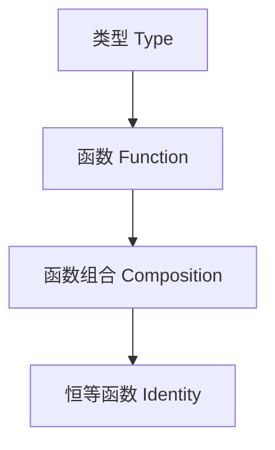

# 01. 范畴论与Haskell类型系统（Category Theory and Haskell Type System）

> **中英双语核心定义 | Bilingual Core Definitions**

## 1.1 范畴论与类型系统简介（Introduction to Category Theory and Type Systems）

- **定义（Definition）**：
  - **中文**：范畴论是一门研究对象与态射（映射）及其组合规律的数学理论。Haskell的类型系统可被视为一个范畴，其中类型为对象，函数为态射。
  - **English**: Category theory is a mathematical theory that studies objects, morphisms (arrows), and their composition. The type system of Haskell can be viewed as a category, where types are objects and functions are morphisms.

- **Wiki风格国际化解释（Wiki-style Explanation）**：
  - 范畴论为Haskell等函数式编程语言的类型系统、抽象与组合提供了统一的理论基础。
  - Category theory provides a unified theoretical foundation for type systems, abstraction, and composition in functional programming languages like Haskell.

## 1.2 Haskell类型系统的范畴论建模（Category-Theoretic Modeling of Haskell Type System）

- **基本范畴结构（Basic Category Structure）**

$$
\text{Lang} = (\text{Types}, \text{Functions}, \circ, id)
$$

- **映射关系表（Mapping Table）**

| 范畴论概念 | 编程概念 | Haskell示例 |
|---------|---------|-------------|
| 对象（Object） | 类型（Type） | `Int`, `Bool`, `Maybe a` |
| 态射（Morphism） | 函数（Function） | `f :: A -> B` |
| 组合（Composition） | 函数组合 | `(g . f) x = g (f x)` |
| 恒等态射（Identity） | 恒等函数 | `id :: a -> a` |

- **Haskell代码示例**

```haskell
-- 类型作为对象
add :: Int -> Int -> Int
add x y = x + y

-- 函数作为态射
not' :: Bool -> Bool
not' True = False
not' False = True

-- 函数组合
compose :: (b -> c) -> (a -> b) -> a -> c
compose g f x = g (f x)

-- 恒等函数
identity :: a -> a
identity x = x
```

## 1.3 范畴论结构与类型系统的映射（Mapping Category Structure to Type System）

- **对象与类型**：每个Haskell类型（如`Int`、`Bool`、`Maybe a`）对应范畴中的一个对象。
- **态射与函数**：每个Haskell函数（如`f :: A -> B`）对应范畴中的一个态射。
- **组合与函数复合**：Haskell的函数组合（`.`）对应范畴论中的态射组合。
- **恒等函数**：`id :: a -> a`是每个类型的恒等态射。

- **中英双语表格**：

| Category Theory | Programming | Haskell | 中文解释 |
|-----------------|------------|---------|----------|
| Object          | Type       | `Int`   | 类型      |
| Morphism        | Function   | `f :: A -> B` | 函数 |
| Composition     | Function composition | `g . f` | 函数组合 |
| Identity        | Identity function | `id` | 恒等函数 |

## 1.4 形式化证明与论证（Formal Proofs & Reasoning）

- **范畴公理在Haskell类型系统中的体现**
  - **结合律（Associativity）**：
    - $(h \circ g) \circ f = h \circ (g \circ f)$
    - Haskell中：`(h . g) . f == h . (g . f)`
  - **恒等律（Identity Law）**：
    - $id \circ f = f = f \circ id$
    - Haskell中：`id . f == f == f . id`

- **证明示例（Proof Example）**

```haskell
-- 结合律证明
let f = (+1)
let g = (*2)
let h = (^2)
((h . g) . f) 3 == (h . (g . f)) 3  -- True

-- 恒等律证明
(id . f) 5 == f 5  -- True
(f . id) 5 == f 5  -- True
```

## 1.5 多表征与本地跳转（Multi-representation & Local Reference）

- **范畴结构图（Category Structure Diagram）**



- **相关主题跳转**：
  - [类型理论 Type Theory](../01-Type-Theory/01-Type-Theory-Foundation.md)
  - [线性类型理论 Linear Type Theory](../02-Linear-Type-Theory/01-Linear-Type-Theory-Foundation.md)
  - [仿射类型理论 Affine Type Theory](../03-Affine-Type-Theory/01-Affine-Type-Theory-Foundation.md)
  - [时序类型理论 Temporal Type Theory](../04-Temporal-Type-Theory/01-Temporal-Type-Theory-Foundation.md)

---

## 1.6 历史与发展 History & Development

- **中文**：范畴论由Eilenberg和Mac Lane于1940年代提出，最初用于代数拓扑，后广泛影响数学、逻辑和计算机科学。Haskell自1990年代诞生以来，其类型系统不断吸收范畴论思想，推动了类型类、Functor、Monad等概念的普及。
- **English**: Category theory was introduced by Eilenberg and Mac Lane in the 1940s for algebraic topology, and later influenced mathematics, logic, and computer science. Since the 1990s, Haskell's type system has incorporated category theory concepts, popularizing type classes, Functors, Monads, etc.

## 1.7 Haskell 相关特性 Haskell Features

### 经典特性 Classic Features

- 类型类（Type Classes）、Functor、Monad、Applicative、自然变换（Natural Transformation）等，均有范畴论基础。
- Type classes, Functor, Monad, Applicative, and natural transformations in Haskell are all rooted in category theory.

### 最新特性 Latest Features

- **GADTs（广义代数数据类型）**：更强的类型表达能力，支持更复杂的范畴结构。
- **Type Families/Type-level Programming**：类型级函数和类型运算，支持类型范畴的抽象。
- **Linear Types（线性类型）**：GHC 8.12+，引入资源敏感的范畴结构。
- **Dependent Types（依赖类型）**：GHC 9.x实验性支持，类型依赖于值，进一步接近范畴论中的依赖范畴。
- **QuantifiedConstraints/RankNTypes**：更高阶的类型抽象。
- **GHC 2021/2022**：标准化更多类型系统扩展。

- **English**:
  - GADTs: More expressive types, supporting complex categorical structures.
  - Type Families/Type-level Programming: Type-level functions and computation, enabling categorical abstraction at the type level.
  - Linear Types: Introduced in GHC 8.12+, resource-sensitive categorical structures.
  - Dependent Types: Experimental in GHC 9.x, types depending on values, approaching dependent categories in category theory.
  - QuantifiedConstraints/RankNTypes: Higher-order type abstraction.
  - GHC 2021/2022: Standardizes more type system extensions.

## 1.8 应用 Applications

- **中文**：Haskell的范畴论思想广泛应用于泛型编程、抽象代数、DSL设计、并发与分布式系统、形式化验证等领域。
- **English**: Category theory in Haskell is widely used in generic programming, abstract algebra, DSL design, concurrency and distributed systems, and formal verification.

## 1.9 例子 Examples

```haskell
-- 依赖类型与GADT结合的例子（GHC 9.x）
data Nat = Z | S Nat

data Vec a n where
  VNil  :: Vec a 'Z
  VCons :: a -> Vec a n -> Vec a ('S n)

-- 类型级编程：类型族
{-# LANGUAGE TypeFamilies #-}
type family F a where
  F Int = Bool
  F Bool = Int
```

## 1.10 相关理论 Related Theories

- 依赖类型理论（Dependent Type Theory）
- 线性类型理论（Linear Type Theory）
- 范畴论与计算机科学（Category Theory in Computer Science）
- 代数数据类型（Algebraic Data Types）
- 形式化验证（Formal Verification）

## 1.11 参考文献 References

- [Wikipedia: Category Theory](https://en.wikipedia.org/wiki/Category_theory)
- [Wikipedia: Haskell (programming language)](https://en.wikipedia.org/wiki/Haskell_(programming_language))
- [GHC User's Guide](https://downloads.haskell.org/ghc/latest/docs/html/users_guide/)
- [Category Theory for Programmers](https://bartoszmilewski.com/category/category-theory/)
- [Learn You a Haskell for Great Good!](http://learnyouahaskell.com/)

> 本文档为范畴论与Haskell类型系统的中英双语、Haskell语义模型与形式化证明规范化输出，适合学术研究与工程实践参考。
