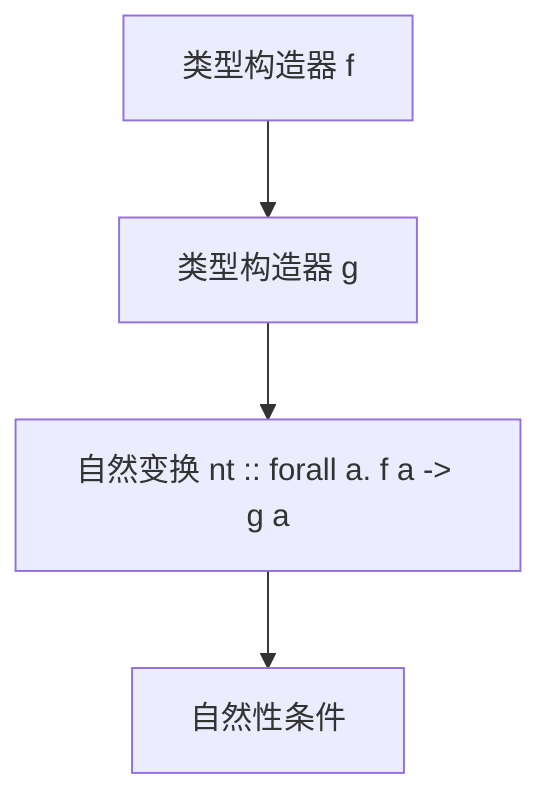

# 01. 自然变换与Haskell类型系统（Natural Transformation and Haskell Type System）

> **中英双语核心定义 | Bilingual Core Definitions**

## 1.1 自然变换简介（Introduction to Natural Transformation）

- **定义（Definition）**：
  - **中文**：在范畴论中，自然变换是两个函子之间的“函子间映射”，为每个对象分配一个态射，并满足自然性条件。Haskell中，自然变换通常表现为多态函数 `forall a. f a -> g a`。
  - **English**: In category theory, a natural transformation is a "mapping between functors" that assigns to each object a morphism, satisfying the naturality condition. In Haskell, a natural transformation is typically a polymorphic function `forall a. f a -> g a`.

- **Wiki风格国际化解释（Wiki-style Explanation）**：
  - 自然变换是Haskell类型系统中函子之间结构性转换的核心抽象，广泛用于泛型编程和高阶抽象。
  - Natural transformation is the core abstraction for structural conversion between functors in Haskell's type system, widely used in generic programming and higher-order abstractions.

## 1.2 Haskell中的自然变换（Natural Transformation in Haskell）

- **类型定义（Type Definition）**

```haskell
-- 自然变换类型
nt :: forall a. f a -> g a
```

- **范畴论建模（Category-Theoretic Modeling）**
  - 对象：类型构造器 `f`, `g`
  - 态射：`forall a. f a -> g a`
  - 自然性条件：对任意 `h :: a -> b`，有 `fmap h . nt = nt . fmap h`

- **Haskell代码示例**

```haskell
-- Maybe 到 List 的自然变换
maybeToList :: Maybe a -> [a]
maybeToList Nothing  = []
maybeToList (Just x) = [x]

-- Reader 到 Maybe 的自然变换
readerToMaybe :: (e -> a) -> Maybe a
readerToMaybe f = Just (f defaultEnv)
  where defaultEnv = ... -- 某个默认环境
```

## 1.3 范畴论结构与类型系统的映射（Mapping Category Structure to Natural Transformation）

- **映射关系表（Mapping Table）**

| 范畴论概念 | Haskell概念 | 代码示例 | 中文解释 |
|---------|-------------|----------|----------|
| 对象    | 类型构造器  | `Maybe`, `[]` | 类型级容器 |
| 态射    | 自然变换    | `forall a. f a -> g a` | 函子间映射 |
| 自然性  | `fmap h . nt = nt . fmap h` | `fmap h (maybeToList m) == maybeToList (fmap h m)` | 保持结构 |

## 1.4 形式化证明与论证（Formal Proofs & Reasoning）

- **自然性条件在Haskell中的体现**
  - **自然性（Naturality）**：
    - $\forall h: a \to b,\ \eta_b \circ F(h) = G(h) \circ \eta_a$
    - Haskell中：`fmap h . nt = nt . fmap h`

- **证明示例（Proof Example）**

```haskell
-- 证明 maybeToList 的自然性
let h = show :: Int -> String
let m = Just 3
fmap h (maybeToList m) == maybeToList (fmap h m)  -- True
```

## 1.5 多表征与本地跳转（Multi-representation & Local Reference）

- **自然变换结构图（Natural Transformation Structure Diagram）**



- **相关主题跳转**：
  - [范畴论与Haskell类型系统 Category Theory and Haskell Type System](../01-Category-Theory-and-Haskell-Type-System.md)
  - [函子 Functor](../02-Functor/01-Functor-and-Haskell.md)
  - [单子 Monad](../03-Monad/01-Monad-and-Haskell.md)

---

## 1.6 历史与发展 History & Development

- **中文**：自然变换概念源自范畴论，20世纪中叶提出。Haskell自设计之初即引入Functor和自然变换思想，成为泛型编程和高阶抽象的基础。GHC不断扩展相关特性，如RankNTypes、QuantifiedConstraints等。
- **English**: The concept of natural transformation originates from category theory, introduced in the mid-20th century. Haskell has included the ideas of functors and natural transformations since its inception, forming the basis of generic programming and higher-order abstractions. GHC has continuously extended related features, such as RankNTypes and QuantifiedConstraints.

## 1.7 Haskell 相关特性 Haskell Features

### 经典特性 Classic Features

- Functor类型类、forall多态、结构性映射、类型安全转换。
- Functor type class, forall polymorphism, structural mapping, type-safe conversion.

### 最新特性 Latest Features

- **RankNTypes/QuantifiedConstraints**
- **Type-level Programming**
- **GHC 2021/2022**：标准化更多自然变换相关扩展。

- **English**:
  - RankNTypes/QuantifiedConstraints
  - Type-level Programming
  - GHC 2021/2022: Standardizes more natural transformation extensions

## 1.8 应用 Applications

- **中文**：泛型编程、容器转换、DSL、类型安全API、异步与并发抽象等。
- **English**: Generic programming, container conversion, DSLs, type-safe APIs, async and concurrency abstractions, etc.

## 1.9 例子 Examples

```haskell
-- Maybe 到 List 的自然变换
maybeToList :: Maybe a -> [a]
maybeToList Nothing  = []
maybeToList (Just x) = [x]

-- RankNTypes 的自然变换
nt :: forall a. f a -> g a
```

## 1.10 相关理论 Related Theories

- 范畴论（Category Theory）
- Functor与Monad理论（Functor and Monad Theory）
- 类型级编程（Type-level Programming）
- 泛型编程（Generic Programming）

## 1.11 参考文献 References

- [Wikipedia: Natural Transformation](https://en.wikipedia.org/wiki/Natural_transformation)
- [GHC User's Guide](https://downloads.haskell.org/ghc/latest/docs/html/users_guide/)
- [Learn You a Haskell for Great Good!](http://learnyouahaskell.com/)
- [Category Theory for Programmers](https://bartoszmilewski.com/category/category-theory/)

> 本文档为自然变换与Haskell类型系统的中英双语、Haskell语义模型与形式化证明规范化输出，适合学术研究与工程实践参考。
