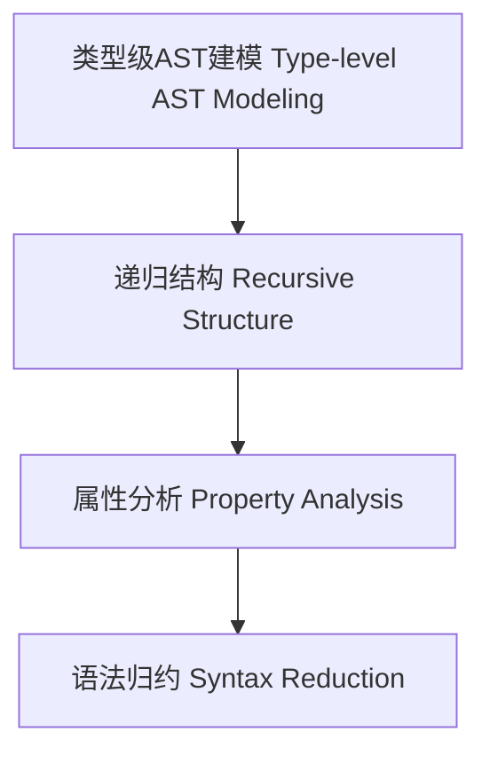

# 类型级AST建模（Type-Level AST Modeling in Haskell）

## 定义 Definition

- **中文**：类型级AST建模是指在类型系统层面对抽象语法树（AST）进行类型级结构建模、递归定义与属性分析的机制，支持类型安全的编译期语法分析。
- **English**: Type-level AST modeling refers to mechanisms at the type system level for modeling, recursively defining, and analyzing properties of abstract syntax trees (ASTs), supporting type-safe compile-time syntax analysis in Haskell.

## Haskell 语法与实现 Syntax & Implementation

```haskell
{-# LANGUAGE GADTs, DataKinds, TypeFamilies #-}

-- 类型级AST建模

data AST a where
  LitInt  :: Int  -> AST Int
  Add     :: AST Int -> AST Int -> AST Int
  Var     :: String -> AST Int
```

## 类型级递归结构与属性分析 Recursive Structure & Property Analysis

- 类型级AST的递归定义、属性分析、结构归约
- 支持类型安全的编译期语法分析与优化

## 形式化证明 Formal Reasoning

- **AST结构归约正确性证明**：递归归约与属性分析覆盖所有AST节点
- **Proof of AST reduction correctness**: Recursive reduction and property analysis cover all AST nodes

### 证明示例 Proof Example

- 对 `AST a` 递归归纳，所有构造器均被分析与归约覆盖

## 工程应用 Engineering Application

- 类型安全的类型级DSL、编译期语法分析、自动化优化
- Type-safe type-level DSLs, compile-time syntax analysis, automated optimization

## 结构图 Structure Diagram



## 本地跳转 Local References

- [类型级语法制导优化 Type-Level Syntax-Directed Optimization](../110-Type-Level-Syntax-Directed-Optimization/01-Type-Level-Syntax-Directed-Optimization-in-Haskell.md)
- [类型级语义分析 Type-Level Semantic Analysis](../111-Type-Level-Semantic-Analysis/01-Type-Level-Semantic-Analysis-in-Haskell.md)
- [类型安全 Type Safety](../14-Type-Safety/01-Type-Safety-in-Haskell.md)

---

## 历史与发展 History & Development

- **中文**：类型级AST建模源于类型系统与编译原理的结合，Haskell社区自GADTs、Type Families等特性引入后，推动了类型级抽象语法树的研究与应用。
- **English**: Type-level AST modeling arises from the integration of type systems and compiler theory. The introduction of GADTs and Type Families in Haskell has advanced research and application of type-level ASTs.

## Haskell 相关特性 Haskell Features

### 经典特性 Classic Features

- GADTs、类型族、类型类、DataKinds等为类型级AST建模提供基础。
- GADTs, type families, type classes, and DataKinds provide the foundation for type-level AST modeling.

### 最新特性 Latest Features

- **Type-level Programming**：类型级函数、类型级递归。
- **Singletons**：类型与值的单例化，支持类型安全的AST操作。
- **Dependent Types**：实验性支持，类型依赖于AST结构。
- **Template Haskell**：元编程辅助类型级AST生成。
- **GHC 2021/2022**：标准化类型级编程相关扩展。

- **English**:
  - Type-level programming: Type-level functions and recursion.
  - Singletons: Singletonization of types and values, supporting type-safe AST operations.
  - Dependent Types: Experimental support, types depending on AST structure.
  - Template Haskell: Metaprogramming for type-level AST generation.
  - GHC 2021/2022: Standardizes type-level programming extensions.

## 应用 Applications

- **中文**：类型安全的DSL、编译期语法分析、自动化优化、形式化验证等。
- **English**: Type-safe DSLs, compile-time syntax analysis, automated optimization, formal verification, etc.

## 例子 Examples

```haskell
{-# LANGUAGE DataKinds, GADTs, TypeFamilies #-}
data Expr a where
  EInt  :: Int -> Expr Int
  EAdd  :: Expr Int -> Expr Int -> Expr Int
  EIf   :: Expr Bool -> Expr a -> Expr a -> Expr a

type family Eval (e :: Expr a) :: a where
  Eval ('EInt n) = n
  Eval ('EAdd e1 e2) = Eval e1 + Eval e2
```

## 相关理论 Related Theories

- 类型级编程（Type-level Programming）
- 依赖类型（Dependent Types）
- 形式化验证（Formal Verification）
- 语法制导翻译（Syntax-directed Translation）

## 参考文献 References

- [Wikipedia: Abstract Syntax Tree](https://en.wikipedia.org/wiki/Abstract_syntax_tree)
- [GHC User's Guide](https://downloads.haskell.org/ghc/latest/docs/html/users_guide/)
- [Type-level Programming in Haskell](https://wiki.haskell.org/Type-level_programming)
