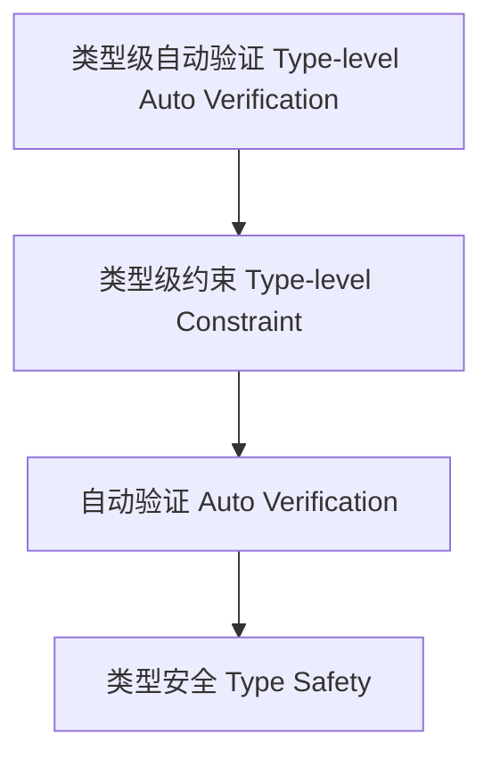

# 类型级自动验证（Type-Level Auto Verification in Haskell）

## 定义 Definition

- **中文**：类型级自动验证是指在类型系统层面自动验证类型约束、类型安全和程序属性的机制，提升编译期安全性和可靠性。
- **English**: Type-level auto verification refers to mechanisms at the type system level for automatically verifying type constraints, type safety, and program properties, improving compile-time safety and reliability in Haskell.

## Haskell 语法与实现 Syntax & Implementation

```haskell
{-# LANGUAGE TypeFamilies, ConstraintKinds, TypeOperators, UndecidableInstances #-}
import GHC.Exts (Constraint)

-- 类型级自动验证示例：类型级约束验证

type family Verify (c :: Constraint) :: Bool where
  Verify (() :: Constraint) = 'True
  Verify c = 'False
```

## 自动验证机制 Auto Verification Mechanism

- 类型族递归验证、类型类约束检查
- 支持类型级属性自动验证与错误检测

## 形式化证明 Formal Reasoning

- **自动验证正确性证明**：证明验证机制能检测所有非法约束
- **Proof of correctness for auto verification**: Show that the verification mechanism detects all illegal constraints

### 证明示例 Proof Example

- 对 `Verify c`，归纳证明 `c` 可解时返回 `True`，否则为 `False`

## 工程应用 Engineering Application

- 类型安全的自动验证、泛型库、DSL 框架
- Type-safe auto verification, generic libraries, DSL frameworks

## 结构图 Structure Diagram



## 本地跳转 Local References

- [类型级约束求解器 Type-Level Constraint Solver](../28-Type-Level-Constraint-Solver/01-Type-Level-Constraint-Solver-in-Haskell.md)
- [类型级自动化 Type-Level Automation](../27-Type-Level-Automation/01-Type-Level-Automation-in-Haskell.md)
- [类型安全 Type Safety](../14-Type-Safety/01-Type-Safety-in-Haskell.md)
