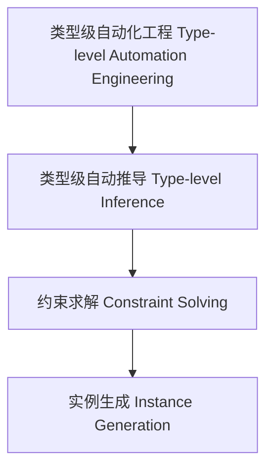

# 类型级自动化工程（Type-Level Automation Engineering in Haskell）

## 定义 Definition

- **中文**：类型级自动化工程是指在类型系统层面系统性地实现类型级自动推导、约束求解和实例生成等自动化机制，提升类型系统的工程能力。
- **English**: Type-level automation engineering refers to systematically implementing type-level automatic inference, constraint solving, instance generation, and other automation mechanisms at the type system level, enhancing the engineering capability of the type system in Haskell.

## Haskell 语法与实现 Syntax & Implementation

```haskell
{-# LANGUAGE TypeFamilies, MultiParamTypeClasses, FlexibleInstances, UndecidableInstances #-}

-- 类型级自动化工程示例：自动实例生成
class AutoInstance a where
  type Result a
  auto :: a -> Result a

instance AutoInstance Int where
  type Result Int = Bool
  auto n = n > 0

instance AutoInstance Bool where
  type Result Bool = Int
  auto b = if b then 1 else 0
```

## 自动化工程机制 Automation Engineering Mechanism

- 类型族、类型类、GADT 等协同实现类型级自动化
- 支持类型级约束自动传播与消解、实例自动生成

## 形式化证明 Formal Reasoning

- **自动化工程一致性证明**：证明自动化机制不会破坏类型系统一致性
- **Proof of automation consistency**: Show that automation mechanisms preserve type system consistency

## 工程应用 Engineering Application

- 类型安全的自动推导、类型驱动的代码生成、泛型库
- Type-safe automatic inference, type-driven code generation, generic libraries

## 结构图 Structure Diagram



## 本地跳转 Local References

- [类型级自动化 Type-Level Automation](../27-Type-Level-Automation/01-Type-Level-Automation-in-Haskell.md)
- [类型级推理引擎 Type-Level Inference Engine](../38-Type-Level-Inference-Engine/01-Type-Level-Inference-Engine-in-Haskell.md)
- [类型级约束求解 Type-Level Constraint Solving](../22-Type-Level-Constraint-Solving/01-Type-Level-Constraint-Solving-in-Haskell.md)
