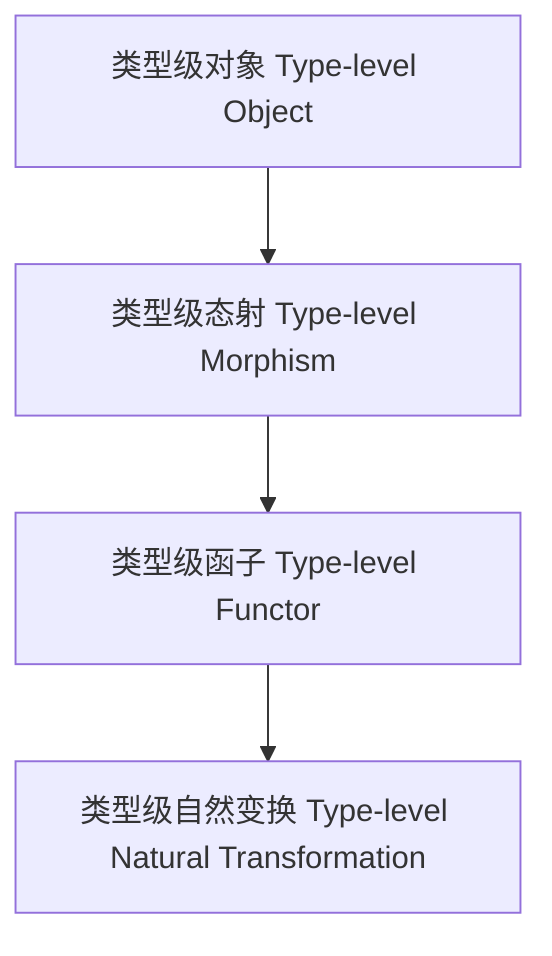

# 类型级范畴论映射（Type-Level Category Theory Mapping in Haskell）

## 定义 Definition

- **中文**：类型级范畴论映射是指在类型系统层面将范畴论结构（如对象、态射、函子、自然变换等）映射到类型级编程中的机制。
- **English**: Type-level category theory mapping refers to mechanisms at the type system level for mapping category-theoretic structures (such as objects, morphisms, functors, natural transformations) into type-level programming in Haskell.

## Haskell 语法与实现 Syntax & Implementation

```haskell
{-# LANGUAGE TypeFamilies, GADTs, KindSignatures #-}

-- 类型级对象与态射

data Obj = A | B | C

data Hom :: Obj -> Obj -> * where
  Id  :: Hom a a
  F   :: Hom 'A 'B
  G   :: Hom 'B 'C

-- 类型级函子

type family FMap (f :: Obj -> Obj) (h :: Hom a b) :: Hom (f a) (f b)
```

## 范畴论结构与类型级映射 Category Theory Structures & Type-Level Mapping

- 对象（Object）、态射（Morphism）、函子（Functor）、自然变换（Natural Transformation）
- 类型级建模与映射

## 形式化证明 Formal Reasoning

- **函子映射保持结构证明**：证明 FMap 保持恒等与组合
- **Proof of functoriality**: Show that FMap preserves identity and composition

### 证明示例 Proof Example

- 对于任意 h，FMap f (Id :: Hom a a) = Id :: Hom (f a) (f a)
- 对于组合 h1 . h2，FMap f (h1 . h2) = FMap f h1 . FMap f h2

## 工程应用 Engineering Application

- 类型级 DSL、类型安全的抽象建模、泛型库
- Type-level DSLs, type-safe abstract modeling, generic libraries

## 结构图 Structure Diagram



## 本地跳转 Local References

- [范畴论与Haskell类型系统 Category Theory and Haskell Type System](../05-Category-Theory/01-Category-Theory-and-Haskell-Type-System.md)
- [类型级编程 Type-level Programming](../12-Type-Level-Programming/01-Type-Level-Programming-in-Haskell.md)
- [类型级泛型 Type-level Generic](../24-Type-Level-Generic/01-Type-Level-Generic-in-Haskell.md)
