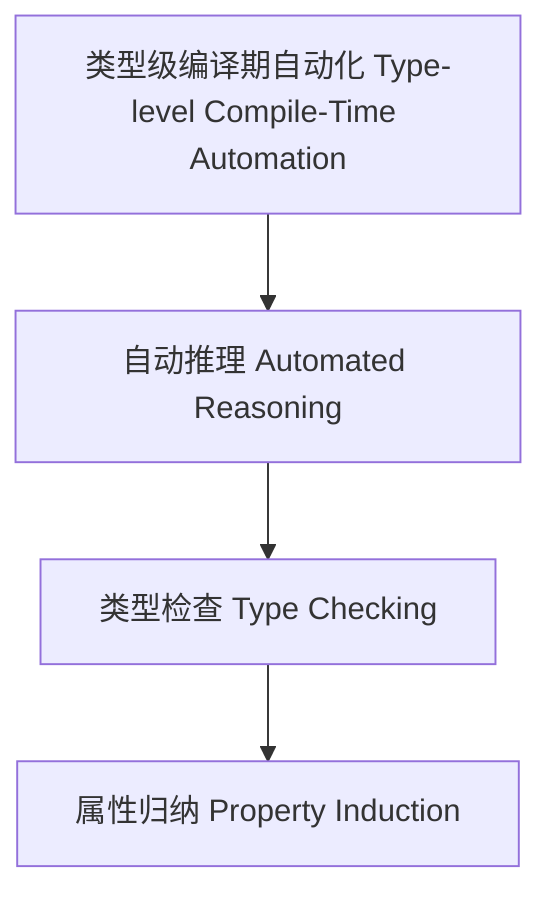

# 类型级编译期自动化（Type-Level Compile-Time Automation in Haskell）

## 定义 Definition

- **中文**：类型级编译期自动化是指在类型系统层面对类型级结构和表达式进行自动推理、类型检查与属性归纳的机制，支持类型安全的编译期自动化。
- **English**: Type-level compile-time automation refers to mechanisms at the type system level for automated reasoning, type checking, and property induction of type-level structures and expressions, supporting type-safe compile-time automation in Haskell.

## Haskell 语法与实现 Syntax & Implementation

```haskell
{-# LANGUAGE GADTs, DataKinds, TypeFamilies #-}

-- 类型级表达式

data Expr a where
  LitInt  :: Int  -> Expr Int
  Add     :: Expr Int -> Expr Int -> Expr Int

-- 类型级编译期自动化

type family Auto (e :: Expr a) :: Bool where
  Auto ('LitInt n) = 'True
  Auto ('Add x y) = Auto x && Auto y
```

## 类型级自动推理与类型检查 Automated Reasoning & Type Checking

- 类型级表达式的自动推理、类型检查、属性归纳
- 支持类型安全的编译期自动化

## 形式化证明 Formal Reasoning

- **自动化正确性证明**：Auto e 能准确自动推理表达式属性
- **Proof of automation correctness**: Auto e can accurately automate reasoning about expression properties

### 证明示例 Proof Example

- 对 `Auto e`，归纳每个构造器，自动化推理覆盖所有情况

## 工程应用 Engineering Application

- 类型安全的类型级DSL、编译期自动化、自动化验证
- Type-safe type-level DSLs, compile-time automation, automated verification

## 结构图 Structure Diagram



## 本地跳转 Local References

- [类型级编译期推理 Type-Level Compile-Time Reasoning](../115-Type-Level-Compile-Time-Reasoning/01-Type-Level-Compile-Time-Reasoning-in-Haskell.md)
- [类型级语义推断 Type-Level Semantic Inference](../116-Type-Level-Semantic-Inference/01-Type-Level-Semantic-Inference-in-Haskell.md)
- [类型安全 Type Safety](../14-Type-Safety/01-Type-Safety-in-Haskell.md)
