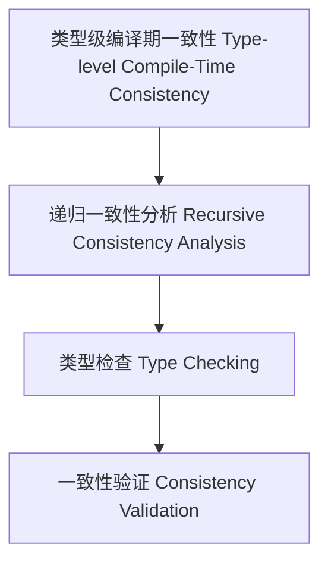

# 类型级编译期一致性（Type-Level Compile-Time Consistency in Haskell）

## 定义 Definition

- **中文**：类型级编译期一致性是指在类型系统层面对类型级结构和表达式进行递归一致性分析、类型检查与验证的机制，支持类型安全的编译期一致性保障。
- **English**: Type-level compile-time consistency refers to mechanisms at the type system level for recursive consistency analysis, type checking, and validation of type-level structures and expressions, supporting type-safe compile-time consistency in Haskell.

## Haskell 语法与实现 Syntax & Implementation

```haskell
{-# LANGUAGE GADTs, DataKinds, TypeFamilies #-}

-- 类型级表达式

data Expr a where
  LitInt  :: Int  -> Expr Int
  Add     :: Expr Int -> Expr Int -> Expr Int

-- 类型级编译期一致性分析

type family CTConsistent (e :: Expr a) :: Bool where
  CTConsistent ('LitInt n) = 'True
  CTConsistent ('Add x y) = CTConsistent x && CTConsistent y
```

## 类型级递归一致性分析与类型检查 Recursive Consistency Analysis & Type Checking

- 类型级表达式的递归一致性分析、类型检查、验证
- 支持类型安全的编译期一致性保障

## 形式化证明 Formal Reasoning

- **编译期一致性正确性证明**：CTConsistent e 能准确分析表达式编译期一致性
- **Proof of compile-time consistency correctness**: CTConsistent e can accurately analyze compile-time consistency of expressions

### 证明示例 Proof Example

- 对 `CTConsistent e`，归纳每个构造器，一致性分析覆盖所有情况

## 工程应用 Engineering Application

- 类型安全的类型级DSL、编译期一致性分析、自动化验证
- Type-safe type-level DSLs, compile-time consistency analysis, automated verification

## 结构图 Structure Diagram



## 本地跳转 Local References

- [类型级编译期安全 Type-Level Compile-Time Safety](../123-Type-Level-Compile-Time-Safety/01-Type-Level-Compile-Time-Safety-in-Haskell.md)
- [类型级语义一致性 Type-Level Semantic Consistency](../122-Type-Level-Semantic-Consistency/01-Type-Level-Semantic-Consistency-in-Haskell.md)
- [类型安全 Type Safety](../14-Type-Safety/01-Type-Safety-in-Haskell.md)
