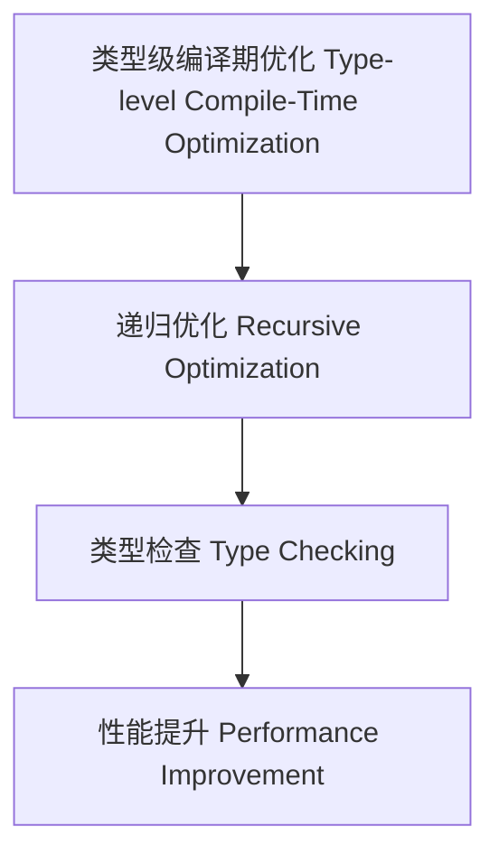

# 类型级编译期优化（Type-Level Compile-Time Optimization in Haskell）

## 定义 Definition

- **中文**：类型级编译期优化是指在类型系统层面对类型级结构和表达式进行递归优化、类型检查与性能提升的机制，支持类型安全的编译期优化。
- **English**: Type-level compile-time optimization refers to mechanisms at the type system level for recursive optimization, type checking, and performance improvement of type-level structures and expressions, supporting type-safe compile-time optimization in Haskell.

## Haskell 语法与实现 Syntax & Implementation

```haskell
{-# LANGUAGE GADTs, DataKinds, TypeFamilies #-}

-- 类型级表达式

data Expr a where
  LitInt  :: Int  -> Expr Int
  Add     :: Expr Int -> Expr Int -> Expr Int
  Zero    :: Expr Int

-- 类型级编译期优化

type family CTOptimize (e :: Expr Int) :: Expr Int where
  CTOptimize ('Add 'Zero x) = CTOptimize x
  CTOptimize ('Add x 'Zero) = CTOptimize x
  CTOptimize ('Add x y) = 'Add (CTOptimize x) (CTOptimize y)
  CTOptimize e = e
```

## 类型级递归优化与类型检查 Recursive Optimization & Type Checking

- 类型级表达式的递归编译期优化、类型检查、性能提升
- 支持类型安全的编译期优化

## 形式化证明 Formal Reasoning

- **编译期优化正确性证明**：CTOptimize e 与 e 语义等价且优化有效
- **Proof of compile-time optimization correctness**: CTOptimize e is semantically equivalent to e and effectively optimized

### 证明示例 Proof Example

- 对 `CTOptimize e`，归纳每个构造器，优化前后语义一致且性能提升

## 工程应用 Engineering Application

- 类型安全的类型级DSL、编译期优化、自动化验证
- Type-safe type-level DSLs, compile-time optimization, automated verification

## 结构图 Structure Diagram



## 本地跳转 Local References

- [类型级语义优化 Type-Level Semantic Optimization](../114-Type-Level-Semantic-Optimization/01-Type-Level-Semantic-Optimization-in-Haskell.md)
- [类型级编译期自动化 Type-Level Compile-Time Automation](../117-Type-Level-Compile-Time-Automation/01-Type-Level-Compile-Time-Automation-in-Haskell.md)
- [类型安全 Type Safety](../14-Type-Safety/01-Type-Safety-in-Haskell.md)

---

## 历史与发展 History & Development

- **中文**：类型级编译期优化随着类型系统和编译器理论的发展而演进。Haskell社区通过GADTs、Type Families等特性，推动了类型级优化的研究。GHC不断引入类型级重写、归约和自动化优化机制。
- **English**: Type-level compile-time optimization has evolved with advances in type systems and compiler theory. The Haskell community has promoted research on type-level optimization through features like GADTs and Type Families. GHC has introduced type-level rewriting, reduction, and automated optimization mechanisms.

## Haskell 相关特性 Haskell Features

### 经典特性 Classic Features

- GADTs、类型族、类型类、DataKinds等为类型级优化提供基础。
- GADTs, type families, type classes, and DataKinds provide the foundation for type-level optimization.

### 最新特性 Latest Features

- **Type-level Programming**：类型级函数、类型级递归、类型级重写。
- **Singletons**：类型与值的单例化，支持类型安全的优化。
- **Dependent Types**：实验性支持，类型依赖于表达式结构。
- **Template Haskell**：元编程辅助类型级优化。
- **GHC 2021/2022**：标准化类型级编程相关扩展。

- **English**:
  - Type-level programming: Type-level functions, recursion, and rewriting.
  - Singletons: Singletonization of types and values, supporting type-safe optimization.
  - Dependent Types: Experimental support, types depending on expression structure.
  - Template Haskell: Metaprogramming for type-level optimization.
  - GHC 2021/2022: Standardizes type-level programming extensions.

## 应用 Applications

- **中文**：类型安全的DSL、编译期优化、自动化验证、极端情况检测等。
- **English**: Type-safe DSLs, compile-time optimization, automated verification, edge case detection, etc.

## 例子 Examples

```haskell
{-# LANGUAGE DataKinds, GADTs, TypeFamilies #-}
data Expr a where
  LitInt  :: Int -> Expr Int
  Add     :: Expr Int -> Expr Int -> Expr Int
  Zero    :: Expr Int
  Mul     :: Expr Int -> Expr Int -> Expr Int

type family CTOptimize (e :: Expr Int) :: Expr Int where
  CTOptimize ('Add 'Zero x) = CTOptimize x
  CTOptimize ('Add x 'Zero) = CTOptimize x
  CTOptimize ('Mul 'Zero _) = 'Zero
  CTOptimize ('Mul _ 'Zero) = 'Zero
  CTOptimize ('Add x y) = 'Add (CTOptimize x) (CTOptimize y)
  CTOptimize ('Mul x y) = 'Mul (CTOptimize x) (CTOptimize y)
  CTOptimize e = e
```

## 相关理论 Related Theories

- 类型级编程（Type-level Programming）
- 依赖类型（Dependent Types）
- 形式化验证（Formal Verification）
- 编译期优化理论（Compile-time Optimization Theory）

## 参考文献 References

- [Wikipedia: Program Optimization](https://en.wikipedia.org/wiki/Program_optimization)
- [GHC User's Guide](https://downloads.haskell.org/ghc/latest/docs/html/users_guide/)
- [Type-level Programming in Haskell](https://wiki.haskell.org/Type-level_programming)
