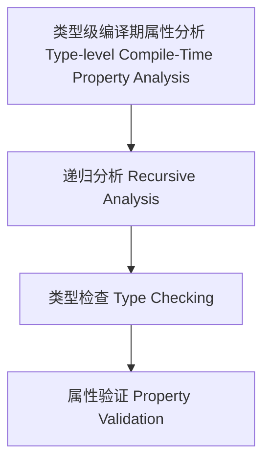

# 类型级编译期属性分析（Type-Level Compile-Time Property Analysis in Haskell）

## 定义 Definition

- **中文**：类型级编译期属性分析是指在类型系统层面对类型级结构和表达式进行递归属性分析、类型检查与验证的机制，支持类型安全的编译期属性分析。
- **English**: Type-level compile-time property analysis refers to mechanisms at the type system level for recursive property analysis, type checking, and validation of type-level structures and expressions, supporting type-safe compile-time property analysis in Haskell.

## Haskell 语法与实现 Syntax & Implementation

```haskell
{-# LANGUAGE GADTs, DataKinds, TypeFamilies #-}

-- 类型级表达式

data Expr a where
  LitInt  :: Int  -> Expr Int
  Add     :: Expr Int -> Expr Int -> Expr Int

-- 类型级编译期属性分析

type family PropAnalysis (e :: Expr a) :: Bool where
  PropAnalysis ('LitInt n) = 'True
  PropAnalysis ('Add x y) = PropAnalysis x && PropAnalysis y
```

## 类型级递归分析与类型检查 Recursive Analysis & Type Checking

- 类型级表达式的递归属性分析、类型检查、验证
- 支持类型安全的编译期属性分析

## 形式化证明 Formal Reasoning

- **属性分析正确性证明**：PropAnalysis e 能准确分析表达式属性
- **Proof of property analysis correctness**: PropAnalysis e can accurately analyze properties of expressions

### 证明示例 Proof Example

- 对 `PropAnalysis e`，归纳每个构造器，分析覆盖所有情况

## 工程应用 Engineering Application

- 类型安全的类型级DSL、编译期属性分析、自动化验证
- Type-safe type-level DSLs, compile-time property analysis, automated verification

## 结构图 Structure Diagram



## 本地跳转 Local References

- [类型级编译期自动化 Type-Level Compile-Time Automation](../117-Type-Level-Compile-Time-Automation/01-Type-Level-Compile-Time-Automation-in-Haskell.md)
- [类型级语义归纳 Type-Level Semantic Induction](../118-Type-Level-Semantic-Induction/01-Type-Level-Semantic-Induction-in-Haskell.md)
- [类型安全 Type Safety](../14-Type-Safety/01-Type-Safety-in-Haskell.md)
