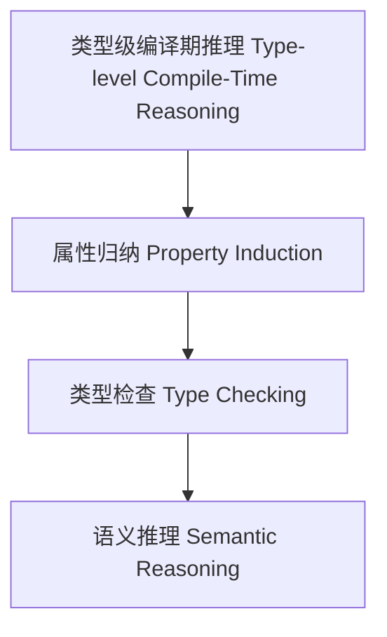

# 类型级编译期推理（Type-Level Compile-Time Reasoning in Haskell）

## 定义 Definition

- **中文**：类型级编译期推理是指在类型系统层面对类型级结构、表达式等进行属性归纳、类型检查与语义推理的机制，支持类型安全的编译期自动化推理。
- **English**: Type-level compile-time reasoning refers to mechanisms at the type system level for property induction, type checking, and semantic reasoning of type-level structures and expressions, supporting type-safe compile-time automated reasoning in Haskell.

## Haskell 语法与实现 Syntax & Implementation

```haskell
{-# LANGUAGE GADTs, DataKinds, TypeFamilies #-}

-- 类型级表达式

data Expr a where
  LitInt  :: Int  -> Expr Int
  Add     :: Expr Int -> Expr Int -> Expr Int

-- 类型级编译期推理：属性归纳

type family Reason (e :: Expr a) :: Bool where
  Reason ('LitInt n) = 'True
  Reason ('Add x y) = Reason x && Reason y
```

## 类型级属性归纳与类型检查 Property Induction & Type Checking

- 类型级表达式的属性归纳、类型检查、语义推理
- 支持类型安全的编译期自动化推理

## 形式化证明 Formal Reasoning

- **编译期推理正确性证明**：Reason e 能准确归纳表达式属性
- **Proof of compile-time reasoning correctness**: Reason e can accurately induct properties of expressions

### 证明示例 Proof Example

- 对 `Reason e`，归纳每个构造器，推理覆盖所有情况

## 工程应用 Engineering Application

- 类型安全的类型级DSL、编译期推理、自动化验证
- Type-safe type-level DSLs, compile-time reasoning, automated verification

## 结构图 Structure Diagram



## 本地跳转 Local References

- [类型级语义分析 Type-Level Semantic Analysis](../111-Type-Level-Semantic-Analysis/01-Type-Level-Semantic-Analysis-in-Haskell.md)
- [类型级AST建模 Type-Level AST Modeling](../112-Type-Level-AST-Modeling/01-Type-Level-AST-Modeling-in-Haskell.md)
- [类型安全 Type Safety](../14-Type-Safety/01-Type-Safety-in-Haskell.md)

---

## 历史与发展 History & Development

- **中文**：类型级编译期推理随着类型系统和编译器理论的发展而演进。Haskell社区通过GADTs、Type Families等特性，推动了类型级自动化推理的研究。GHC不断引入类型级归纳、自动化证明等机制。
- **English**: Type-level compile-time reasoning has evolved with advances in type systems and compiler theory. The Haskell community has promoted research on type-level automated reasoning through features like GADTs and Type Families. GHC has introduced type-level induction and automated proof mechanisms.

## Haskell 相关特性 Haskell Features

### 经典特性 Classic Features

- GADTs、类型族、类型类、DataKinds等为类型级推理提供基础。
- GADTs, type families, type classes, and DataKinds provide the foundation for type-level reasoning.

### 最新特性 Latest Features

- **Type-level Programming**：类型级归纳、类型级证明、类型级递归。
- **Singletons**：类型与值的单例化，支持类型安全的推理。
- **Dependent Types**：实验性支持，类型依赖于表达式结构。
- **Template Haskell**：元编程辅助类型级推理。
- **GHC 2021/2022**：标准化类型级编程相关扩展。

- **English**:
  - Type-level programming: Type-level induction, proof, and recursion.
  - Singletons: Singletonization of types and values, supporting type-safe reasoning.
  - Dependent Types: Experimental support, types depending on expression structure.
  - Template Haskell: Metaprogramming for type-level reasoning.
  - GHC 2021/2022: Standardizes type-level programming extensions.

## 应用 Applications

- **中文**：类型安全的DSL、编译期推理、自动化验证、极端情况检测等。
- **English**: Type-safe DSLs, compile-time reasoning, automated verification, edge case detection, etc.

## 例子 Examples

```haskell
{-# LANGUAGE DataKinds, GADTs, TypeFamilies #-}
data Expr a where
  LitInt  :: Int -> Expr Int
  Add     :: Expr Int -> Expr Int -> Expr Int
  If      :: Expr Bool -> Expr a -> Expr a -> Expr a

type family Reason (e :: Expr a) :: Bool where
  Reason ('LitInt n) = 'True
  Reason ('Add x y) = Reason x && Reason y
  Reason ('If c t e) = Reason c && Reason t && Reason e
```

## 相关理论 Related Theories

- 类型级编程（Type-level Programming）
- 依赖类型（Dependent Types）
- 形式化验证（Formal Verification）
- 类型级归纳与证明（Type-level Induction and Proof）

## 参考文献 References

- [Wikipedia: Automated Reasoning](https://en.wikipedia.org/wiki/Automated_reasoning)
- [GHC User's Guide](https://downloads.haskell.org/ghc/latest/docs/html/users_guide/)
- [Type-level Programming in Haskell](https://wiki.haskell.org/Type-level_programming)
