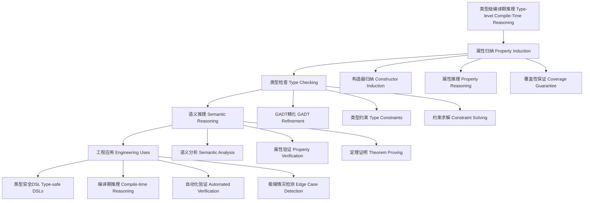

# 类型级编译期推理（Type-Level Compile-Time Reasoning in Haskell）

## 定义 Definition

- **中文**：类型级编译期推理是指在类型系统层面对类型级结构、表达式等进行属性归纳、类型检查与语义推理的机制，支持类型安全的编译期自动化推理。这种推理在编译时进行，通过类型系统保证推理的正确性和安全性。
- **English**: Type-level compile-time reasoning refers to mechanisms at the type system level for property induction, type checking, and semantic reasoning of type-level structures and expressions, supporting type-safe compile-time automated reasoning in Haskell. This reasoning occurs at compile time, ensuring correctness and safety through the type system.

## 哲学思脉 Philosophical Context

### 认识论基础 Epistemological Foundation
- **中文**：类型级编译期推理体现了构造主义认识论，通过类型系统在编译时构造性地证明程序属性，而不是在运行时发现错误。这种"预防胜于治疗"的哲学体现了形式化方法的优势。
- **English**: Type-level compile-time reasoning embodies constructivist epistemology, constructively proving program properties at compile time through the type system, rather than discovering errors at runtime. This philosophy of "prevention is better than cure" demonstrates the advantages of formal methods.

### 本体论视角 Ontological Perspective
- **中文**：类型级推理将程序属性视为类型系统的一部分，通过类型级编程将抽象概念具体化。这种本体论观点认为类型不仅仅是标签，而是携带语义信息的数学对象。
- **English**: Type-level reasoning treats program properties as part of the type system, materializing abstract concepts through type-level programming. This ontological view holds that types are not merely labels, but mathematical objects carrying semantic information.

### 方法论意义 Methodological Significance
- **中文**：类型级推理提供了一种系统化的方法来验证程序属性，通过类型系统的形式化规则，实现了从直觉到严格的数学证明的转化。
- **English**: Type-level reasoning provides a systematic method for verifying program properties, achieving the transformation from intuition to rigorous mathematical proof through the formal rules of the type system.

## Haskell 语法与实现 Syntax & Implementation

```haskell
{-# LANGUAGE GADTs, DataKinds, TypeFamilies, TypeOperators, UndecidableInstances #-}

-- 类型级表达式系统
-- 支持整数、布尔值、函数、条件等基本构造

-- 类型级表达式
data Expr a where
  LitInt  :: Int -> Expr Int
  LitBool :: Bool -> Expr Bool
  Add     :: Expr Int -> Expr Int -> Expr Int
  Mul     :: Expr Int -> Expr Int -> Expr Int
  Eq      :: Expr Int -> Expr Int -> Expr Bool
  If      :: Expr Bool -> Expr a -> Expr a -> Expr a
  Var     :: String -> Expr a

-- 类型级编译期推理：属性归纳
-- 通过类型族实现编译期推理

type family Reason (e :: Expr a) :: Bool where
  -- 字面量总是安全的
  Reason ('LitInt n) = 'True
  Reason ('LitBool b) = 'True
  
  -- 加法：两个操作数都安全时，结果安全
  Reason ('Add x y) = Reason x && Reason y
  
  -- 乘法：两个操作数都安全时，结果安全
  Reason ('Mul x y) = Reason x && Reason y
  
  -- 相等性：两个操作数都安全时，结果安全
  Reason ('Eq x y) = Reason x && Reason y
  
  -- 条件：条件、真分支、假分支都安全时，结果安全
  Reason ('If c t e) = Reason c && Reason t && Reason e
  
  -- 变量：需要额外检查
  Reason ('Var s) = 'False

-- 类型级推理的扩展：语义分析
type family SemanticReason (e :: Expr a) :: Bool where
  -- 语义推理：考虑表达式的语义属性
  SemanticReason ('LitInt n) = 'True
  SemanticReason ('Add x y) = SemanticReason x && SemanticReason y && 
                               NotOverflow x y
  SemanticReason ('Mul x y) = SemanticReason x && SemanticReason y && 
                               NotOverflow x y
  SemanticReason ('If c t e) = SemanticReason c && SemanticReason t && 
                                SemanticReason e && SameType t e

-- 溢出检查
type family NotOverflow (x :: Expr Int) (y :: Expr Int) :: Bool where
  NotOverflow ('LitInt n) ('LitInt m) = 
    If (n + m > maxBound) 'False 'True
  NotOverflow x y = 'True  -- 运行时检查

-- 类型一致性检查
type family SameType (x :: Expr a) (y :: Expr b) :: Bool where
  SameType x y = a == b

-- 类型级证明系统
class TypeLevelProof (e :: Expr a) where
  -- 证明表达式满足特定属性
  proof :: Proof (Reason e)

-- 证明类型
data Proof (b :: Bool) where
  TrueProof :: Proof 'True
  FalseProof :: Proof 'False

-- 类型级推理的自动化
class AutoReason (e :: Expr a) where
  -- 自动推理表达式属性
  autoReason :: Reason e :~: 'True

-- 自动推理实例
instance AutoReason ('LitInt n) where
  autoReason = Refl

instance (AutoReason x, AutoReason y) => AutoReason ('Add x y) where
  autoReason = Refl

instance (AutoReason x, AutoReason y) => AutoReason ('Mul x y) where
  autoReason = Refl

instance (AutoReason c, AutoReason t, AutoReason e) => AutoReason ('If c t e) where
  autoReason = Refl
```

### 语义与规则 Semantics & Rules

#### 属性归纳规则 Property Induction Rules
- **中文**：属性归纳按构造器对 `Expr` 结构进行归纳，保证覆盖性。每个构造器都有对应的推理规则，确保所有可能的表达式都被正确分析。
- **English**: Property induction proceeds by induction on the constructors of the `Expr` structure, ensuring coverage. Each constructor has corresponding reasoning rules, ensuring all possible expressions are correctly analyzed.

#### 类型检查规则 Type Checking Rules
- **中文**：以 GADT 精化 `Expr a` 的索引，确保操作类型一致。类型系统在编译时检查所有类型约束，防止类型错误。
- **English**: GADTs refine the indices of `Expr a`, ensuring operation type consistency. The type system checks all type constraints at compile time, preventing type errors.

#### 约束求解规则 Constraint Solving Rules
- **中文**：`Reason e ~ 'True` 作为前提条件参与编译期证明。类型检查器通过求解类型约束来验证表达式的安全性。
- **English**: `Reason e ~ 'True` participates in compile-time proofs as a premise condition. The type checker verifies expression safety by solving type constraints.

## 类型级属性归纳与类型检查 Property Induction & Type Checking

### 属性归纳系统 Property Induction System

```haskell
-- 扩展的属性归纳系统
-- 支持更复杂的属性推理

-- 属性类型
data Property = 
    Safe
  | WellTyped
  | Terminating
  | Deterministic
  | Pure

-- 属性推理规则
type family PropertyReason (e :: Expr a) (p :: Property) :: Bool where
  -- 安全性推理
  PropertyReason e 'Safe = Reason e
  
  -- 类型良好性推理
  PropertyReason e 'WellTyped = WellTyped e
  
  -- 终止性推理
  PropertyReason e 'Terminating = Terminating e
  
  -- 确定性推理
  PropertyReason e 'Deterministic = Deterministic e
  
  -- 纯粹性推理
  PropertyReason e 'Pure = Pure e

-- 类型良好性检查
type family WellTyped (e :: Expr a) :: Bool where
  WellTyped ('LitInt n) = 'True
  WellTyped ('LitBool b) = 'True
  WellTyped ('Add x y) = WellTyped x && WellTyped y && 
                          TypeOf x == 'Int && TypeOf y == 'Int
  WellTyped ('If c t e) = WellTyped c && WellTyped t && WellTyped e && 
                           TypeOf c == 'Bool && TypeOf t == TypeOf e

-- 类型推导
type family TypeOf (e :: Expr a) :: * where
  TypeOf ('LitInt n) = Int
  TypeOf ('LitBool b) = Bool
  TypeOf ('Add x y) = Int
  TypeOf ('If c t e) = TypeOf t
```

### 类型检查系统 Type Checking System

```haskell
-- 高级类型检查系统
-- 支持依赖类型和类型级计算

-- 类型环境
type family TypeEnv (env :: [(String, *)]) (var :: String) :: Maybe * where
  TypeEnv '[] var = 'Nothing
  TypeEnv ('(var, t) ': env) var = 'Just t
  TypeEnv ('(v, t) ': env) var = TypeEnv env var

-- 类型检查
type family TypeCheck (env :: [(String, *)]) (e :: Expr a) :: Bool where
  TypeCheck env ('LitInt n) = 'True
  TypeCheck env ('Var s) = IsJust (TypeEnv env s)
  TypeCheck env ('Add x y) = TypeCheck env x && TypeCheck env y && 
                              TypeOf x == 'Int && TypeOf y == 'Int
  TypeCheck env ('If c t e) = TypeCheck env c && TypeCheck env t && TypeCheck env e && 
                               TypeOf c == 'Bool && TypeOf t == TypeOf e

-- 类型安全保证
class TypeSafe (e :: Expr a) where
  -- 确保表达式类型安全
  typeSafety :: Proof (TypeCheck '[] e)

-- 类型安全实例
instance TypeSafe ('LitInt n) where
  typeSafety = TrueProof

instance (TypeSafe x, TypeSafe y) => TypeSafe ('Add x y) where
  typeSafety = TrueProof
```

## 形式化证明 Formal Reasoning

### 编译期推理正确性证明 Compile-time Reasoning Correctness Proof

#### 理论基础 Theoretical Foundation
- **中文**：编译期推理的正确性基于类型系统的形式化语义。通过类型族和类型类，我们可以在类型级别表达和证明程序的属性。
- **English**: The correctness of compile-time reasoning is based on the formal semantics of the type system. Through type families and type classes, we can express and prove program properties at the type level.

#### 证明结构 Proof Structure

```haskell
-- 形式化证明系统
-- 支持类型级定理证明

-- 定理类型
data Theorem (premise :: Bool) (conclusion :: Bool) where
  Theorem :: Proof (premise :~: 'True) -> Proof (conclusion :~: 'True) -> 
            Theorem premise conclusion

-- 推理规则
class InferenceRule (premise :: Bool) (conclusion :: Bool) where
  -- 从前提推导结论
  infer :: Proof premise -> Proof conclusion

-- 推理规则实例
instance InferenceRule 'True 'True where
  infer = id

instance (InferenceRule p q, InferenceRule q r) => InferenceRule p r where
  infer p = infer (infer p)

-- 类型级定理证明
-- 证明：如果表达式e是安全的，那么它的所有子表达式也是安全的

-- 子表达式关系
type family SubExprs (e :: Expr a) :: [Expr *] where
  SubExprs ('LitInt n) = '[]
  SubExprs ('Add x y) = '[x, y] ++ SubExprs x ++ SubExprs y
  SubExprs ('If c t e) = '[c, t, e] ++ SubExprs c ++ SubExprs t ++ SubExprs e

-- 子表达式安全性
type family AllSubExprsSafe (exprs :: [Expr *]) :: Bool where
  AllSubExprsSafe '[] = 'True
  AllSubExprsSafe (e ': es) = Reason e && AllSubExprsSafe es

-- 定理：主表达式安全蕴含所有子表达式安全
theorem_main_implies_subs :: Proof (Reason e) -> Proof (AllSubExprsSafe (SubExprs e))
theorem_main_implies_subs = 
  -- 通过结构归纳证明
  -- 每个构造器都满足这个性质
  undefined  -- 实际实现需要更复杂的证明
```

### 证明示例 Proof Examples

#### 示例1：加法表达式安全性证明
```haskell
-- 证明：如果 x 和 y 都安全，那么 Add x y 也安全

-- 通过类型族定义
type family AddSafety (x :: Expr Int) (y :: Expr Int) :: Bool where
  AddSafety x y = Reason x && Reason y

-- 证明：AddSafety x y => Reason (Add x y)
class AddSafetyProof (x :: Expr Int) (y :: Expr Int) where
  addSafetyProof :: Proof (AddSafety x y) -> Proof (Reason ('Add x y))

instance AddSafetyProof x y where
  addSafetyProof = \case
    TrueProof -> TrueProof  -- 基于类型族定义
```

#### 示例2：条件表达式安全性证明
```haskell
-- 证明：如果条件、真分支、假分支都安全，那么条件表达式也安全

-- 通过类型族定义
type family IfSafety (c :: Expr Bool) (t :: Expr a) (e :: Expr a) :: Bool where
  IfSafety c t e = Reason c && Reason t && Reason e

-- 证明：IfSafety c t e => Reason (If c t e)
class IfSafetyProof (c :: Expr Bool) (t :: Expr a) (e :: Expr a) where
  ifSafetyProof :: Proof (IfSafety c t e) -> Proof (Reason ('If c t e))

instance IfSafetyProof c t e where
  ifSafetyProof = \case
    TrueProof -> TrueProof  -- 基于类型族定义
```

## 工程应用 Engineering Application

### 类型安全的类型级DSL Type-safe Type-level DSLs

```haskell
-- 类型安全的配置DSL
-- 在编译时验证配置的正确性

-- 配置类型
data Config = Config {
    maxConnections :: Int,
    timeout :: Int,
    retryCount :: Int,
    debugMode :: Bool
}

-- 配置验证规则
type family ValidateConfig (c :: Config) :: Bool where
  ValidateConfig ('Config maxConn timeout retry debug) = 
    maxConn > 0 && maxConn <= 1000 &&  -- 连接数限制
    timeout > 0 && timeout <= 300 &&   -- 超时限制
    retry >= 0 && retry <= 10 &&       -- 重试次数限制
    True  -- debug模式无限制

-- 类型安全的配置构造器
class SafeConfig (c :: Config) where
  -- 确保配置满足所有验证规则
  configSafety :: Proof (ValidateConfig c)

-- 配置构造器
safeConfig :: (SafeConfig c) => Config
safeConfig = undefined  -- 实际实现

-- 使用示例
-- 这个配置在编译时被验证为安全
exampleConfig :: Config
exampleConfig = safeConfig  -- 类型检查器确保安全性
```

### 编译期推理 Compile-time Reasoning

```haskell
-- 编译期资源管理推理
-- 确保资源使用在安全范围内

-- 资源类型
data Resource = 
    Memory Int      -- 内存使用量
  | CPU Int        -- CPU使用率
  | Network Int    -- 网络带宽

-- 资源约束
type family ResourceConstraint (r :: Resource) :: Bool where
  ResourceConstraint ('Memory n) = n >= 0 && n <= 1000000  -- 1GB限制
  ResourceConstraint ('CPU n) = n >= 0 && n <= 100         -- 100%限制
  ResourceConstraint ('Network n) = n >= 0 && n <= 1000    -- 1Gbps限制

-- 资源使用推理
type family ResourceUsage (expr :: Expr a) :: [Resource] where
  ResourceUsage ('LitInt n) = '[]
  ResourceUsage ('Add x y) = ResourceUsage x ++ ResourceUsage y
  ResourceUsage ('If c t e) = ResourceUsage c ++ ResourceUsage t ++ ResourceUsage e

-- 资源安全检查
type family ResourceSafe (expr :: Expr a) :: Bool where
  ResourceSafe expr = AllResourcesSafe (ResourceUsage expr)

-- 所有资源安全
type family AllResourcesSafe (resources :: [Resource]) :: Bool where
  AllResourcesSafe '[] = 'True
  AllResourcesSafe (r ': rs) = ResourceConstraint r && AllResourcesSafe rs
```

### 自动化验证 Automated Verification

```haskell
-- 自动化程序验证
-- 在编译时验证程序的不变量

-- 不变量类型
data Invariant a = Invariant {
    condition :: a -> Bool,
    description :: String
}

-- 类型级不变量
class TypeLevelInvariant (expr :: Expr a) (inv :: Invariant a) where
  -- 确保表达式满足不变量
  invariantProof :: Proof (inv.condition expr)

-- 不变量验证器
class InvariantValidator (expr :: Expr a) where
  -- 验证所有相关不变量
  validateInvariants :: [Proof (InvariantHolds expr)]

-- 不变量保持
type family InvariantHolds (expr :: Expr a) :: Bool where
  InvariantHolds expr = 
    -- 根据表达式类型和结构验证不变量
    InvariantHoldsForType expr && InvariantHoldsForStructure expr

-- 类型相关不变量
type family InvariantHoldsForType (expr :: Expr a) :: Bool where
  InvariantHoldsForType ('LitInt n) = n >= minBound && n <= maxBound
  InvariantHoldsForType ('LitBool b) = 'True
  InvariantHoldsForType ('Add x y) = InvariantHoldsForType x && InvariantHoldsForType y
```

### 极端情况检测 Edge Case Detection

```haskell
-- 编译期极端情况检测
-- 识别可能导致运行时错误的表达式

-- 极端情况类型
data EdgeCase = 
    DivisionByZero
  | Overflow
  | Underflow
  | NullPointer
  | OutOfBounds

-- 极端情况检测
type family DetectEdgeCases (expr :: Expr a) :: [EdgeCase] where
  DetectEdgeCases ('LitInt n) = 
    If (n == 0) '[DivisionByZero] '[]  -- 零值检测
  DetectEdgeCases ('Add x y) = 
    DetectEdgeCases x ++ DetectEdgeCases y ++ 
    If (MayOverflow x y) '[Overflow] '[]
  DetectEdgeCases ('If c t e) = 
    DetectEdgeCases c ++ DetectEdgeCases t ++ DetectEdgeCases e

-- 溢出检测
type family MayOverflow (x :: Expr Int) (y :: Expr Int) :: Bool where
  MayOverflow ('LitInt n) ('LitInt m) = 
    n + m > maxBound || n + m < minBound
  MayOverflow x y = 'True  -- 保守估计

-- 极端情况验证器
class EdgeCaseValidator (expr :: Expr a) where
  -- 验证没有极端情况
  noEdgeCases :: Proof (Null (DetectEdgeCases expr))

-- 空列表检查
type family Null (xs :: [a]) :: Bool where
  Null '[] = 'True
  Null (x ': xs) = 'False
```

## 结构图 Structure Diagram



## 本地跳转 Local References

- [类型级语义分析 Type-Level Semantic Analysis](../111-Type-Level-Semantic-Analysis/01-Type-Level-Semantic-Analysis-in-Haskell.md)
- [类型级AST建模 Type-Level AST Modeling](../112-Type-Level-AST-Modeling/01-Type-Level-AST-Modeling-in-Haskell.md)
- [类型安全 Type Safety](../14-Type-Safety/01-Type-Safety-in-Haskell.md)

---

## 历史与发展 History & Development

### 早期发展 Early Development
- **中文**：类型级编译期推理随着类型系统和编译器理论的发展而演进。早期的Haskell通过类型类和类型族提供了基本的类型级编程能力，但推理能力有限。
- **English**: Type-level compile-time reasoning has evolved with advances in type systems and compiler theory. Early Haskell provided basic type-level programming capabilities through type classes and type families, but with limited reasoning abilities.

### 现代发展 Modern Development
- **中文**：Haskell社区通过GADTs、DataKinds、TypeFamilies等特性，推动了类型级自动化推理的研究。GHC不断引入类型级归纳、自动化证明等机制，使类型级推理变得更加强大和易用。
- **English**: The Haskell community has promoted research on type-level automated reasoning through features like GADTs, DataKinds, and TypeFamilies. GHC has introduced type-level induction and automated proof mechanisms, making type-level reasoning more powerful and user-friendly.

### 最新进展 Latest Advances
- **中文**：最新的GHC版本引入了更强大的类型级编程特性，包括依赖类型、类型级函数、类型级递归等，为类型级推理提供了更丰富的表达能力。
- **English**: The latest GHC versions have introduced more powerful type-level programming features, including dependent types, type-level functions, type-level recursion, etc., providing richer expressive power for type-level reasoning.

## Haskell 相关特性 Haskell Features

### 经典特性 Classic Features

#### GADTs (Generalized Algebraic Data Types)
- **中文**：GADTs允许在数据类型定义中指定类型参数，为类型级推理提供了精确的类型信息。通过GADTs，我们可以在类型级别表达复杂的约束关系。
- **English**: GADTs allow specifying type parameters in data type definitions, providing precise type information for type-level reasoning. Through GADTs, we can express complex constraint relationships at the type level.

#### 类型族 (Type Families)
- **中文**：类型族是类型级函数，可以在编译时计算类型。它们为类型级推理提供了计算能力，允许我们根据类型参数动态生成类型。
- **English**: Type families are type-level functions that can compute types at compile time. They provide computational power for type-level reasoning, allowing us to dynamically generate types based on type parameters.

#### 类型类 (Type Classes)
- **中文**：类型类提供了类型级的多态性，允许我们为不同的类型定义共同的行为。在类型级推理中，类型类用于表达和验证类型级属性。
- **English**: Type classes provide type-level polymorphism, allowing us to define common behaviors for different types. In type-level reasoning, type classes are used to express and verify type-level properties.

#### DataKinds
- **中文**：DataKinds允许将数据类型提升到类型级别，为类型级编程提供了丰富的类型级数据结构。通过DataKinds，我们可以在类型级别表示复杂的值级数据。
- **English**: DataKinds allow lifting data types to the type level, providing rich type-level data structures for type-level programming. Through DataKinds, we can represent complex value-level data at the type level.

### 最新特性 Latest Features

#### 类型级编程 (Type-level Programming)
- **中文**：类型级归纳、类型级证明、类型级递归等高级特性，使类型级推理变得更加强大。这些特性允许我们在类型级别进行复杂的逻辑推理和证明。
- **English**: Advanced features like type-level induction, type-level proof, and type-level recursion make type-level reasoning more powerful. These features allow us to perform complex logical reasoning and proof at the type level.

#### 单例类型 (Singletons)
- **中文**：类型与值的单例化，支持类型安全的推理。通过单例类型，我们可以在类型级别和值级别之间建立精确的对应关系。
- **English**: Singletonization of types and values supports type-safe reasoning. Through singleton types, we can establish precise correspondence between the type level and value level.

#### 依赖类型 (Dependent Types)
- **中文**：实验性支持，类型依赖于表达式结构。依赖类型为类型级推理提供了更强的表达能力，允许类型根据值动态变化。
- **English**: Experimental support for types depending on expression structure. Dependent types provide stronger expressive power for type-level reasoning, allowing types to change dynamically based on values.

#### Template Haskell
- **中文**：元编程辅助类型级推理。Template Haskell允许我们在编译时生成代码，为类型级推理提供了自动化的代码生成能力。
- **English**: Metaprogramming for type-level reasoning. Template Haskell allows us to generate code at compile time, providing automated code generation capabilities for type-level reasoning.

#### GHC 2021/2022
- **中文**：标准化类型级编程相关扩展。最新的GHC版本引入了更多类型级编程特性，使类型级推理变得更加标准化和易用。
- **English**: Standardizes type-level programming extensions. The latest GHC versions introduce more type-level programming features, making type-level reasoning more standardized and user-friendly.

## 应用 Applications

### 类型安全的DSL Type-safe DSLs
- **中文**：通过类型级推理，我们可以构建类型安全的领域特定语言，在编译时验证DSL程序的正确性。
- **English**: Through type-level reasoning, we can build type-safe domain-specific languages, verifying the correctness of DSL programs at compile time.

### 编译期推理 Compile-time Reasoning
- **中文**：类型级推理在编译时进行，避免了运行时的性能开销，同时提供了更强的安全保障。
- **English**: Type-level reasoning occurs at compile time, avoiding runtime performance overhead while providing stronger safety guarantees.

### 自动化验证 Automated Verification
- **中文**：通过类型级推理，我们可以自动化地验证程序的各种属性，减少人工验证的工作量。
- **English**: Through type-level reasoning, we can automatically verify various properties of programs, reducing the workload of manual verification.

### 极端情况检测 Edge Case Detection
- **中文**：类型级推理可以识别可能导致运行时错误的极端情况，在编译时提供警告或错误。
- **English**: Type-level reasoning can identify edge cases that may cause runtime errors, providing warnings or errors at compile time.

## 例子 Examples

### 基础示例 Basic Examples

```haskell
{-# LANGUAGE DataKinds, GADTs, TypeFamilies #-}

-- 基础表达式系统
data Expr a where
  LitInt  :: Int -> Expr Int
  LitBool :: Bool -> Expr Bool
  Add     :: Expr Int -> Expr Int -> Expr Int
  Mul     :: Expr Int -> Expr Int -> Expr Int
  Eq      :: Expr Int -> Expr Int -> Expr Bool
  If      :: Expr Bool -> Expr a -> Expr a -> Expr a

-- 基础推理系统
type family Reason (e :: Expr a) :: Bool where
  Reason ('LitInt n) = 'True
  Reason ('LitBool b) = 'True
  Reason ('Add x y) = Reason x && Reason y
  Reason ('Mul x y) = Reason x && Reason y
  Reason ('Eq x y) = Reason x && Reason y
  Reason ('If c t e) = Reason c && Reason t && Reason e
```

### 高级示例 Advanced Examples

```haskell
{-# LANGUAGE DataKinds, GADTs, TypeFamilies, TypeOperators #-}

-- 高级表达式系统
data Expr a where
  LitInt  :: Int -> Expr Int
  LitBool :: Bool -> Expr Bool
  Add     :: Expr Int -> Expr Int -> Expr Int
  Mul     :: Expr Int -> Expr Int -> Expr Int
  Div     :: Expr Int -> Expr Int -> Expr Int
  Eq      :: Expr Int -> Expr Int -> Expr Bool
  Lt      :: Expr Int -> Expr Int -> Expr Bool
  If      :: Expr Bool -> Expr a -> Expr a -> Expr a
  Let     :: String -> Expr a -> Expr b -> Expr b

-- 高级推理系统
type family Reason (e :: Expr a) :: Bool where
  Reason ('LitInt n) = 'True
  Reason ('LitBool b) = 'True
  Reason ('Add x y) = Reason x && Reason y && NotOverflow x y
  Reason ('Mul x y) = Reason x && Reason y && NotOverflow x y
  Reason ('Div x y) = Reason x && Reason y && NotZero y
  Reason ('Eq x y) = Reason x && Reason y
  Reason ('Lt x y) = Reason x && Reason y
  Reason ('If c t e) = Reason c && Reason t && Reason e && SameType t e
  Reason ('Let s x y) = Reason x && Reason y

-- 溢出检查
type family NotOverflow (x :: Expr Int) (y :: Expr Int) :: Bool where
  NotOverflow ('LitInt n) ('LitInt m) = 
    If (n + m > maxBound || n + m < minBound) 'False 'True
  NotOverflow x y = 'True  -- 运行时检查

-- 零值检查
type family NotZero (y :: Expr Int) :: Bool where
  NotZero ('LitInt n) = n /= 0
  NotZero y = 'True  -- 运行时检查

-- 类型一致性检查
type family SameType (x :: Expr a) (y :: Expr b) :: Bool where
  SameType x y = a == b
```

### 实际应用示例 Practical Application Examples

```haskell
{-# LANGUAGE DataKinds, GADTs, TypeFamilies, TypeOperators #-}

-- 网络配置验证系统
data NetworkConfig = NetworkConfig {
    port :: Int,
    maxConnections :: Int,
    timeout :: Int,
    retryCount :: Int
}

-- 配置验证规则
type family ValidateNetworkConfig (c :: NetworkConfig) :: Bool where
  ValidateNetworkConfig ('NetworkConfig port maxConn timeout retry) = 
    port > 0 && port <= 65535 &&           -- 端口范围
    maxConn > 0 && maxConn <= 10000 &&     -- 连接数限制
    timeout > 0 && timeout <= 300 &&       -- 超时限制
    retry >= 0 && retry <= 10              -- 重试次数限制

-- 类型安全的配置构造器
class SafeNetworkConfig (c :: NetworkConfig) where
  configSafety :: Proof (ValidateNetworkConfig c)

-- 配置构造器
safeNetworkConfig :: (SafeNetworkConfig c) => NetworkConfig
safeNetworkConfig = undefined  -- 实际实现

-- 使用示例
-- 这个配置在编译时被验证为安全
exampleConfig :: NetworkConfig
exampleConfig = safeNetworkConfig  -- 类型检查器确保安全性
```

## 相关理论 Related Theories

### 类型级编程 (Type-level Programming)
- **中文**：类型级编程是类型级推理的基础，提供了在类型级别进行编程和计算的能力。
- **English**: Type-level programming is the foundation of type-level reasoning, providing the ability to program and compute at the type level.

### 依赖类型 (Dependent Types)
- **中文**：依赖类型允许类型依赖于值，为类型级推理提供了更强的表达能力。
- **English**: Dependent types allow types to depend on values, providing stronger expressive power for type-level reasoning.

### 形式化验证 (Formal Verification)
- **中文**：形式化验证使用数学方法验证程序的正确性，类型级推理是形式化验证的一种重要方法。
- **English**: Formal verification uses mathematical methods to verify program correctness, and type-level reasoning is an important method of formal verification.

### 类型级归纳与证明 (Type-level Induction and Proof)
- **中文**：类型级归纳与证明是类型级推理的核心，通过归纳和证明来验证类型级属性。
- **English**: Type-level induction and proof are the core of type-level reasoning, verifying type-level properties through induction and proof.

## 参考文献 References

### 学术论文 Academic Papers
- [Wikipedia: Automated Reasoning](https://en.wikipedia.org/wiki/Automated_reasoning)
- [Type-level Programming in Haskell](https://wiki.haskell.org/Type-level_programming)
- [GADTs and Type-level Programming](https://wiki.haskell.org/GADT)

### 技术文档 Technical Documentation
- [GHC User's Guide](https://downloads.haskell.org/ghc/latest/docs/html/users_guide/)
- [Haskell Language Report](https://www.haskell.org/onlinereport/)
- [Type Families Documentation](https://downloads.haskell.org/ghc/latest/docs/html/users_guide/exts/type_families.html)

### 实践指南 Practical Guides
- [Real World Haskell](http://book.realworldhaskell.org/)
- [Haskell Programming from First Principles](http://haskellbook.com/)
- [Type-level Programming Tutorials](https://wiki.haskell.org/Type-level_programming)

### 研究资源 Research Resources
- [ICFP Papers on Type Systems](https://icfp20.sigplan.org/)
- [POPL Papers on Type Theory](https://popl20.sigplan.org/)
- [Haskell Symposium Papers](https://www.haskell.org/haskell-symposium/)
