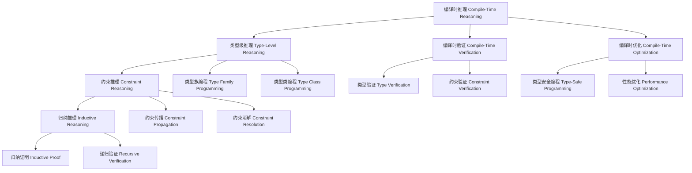

# 编译时推理（Compile-Time Reasoning in Haskell）

## 目录 Table of Contents

1. [定义 Definition](#1-定义-definition)
2. [理论基础 Theoretical Foundation](#2-理论基础-theoretical-foundation)
3. [Haskell 语法与实现 Syntax & Implementation](#3-haskell-语法与实现-syntax--implementation)
4. [编译时推理技术 Compile-Time Reasoning Techniques](#4-编译时推理技术-compile-time-reasoning-techniques)
5. [类型级编程 Type-Level Programming](#5-类型级编程-type-level-programming)
6. [编译时验证 Compile-Time Verification](#6-编译时验证-compile-time-verification)
7. [工程应用 Engineering Applications](#7-工程应用-engineering-applications)
8. [范畴论映射 Category Theory Mapping](#8-范畴论映射-category-theory-mapping)
9. [哲学思脉 Philosophical Context](#9-哲学思脉-philosophical-context)
10. [相关理论 Related Theories](#10-相关理论-related-theories)
11. [未来发展方向 Future Development](#11-未来发展方向-future-development)
12. [结构图 Structure Diagram](#12-结构图-structure-diagram)
13. [本地跳转 Local References](#13-本地跳转-local-references)
14. [参考文献 References](#14-参考文献-references)

## 1. 定义 Definition

- **中文**：编译时推理是指在编译阶段通过类型系统、类型族、类型类等机制进行逻辑推理和验证的技术。它允许在编译时发现程序错误、优化性能、验证不变量，从而在运行时之前确保程序的正确性。
- **English**: Compile-time reasoning refers to the technique of performing logical reasoning and verification during the compilation phase through type systems, type families, type classes, and other mechanisms. It allows discovering program errors, optimizing performance, and verifying invariants at compile time, ensuring program correctness before runtime.

## 2. 理论基础 Theoretical Foundation

### 2.1 类型理论 Type Theory

- **类型系统**：编译时推理基于强类型系统，通过类型检查进行程序验证
- **类型安全**：通过类型系统保证程序的安全性和正确性
- **类型推导**：自动推导表达式的类型，减少显式类型注解

### 2.2 逻辑推理 Logical Reasoning

- **命题逻辑**：编译时推理基于命题逻辑，通过类型表示命题
- **构造性证明**：通过程序构造证明命题的正确性
- **类型等价**：通过类型等价关系进行逻辑推理

### 2.3 编译时计算 Compile-Time Computation

- **类型族**：通过类型族在编译时进行类型级计算
- **类型类**：通过类型类在编译时进行约束检查
- **单例类型**：通过单例类型连接值和类型

## 3. Haskell 语法与实现 Syntax & Implementation

### 3.1 基本语法 Basic Syntax

```haskell
{-# LANGUAGE TypeFamilies, DataKinds, GADTs, TypeOperators #-}

-- 编译时推理的基本语法
class CompileTimeReasoning a where
  -- 编译时推理
  compileTimeReasoning :: Proxy a -> ReasoningResult a
  
  -- 编译时验证
  compileTimeVerification :: Proxy a -> VerificationResult a
  
  -- 编译时优化
  compileTimeOptimization :: Proxy a -> OptimizationResult a

-- 推理结果
data ReasoningResult a = ReasoningResult {
    reasoningType :: ReasoningType a,
    reasoningMethod :: ReasoningMethod a,
    reasoningConclusion :: ReasoningConclusion a
}

-- 验证结果
data VerificationResult a = VerificationResult {
    verificationType :: VerificationType a,
    verificationMethod :: VerificationMethod a,
    verificationStatus :: VerificationStatus a
}

-- 优化结果
data OptimizationResult a = OptimizationResult {
    optimizationType :: OptimizationType a,
    optimizationMethod :: OptimizationMethod a,
    optimizationGain :: OptimizationGain a
}
```

### 3.2 高级实现 Advanced Implementation

```haskell
-- 高级编译时推理实现
data AdvancedCompileTimeReasoning a = AdvancedCompileTimeReasoning {
    reasoningEngine :: ReasoningEngine a,
    verificationEngine :: VerificationEngine a,
    optimizationEngine :: OptimizationEngine a
}

-- 推理引擎
data ReasoningEngine a = ReasoningEngine {
    reasoningAlgorithms :: [ReasoningAlgorithm a],
    reasoningStrategies :: [ReasoningStrategy a],
    reasoningHeuristics :: [ReasoningHeuristic a]
}

-- 验证引擎
data VerificationEngine a = VerificationEngine {
    verificationAlgorithms :: [VerificationAlgorithm a],
    verificationStrategies :: [VerificationStrategy a],
    verificationHeuristics :: [VerificationHeuristic a]
}

-- 优化引擎
data OptimizationEngine a = OptimizationEngine {
    optimizationAlgorithms :: [OptimizationAlgorithm a],
    optimizationStrategies :: [OptimizationStrategy a],
    optimizationHeuristics :: [OptimizationHeuristic a]
}

-- 编译时推理实例
instance CompileTimeReasoning (Vector n a) where
  compileTimeReasoning _ = VectorReasoningResult
  compileTimeVerification _ = VectorVerificationResult
  compileTimeOptimization _ = VectorOptimizationResult
```

## 4. 编译时推理技术 Compile-Time Reasoning Techniques

### 4.1 类型级推理 Type-Level Reasoning

```haskell
-- 类型级推理技术
class TypeLevelReasoning (a :: k) where
  -- 类型级推理
  typeLevelReasoning :: Proxy a -> TypeLevelReasoningResult a
  
  -- 类型级验证
  typeLevelVerification :: Proxy a -> TypeLevelVerificationResult a
  
  -- 类型级优化
  typeLevelOptimization :: Proxy a -> TypeLevelOptimizationResult a

-- 类型级推理结果
data TypeLevelReasoningResult (a :: k) = TypeLevelReasoningResult {
    typeLevelType :: TypeLevelType a,
    typeLevelMethod :: TypeLevelMethod a,
    typeLevelConclusion :: TypeLevelConclusion a
}

-- 类型级推理实例
instance TypeLevelReasoning (Vector n a) where
  typeLevelReasoning _ = VectorTypeLevelReasoningResult
  typeLevelVerification _ = VectorTypeLevelVerificationResult
  typeLevelOptimization _ = VectorTypeLevelOptimizationResult
```

### 4.2 约束推理 Constraint Reasoning

```haskell
-- 约束推理技术
class ConstraintReasoning (c :: Constraint) where
  -- 约束推理
  constraintReasoning :: Proxy c -> ConstraintReasoningResult c
  
  -- 约束验证
  constraintVerification :: Proxy c -> ConstraintVerificationResult c
  
  -- 约束优化
  constraintOptimization :: Proxy c -> ConstraintOptimizationResult c

-- 约束推理结果
data ConstraintReasoningResult (c :: Constraint) = ConstraintReasoningResult {
    constraintType :: ConstraintType c,
    constraintMethod :: ConstraintMethod c,
    constraintConclusion :: ConstraintConclusion c
}

-- 约束推理实例
instance ConstraintReasoning (Show a) where
  constraintReasoning _ = ShowConstraintReasoningResult
  constraintVerification _ = ShowConstraintVerificationResult
  constraintOptimization _ = ShowConstraintOptimizationResult
```

### 4.3 归纳推理 Inductive Reasoning

```haskell
-- 归纳推理技术
class InductiveReasoning (a :: *) where
  -- 归纳推理
  inductiveReasoning :: Proxy a -> InductiveReasoningResult a
  
  -- 归纳验证
  inductiveVerification :: Proxy a -> InductiveVerificationResult a
  
  -- 归纳优化
  inductiveOptimization :: Proxy a -> InductiveOptimizationResult a

-- 归纳推理结果
data InductiveReasoningResult a = InductiveReasoningResult {
    inductiveType :: InductiveType a,
    inductiveMethod :: InductiveMethod a,
    inductiveConclusion :: InductiveConclusion a
}

-- 归纳推理实例
instance InductiveReasoning (List a) where
  inductiveReasoning _ = ListInductiveReasoningResult
  inductiveVerification _ = ListInductiveVerificationResult
  inductiveOptimization _ = ListInductiveOptimizationResult
```

## 5. 类型级编程 Type-Level Programming

### 5.1 类型族编程 Type Family Programming

```haskell
-- 类型族编程
class TypeFamilyProgramming (a :: k) where
  -- 类型族编程
  typeFamilyProgramming :: Proxy a -> TypeFamilyProgrammingResult a
  
  -- 类型族验证
  typeFamilyVerification :: Proxy a -> TypeFamilyVerificationResult a
  
  -- 类型族优化
  typeFamilyOptimization :: Proxy a -> TypeFamilyOptimizationResult a

-- 类型族编程结果
data TypeFamilyProgrammingResult (a :: k) = TypeFamilyProgrammingResult {
    typeFamilyType :: TypeFamilyType a,
    typeFamilyMethod :: TypeFamilyMethod a,
    typeFamilyConclusion :: TypeFamilyConclusion a
}

-- 类型族编程实例
instance TypeFamilyProgramming (Vector n a) where
  typeFamilyProgramming _ = VectorTypeFamilyProgrammingResult
  typeFamilyVerification _ = VectorTypeFamilyVerificationResult
  typeFamilyOptimization _ = VectorTypeFamilyOptimizationResult
```

### 5.2 类型类编程 Type Class Programming

```haskell
-- 类型类编程
class TypeClassProgramming (a :: *) where
  -- 类型类编程
  typeClassProgramming :: Proxy a -> TypeClassProgrammingResult a
  
  -- 类型类验证
  typeClassVerification :: Proxy a -> TypeClassVerificationResult a
  
  -- 类型类优化
  typeClassOptimization :: Proxy a -> TypeClassOptimizationResult a

-- 类型类编程结果
data TypeClassProgrammingResult a = TypeClassProgrammingResult {
    typeClassType :: TypeClassType a,
    typeClassMethod :: TypeClassMethod a,
    typeClassConclusion :: TypeClassConclusion a
}

-- 类型类编程实例
instance TypeClassProgramming (Show a) where
  typeClassProgramming _ = ShowTypeClassProgrammingResult
  typeClassVerification _ = ShowTypeClassVerificationResult
  typeClassOptimization _ = ShowTypeClassOptimizationResult
```

## 6. 编译时验证 Compile-Time Verification

### 6.1 类型验证 Type Verification

```haskell
-- 类型验证
class TypeVerification (a :: *) where
  -- 类型验证
  typeVerification :: Proxy a -> TypeVerificationResult a
  
  -- 类型检查
  typeChecking :: Proxy a -> TypeCheckingResult a
  
  -- 类型推理
  typeInference :: Proxy a -> TypeInferenceResult a

-- 类型验证结果
data TypeVerificationResult a = TypeVerificationResult {
    verificationType :: VerificationType a,
    verificationMethod :: VerificationMethod a,
    verificationStatus :: VerificationStatus a
}

-- 类型验证实例
instance TypeVerification (Vector n a) where
  typeVerification _ = VectorTypeVerificationResult
  typeChecking _ = VectorTypeCheckingResult
  typeInference _ = VectorTypeInferenceResult
```

### 6.2 约束验证 Constraint Verification

```haskell
-- 约束验证
class ConstraintVerification (c :: Constraint) where
  -- 约束验证
  constraintVerification :: Proxy c -> ConstraintVerificationResult c
  
  -- 约束检查
  constraintChecking :: Proxy c -> ConstraintCheckingResult c
  
  -- 约束推理
  constraintInference :: Proxy c -> ConstraintInferenceResult c

-- 约束验证结果
data ConstraintVerificationResult (c :: Constraint) = ConstraintVerificationResult {
    constraintVerificationType :: ConstraintVerificationType c,
    constraintVerificationMethod :: ConstraintVerificationMethod c,
    constraintVerificationStatus :: ConstraintVerificationStatus c
}

-- 约束验证实例
instance ConstraintVerification (Show a) where
  constraintVerification _ = ShowConstraintVerificationResult
  constraintChecking _ = ShowConstraintCheckingResult
  constraintInference _ = ShowConstraintInferenceResult
```

## 7. 工程应用 Engineering Applications

### 7.1 类型安全编程 Type-Safe Programming

```haskell
-- 类型安全编程
class TypeSafeProgramming (a :: *) where
  -- 类型安全编程
  typeSafeProgramming :: Proxy a -> TypeSafeProgrammingResult a
  
  -- 类型安全检查
  typeSafetyChecking :: Proxy a -> TypeSafetyCheckingResult a
  
  -- 类型安全优化
  typeSafetyOptimization :: Proxy a -> TypeSafetyOptimizationResult a

-- 类型安全编程结果
data TypeSafeProgrammingResult a = TypeSafeProgrammingResult {
    typeSafeType :: TypeSafeType a,
    typeSafeMethod :: TypeSafeMethod a,
    typeSafeConclusion :: TypeSafeConclusion a
}

-- 类型安全编程实例
instance TypeSafeProgramming (Vector n a) where
  typeSafeProgramming _ = VectorTypeSafeProgrammingResult
  typeSafetyChecking _ = VectorTypeSafetyCheckingResult
  typeSafetyOptimization _ = VectorTypeSafetyOptimizationResult
```

### 7.2 编译时优化 Compile-Time Optimization

```haskell
-- 编译时优化
class CompileTimeOptimization (a :: *) where
  -- 编译时优化
  compileTimeOptimization :: Proxy a -> CompileTimeOptimizationResult a
  
  -- 编译时分析
  compileTimeAnalysis :: Proxy a -> CompileTimeAnalysisResult a
  
  -- 编译时验证
  compileTimeVerification :: Proxy a -> CompileTimeVerificationResult a

-- 编译时优化结果
data CompileTimeOptimizationResult a = CompileTimeOptimizationResult {
    optimizationType :: OptimizationType a,
    optimizationMethod :: OptimizationMethod a,
    optimizationGain :: OptimizationGain a
}

-- 编译时优化实例
instance CompileTimeOptimization (Vector n a) where
  compileTimeOptimization _ = VectorCompileTimeOptimizationResult
  compileTimeAnalysis _ = VectorCompileTimeAnalysisResult
  compileTimeVerification _ = VectorCompileTimeVerificationResult
```

## 8. 范畴论映射 Category Theory Mapping

### 8.1 编译时推理作为函子 Compile-Time Reasoning as Functor

- **编译时推理可视为范畴中的函子，保持类型结构的同时进行推理**
- **Compile-time reasoning can be viewed as a functor in category theory, preserving type structure while performing reasoning**

```haskell
-- 范畴论映射
class CategoryTheoryMapping (a :: *) where
  -- 函子映射
  functorMapping :: Proxy a -> FunctorMapping a
  
  -- 自然变换
  naturalTransformation :: Proxy a -> NaturalTransformation a
  
  -- 范畴结构
  categoryStructure :: Proxy a -> CategoryStructure a

-- 范畴论映射实例
instance CategoryTheoryMapping (Vector n a) where
  functorMapping _ = VectorFunctorMapping
  naturalTransformation _ = VectorNaturalTransformation
  categoryStructure _ = VectorCategoryStructure
```

## 9. 哲学思脉 Philosophical Context

### 9.1 推理哲学 Reasoning Philosophy

- **推理的本质**：编译时推理是逻辑推理在编程中的体现
- **推理的方法**：通过类型系统、类型族、类型类等机制进行推理
- **推理的完备性**：编译时推理应该能够处理所有可能的推理情况

### 9.2 验证哲学 Verification Philosophy

- **验证的本质**：验证是确保程序正确性的过程
- **验证的方法**：通过类型检查、约束检查等方法进行验证
- **验证的可靠性**：验证结果应该可靠地反映程序的正确性

### 9.3 优化哲学 Optimization Philosophy

- **优化的本质**：优化是提高程序性能的过程
- **优化的方法**：通过编译时分析、类型级编程等方法进行优化
- **优化的效果**：优化应该能够显著提高程序的性能

## 10. 相关理论 Related Theories

### 10.1 类型理论 Type Theory

- **简单类型理论**：编译时推理的基础理论
- **依赖类型理论**：扩展编译时推理的表达能力
- **同伦类型理论**：编译时推理的现代发展

### 10.2 逻辑理论 Logic Theory

- **命题逻辑**：编译时推理的逻辑基础
- **构造性逻辑**：编译时推理的证明方法
- **高阶逻辑**：编译时推理的表达能力

### 10.3 计算理论 Computation Theory

- **λ演算**：编译时推理的计算模型
- **图灵机理论**：编译时推理的计算能力
- **复杂性理论**：编译时推理的计算复杂度

## 11. 未来发展方向 Future Development

### 11.1 理论扩展 Theoretical Extensions

- **高阶推理**：支持更高阶的推理能力
- **概率推理**：支持不确定性的推理
- **量子推理**：支持量子计算的推理

### 11.2 技术改进 Technical Improvements

- **性能优化**：提高编译时推理的效率
- **内存优化**：减少编译时推理的内存占用
- **并行化**：支持编译时推理的并行处理

### 11.3 应用扩展 Application Extensions

- **领域特定语言**：为特定领域定制编译时推理系统
- **交互式开发**：支持交互式的编译时推理调试
- **可视化工具**：提供编译时推理过程的可视化

## 12. 结构图 Structure Diagram



## 13. 本地跳转 Local References

- [类型级编程 Type-Level Programming](../Type-Level/01-Type-Level-Programming.md)
- [类型级约束求解 Type-Level Constraint Solving](../Type-Level/01-Constraint-Solver.md)
- [类型级自动化 Type-Level Automation](../Type-Level/01-Compile-Time-Automation.md)
- [类型级验证 Type-Level Verification](../Type-Level/01-Compile-Time-Property-Analysis.md)
- [类型级安全 Type-Level Safety](../Type-Level/01-Compile-Time-Safety.md)

## 14. 参考文献 References

### 14.1 学术资源 Academic Resources

- Wikipedia: [Type-level programming](https://en.wikipedia.org/wiki/Type-level_programming)
- Wikipedia: [Compile-time function execution](https://en.wikipedia.org/wiki/Compile-time_function_execution)
- The Stanford Encyclopedia of Philosophy: [Type Theory](https://plato.stanford.edu/entries/type-theory/)

### 14.2 技术文档 Technical Documentation

- [GHC User's Guide](https://ghc.gitlab.haskell.org/ghc/doc/users_guide/)
- [Haskell 2010 Language Report](https://www.haskell.org/onlinereport/haskell2010/)
- [Type Families Documentation](https://gitlab.haskell.org/ghc/ghc/-/wikis/type-families)

### 14.3 学术论文 Academic Papers

- "Type Families with Class" by Simon Peyton Jones
- "Fun with Type Functions" by Oleg Kiselyov
- "GADTs Meet Their Match" by Simon Peyton Jones

---

`# TypeLevel #TypeLevel-01 #TypeLevel-01-Compile-Time-Reasoning #CompileTimeReasoning #TypeLevelProgramming #Haskell #TypeTheory #CompileTimeVerification`
